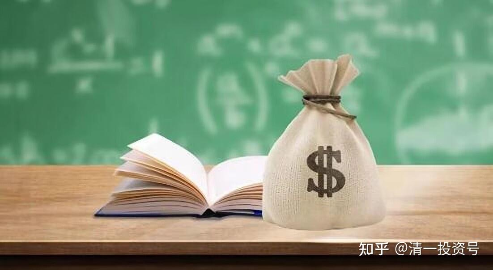

34篇.《人生十二讲》自由讲投资：(6)投资杂问（完结）

清一山长 2007年9月30日

**一、投资杂问**

学生：张老师，你觉得一个是资本投资，一个是人生投资，就是投资的那个机会成本是什么？

张老师：我不太明白你的概念，你的概念再重新厘清一下，是什么？

学生：就是人的一生中必须要做这种理性的投资吗？

张老师：**人的一生必须做投资，你不做投资也是在做投资，但是不一定是做资本投资。**

学生：但是如果你做了这个资本投资，在做这个投资的时候，你会失去什么？

张老师：会失去蛮多的机会，会失去自我原谅的机会。**做投资，尤其做金融投资，绝对不允许自己偷懒、不允许自我原谅，你会形成一个甚至是有点自虐的习惯，很多东西都会失去。所以我建议女生一般不要学投资。**

学生：你会失去享受生活的机会吗？

张老师：不一定，我觉得我挺享受生活的，你们觉得我不太会享受生活吗？是自讨苦吃吗？

学生：就是不会很随意是吗？

张老师：啊？不知道什么叫做随意。

学生：就是像你说的，你买车的时候就一定要买那种经济实用型的，而不买那个昂贵的……就是说不是很随意的去做……

张老师：我很随意啊！我随我的意，因为这是我的价值观，你要让我去买一个宝马、奔驰，我挺难受的，心里面堵得慌。所以这绝对随我的意，我选得特别开心，我觉得这车性能很好，开起来又舒适，都是我挑的。我当然不会去买一个QQ车，那也不符合我的价值观，要不我就不买。

学生：听了你的讲座，我觉得张老师也是一个对投资蛮内行的人，但是我想问一个问题，就是你有没有想过不断地整合自己手中的资源，让自己的今日电器发展壮大，然后超过黄光裕？

张老师：我已经退出今日电器两年以上了，这是第一个；第二个，我从来不喜欢跟人家比，我只是说当年如果我换一个地方做，说不定我就是黄光裕，但是这个机会已经失去了，那么现在我就不想了。

学生：张老师有没有想过做一些其它方面的投资？

张老师：没有。做投资我已经说过，我不追求金钱，不是为了追求名望，我要那样去做会非常累的，所以我就不想去做。用我的观点来说，就是钱摆在那里，只要我随便伸一伸手，它就到手了，我经常伸一下手把它拿到手就完了。但是，如果要像你刚刚说的，要去跟黄光裕比，甚至要跟巴菲特比，我觉得我的手要伸很长，我的手也没那么长，所以我不去做。

学生：我觉得你这是淡泊、宁静、致远。好像很多人很难达到你这种境界？

张老师：我只是知道我要什么而已，因为那不是我要的。我不要做黄光裕，我只要做张健柏就好了，就这么简单。好，你说。

**二、关于知识的广度和深度**

学生：张老师，我想问你一个问题。你觉得一个人，是知识的广度越广越好，还是在哪一块越深越好？

张老师：在我的概念里面，没有你这个问题。我的概念里面，又要广、又要深。我没有说：要广好，还是要深好。也不存在这个概念，只存在我要什么。我要什么就去研究它，至于什么叫广？什么叫深？我不知道。我需要，就去拿下它。

但是，有可能我会在某些领域搞得很深。比如我在教育领域，我认为以后大家可以慢慢研究，但是到目前为止，我发现我的水平是最高的。不客气，如果我认为是的，我就会说是的。可能明天发现不是，我就会说：其实不是的。到目前为止，我还算是最高的，不是因为我搞得很深，而是我要做好这件事情，我必需去研究它，然后自动就做成了，因为我没办法不把它做好。不去研究深入了，这件事情就一定没办法做好。做得不好，我自己是不能原谅自己的，我要做就要做到最好。

而且别人都能做的事情，我不愿意做。别人都能做，我还去做干嘛呢？我觉得这个世界有我不多，无我不少，我就不做了。

**我专做其他人不能做的事情，而且我真做起来觉得很开心。这也是价值观，所以我不想做黄光裕第二，我可以去做张健柏第一。**

**三、洞察力是一种思维习惯**

学生：张老师，你刚才也提到要有一种远见，但是人也不是天生就有这种洞察力。这种洞察力是如何培养的？

张老师：是一种思维习惯，**你的习惯当中就喜欢从一个地方想到另外一个地方，去追踪、去分析。你勤于分析的习惯，会让你有一种远见。**

另外，这种远见，西方叫历史感，就是有一个时间的延续和周转的过程，你要感觉历史。比如我要感觉这个前多少年、后多少年的情况。但是很多人没有去训练这种感觉，也缺乏这种训练，要去阅读历史、阅读人生，去经常关注时间的变化可能会带来什么样的变化。比如看到春天的时候，同时要想到秋天，其实这很简单。

学生：是不是我们读书的时候培养？

张老师：思考，就是一个思考的习惯，养成一个习惯就够了，这种东西是自然变化的。下面是最后一个问题。

**四、正确的财富观，少年商学院扶贫**

学生：张老师，社会上是有很多人需要帮助的，比如那些贫困地区，环境特别恶劣。特别是现在国家的教育方面，各个方面都存在缺陷。就是说我们怎么样对待这一块。

张老师：关键是看你个人怎么设定了，看你想做什么事情了。因为第一，我始终持有一种观点，就是财富不是哪一个人的，它一般流向能够掌握和控制财富的人手中。

比如，假定我有一千万，我自己操作不当，自己个性各方面出了问题，好啦，没有啦！我破产啦！然后你们看到的是我破产啦！其实没有破，财还是在，在谁的手里面？它流到比我更有效率，起码能够打败我的人的手上去了。

**社会上的金钱是流动的，它不停的在分配。我们要做的事情是什么呢？我们要做的就是证明自己是优秀者，如果你证明自己是优秀者，财富会流到你身边，由你来支配。**

**因此你只不过是财富的一个代管者，不是它的拥有者，你拥有不了它的。包括很多家族拥有的财富，以为是自己的，其实你拥有不了的。财富的使用方式就决定了你的未来。**

比如你是一个老板，拥有大批的财产，自己的小孩子一年花几十万。那么糟糕啦！这笔财产就开始往外散发，散发到没有效率的地方、散发到伤害小孩将来生活的地方，你们觉得呢？

炫富伤害未来，所以很多富家子弟会让财产流失，因为他做了错事。但是另外一些人，像比尔·盖茨、巴菲特，他们把财富拿来贡献社会。**他们也是一样的观点：他们只是代管者。但是他们管得很有效率，这就是第一个概念，你持有这种概念后，一个人的财富迟早会把它拿来贡献社会，就像我现在正在做的事情一样。**

我现在要做的事情，就是要在边远地区、很穷困的地区，那地方穷得可能一家人一年的生活水平就只有几百块钱，不到一千块钱，穷困得不得了；而且那些地区（我没见到）据说，最穷的一家人只有两条裤子，就是谁出门去谁穿，只有两条像样的裤子，很贫困。

在这样的地区，我们有一种办法是拿钱给他，但是我不喜欢这种方法。因为你拿钱给他，他可能很快地把它消费掉，而且他根本不懂得怎么样去改善自己的生活，因为他观念上有问题，穷人一定有穷的道理的。你怎么给他帮助？

我想做的事情是找到这样一些地方的最穷的人，找到他们的小孩子，把他们的小孩拿一批过来，让他们接受最好的教育，是贵族式的教育。但是这种贵族式不是中国式的贵族，是真正的西方式的贵族，中国式的贵族只是有钱。当然我这个也要花钱，一年的学费至少要花两三万以上。最先拿过来十几个孩子，让他们接受这种精英教育，用思想训练的精英，他将来一定是精英。八九岁拿来训练十年，你觉得怎么样？

训练出来了，他十年以后就会承担很重要的工作、会贡献社会，社会一定会给他非常好的东西，这就改变了他自己、改变了他的家庭，甚至改变了他们村。比如一个村，我选一个有前途的小孩，然后将来十年、二十年、三十年以后，他可能回去把他的村子都改变了，甚至改变他的县都有可能。

那么这就是一个很大的功德，这个功德肯定要花不少钱，但花这个钱很有价值。目前为止，不花钱让小孩子上学的就只有希望工程，不过大家都觉得希望工程没用，希望工程培养什么呢？培养了一批未来的民工而已，他们不可能培养别的，很难。因为很穷的地方，希望工程虽然有办法去支持，但缺乏好老师，孩子就是识几个字，知道一些基本文化也就够了，只是一个民工培训，没有什么实质价值。但是我这种选拔方式，让他们来学习，用最好的教育方法培养出来就绝对是高层领导、企业的未来领导人，就是我说的少年商学院。

这就是选择的方式的不同，取决于你的价值观。我可以这样去做，可能另外一个人又喜欢去做另外一件事情。

**中国这样的人多了以后，我们就可以做相当于美国的民间基金会的事。在美国，各种各样的捐款、各种各样的私人基金会，相当于第二政府，它做了很多政府不做的事情。**我这也相当于是做一小块政府没做的事情。没有哪一个人会考虑：让一个最穷的孩子去受最高、最好、最昂贵的教育，我可以去尝试一下。但我不能尝试太多，我不能搞几千人过来，那我就破产了。我可以搞几十个人过来，就这么简单。

**参考链接：**

[25篇.《人生十二讲》自由讲投资：（1）复利的魅力](https://zhuanlan.zhihu.com/p/606914565)

[27篇.《人生十二讲》自由讲投资：（2）金融投资和实业投资的差别](https://zhuanlan.zhihu.com/p/608151379)

[29篇.](https://zhuanlan.zhihu.com/p/610852390)[《人生十二讲》](https://zhuanlan.zhihu.com/p/608151379)[自由讲投资：（3）张氏投资法：看大势的“基础研究”加“心理分析”](https://zhuanlan.zhihu.com/p/610852390)

[30篇.](https://zhuanlan.zhihu.com/p/612686722)[《人生十二讲》](https://zhuanlan.zhihu.com/p/608151379)[自由讲投资：（4）自我投资和人生目标](https://zhuanlan.zhihu.com/p/612686722)

[32篇.《人生十二讲》自由讲投资：（5）学生自由提问](https://zhuanlan.zhihu.com/p/613765261)

