一个人也可以改变世界。只要你有雄心壮志，有远大抱负，还有踏实的努力------你如果看到行业的缺陷，不需要抱怨，自己去改变他。

1882年，学了四年日本传统武术的一个人--嘉纳治五郎。看到了日本武术的弊端，各种乱象，不规范的情况，就立志改变。他成立了自己的武道馆---讲道馆。采用全新的方式来训练，培养人才。他不靠国家，不依赖政府指导，不靠老前辈指路，靠的是自己的理想和志气！

到了1885年，东京警察机关考虑选择一种武术用于培训警察，并为此举办了一场盛大的比赛以测试各流派的战斗力，以便择取其中一种来培训警力。**结果这个年轻人开办的**讲道馆，压倒性地赢得了15场比赛中的13场，剩下的两场以平局结束。从此开创了日本武术的先河，后期的很多武术，包括巴西柔术，他都是创始人。他也被誉为日本现代体育之父。

同样：后来的日本拳手，在与泰拳实战中，遭遇惨败后，有志气的人，就研究学习，开创了日本特色的“踢拳”，全世界有影响力。另外还开创了合气道，另立道路。极真空手道创立人，也是对传统空手道玩假的比赛（点到为止）实战的反叛，至今成为流行全世界的空手道流派！

因此，是人改变了世界。不是世界成就了人。如果你认为是对的，就不要依赖“体制”来帮你解决。

中国人，就是太缺实干的人，空口说白话，混日子的人太多了。如果中国多一点日本这样的开创人，中国不仅仅武道，何事不可兴呢？

中国的武道，我们可以改变。清一武道馆，愿意成为当代的“讲道馆”，武士和木兰们，愿意用自己的努力和进去，在机遇到来之时，打一个“15:0”的战绩出来。

其实---今年春节的中国日，武士们面对泰拳的挑战，7战无一败，从此泰人胆寒。但我们做得还不够。明年的中国日，我们会有更好的表现！

清一记！

***转：“离经叛道，开宗立派，混体制，纳新技。”***

*——嘉纳治五郎的武道创业之路*

- 全文近9000字，信息量不小，适合抽空细品。

- 本文会提及日本传统柔术、柔道和巴西柔术，属三种不同的格斗术，文中会将用“柔术”来述称日本传统的古流柔术，而非指现代巴西柔术。

在故事开始之前，邀请大家思考这样一个问题：

**如果有一种武术，它的技术五花八门，而且招招奔着下三路，全是插眼踢裆碎喉咙的狠毒招式，那么这种武术的战斗力，一定很强吗？**自从成体系的武术和格斗技术出现之后，人们一直在争论这个问题，随处都可以找出“插眼踢裆术高莫用派”，“拳摔柔天下第一党”……但鲜有人能真正用实践去证明自己所持有的观点。

在那些为数不多的实践者当中，柔道之父嘉纳治五郎，无疑是最著名的武术家之一。

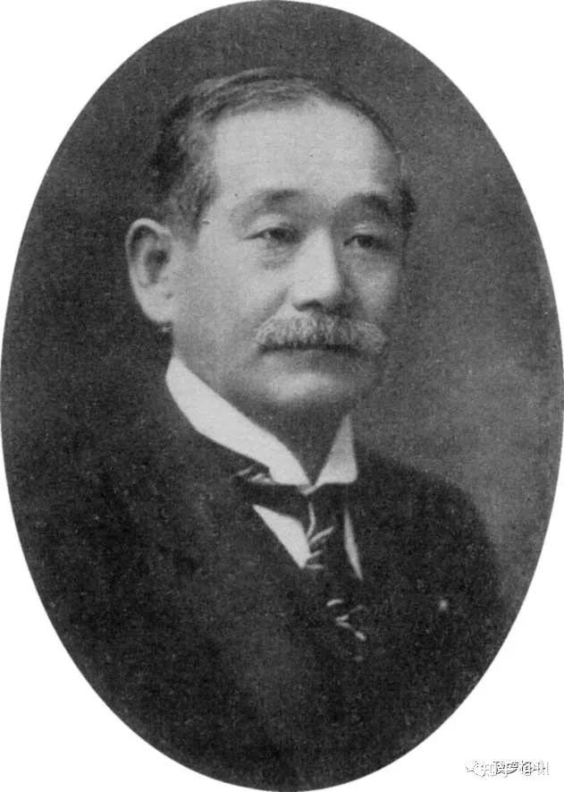

嘉纳治五郎 かのう じごろう1860年12月10日—1938年5月4日武术家、教育家，柔道的创始人首任日本奥委会会长，被尊为“日本体育之父”

**嘉纳治五郎是如何用实践去证实并解决相关难题的？**在这里先卖个关子，先来讲讲嘉纳的“创业前传”。

***离经叛道，习武强身***

嘉纳治五郎于1860年出生于日本神户，他的家族在当地非常有名望。嘉纳因从小身体不好，受人欺负，当他非常想学习日本传统柔术的时候，却遭到包括父亲在内的家人们的强烈反对。因为嘉纳的家人们认为练柔术有悖家族风貌，“离经叛道”。虽然在中文里都叫“柔术”，但日本传统柔术和我们现在所见的“巴西柔术”差别是非常巨大的，非要类比的话，古流柔术可能更类似于某些中国的传统武术，它包括了击打、摔投、冷兵器等各种技术。

既是日本传统的武艺，一个日本年轻人想要学习它，为何算作“离经叛道”？

简言之，在当时的日本，***古流柔术，口碑极差。***

一方面，古流柔术练习者中很多人斗殴成性，各种血腥残暴的踢馆挑战层出不穷；另一方面，当时的日本，经由“黑船来航”被迫开国不久，民众普遍认为是旧秩序导致了日本在科技和军事方面的落后，而古流柔术又是旧秩序的重要组成部分，所以，渴求革新的民众自然而然地将“古流柔术”和“旧秩序”绑定在了一起，将其视作过时且无用之物。所以那时的柔术在大众心中声望极差。

而嘉纳出身名门，家族成员谁也不想与流氓斗殴这类的粗鄙之事扯上干系，自然反对他习练柔术。

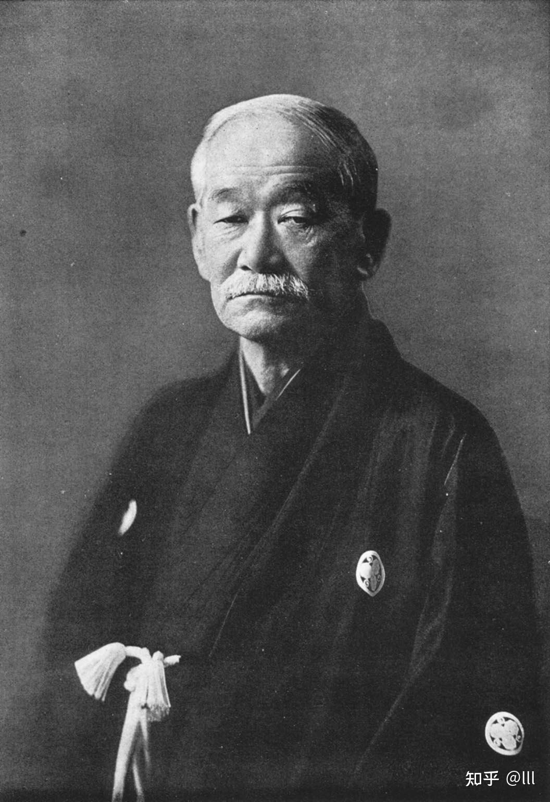

*嘉纳治五郎 かのう じごろう*

但由于小时候被欺负的不愉快的回忆，嘉纳实在很想变强。1877年，嘉纳考取了东京大学，主修哲学。他在东京大学求学期间，经过一番挣扎，做出了一个违背祖宗的决定：进行了为期四年的柔术学习。而嘉纳不仅训练时心无旁骛，还展现出了极高的格斗天赋。

***发现古流柔术的弱点***按照普通人的思路，嘉纳很可能一头扎进古流柔术，最后成为该武术某流派的大师。然而，这并不是嘉纳所想要的，他想要做的是**创造一种真正具有战斗力的武术。**因此他一边学习，一边记录下他所发现的古流柔术的弱点，并决心在未来创造出一种没有这些弱点的更优秀的武术。

嘉纳所认为的古流柔术的弱点，主要有以下：

***第一，社会声望差，难以建立群众基础***

古流柔术因无法撇清自身和流氓斗殴的关系，导致长期受到社会质疑。嘉纳认为武术训练不应该仅仅是打斗技巧的练习，更应该是自我完善的一部分，**性格塑造与格斗技巧同样重要**。***第二，没有稳定的教学体系和训练阶段划分***

古流柔术不分段位，不按经验和水平来对学生进行划分，新手经常和老手一起训练，教学的内容也常常是想到哪里教到哪里，这样的训练方式使得训练中受伤的可能性大大增加。科学的格斗训练应该是循序渐进的，例如，如果新手没有经过受身训练，就不该开始练摔投，否则练习过程中受伤的可能性会非常高。而越是容易受伤，就越是难以保持训练和获得水平的提升。

***第三，缺乏指导原则，没有清晰的技术成长体系***

比方说，古流柔术里有一些技术强调要“以巧破力”、“以柔克刚”，但另一些技术却又不遵循这个原则……诸如此类问题，导致古流柔术的技术不成系统，只能算作是各种零碎技巧的集合。学起来自然也就缺乏章法和清晰的成长体系。***第四，缺乏科学的训练方法，嘉纳认为这是最大的问题***

古流柔术的练习主要是通过“形”来完成。“形”的意思是与训练伙伴在完全没有对抗的情况下共同演练一套设计好的动作，接近于中国传统武术中的套路，只不过是需要两个人合作完成的。

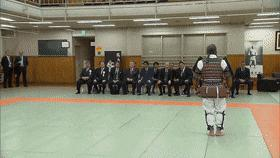

关于“形”，曾经在网上有一段广为流传过的视频，内容是普京访日时安倍邀请他去看柔道表演。

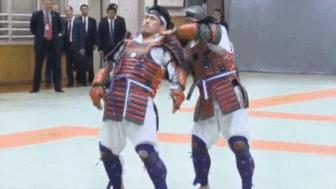

柔道之中的“古式之形”

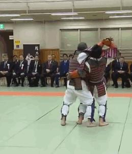

虽然说这是讲道馆柔道中的“古式之形”，但其中保留了大量天神真杨流柔术和起倒流柔术的动作，大家可以藉此对于“形”有个大概的直观的理解。

最初之所以要采用这样的训练方式，主要原因是古流柔术中的很多重要技术源自于战场搏杀，在战场上拽头发、挖眼、攻击裆部、撕扯嘴巴和抓挠等动作毫不鲜见，但这些技术在和平时期很难得到实践，在训练的过程中显然不可能对自己人全力使用，毕竟谁也不是“一次性用品”。

结果随着时间的推移，高度理想化的“形”，***却从训练手段变成了目的，“形”打得越好就被认为越厉害。***

但只需稍加思考就会发现，现实的打斗和“形”的演练是完全不同的，没人会傻站在那里不动，甚至主动配合你的攻击。相反，对手会拼了命地抵抗和反击，在真实的对抗下想把技术用出来，可比打“形”的时候难多了。并且随着时间的推移，一旦为战斗力习武的“初心”消失殆尽，某些武术就会逐渐从“伤人技”发展向“飙演技”，现实中套路打得虎虎生风，一上台秒变王八拳，这样的例子比比皆是。

所以尽管“形”是向学生传授技术的一种安全方法，但通过形这种训练方式，完全不足以让他们应对现实的战斗。

由此嘉纳开始思考，***能不能创造出一套训练方法，既能模拟真实的打斗，又能保证训练的安全呢？***

***嘉纳解决“弱点”的方案***

善于发现真正问题之所在，才能制定有效的解决方案并落实执行。

***（一）“洗白恶名”***

- 设计一套严格的道德规范

以各种规矩限定学生的行为，比如设定礼节、禁止学生为了钱而打斗、禁止学生参与斗殴、禁止私下比武等……力图让武术摆脱暴力行为的刻板印象，挽回公众对武术的看法。

- 更名换姓，提升立意

嘉纳使用了柔道（judo）而非柔术（jujitsu）来命名自己的流派。

相比单纯的技术或技巧，柔道这个词包含着更高的追求。“道”既代表了技艺，也包括了追寻技艺的旅途，它不仅仅是简单的技能积累，更带有自我精进，自我完善的涵义。***（二）设定清晰的技术指导原则，形成风格，设立愿景***

“精力善用，自他共荣”

嘉纳为柔道赋予了一个贯彻始终的指导原则——“精力善用”。有人把它译作“以柔克刚”，但我更愿意用长一点的语句将其描述，

***“花费最小的力量，获取最大的效果。”***

要讲究功耗和性价比，作为这个原则的直接体现，嘉纳最为看重“破势”的应用。所谓破势，就是在真正发力摔倒对手之前，先借助对手的动势，用一个较小的动作使其身体先失去平衡。嘉纳在研究过程中发现，如果对手处于失衡状态，那么他既无法进攻，也无法有效地防守摔技和投技。并且，如果对手失去了平衡，那摔倒他所需要的力量会大大小于摔倒一个平衡很好的人。

***（三）探索能真正提升战斗力的科学训练方法***技术层面的问题是相对容易解决的，最难解决也是最重要的问题来自于训练方法。

嘉纳在学习古流柔术的四年中接触了大量古流柔术技术，他认为从数量上说，古流柔术技术已经足够丰富，其中很多也非常有用，但他敏锐地意识到技术和应用之间存在鸿沟——如果不考虑使用者的水平高低，很多技术都是合理的，但如果使用者水平不够，技术就无法达到想象中的效果。

也就是说，**一个技术能发挥出多大用处取决于使用者的能力限制。**举个例子：步枪射击的命中率取决于使用它的人。如果射手的枪法很差，那么投入再多的资源来开发极其精确的步枪也是毫无用处的。

因此，**对于教学者来说，应该将更多的精力放在如何让学生更好地掌握技术上，这比简单地发明越来越多的技术要更有意义。**在嘉纳看来，古流柔术仅仅因为一些“阴损毒辣”的技术而抛弃实战的做法，相当于研发了大量的步枪，但却从来不让士兵进行实弹射击训练。正如之前所说，这种做法的明显问题是学生永远无法学会如何在真实的打斗中运用这些技巧。古流柔术因此陷入了两难境地：如果通过完全开放对抗的训练来实现对真实战斗的完全模拟，后果会是学生很快都因受伤而无法继续训练了；如果完全取消实战，训练确实变得“安全又愉快”了，但训练和实战本末倒置，并不能真正提升战斗力。

因此，**嘉纳竭尽全力地去寻找一种实战模式，既可以让学生承受真实战斗中的压力和疲劳，同时又不会造成太大的受伤风险。**在嘉纳决定改良柔术推广柔道前期的若干年时间内，他几乎没有在技术层面进行创新，他所教的几乎所有技术都是古流柔术的一部分。

他真正重要的创新是训练方法。

***（四）革新训练方式，做了减法，却加了威力***

嘉纳最终确定的训练方案从原理上说非常简单粗暴，但毫无疑问是人类武术史上最伟大的突破之一：

既然实战训练中大部分伤害的发生只和那些阴损毒辣的技术有关，**把阴损毒辣的技术全部去掉，放开手脚打实战，**不就好了吗？

通过这种方式，既保证了训练的实战性，也不会对学生造成不可接受的伤害。**这种通过对技术施加限制获取全力实战训练的方法，在现在已经成为所有衍生格斗技术甚至许多击打类格斗技术的标准做法。**无论是我们现在练习的巴西柔术，还是拳击、踢拳，甚至是很多冷兵器流派，都是这种实战模式的受益者。说到这里肯定很多人会质疑，“失去了这些‘阴损毒辣’的技术，这门武术还有威力吗？大街上可没人会遵守格斗训练时的规则！”

不得不说这类怀疑非常盛行，原因之一就是其非常符合普通人的“直觉”，毕竟挖出一个人的眼睛，或用力一掌震破其耳膜，听起来就令人生畏！

所以**在世界各地的传统武术中都存在一个普遍的观念，即一门武术有多厉害，取决于其拥有的技术数量和这些技术的在表面上看起来的致命性。**如果存在一种武术，它包含了很多用来折断对手脖子、戳瞎对手的眼睛或者能引起其它类似可怕伤害或死亡的技术，那么这种武术通常就会被认为非常危险而有效。**这种想法在古流柔术中也非常普遍，许多流派以他们所包含的技术的数量和所谓的致命性来彰显他们有多厉害。**然而，许多人没有、或者无法真正意识到，这些危险的动作和其他动作一样，都是身体技能。因此，就像射门或扣篮需要练习一样，这些动作要想运用自如，也必然离不开贴近现实对抗的练习。没人能只靠练习某种“篮球套路”就能进NBA，也没人只练习空击就能赢得拳王金腰带，同样，自然也**没有人能通过“形”的练习来真正学会怎么在实战中用出那些阴损毒辣之技。**

宫本武藏在《五轮书》中也曾表达过类似的意思：**你只能用你训练的方式来战斗。**平时不练对抗只摆摆架势，指望在实战中摇奖一击得手，是不现实的。“阴损毒辣”的技术除了无法安全训练之外，还有另一个问题，那就是它们中的大多数非常依赖小肌肉群驱动的精细动作。什么是精细动作呢，比如穿针。大家可以想象，无论你把穿针这件事练习多少遍有多娴熟，一旦有人推搡、拉扯、击打你，穿针这件事就变成了几乎不可能完成的高难度动作，更不用说心脏狂跳、肾上腺素的飙升让你的手颤抖不已。这个比喻或许看来夸张，但大多数“阴招”瞄准的都是人体上的小目标，比如眼睛、太阳穴、手指、裆部等等，要在高速、高强度的对抗中，命中这些部位并施加额外操作的难度，实际并不比一边被拉扯一边穿针引线的难度小太多。与之相对的是更大幅度的技术动作，比如拳击中的直拳、摆拳，柔道中的大外刈、背负投等等。这些技术瞄准的目标大多是人体中相对更大的部位，比如头部、腹部甚至整个身体。虽然从吓人程度上来说，它们远远不如那些“阴招”，但仅仅听起来吓人并不能让人赢得战斗，胜负往往是由一记记结实打到下巴上的摆拳分出，理论上的可行性永远不如真实的胜负具备说服力。

*退一万步说，当一个通过大量的训练掌握在激烈的对抗干扰下，如何闪避攻击、忍受击打并痛击对手的人，在同样的激烈程度的对抗中他意图进行戳眼，其命中率可能会低于一个没有经历过真实对抗，只在配合中练过戳眼技巧的人吗？显然不可能。*

还有一个常常被人忽略的因素是，在激烈的对抗中，人对于痛苦的忍耐程度远超过普通人的认知。古流柔术中有很多掰手指的技术，听起来合理，但别说生死相搏了，就算是在体育竞技中，手指脱臼都根本算不得大伤。就算是插眼，一样不如大众想象中“好用”。多年前综合格斗的早期阶段，日本传奇选手中井祐树在比赛中被对手犯规插眼，在瞎了一只眼睛的情况下依然降服对手赢下了比赛——如果那是一场搏命的对决，他的对手很有可能被某种降服技夺去生命。

总之，***嘉纳的观点是，一种武术到底有没有用，跟它的招式有多毒辣没有太大关系，能不能通过合理的训练方法让人在实战中用出来才是最重要的。***

**而大多数古流柔术恰恰都忽略了这个关键因素，形成了一种对技术的偏执——这个技术到底能不能用于实战不重要，技术本身看起来够玄妙或者够凶狠就行。**嘉纳希望自己不仅仅能够学会技术，而是能以一套训练方法论，将那些相对技术安全高效地传授给学生，并且使他们可以在实战情况下自信地使用它们。

***讲道馆的崛起***看完前面的内容，还是会有小伙伴坚持认为，“嗯，嘉纳的理论听起来是有道理，但我还是觉得保留插眼踢裆咬人技术的武术比较强。”

是，当年泼嘉纳冷水的人也不少，但后来的事实证明，嘉纳从柔道里去除古流柔术中“阴损”技术的做法，确实非但没有削弱其战斗力，还创造出了一种实战能力更强的格斗流派。

***（一）招募人才，培养运动员，打败竞争对手***

嘉纳于1882年开设了他的柔道馆：***讲道馆***。

**当时他只有22岁**，仅学了四年传统柔术，以这样的资历开宗立派既需要极大的魄力，遇到的阻力也是很大的。一开始，道馆规模很小，据说“只有十二张草席的大小”，愿意跟着学习的学生也只有九个。经过多年的努力研究和经营，他不断地扩建和搬迁，甚至将日本一些最优秀的古流柔术家招募到讲道馆。这些人通过使用嘉纳的训练方法来继续精进他们的技术。慢慢的，讲道馆成为了东京名气最大的道馆之一。一个既有声望又跟自己抢学生的道馆必然会成为很多人的眼中钉。当年的风气是不服就打，很快古流柔术就以流派和个人的名义纷纷向讲道馆发起了一系列挑战。有趣的是，应对挑战和踢馆时，**讲道馆出战的几个学生都毫不困难地击败了所有挑战者。**

由于嘉纳想避免柔术道馆在公共场合斗殴的不良形象，嘉纳对这些挑战有严格的规则限定：所有比赛都在讲道馆举行，并且不允许出现脏招和击打动作。因此，这些挑战赛更像是缠斗比赛，而不是真正的无规则打斗。尽管有很多限制，讲道馆的门徒们如此轻松地横扫了古流柔术，还是震惊了很多人。

十九世纪八十年代，类似的挑战达到了高潮。到了1885年，东京警察机关考虑选择一种武术用于培训警察，并为此举办了一场盛大的比赛以测试各流派的战斗力，以便择取其中一种来培训警力。**在比赛的后半程，作为新派武术代表的柔道与一些最著名的传统柔术流派展开了决战。**这次比赛的胜利条件主要是**一本**和**降服**。其中一本的意思是将对手摔至干净利落地后被着地。

西乡四郎／さいごうしろう（1866－1922年）富田常雄于1942年发表的后被多次改编为影视作品的小说《姿三四郎》就是以他为角色原型进行的创作

最终，在几个传奇人物如西乡四郎和富田常次郎的带领下，讲道馆压倒性地赢得了15场比赛中的13场，剩下的两场以平局结束。根据记载，降服在这次比赛中并没有出现，所有的比赛都以摔投技术决出了胜负。这次比赛依旧有规则限制，并禁止使用脏招，所以跟之前的挑战类似，更像缠斗比赛而非真实打斗。但无论如何，**这是讲道馆历史上的一次巨大胜利，也彻底奠定了讲道馆在日本武术界的统治性地位。**

讲道馆仅仅诞生了四年，且是在一位年轻人的带领下，就在公开的比试中击败了曾经不可一世的古柔术大师们。这件事迅速让嘉纳的道馆成为了全日本最成功的道馆。到1887年，讲道馆拥有了超过1500个学生。随着讲道馆的名望进一步提高，传统柔术慢慢退出了主流。

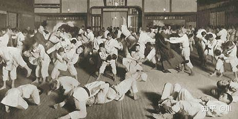

1913年的讲道馆，下饺子式的训练氛围

***（二）加入政府和国际权威机构，借体制之力推广柔道***嘉纳作为一名被广受尊重的人物，进入了日本的教育体系担任要职。他还曾于1902年创办了弘文学院，帮助中国留学生学习日语。大多数人可能没有听说过这个学校，但我们很熟悉的陈独秀、鲁迅，都曾在弘文学院的就读过。**鲁迅也因此成为有记载的最早接触柔道训练的中国人之一。**虽然他的柔道训练时长和实际水平不详，但鲁迅当年的入学签名仍在讲道馆的资料馆中展出。

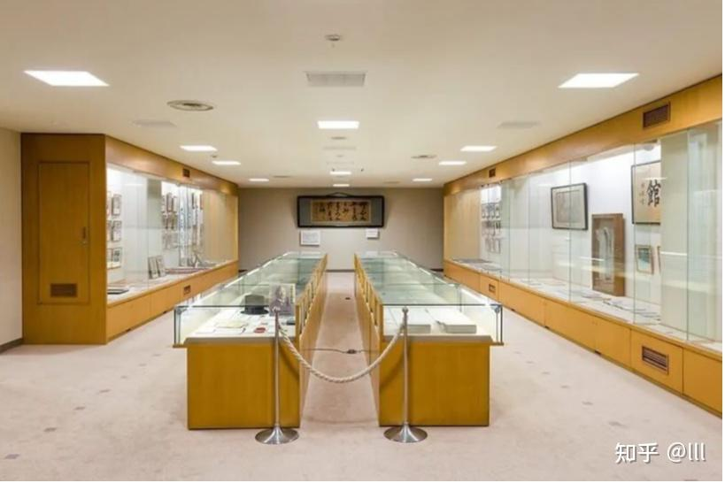

讲道馆的资料馆

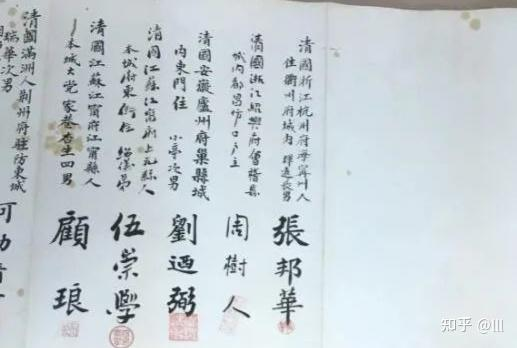

鲁迅本名“周树人”的签名和印章

自1911年开始，柔道成为了公立学校的必修课。**在很短的时间之内，柔道从冷门武术，一跃成为了日本国民运动。**

嘉纳并不满足于此，他希望柔道能获得全世界的认可。

他后来成为日本首任奥委会会长，跻身国际奥委会，推动柔道成为一项国际性的武术。他把很多学生派往世界各地进行推广，也接受在日本的外国人前来学习柔道。柔道的长足发展使得古流柔术日渐凋敝，随时有消亡的危险。***（三）巅峰之际，首次败北***在十九世纪末的时候，柔道已经是日本知名度最高的格斗术，地位几乎无可撼动了。它不仅在比赛中令人信服地击败了几乎所有其它格斗流派，还因为嘉纳在日本教育界的地位而得到了政府的支持。

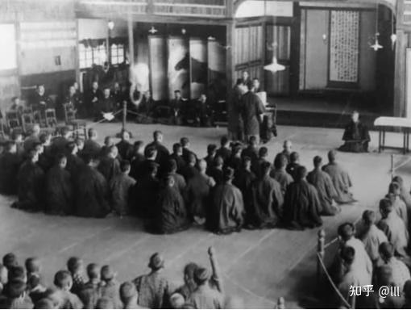

红红火火的讲道馆

然而，在讲道馆如日中天之时，曾受到了一个叫田边又右卫门的人挑战，他的道馆叫不遷（qiān）流，在当时是个名不见经传的小流派。当时的讲道馆，并没有把由一个传统柔术流派发起的挑战放在眼里，毕竟他们已经轻松击败了那些最著名的柔术流派。但他们不知道的是，**这次面对的对手，“和以往有那么一点点不一样”。**

时到如今，不遷流依然是个神秘的存在，关于它的历史记载很少，但有一点可以确定，田边又右卫门这位十九世纪90年代的宗师，**是个玩地面的**。他曾在地面缠斗方面接受过大量训练，而地面缠斗也是这个流派的训练重点。其实，**地面缠斗并不是什么新鲜事物，传统柔术中一直多多少少有一些地面缠斗的元素。**战场上的经验表明，就算双方都想站着，实际战斗也往往因为搂抱、摔投或者单纯站不稳，致使战斗者倒向地面。事实上，大部分真实的打斗结束时，双方往往都倒在地上。另外，地面技术也常常用于在战场俘虏敌人。

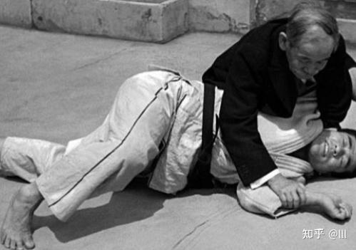

然而，**尽管在现实的格斗中，地面缠斗是不可忽视的重要部分，但很少有道馆会发展出完整的地面缠斗体系，并花费大量时间去进行实战练习。**就像前面所提到过的，在讲道馆柔道和传统柔术流派之间的所有馆间对抗中，胜负全都是由摔投技术决定的。嘉纳个人非常喜欢摔投，也乐于看到他的学生干净利落地将对手摔至后背着地，从而在比赛中取得胜利，所以**讲道馆柔道最开始的技术系统仅仅包括摔投技术，完全没有地面缠斗部分。**田边发现了这一点，并想出了一个看起来有些滑稽却行之有效的解决方案——既然柔道选手精于摔投，那就根本不给他们摔的机会——**只要在对手摔倒我之前我先一屁股坐到地上，对方不就没法摔我了吗？**这样一来，就可以轻而易举地把当时的柔道选手从他们擅长的领域，带到他们压根不懂的领域，再通过自己擅长的缠斗，用锁技或绞技迫使对手主动投降而获得降服胜利。

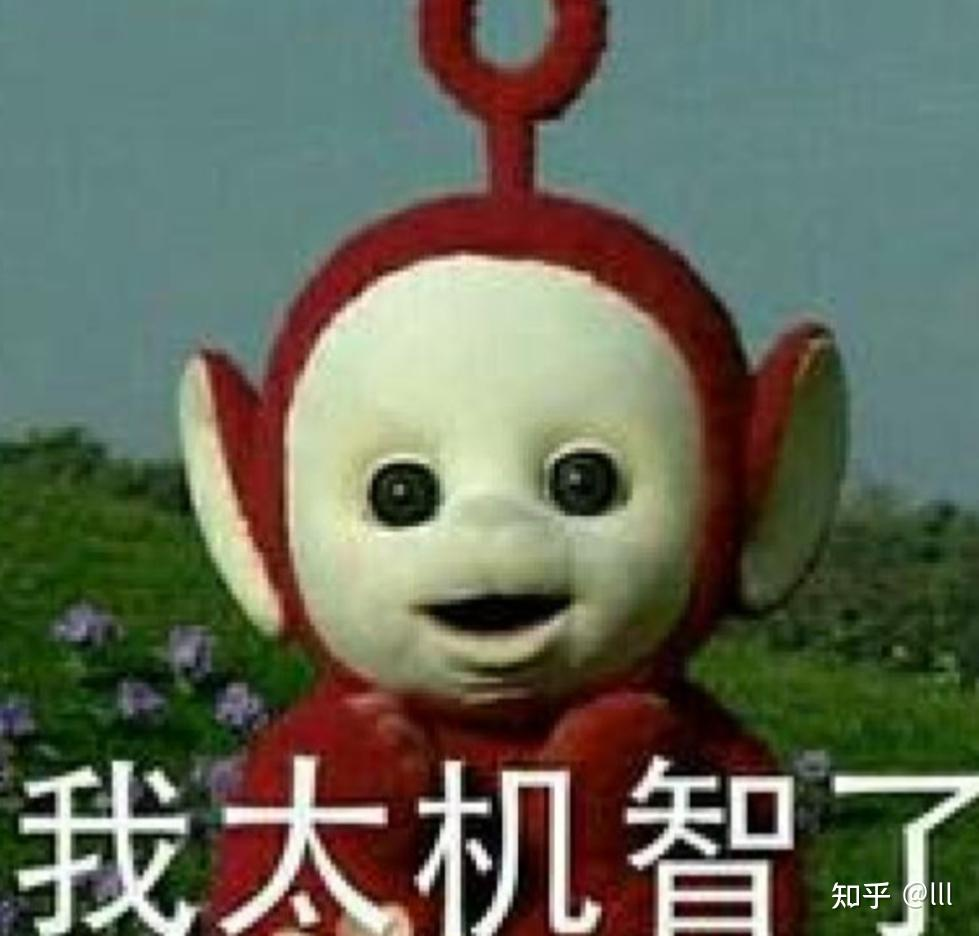

**这种打法虽然有点“好笑”，却是一种在现今看来也很重要的格斗思路。**将一场战斗按照站立击打、站立缠抱、摔投、地面缠斗、地面击打、降服等等进行拆分，从而分为不同的阶段。然后**在战斗中尽可能迫使对手到其不擅长的阶段，再用自己擅长的技术击败他。至今依然是现代综合格斗的重要指导战术。**可惜的是，由于相关这段历史的记载非常模糊，所以关于不遷流挑战讲道馆的过程中到底发生了什么有很多种说法，无论是具体发生的时间，还是挑战过程，都有不同的解读。

但众说纷纭之下都认同的一点是，**曾经所向披靡的讲道馆在挑战中第一次也是唯一一次，败给了此前默默无闻的不遷流，并且是以被降服的方式。**

同时对比赛的大多数记载都提到了一点，不遷流选手采用了一种新颖策略：比赛开始后马上就坐下，从而立刻使摔投的较量变成了地面缠斗的对决。战斗进入地面后，柔道选手们完全不知道如何应对不遷流选手，于是他们很快就都被降服了。**一边倒的结果对嘉纳治五郎和讲道馆产生了巨大的冲击。**值得一提的是，不遷流虽然是古流柔术的流派，但一点也不守旧。除了通过“分阶段战斗”的战术在技术层面获得优势以外，不遷流还采取了和讲道馆几乎相同的日常训练方式——去除危险技术后进行全力实战。所以，**不遷流的胜利并不是古流柔术的胜利，而是再次验证了科学的训练方式卓有成效。**但无论如何，现在难题摆到了嘉纳面前，面对一个在自己设定的规则下能打败自己的对手，应该怎么办？

***（四）打不过就加入？不，并不。***嘉纳当时已经是日本著名的武术大师，也是政府教育系统的重要人物，无法对此视而不见。

他采取的做法是，**打不过就吸收。**他亲自去找田边又右卫门，希望能向他学习地面缠斗技术。田边同意了这个请求，不遷流柔术的核心要素得以揭示。**地面技术成为讲道馆柔道教学课程的一部分后迅速风靡一时。很快，地面缠斗技术（寝技）迅速在柔道中占据了主导地位。**与不遷流比赛后的那段时间里，人们对寝技爆发了巨大的热情，站立技术几乎被抛弃。

这可能会让很多人感到奇怪，因为我们通常认为柔道是一种以站立的摔投为主的武术，地面缠斗仅占其中很少的一部分。但在柔道的早期阶段，也就是第二次世界大战之前，特别是**1900年到1925年之间，寝技才是主角，大多数柔道比赛都是在地面上决出的胜负。**在柔道寝技的爆炸性流行之中，不遷流黯然失色，最终销声匿迹了。

虽然不遷流作为一个柔术流派最终消亡了，现在鲜少有人知晓，但它的核心思想已经彻底融入了柔道，并最终以巴西柔术、高专柔道等柔道的衍生形态留存至今。

***结语***从古流柔术，到现代柔道；从“形”的古板到实战训练的科学高效；从摔投一统天下，到寝技的爆发；从单一打法的比拼，再到多阶段的复合战斗。只是摔柔系武术跌宕起伏的发展史中的故事一隅。

至于再后来，嘉纳治五郎的学生前田光世用柔道在美国和巴西杀出一条血路，最终在巴西，柔道又以巴西柔术的形态在Vale Tudo和现代综合格斗中大放异彩，又是若干别的“创业故事”了。但无论在哪个时期，乃至现在，嘉纳治五郎当年的思想依然在格斗技术飞速进化的过程中不断得到印证，给今天的格斗家宝贵的启发和灵感。