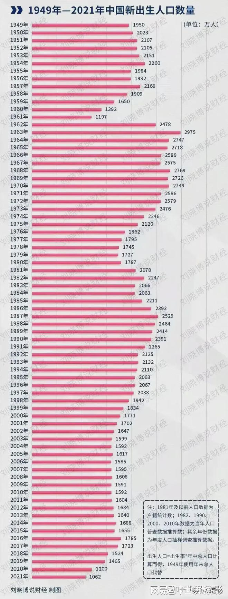

原来5:5的中考录取比例。就让很多中产家庭破防：自家父母都还是蛮体面的，但孩子却连高中都考不上。将来肯定连个像样的职业都没有。妥妥的阶层下降呀。现在居然7:3了？连个高中都不能上了？真麻烦！

其实新加坡就是强行分流的。读不好书的人，就别读了。从小就分开。去干蓝领，服务业去。别装啥高级人才。

[中考录取比例调整为3:7](http://link.zhihu.com/?target=https%3A//mp.weixin.qq.com/s%3F__biz%3DMzg5NjY1NTcxOA%3D%3D%26mid%3D2247491930%26idx%3D1%26sn%3Dd520f143cf279d85c36e40e6f0a703fb%26chksm%3Dc07f6953f708e045302817e9de79c8ae1583f9d1e21f739a609011b187033de1955761ab4665%26mpshare%3D1%26scene%3D23%26srcid%3D0413BZJyUAMI4PyDaeLJ1n7y%26sharer_sharetime%3D1681366478345%26sharer_shareid%3Dbe21c0dfd842dcbbe49d4191504b6a95%23rd)

我原来一个大学同学，自己是985名校毕业的强人，与省级干部的二代联姻，妥妥的中国高阶家庭，上流社会。可他们家的三代，当年虽然上的省级特保的中小学，但儿子就是考不上正规的高中，只能花钱去了民办高中。后来靠关系去读了民办三流大学，学个美术专业。再后来----据说给腾讯打工去了。非常明显的阶级下降情况。三代人，从高阶降到中产干部，第三代居然降到了打工阶级。但总算还有一个基本的职位。

将来他们家的四代怎么样？真就不好说了。如果这种省部级的国家高级干部的红二代，红三代，都保不住自己后代的阶级地位，普通人就更难说了，这还是过去几十年中国高速发展的情况下。从这一点看，中国还是很公平的。起码官场也不是想象的这么黑暗。成绩不行，考不上高中，考不上大学，这些牛人也没有办法偷偷送进去自己的母校985上大学！

未来十年，是中国最艰难的十年！特别对于年轻人来说，是最残酷的十年：大多数年轻人，会连一个很普通的中产级别的职位都找不到。想当个小学教师都当不上。可能只有低阶的工人，蓝领，服务业会有需要。未来的产业分化，进入“减量博弈”时代。除非最终稳定下来。否则这个过程，对于竞争力不足的小企业和大量的年轻人来说，是非常难过的时代。很多中小企业会破产，大鱼吃小鱼。然后---大量的年轻人要失业！因为工作职位流失了。

就算是幸运一点的卷王。很幸运的有个工作职位，估计也和日韩的情况差不多：收入不会很高，但要求很高！每天都会累死！

只要父母没有升级成功，没有眼光，没有帮助孩子建立好未来的平台。未来都必须参加这种激烈的竞争。直到-----最近两年的新生人口长大进入职场的时候，估计我们的社会才会找到新的平衡点！

从这种图形来看，今年中考的人，就是2007到2008年出生的人。出生人数1500万。只有三分之一上高中的话，就算100%录取率（基本不可能），但国家限制这些人只有500万人能够上大学。而目前，每年大约录取1000万人左右。

这种情况，就意味着：三年后，大学将大量消减招生名额（就像今年消减高中名额一样）。很多大学要停止招生。大学学历的“虚浮”，放水时代结束了。大学马上迎来关闭潮。大量的大学教师要失业了，首当其冲的，就是民办大学，三流大学。但名校也一定会强行被要求按一定的比例，消减招生名额的。

也意味着：国家判断未来的经济发展，已经不需要更多的大学，以及大学生了。未来没有多少中级技术和管理职位，白领职业需要人。未来只需要最底层的工人职位。

目前生育率不足够，工人供应不足。同时很多年轻人自以为大学毕业，身份高贵，不愿意下场干活。现在国家的办法，就是彻底打掉这些小民们自以为是个人物的幻想，开启“降级”时代。把大量的中产阶级的后代，用强制不能上高中的模式，标记上“低端工人，普通劳动者”的符号。让这些人去充实工厂，工地，低端服务业。而不是幻想自己是“高级人才”，端不起身份了。

现在的大学，是给你一个虚假的长衫。只是要求你这个孔乙己，自己脱下长衫。很多人肯定舍不得脱的。

三年后的中国，是面子活---长衫都不给你了！你就是短衣一袭。你的命就是打工的命！

**这些人当然很悲惨！从此失去上升的机会！不仅仅自己，自己的孩子也不会有啥机会的！**

**未来最可怕的不是阶层固化，而是阶层降级！**

但：赢家也很悲惨！未来剩下的少数高端职位的竞争压力，绝对非常的大！日韩的年轻人遭遇到的苦难，将在中国青年身上重现。日本90年代开启失去的30年，在中国会有一个特别新的版本出来：一方面，中国高端升级成功（我很自信中国能够赢美国）。但另外一方面，基于中国未来人口下降的危机，随著人口下降，中国必然步入中产阶级陷阱。低端劳动力不足的问题会很严重，因此现在强行压减高中和大学招生，是必然的举措。理解国策，先行一步，才有机会。

但我认为：现在出生的人，未来的应该机会就多得多。2022年开始。中国出生人口跌破1000万。这些年轻人的对手，自动消失了一小半。因为直到2019年，出生人口都是1500万左右。两三年之间，就掉三分之一的人数。造成的适龄人口需求不足会非常的有利于现在出生的人。因此----从现在大学毕业生开始，一直到未来20年。都是对年轻人特别不友好的时代！卷的太凶了！

别说年轻人机会少了。现在在职的中年人，压力也会更大！降低成本，提高工效，超时工作。如果你不干，到处有人顶替你。所以----现在各位别玩情调了。别有钱就去开车去淄博吃烧烤，有点钱，都尽量存起来，买一个烤串吃掉，不如买几股四大行存起来年年拿分红。防止有一天就没工作了。别跟原来一样，傻乎乎的消费掉。原来挣钱容易，未来挣钱会很难的！

我很早就预判未来很有这一天。但无论如何没想到会这么快来。

我的预案是：我的孩子舍不得她去跟随狂卷985。现在这样子，都拼得昏天黑地的，将来只会拼杀更激烈。我也不能指望自己的孩子就是天才。因此----我给孩子安排的出路，就是去小语种国家发展。这些地方，是中国企业海外开拓的必经之路。未来十年需要大量的人才。如果想要家庭不降级，就只能去海外发展，蓝海谋职，才更有希望。留在国内考大学，我都担心孩子会卷成神经病。

各位今天才看到海外小语种留学的好处？才知道我们培养三语学霸的目标？

其实今天也不晚：毕竟---国内的绝大多数人，都还没有反应过来。我只是好笑----一些今日的家长，去年还有人把表现优秀的孩子接回家去跟体制学校接轨，去跟1500万人抢饭碗。而我让三语高中的孩子去全世界与200万人抢饭碗，家长觉得难度高。真不知他们脑袋怎样想的！

中国人的勤奋，恐怕真的是世界第一！我在海外，看到大量躺平的年轻人。读书完全不上进。与国内普遍很紧张的求学气氛相比差距太远，因此：我们只要拿出国内985卷王们一半的努力来，在国外就可以成为top5%的精英学生，海外毕业后在三语国家找个中级职位的工作，无论什么单位都很容易（但英语国家例外，卷的也不轻松，根本找不到好的职位】。比如一些家长为了提升阶级到了加拿大，突然发现自己已经降级了。虽然移民成功，但原来在国内本来是很有地位的中产阶级家长们，到了海外，往往只能找到蓝领的低级工作。工资收入降级，但开支无法降级，结果比国内难受多了。这就是不动脑子，花钱买罪受的结果。

在马来西亚，在泰国，如果你的本土语言很好，英语很好，三语背景，还是名牌大学毕业，很多企业。本土的，国外的企业，都很欢迎的。找个好一点的工作不是很难！如果找到中国的企业，给的工资是国内的高薪，你的支出是小语种国家的开支，比国内生活不知道好太多了！