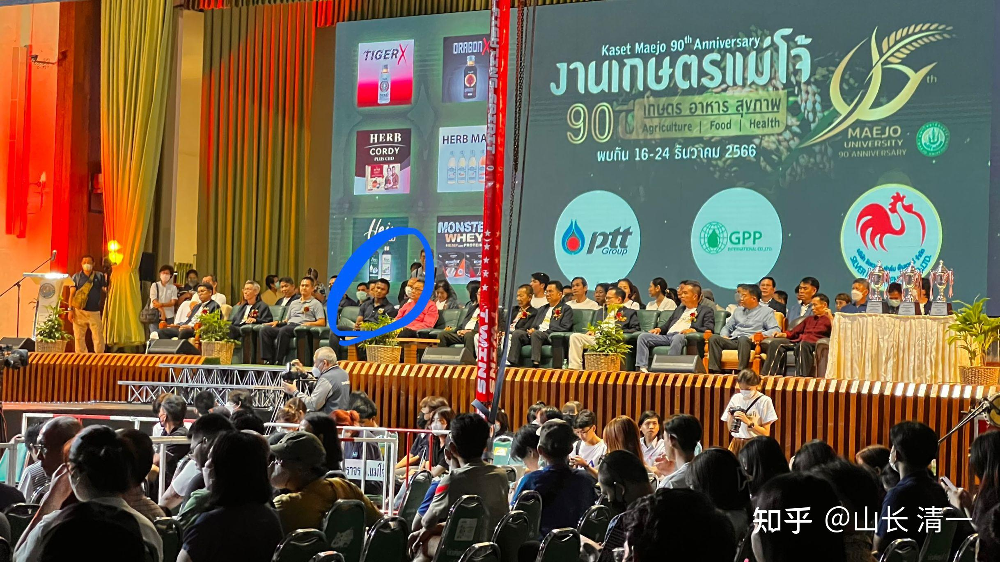

昨晚木兰首战拳击，我去现场观看。因为我依然有点担心：我教木兰们用于对付拳击的技术，都是纸上谈兵的理论原则，不知道实战是否有效。因为我也从来没打过拳击赛事，甚至----不好意思，我昨天才第一次现场观看拳击比赛，原来只在视频上看过。公主班的学生昨天也全员出动去看比赛了。由于昨天是梅州大学创立90周年的赛事。当地的政府官员和各界校友名人都参加。而且比赛有金腰带参加和国外拳手参加，煞有介事的隆重介绍。

昨晚赛事6：30就开始了。因为比赛的场次较多，而且拳击赛事有些是12回合的顶尖拳手职业赛。清一太极也首战拳击，见证实战结果。原来打泰的利器---迎门三脚，以及我们占有优势。并借此多次KO泰拳手的内围肘膝，在拳击赛上就完全用不上了。而我们太极门的用拳习惯，打法，技术，原则，都完全不同于拳击的打法。万一我们判断失误，上场后发现我们的技术无法正常使用，就会闹大笑话的。毕竟-----拳击已经发展了几百年的技术，可以说已经相当的完善，该提升的技术底蕴，理论上，这么多年欧美的拳界人士，为了高额的，上亿的奖金，也早就去开发出来了。怎么可能轮到被中国人，被我这样的一介书生，拳击外行，轻松去发现拳击奥秘，并利用拳击的漏洞去降维打击呢？

比如雷雷，用自己想象的，威力无穷的太极，和现代格斗去对阵，结果上场后就只会用脑袋硬接拳头了。民国时期首次的全国传武大会，比武的结果，就是学西洋拳击的拳手，彻底打败各路学传武的中国功夫。因此，对于西洋拳击的崇拜，已经刻到了国人的心中。各种大师，中国的梅蕙志等，都在贬传武而崇西洋拳。国际上，拳击也因为英美数百年的经营和推崇，成为格斗界的第一大赛事。西洋拳手们的报酬也极高。梅威瑟一次拳击比赛就掠金上亿美金，完全不是泰拳等格斗赛事能比的。如果清一太极能够轻松克制拳击技术，取得胜利，意味着中华武术未来将取得历史性的突破！

谭木兰是昨晚7场拳击赛事的最后一场比赛。赛前还有公主班的啦啦队舞蹈展示，形象很好，很受现场欢迎。

谭木兰首战拳击的成功，从小公主们看前面几场职业赛事的时候，就有预兆了。孩子们也是第一次现场观看职业拳击比赛。还是多位冠军参赛的高级赛事。其中有几个非常厉害的重量级，轻量级的外国拳手参加。但明慧看了这些正宗的西洋拳比赛，就说他们的攻击好慢，应该不难打。佳慧说：Ella看了男子的职业拳击后，虽然场面看起来还是很凶猛的，连耳朵都打出血来了。但ELLA居然对佳慧说：她认为---要打男生。更稳健的方式，不如先去打拳击比赛。因为她也是练拳的，她看到的职业拳手男生比赛，觉得比泰拳更容易打，技术简单很多。对方攻击手段就两只拳，很容易封死攻击线路。而且西洋拳的打法笨拙，都是双腿支撑，双手互伦。打击力量上，也难以对防范严格的对手造成明显的威胁。因此认为：女生打相同重量的男生，也不会太吃亏，相对泰拳的八体技术来说，西洋拳似乎更容易。男拳手对木兰的威胁力也大大减轻。

如果木兰们自己，都能发现西洋拳“更容易对付”。我看到的拳击，更觉得很容易对付------木兰只要发挥正常，就可以轻松拿下拳击比赛。但由于清一太极的打法太独特，而且上场就带歪了对手的格斗思路，因此与其他场次的拳击比起来，画风完全不一样，很多行家都被闹迷糊了。只有普通的不懂拳击的人，看至双方似乎打得很热闹。但门道完全不是西洋拳味道。特别搞笑的是：木兰上场正式开打后，前几场赛事都是口若悬河，不断介绍双方采用的各种拳击技术的专业解说员，突然就不知道如何解说了。明慧说他一直说一些无关的废话。我估计是他从来没见过这样打拳击的风格，风格很怪异。不知道如何评判才好。的确场面与前几场比赛双方互换攻击的传统拳击风格，大不相同，解说员只好说一些废话度过去假装在评论拳击。

对手本来是泰方精心选出来的进攻型拳手，听赛前反馈：这拳手还是很厉害的。只是面对木兰，却突然失去了锐气，她根本不适应这种攻击方式，面对谭木兰的压迫性打法，不太敢出招。一动就挨打。因此有点不知所措，不得不步步后退。刚开始打了不到一分钟，我就说木兰会赢了，我们的技术克制相当有效，对手无法发挥优势。

很在意谭木兰本次是否能赢比赛的泰国老拳师，昨晚也来到了现场，比赛时就坐在我旁边，打完第一局，他也放松了。高高兴兴的说谭木兰打得不错，应该会赢的。因为泰方拳击手，已经被明显被压制了。甚至明慧都看出来了，告诉我说：谭木兰一直在压对手的0.8距离，不轻易攻击，很稳定。泰方拳击手由于吃了亏，不敢攻击，只能不断退开避战。因为这个我方的0.8预备进攻距离，是泰方很不舒服的位置，她难以正常还手。一旦攻击自己会先挨打。泰方因此陷入了很被动的局面，不断挨打，却无法正常的回手反击。勉强发动的防守反击也无效，还带来更多的攻击。而且木兰看上去轻描淡写，攻击幅度不大的动作，给对手造成的打击力量显然很大。常常出现泰方挨了一拳后，站不稳连续倒退几步的情况。谭木兰甚至在第三局，还发一拳就把对手击倒在地上。优势很明显。

回合中间休息的时候，我看泰国拳击手的状态，是低头走回角落，非常明显的无助样子。我认为是她在比赛中，就看不到打赢的希望，不明白自己哪里出了错。跟她日常的训练对抗节奏完全不一样，因此显得非常的丧气。只是昨天，我认为谭木兰虽然发挥了左手的攻击优势，但准确度和力度还不够完善，连续攻击中也还没有发挥出来脆劲和力量。不然泰国拳手的命运，就是糊涂糊涂的被KO了。谭木兰左直拳和连续拳都发挥出来了，就是力量还没有达到我的要求，但也能打得对手连连后退。将来一旦发挥力量优势，对手就是想退都退不开了。

谭木兰也很遗憾---她认为其实有KO的机会但没有抓住。不过毕竟只是四回合的比赛，这么短时间要耗尽对方体能，KO对手，要比泰拳难得多。因此拳击赛其实KO难度比泰拳要大。毕竟---昨晚非常激烈的12回合的金腰带对抗，一方有些弱，但最终也没有KO。

最终，清一太极战拳击，获得了压倒性的优势和胜利。主席台上的主办方，似乎也很开心。赛前就特别的给了谭木兰一笔额外的奖金。估计是因为她代表梅州大学出战，校方很支持。赛后梅州大学的老校长，又再给了谭木兰一份“胜利奖金”，场面很温馨。昨晚的全部比赛，均通过专业电视台摄制，并公开网上直播。下场后，我对谭木兰基本执行了战前的战术战略表示满意，同时也批评她没有发挥本身的实力，还不够冷静沉着，放过了很多很好的重击机会。不然对方会不断被打倒的。还需要她更冷静地应对赛事。同时告诉她:拳击技术也完全可以用于对付泰拳赛事。这种攻击方式会把对方的拳腿攻击都封杀。最终对方只能逼得使用肘膝来对抗。处于完全被动的境地。

技术改进意见：泰拳手在主动攻击被完全压制后，改进了方式，就是尽量退远一点，设置攻击陷阱，让木兰在上位进入预备攻击区域的时候，用后手重拳去袭击预定进入的位置，而不是攻击现有的木兰位置。这和泰拳手们面对木兰进逼，用退开远距离用后扫腿来应对木兰的技术方式很相似。虽然这种反击没有啥实质效果，但造成我方的攻击方法也难以顺利实施，主要是攻击距离过远，不容易打实。因此我方可以改进更高级的攻击方式。就是假装要进步攻击，先引诱对方的后手，后重拳出击后，再发动真正的攻击，这样对方在提前攻击后遭遇反击，效果会更佳。原来的木兰，往往急于进攻，会走进对方的陷阱，造成自己的攻击距离过远打不住对手，白白耗费体力的情况。如果改用这种新的方式，效率会更加提高。对手会更无助的。真真假假，虚虚实实，就更难防范了。

另外一种应对方式，就是用跳步，飞步快速拉近距离进行打击！对方会更难应对，心理上的打击更大。这两种方式，必须是未来木兰们更加重点练习的方式，双方对抗的升级版！

不管怎么说，今天都是创记录的胜利。清一太极首战拳击试水成功。未来会尽量找到更多的拳击赛事参加，开始进入拳击界！

*赛场的主席台*

昨天播求出现在主席台上的嘉宾中，播求现在是泰国的泰拳推广大使。现在比赛很少，但参加各种活动的机会更多了！