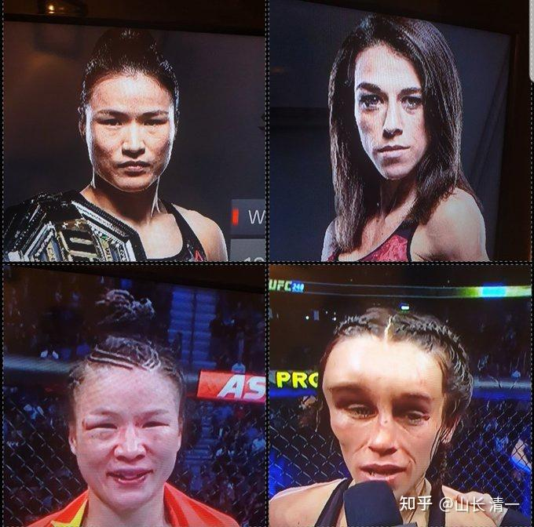

为了让大家真正了解拳击格斗的技术，我们先看这个正宗的，示范性质的拳击对抗视频。 这就是真正的拳击对抗！墨西哥人，现在是出产全世界最优秀拳击手的地方。也可以看到与我们木兰的拳击比赛，有很多不同的地方。

[墨西哥拳击-桑塔·克鲁兹火爆对攻_哔哩哔哩_bilibili](http://link.zhihu.com/?target=https%3A//www.bilibili.com/video/BV1c64y1k7Xj/%3Fspm_id_from%3D333.337.search-card.all.click)

而太极与拳击的首战对抗，是下面这样的视频，你们看看两者的区别有多大？----- 这也许是历史上第一次记录下来的，古传太极技术对抗西洋拳击的实战视频！太极拳手按照拳击规则来打的这场比赛，真太极，练的是格斗，正常的格斗技术，是可以与任何流派的格斗手对垒的，因此，可以采用任何对方规定的格斗规则来比赛。我们只需要了解规则，适应规则，调整一些技术就够了。但采用的核心技术，万变不离其宗，依然是内家太极拳。如果只能规定用某种技术来比赛，如推手等，这种没有自信的拳，肯定不是太极。

你们可以看出来，谭木兰的比赛，与上面的拳击对抗视频，是完全不同的风格！虽然这场比赛，双方的水平并不是最高的，我们的拳手也正在走向成熟的路上。但我相信这场比赛，注定会成为一个重要的历史记录。将来拳击界的人，想要击败清一太极拳手的话，他们会把这一份拳击首秀的视频，作为重要的资料，成百遍，千遍的去观看，去研究。了解太极技术，到底为啥让拳击技术无法发挥！因此---这是一场必将走入历史记录的比赛！

[https://www.zhihu.com/zvideo/1634512972709154816](https://www.zhihu.com/zvideo/1634512972709154816)

**区别要点一：双方的距离感不同 短距离攻击VS长距离攻防**

拳击手的对抗距离，要比清一拳手的对抗距离更短。拳击手双方大致上都在一臂的距离内进行各种技术的对抗：如摇闪技术用于对方进攻。曲臂防守用于保护自己头面部。以及提肩防守用于防止侧击，还有曲臂防守护住自己，硬接上几拳后，瞅准空子进行反击。为啥不采用回退躲开移动，躲避对手的打击呢？因为双方的攻击都在手臂范围内才有效，因此：你后退躲开了对方的攻击，但自己也不能攻击对方了。就变成了追逐游戏，双方都无法得分。因此，如果实力差不多，拳击对抗的技术，更强调双方在手臂可攻击范围内进行防守和反攻。双方的头部距离非常的近。双方都有机会击中对方。

但这个距离内拼拳，有一个巨大的问题，就是人体的防守反应时间，是有阈值的。如果是职业拳手，阈值反应是完全可以面对业余拳手的攻击，可以完全躲过所有的慢速的出拳。能让业余拳手根本就摸不著，打不中，单向狂虐对手。但如果是水平双方差不多的职业拳手，反应速度都差不多。但拳攻击的速度，是要短于防守反应阈值的。因此，无论何种等级的拳手，对抗中，都一定会挨打。因此：双方一定要学会抗击打力，而且要求身子必须站稳，被击中后，身体还要不变形，才能在被攻击后马上回击。双方互相交换挨打。不至于吃亏。如果站不稳的一方，或者扛不住打击的一方，最终就败北！但胜方全场也会被多次击中，受伤，甚至不会比输家更好！

看看下面这张图片，赛前赛后两人的面部照片，就知道这种拳击技术的互换攻击，有多艰难了！

*相同技术，谁抗住打击谁赢！*

清一拳手如果采用相同的技术，去打拳击赛，与拳击对抗的话，是不可能赢的。因为必须要与对方已经上百年积累的成熟技术去内卷，我们肯定卷不赢对方的。需要格斗天才去卷，才能夺取冠军桂冠。我们不会有机会。

所以：我们的打法，就是尽量在对手的舒适区外展开攻防。在对方防区外开启打击，这样对方根本就没有防守和回击的机会。这样我们就可以只打人，而不挨打了！

具体方式是：放弃前手曲臂保护的动作，而是把前手伸长。有点像是拳击手用前手测量距离的样子。这个动作就是雷雷对抗冬瓜的样子，前手放在前面。而不做拳击一样，尽量护住面门的防守动作。

但：这个动作不是用来像雷雷一样摆POSE，装大师的。而是具有攻防合一的作用：

1：如果对手敢于靠近我方前手的拳，就是铁定要挨打的。这就是传统拳法里面的“半步崩”的技术，我方不需要手臂的屈伸来发力，只需要步子往前弹跳半步，就可以用整个身子去撞击对方。这个最典型的案例，就是119战中明骐KO对方的这一拳。对手明明站在防区外的“安全距离”。但没想到明骐拥有跳步接近的打击技术，而且上步的脚步落地同时，拳就打击到位了。对方几乎没有防备的就中拳倒下。拳击手，是很难想象一个看起来轻飘飘的“前手刺拳”，居然有如此威力。谭木兰由于准确度不高，速度也不够快，我教她的就是“拒止”打法。不打对手的头部，瞄准对方的胸部三角区打击，让对方没有靠近我方的机会，只能在我防区外被动挨打。对方拳击手第四回合被谭木兰击倒，以及中间多次身体被击退数步，都是使用的这个技术。如果这一拳打在脸上，下巴上，就可能KO对方！

[https://www.zhihu.com/zvideo/1634132852512874497](https://www.zhihu.com/zvideo/1634132852512874497)

你想想看：如果你是拳击手，你怎么对付这个伸出来的前手拳？它是进攻还是防守？显然你过不了这一关的封锁，你就别想打上对手的头部！拉不近距离，拳击手根本就没有出手的机会。你面对眼前的拳头，如果没有想好对策，贸然向前移动，肯定会遭到严厉的打击！但如果你保持在原位置攻击，距离超过了对方的手臂长度，肯定无法击中。因此你发现了，对手迟迟没有出拳攻击的动作。只有在不断的试探和躲闪，如果我方实战训练良好，不会对这些场上的无效动作做出反应。对手由于没有啥有效办法应对，只能不断做这些闪避动作以求规避打击！

2：对方通过试探，并头上挨打数次之后，知道站在自己习惯的位置，是不安全的。对方前手拳会随时打到自己头部。因此：马上就学会了应对方式---自己也伸出前手手臂，让身体保持在更远的距离。而且在对方进步拉进距离的时候，学会不断退步保持距离，避免被攻击。这样导致的弊端，就是自己也失去了攻击的机会。---尽管可以有效躲过攻击，但自己也无法进攻，步步溃退，场面很难看。裁判如果强势一点， 会判她消极比赛，逼她前进的。而且---对手如果连续进步，快速拉近距离，自己就会挨打。因此---我方通过【控制距离】一个技术，就完全让西洋拳缴枪，失去了威胁力！无法对等反攻。这就相当于苹果用智能手机技术，取代了诺基亚的霸主地位。诺基亚积累了几十年的专利壁垒完全失效。我相信未来，不学太极格斗技术的拳击手，肯定遭遇失败！都必须转型。而传武的训练，格斗文化的核心资产，都在中国人这里！

**区别要点二：强侧置前（传武）VS 主力后置（拳击）**

拳击的格斗逻辑，是用相对虚弱的前手（左手）在前方，做防守，虚晃，扰乱对方的作用。如果找到机会，用后手重击来取得有效的打击效果。因为从发力技术上，只有后手拳，才会用出拳击的转腰，摆跨，蹬腿发力的重击动作。如果对手站在原位挨打，或者后退中追击打击，拳击这种前刺后摆的组合动作，会发挥出很大的威力。但如果面对木兰这样步步向前的紧逼动作，对方逼得步步后退，就算是勉强出了后手拳，也难以发出力量，也容易被木兰的左手挡掉。因此这种步步紧逼的战术，就破掉了拳击右手拳的有效攻击。

太极的格斗原则，是前手就是强侧，用最灵活，最方便的前手拳作为主力，攻击对方，并控住对方之后，再用不够灵活的后手拳补刀。大家看到我们经常用前手拳KO对方，或者前腿攻击击垮对方。而泰拳和拳击的前手拳和腿，都只是辅助攻击，我方前手，则是主攻手。不仅经常给对方造成KO结果，更重要的是：拒止了对手的后手攻击。

之所以能够这样使用前手拳，是与西洋拳不一样。因为我们的发力动作，并不要靠转腰，摆胯，蹬腿来发力，不需要这么长的发劲距离。而是用身体一抖来发力的，因此首先是看不见（动作很小），而且速度快，还可以发出寸劲。前手伸直，都可以重重的打你一拳。但谭木兰现在的功力还不够，身手合一不够好，她的前手曲度更弯一些，如果她能够变得“更直”一些，功力就更强了，攻击防守的距离就更远，对敌方的威胁会更大。这种发力的练习，不是打沙袋能够得到的，木兰们正在用练大杆子的方式来训练太极发力技术。要等过几个月，肯定就可以发出更加强劲的力量了。将来的拳击台上，欧美人会遇到木兰们越来越强劲的挑战。

**区别要点三：攻防思路不一样----单攻单防VS攻防合一。**

西洋拳是攻击和防守分开的技术。而且，为了强化两手轮流攻击的威力，特别是为了方便右手拳压上去打重击，西洋拳的站位，倾向于接近双足平行模式。这种格斗式，将无法避免在两手的中间，暴露出一个清晰的防守薄弱区。胸部，头部都暴露出来了。因此用直拳和刺拳，都很容易进攻这一关键区域。为了防止直拳进攻，西洋拳会用双拳合拢，借助拳套的体积作为盾牌一样，挡住对方的中线袭击！或者用摇闪技术躲开直线的攻击。

这种格斗技术，遇到太极传武“取中，用中，守中”的格斗原则，就显得特别的愚蠢。

**一：西洋拳击手会找不到自己进攻太极格斗手的有效路线。**因为太极拳手在侧立方位式的时候，前手拳正好位于头部的前方，与鼻梁平齐。因此，对方的直线拳法（直拳，刺拳），是打不到我方头部的。西洋拳手的后手拳进攻，看起来唯一的攻击路线，可以用摆拳击打我方左侧头面部。但拳击原则，是先用刺拳扰乱，引开我方的防守后才能出后手拳的，直接出后手拳，会遭到我们前手拳迎击面部的威胁。而且我方的左手，正好放在防御位置，堵死了对方进攻的空间。面对我方的这种不暴露攻击部位的防御站姿，习惯直接击发目标的西洋拳击手，会蒙菜，失去攻击目标。因为他们完全找不到攻击的路线。因此各位看到的赛场实况，是对手满脸迷惑，主要是在防守，很少主动进攻，因为她就没啥机会进攻。只有不太多的几次后手的防守攻击，或者试探性的攻击，还是在谭木兰前手进攻的时候作为反击出现的，基本上没有啥打击效果。因此场上的局面，其实是一边倒的。

**二：太极格斗是攻防合一的技术。**

太极前手拳的攻击，如果是主动攻击，会从中线用挑手，进攻对手的头部。此时对方的左手，会被架在外围，中线暴露直接挨打。谭木兰的实战中，你们可以多次看到这条线路的攻击！再加上左拳补刀。

如果对方发动进攻，无论是左手的刺拳，还是右手的后直拳，后摆拳，无论是真进攻，还是虚晃一招。我方太极拳手的选择都是一样的：依然用前手直接从中线进攻对方的头胸部，得手后，快速用后手拳补位攻击对方的头胸部，每一拳都要求打移动对方的重心，不给对方站稳拼拳的机会。由于我方前手拳离对方很近，因此肯定后发先至，对方没有机会攻击到我们头面部就会先被击中。只要把控好距离，对手是无法进攻的。只能被动挨打！

**区别要点四：站稳发力VS移动攻击 **

西洋拳的重拳发力，非常依赖底盘（双下肢支撑）的稳定支撑，通过扭腰转胯摆身发力，来获得强大的攻击力量。高手与新手的差别，就是这个技术的熟练程度罢了。因此，如果站在一个手臂的距离内，稳定支撑身体，与对方一起拼拳的话，我方是没有胜算的。他们天天训练这种技术，怎么打得赢？

但如果我们破坏了对方的支撑框架体系，对方就无法发力了。方法有三个！

**一个是双方一搭手，就要改掉对方的重心，**让对方不得不重新去找新的平衡点。这个过程中对方无法攻击和防守，就是我们最佳的进攻时机。这种功夫其实很难练，需要长期的搭手，断手的练习才行。但一旦会用之后，效果非常的好。

** 第二个方式，就是不断的重击对方的重心**，**用打击力量来让对方无法维持平衡**。对手也就失去了还击的能力和机会。所以，一旦发动打击，我方就必须连绵不绝的攻击对方。而且还要有破坏对方平衡的力量，让对方无法站稳。本次实战视频中，大家应该可以明显看到了这种连续技术。可惜谭木兰功力不足，打击力不强。但起码使得对方只能被动挨打，没机会攻击我方。

**第三个方式，就是“快速移动攻击，防区外打击”。**

这个就是明骐在119战中，一个前手拳KO对手的攻击技术。对方当时，看我方拳手站在远离他熟悉的双方互攻位置，连腿都够不上对方，拳就更别说了。因此泰拳手放松了警惕，没有做好防守准备。明骐却一个跳步上前，前足落地的同时，拳力已经发出，打到了泰国拳手三宫步姿势，必然会暴露出来的中线要害---下巴。同时后拳的组合攻击也随即发出，这是为了防止对方右手拳防守反击，以及作为我方前手拳补刀的拳，用于补充前手拳攻击对方头部的补足。只是由于对方倒地太快，躲过了这一拳袭击。

如果打泰拳，需要更远对抗距离的泰拳，我们都可以用一拳就解决战斗。如果换成是打拳击，使用这一技术（移动攻击）的威力会更大。我方不必担心对方的腿，膝肘攻击，攻击就更放得开了。

** 今天讲的这些内容，对于练拳，练实战的武术界人士，是千金不换的宝贝，绝对是当代的格斗圣经！你们看不懂古拳经，我把古拳经做出样子，做出示范来。还怕你们看不懂实战，只知道热闹。我还特别的解释清楚细节技术，让你们看清门道何在。有心人真的看懂了，理解了，就知道老祖宗的功夫，该怎么用于现代格斗了。将来，中华武术就会自动的弘扬和发展。我也没必要到处去找徒弟，当师父，立门派了。也许几年后，很多传武的门派，都可以派出自己的打泰大军了。因此，我们作为先行者，把我们与现代格斗拼打的实战经验，系统地总结和分享出来，希望各派的传武传人们，如果不想让本派功夫毁在自己手里的话，就自己去根据我们的示范，培养一批真正会实战的中华武术人才出来，通过与现代格斗实战，建立自己门派的声誉。我们探路，征泰的实战分享知识产权，就一文不取！我不靠卖拳，卖老祖宗的东西来赚钱。只为了维护中华武术的荣誉而战！希望你们也为你们门派的荣誉而战！**

**大家努力！**