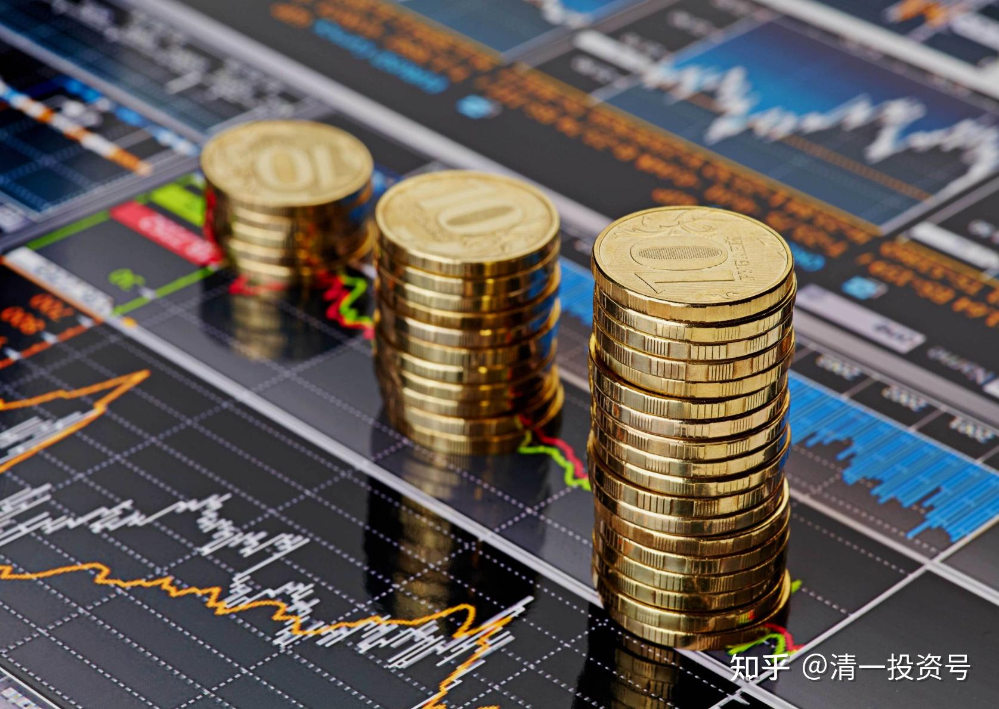
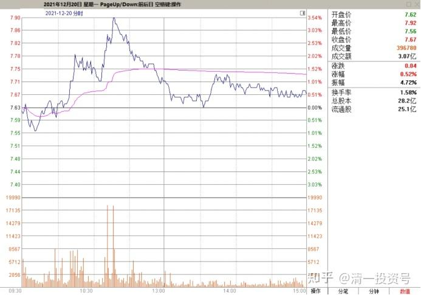
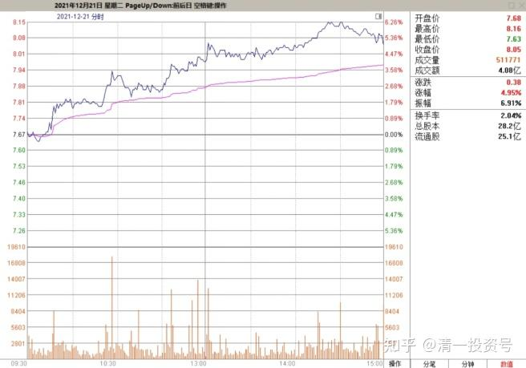
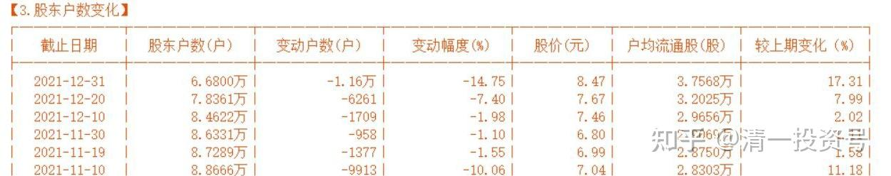
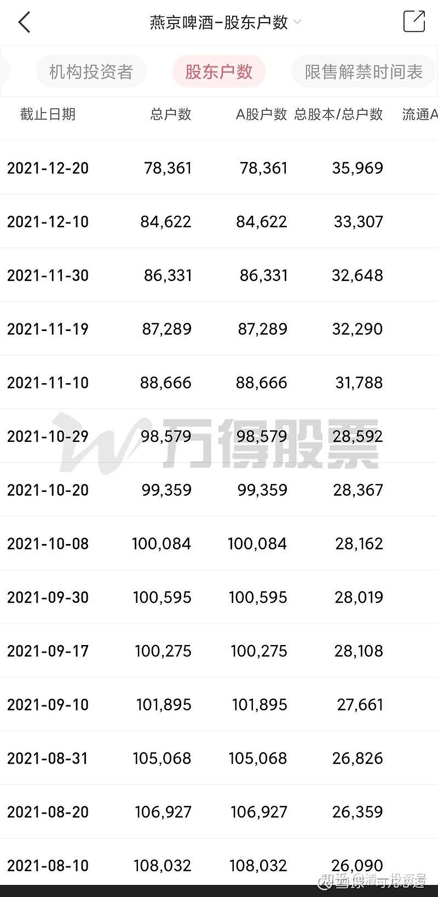
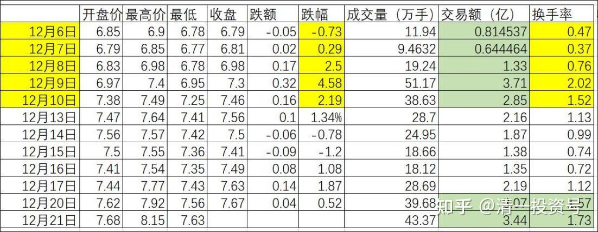
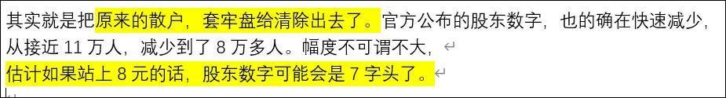

专篇10.主力完成筹码收集

清一山长 2021年12月21日

2021年12月20日YJ走势图

盘面分析：昨天晚上看YJ的走势图，发现昨天是相对大幅的一个冲高回落，一根长长的上阴线，但回落并不深，实际上是自然的解套盘，做T盘的行为，没有主力的打压迹象。**我感觉：YJ的筹码收集已经快结束了，很快会真正的涨了。**上一轮快速起涨，涨过7元的时候，平台调整了很长时间。说明主力不愿意消耗筹码来打压。因此就是主力已经完成底仓的收集了。这一段时间是消耗浮筹，不希望一些跟风盘底部一直跟随赚大钱。所以用小幅拉涨来消耗一些套牢盘，直到目前也是这个策略。第二轮上涨，脱离调整平台的上涨，居然只调整了两天时间，调整幅度也很小，就重新进入了上升通道，说明主力的浮筹处理很成功，已经快要进入真正的主升期了。

2021年12月21日YJ走势图

今天很难得的，直接就快速突破了8元压力位，前期的大多数筹码都已解套。这个价位套牢盘众多，可能会需要继续调整一段时间。**但从成交来看，目前才2.61亿。说明浮筹并不多。**

未来主力的策略，是不希望大量吃进筹码，但要用上涨趋势已经打开，吸引游资加入，一起来烘托上涨。**主力的任务，是用不断地震荡操作来高抛低吸，这种交易手法的主要任务，并不是赚钱，而是制造赚钱效应，吸引跟风盘。**从而达到不增加筹码，不消耗资金的状况下，让股票不断拉升。赚不赚钱不重要（其实这种高抛低吸，也会赚一点钱的，但主要任务是分派筹码，要把冲高吸进的筹码分给游资和右侧投资人。一旦人气爆棚，股价也拉升到主力的出货区之后，他们才有机会真正出货。**出货不是一个点位，而是一个漫长的区间。**

原来的惠泉、珠江都是这样做的。但YJ会怎样？也跟他们一样吗？我有点怀疑。**我认为：YJ主力很可能走出与惠泉、珠江完全不同的走势。我认为会超过他们的上涨幅度，很可能不会只拉一倍就走人的。**当然，不一定会一次到位的，我认为主力的耐心足够。这是一只长庄股，机构股，有可能会走成一只长牛股。我看她，今年以来从来就不涨停，就知道：它现在还不想吸引市场的热钱，还远远没到大热的时候。

换了惠泉，涨到6元多涨到8元，已经拉了好几个涨停了（也让我做T赚了几次了），现在YJ这架势，缓步上移。让我一点做T的动力都没有。很多人不懂看盘，自然一做就飞。YJ的做T党估计全都甩下车了。现在只能干瞪眼。你们就等吧！**没有涨停出现，做T都没有意义。只有出现涨停动作之后，才进入YJ真正的精彩阶段——高抛低吸，斗智斗勇。**现在，还只是热身罢了。你忍不住，可以出手做一点。**我还继续等它涨停再决定取舍（涨停如果量小，我也不走的。我要见到放量才走）**

山长清一2021/12/21 14:37:17

（YJ股东数截图）

最近十天，股东户数大量下降，走了6000多户。还不算一些大量减仓，但没有清仓，留个100股看盘的人。应该是很多套牢盘，股价刚刚解套就跑了，今天估计气死[大笑]。这就是主力的游戏。

山长清一2021/12/21 14:52:33

**尾盘的半小时，是很重要的时间点，跟第二天的走势相关度很高。今天的尾盘如果冲高，明天就没戏了。肯定是回调，清洗筹码的。如果今天的尾盘不温不火的，甚至还掉一些下来的，让人很失望的，反而未来的走势会比较好。**说明主力根本就不想招摇，故意压着一点走势。今天没有万手哥压盘，看上去盘面压力不大，为啥不冲？不是不能，是不想冲！等下看验证吧。到底冲不冲。我认为不会冲。

山长清一2021/12/21 14:54:57

前几天压盘的万手哥都被吃掉了。昨天两笔大单，每单都是170多万股。被没收掉的人肯定气死[大笑]。今天就没有人出来调皮了。但YJ就是不冲高，温吞吞的样子。这样子，就是要你赶快卖。秀肌肉，我要冲，你反而跑掉。跟市场小信号相反，可能你就是对的。

山长清一2021/12/21 14:57:07

**还没有8元，就只有7字头的股东数了。到了年底，会不会就是只剩6万多人了？**

山长清一2021/12/21 15:02:12

收盘了，果然被我说对了。最后一笔成交，真的在往打下打，而不是往上冲。吉祥如意的信号[献花花]，主力不希望大涨，压住涨幅慢慢走。好事！

山长清一2021/12/21 15:29:49

主力其实今天尾盘示范的，就是我们清粉国的格言——付出。本来已经轻松拉到8.16元了。但一直拉高下去的，别人跟不上，就没有人一起走，就只能孤家寡人的玩，拉多高就自弹自唱了。一路不停的往上拉，就只有人下车，没有人上车了。为了让一些聪明人有机会上车，主力一般要压着盘子，给人上车的机会。甚至故意的把筹码扔给一些急着进场的人。

你们千万别以为主力就是要股不要钱的。他的股，我认为已经买好了足够的数量。现在他要的是人气，出钱来做的也是人气。花钱买股是拉人气，出掉筹码给你是让利给你赚钱，制造赚钱效应。各位看尾盘一单打压，就用了一百多万股，总共打下来一毛钱。必须让一些敢于抢盘的勇敢者得到筹码，跟随赚钱。自己吃点亏也无所谓。不吃独食。

吃独食一路上拉的庄家，都是一些富二代被骗来坐庄的，做上去容易，下车就难了。就如同原来我点评过的【**仁东控股**】，就是被人诱惑进去接盘的傻瓜，亏了好像20亿。这是玩的局，专杀不懂股市的土财主。

真正的坐庄，是像YJ、惠泉这样，要让散户赚钱的。只有这样，就慢慢培植了一批“死党”，勇敢地跟着主力追涨杀跌。这些人还会把自己的成功经验，分享给周围，让周围的人一起加入。这样就让YJ越涨，人气越高。赚钱的人越多，大家一起开开心心的往高处走。然后，**来的人越来越多了，主力就悄悄地撤走了。**这才是真正的派发。

现在主力虽然8元多给了筹码，短期内会被套住（明天几乎肯定会回调去考验8元的有效支撑）。但只要“相信主力是好人”，没过几天就解套了。你兴致勃勃的说：YJ是好庄，不套人。接着就加码购买，甚至借钱购买。有一天，就真的套牢了。真出货，是【此恨绵绵无尽期】的，主力才不会给你机会出逃呢！现在是最美好的蜜月阶段开始了——未来很长时间，都是不断的解套所有持股者的时候，是主力被夸奖，有本事，有能力的时候。所以，好好善待主力[献花花]。他们真棒。

唯一不好的，就是封杀我，怕我说话[大笑]。当然，**真正最聪明的散户，就是看到宴会开得最繁荣的时刻，看到主人已经悄然离席了，自己也提前抽身离开。绝对不吃剩下的一口饭，留点好处给别人。**当年最高37元卖掉融创，当时的“宴会”上，个个都在叫88.48元。我显得像是傻瓜一样。现在居然开始考验10元支撑，目标位往8.48靠了。这就是要学会道家的【**功成，身退**】。别吃光吃尽了，留点好处给别人[大笑]。

**丽2021/12/21 14:35:13

@山长清一 谢谢山长分享。我对照着您之前的告诫【成交大量增加】作为指标，看不懂盘面，自己做数据记录，对比您评论的上上周的情况，不是【大量增加】的标志，由着它高也不动。

谢谢山长分享，记着您这句话，我就想，我要留在这7万人里面

还没到后面呢！山长分析的趋势和数据，都开始呈现。

**程 2021/12/21 14:42:42

山长威武果然验证。

**梅2021/12/21 14:44:32

感恩山长的指引。

**雅2021/12/21 14:48:26

@山长清一 感恩山长指点！虽然是加入新教育才第三个学期，但是来来回回看雪球语录，笔记做了很多，企图能学到些山长的门道，可以功底不够。笔记倒是快写了整整一本（整整来回2021年雪球语录看了2/3边，2014-2019年的还在学习中），但是越看越看清晰，几乎到回去，前面的说的，分析的，都在后面的语录中实际中，一一验证！现在YJ虽然只有5万股但是捂着不动中，中国建筑35万股也捂着，从5.2开始买一路跌一路买，今天实在忍不住把4.66成本，第一次做个T点（之前10个月从来没动过包括上次5.38）。另外捂着的还有港股，10元以下山长加仓的中建；3-4元买进5元以上卖的中国海外宏洋；3元以内不断分享大家进入的中国中车；4元以下可以买入家里有矿的中国中铁。

**学2021/12/21 14:53:14

@山长清一 谢谢山长的解盘，刚打开账户看了一下，现在的盈利让我又多了一套海外社区房，不过现在还不准备变现，所以，一股未少。当然，也不准备增加股份，因为前面一年给了我吃够筹码的机会，7元以下，有钱每天就买10000股，买成了第二重仓(第一是中建)。山长曾在财富二年级课程上说过，要参加财富三年级课程，入门券是晒下收益单，今年不但自己赚钱了，还带着一些有缘的家长解决了财务问题。感恩山长的指引。

**雅2021/12/21 15:05:49

@**学 马老师，我就是那有缘的家长！哈哈，谢谢您5月份的盗版的山长的初级财富思维课，才让我想明白了，什么是财富自由，那只无形的逼着我不断拼命工作的背后是无限欲望，才让我放弃了工厂，带着三孩子走入新教育！真的特别感恩。

**祎 2021/12/21 15:05:41

感恩山长手把手的指导，今天一直在关注两个指标，交易量，还有最后是否诱高，结果山长就出来亲自指挥，太幸福了。

**程2021/12/21 15:09:42

感恩山长手把手的指导。

**丽2021/12/21 15:09:51

感谢山长，清粉区还没进驻，山长都已经给我们派发实实在在的福利，这样实时解盘，真正是授清粉居民以渔，真正财富自由，把时间放在追求精神自由，心灵自由。感谢山长，时时示范：人生是用来创造价值的。

**雯 2021/12/21 15:11:12

感恩山长手把手的指导[大赞]

专篇1 [306篇.前缘1.雪球的最后一贴--胜利曙光都已经出现](http://link.zhihu.com/?target=https%3A//xueqiu.com/2017773236/247159187)

专篇2 [307篇.被特别关照的股--前缘2](http://link.zhihu.com/?target=https%3A//xueqiu.com/2017773236/247387457)

专篇3 [308篇.立此存照--前缘3](http://link.zhihu.com/?target=https%3A//xueqiu.com/2017773236/247580614)

专篇4 [309篇.见识传说中的拖拉机账户](http://link.zhihu.com/?target=https%3A//xueqiu.com/2017773236/247973779)

专篇5 [310篇. 拉升在即](http://link.zhihu.com/?target=https%3A//xueqiu.com/2017773236/248351982)

专篇6 [311篇. 进入右侧投资时代](http://link.zhihu.com/?target=https%3A//xueqiu.com/2017773236/248658236)

专篇7 [313篇. 小主力进货的阶段](http://link.zhihu.com/?target=https%3A//xueqiu.com/2017773236/249221851)

专篇8 [316篇.两轮回调对比](http://link.zhihu.com/?target=https%3A//xueqiu.com/2017773236/249675370)

专篇9 [37篇.主力的水军](https://zhuanlan.zhihu.com/p/619400004)

