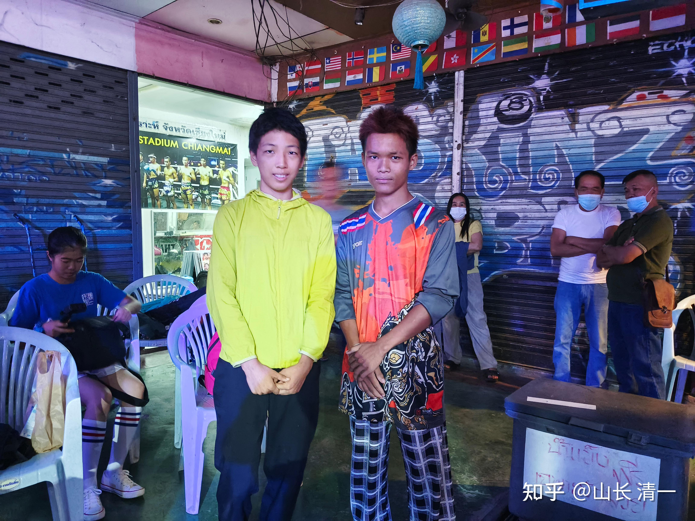
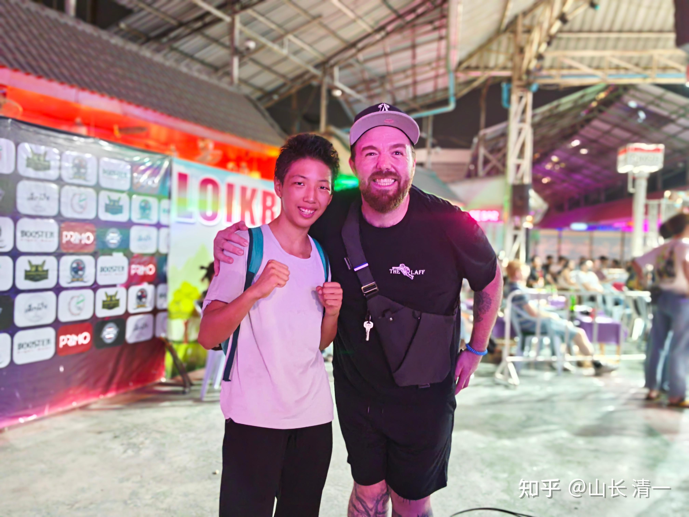
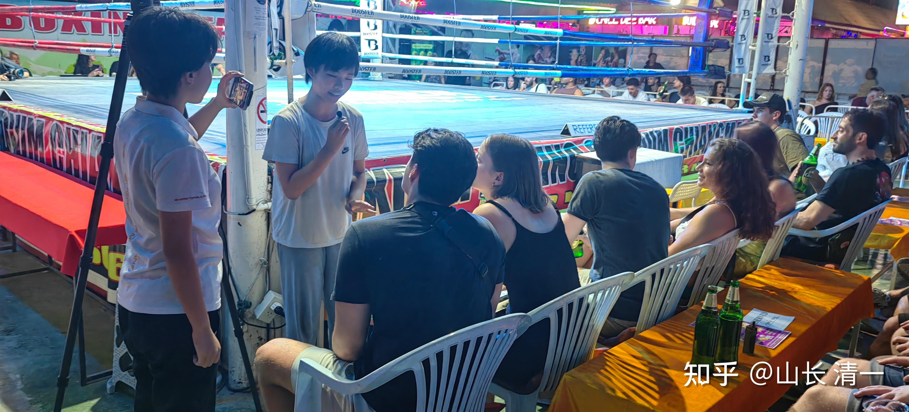

经过某泰国资深律师的特别安排，昨晚清一木兰终于首战男拳手。这是木兰们期待已久的赛事。由于原来发生过安排好了多次男女比赛，又临时取消的情况，因此昨天我们也不抱希望。果然：拳场主办方，要求我方的联系人ELLA昨天下午六点见面。商量关于比赛的事情！ella 就猜会有一些潜在的问题。先找我问问主意：我说随缘。让打就打，不让打就算了。我估计是主办方，想弄清老律师为何介入此事？如实说清楚即可！想不想安排让泰方自由决定！

晚上8:12分：ELLA回报【跟主办方沟通谈完后比赛已经确定，今晚打男生比赛可以举行，只不过只能打3局，细节很多，回来再汇报】。8:20，我们的参赛队伍出发----拳手和公主班的啦啦队。我由于预感将来未必会继续安排类似的比赛，就让公主班啦啦队一起去，做一个特别的节目！果然后来ella的回报是----由于赛前，双方谈得很好，因此主办方同意昨晚按约定进行比赛。但主办方特别的强调----这是第一次，也是最后一次安排这种比赛。以后不再安排。因为他们拳场不想惹上法律的麻烦。强调泰国法律规定：不许在商业赛事中打男女比赛，只能打“表演赛”。昨晚就是以“表演赛”的名义安排的比赛。但表示---以后表演赛都不再安排。让我们别再找他们了，只能安排普通的比赛！

不过，从赛事的安排中，我们还是看出来泰方的“精心照顾”，绝对不是随便安排的比赛。昨晚比赛前，告诉我们安排的拳手，是一个只打过两三场比赛的新拳手，我们还相信了。以为泰方是认为女生不经打。因此为了避免比赛的危险，安排了新男拳手来打。

但比赛中发现：这绝对不是新手，很有经验的老拳手。但依然有点怀疑----难道泰国人像我们一样，不敢轻易上场（别忘了谭木兰首战对象，居然是清迈的女子冠军拳手）。赛后明晓与男拳手交流，结果却大出意外：明晓说自己已经打过30场比赛了。听说对方才打过两三场？感谢对方不介意，新手才打过两三场就愿意上场跟她打比赛。对方有点楞：说自己已经打过40多场比赛，最近刚打了两三场！显然----主办方有意告诉我们错误的信息！

另外：男拳手表示---他的正常体重是50公斤左右。但平时他打的级别是54公斤。这表明---他的实力是超过同体重拳手的，所以才会被安排"升级"打比赛，就像是木兰们经常升级打比赛一样。

可是---泰方为啥有必要，不仅仅用实战经验更丰富的男拳手，还要超重来打木兰？说明泰方已经非常了解木兰的实力，判断出---真找同级别的男拳手，肯定不是对手。而且比赛只安排打三回合，也让我们的体能优势无法发挥！（他们显然发现每次打满五局，我方体能没有明显下降情况。但泰方已经累个半死）

果然：昨晚的男女对赛，非常的吸引观众。现场的观众很支持明晓，欢呼声很大。看男生最后也被打的蛮累的。观众们表示如果打五局明晓肯定会赢。

【比赛视频交给公主宣传小组负责编辑整理，过两天会放到我的视频里面的。太极征泰135战---明晓男女大战！

主办方昨晚的表现，很有意思：

明晓的汇报是：泰方男拳手被通知昨晚参加比赛的时候，根本不知道是要跟女生打。知道对手是中国女生的时候有点懵，但也服从比赛的安排。拳手在泰国是弱势方，必须接受拳场的安排。不然被拳界联合打击，不给比赛资格就麻烦了。就没饭吃了！

明晓的汇报部分：【3、主办方和裁判：在我和对手刚进拳绳的时候女主办方用英语跟观众说：这是一个表演赛**【其实是暗示----如果泰方男拳手输了也没啥奇怪的，因为不是真实的比赛】**。但是在我和对手碰拳准备开打的时候场上裁判用泰语说双方尽全力打**【 这个只有拳手知道。观众不知道，其实是告诉拳手，主要是男拳手，你们放开打，不要留手，尽量KO对手】**。中间打的时候，女主办方也用泰语说这是真打，已经第二局了。第三局了，催促拳手赶紧尽全力打。**【说明泰方的内定目标是尽可能KO木兰。给木兰一点教训。但也做好了“被反杀”的准备。因此挑选的拳手其实是强手】。**对方教练也在不停地喊：不要跟她抱，要肘击**【其实打内围是对方有利，体重力量男拳手肯定优于女生。外围我方战优。对方就是难以应对连续攻击才用抱内围来化解攻击的，因为扫腿对木兰无效，但教练不知道。还以为善于肘击就可以取胜】。 **

4、现场泰国人：赛前有个大叔怪里怪气地过来跟我说你不是想打男生吗？并指了我旁边的一个很壮实的男拳手（应该是60～70公斤）说：他很好打的，你跟他打吧！**【很不友好的举动，泰拳的荣誉受到了挑战】**。我就笑着摇摇头，说那不是我的对手。还有赛后那个喜欢赌拳的阿姨见到我后说，你居然敢跟男生打。另一个塔佩主办方的朋友在我打完之后问我累吗？我说不累，他就说男生的力量比女生大，觉得打成这样挺不错了。**【这几个的反馈基本正常】**

**最终，本次泰拳的男女大赛打满三局，结果判平局。这也算公平吧。不KO就算平局，不算难看！**

*双方拳手赛前合影。男方显然有些不自在*

*赛后外国粉丝找明晓合影*

总结：昨天是创世纪的比赛。格斗项目一向是男拳手拥有绝对优势。从来没有出现过同级别女拳手可以与男拳手媲美的事情。上一次的记录，是一个世界最强荷兰女拳手，拳力甚至超过男拳手。但首回合就被一个普通的泰国男拳手KO了。此后再也没有女拳手敢于挑战职业男拳手了！我们木兰是30年后，首批敢于挑战职业男拳手的女拳手！

木兰们的尝试：再一次证明---中华太极以弱胜强的特点，可以无视凶狠的泰拳。也可以无视强悍的泰国男拳手！

可惜：泰国主办方，是非常的不愿意给木兰们安排比赛的。如果打赢泰国的女拳手，还可以勉强维护面子的话，如果泰拳的男拳手，居然被中国女拳手击败，甚至KO，泰拳的底裤就彻底掉了。完全可以理解，热爱泰拳的泰国人，是绝对不会答应出现这种比较的。我们虽然实力上知道，木兰们已经可以匹敌泰拳男职业拳手了，甚至可以与同级别的地区泰拳冠军拳手一较高低。但奈何别人的地盘，不会给机会让你“证明自己”的。泰方的主办人，已经通过木兰们的130多场比赛，看清了中国木兰的实力。就只让你打普通比赛，为他们拳场赚钱，个体的输赢无所谓。但绝对不让你有机会去证明自己！

将来，等木兰们实力更强一些的时候，我们会自己出钱来举办大型的比赛的。我们自己设定目标。我相信你们会看到新一代的花木兰出世的---新一代太极女侠战胜男拳手。

小公主们也跃跃欲试的，ELLA和小明慧，甚至想自己的首战，就跟男生打，创造自己的人生新记录。看有无机会了！

*公主们在赛前采访现场观众对男女大战的看法*

从观众的反应看：比赛现场非常的热烈，观众的参与度非常高。远远超过普通的比赛！所以---泰拳场如果开办这种比赛，更容易赚钱。打开名声！可惜----这是破坏泰拳根基的做法。热爱泰拳的职场人士，宁肯不赚钱都不安排这种比赛。略有遗憾！

等以后，国内的条件成熟了，我们回中国举办类似比赛吧！

或者：我们可以在老挝的特区，举办这种比赛！弘扬国威！

等机会吧！