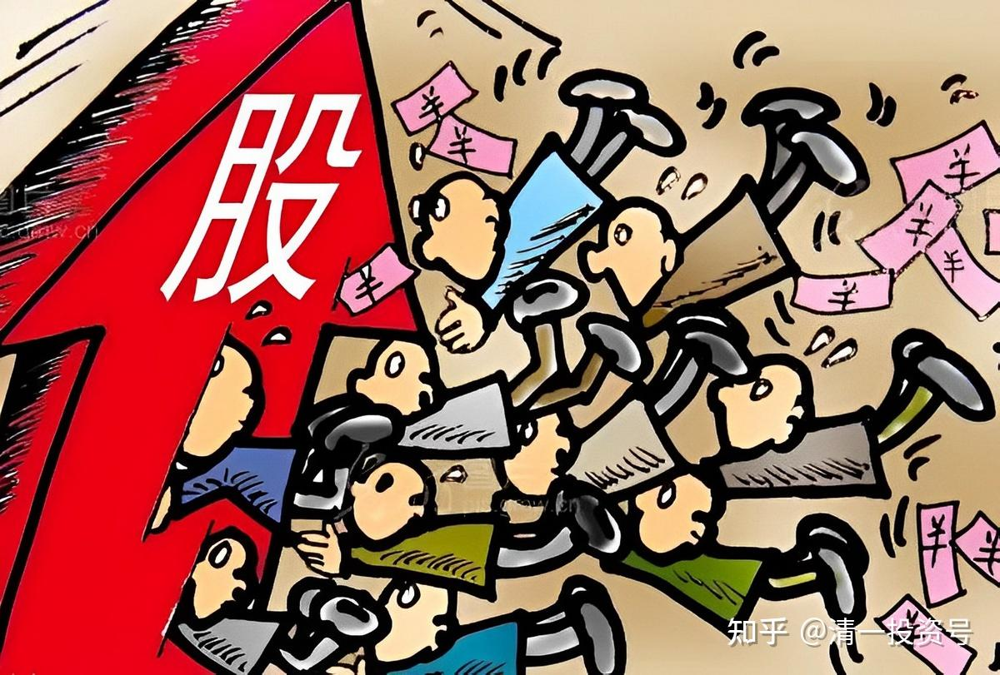
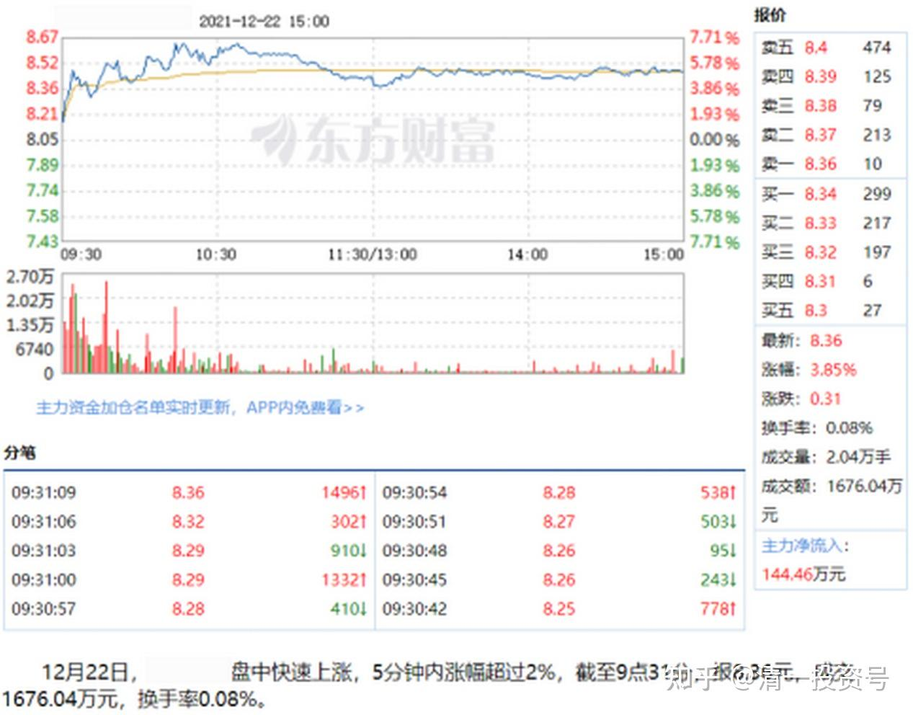
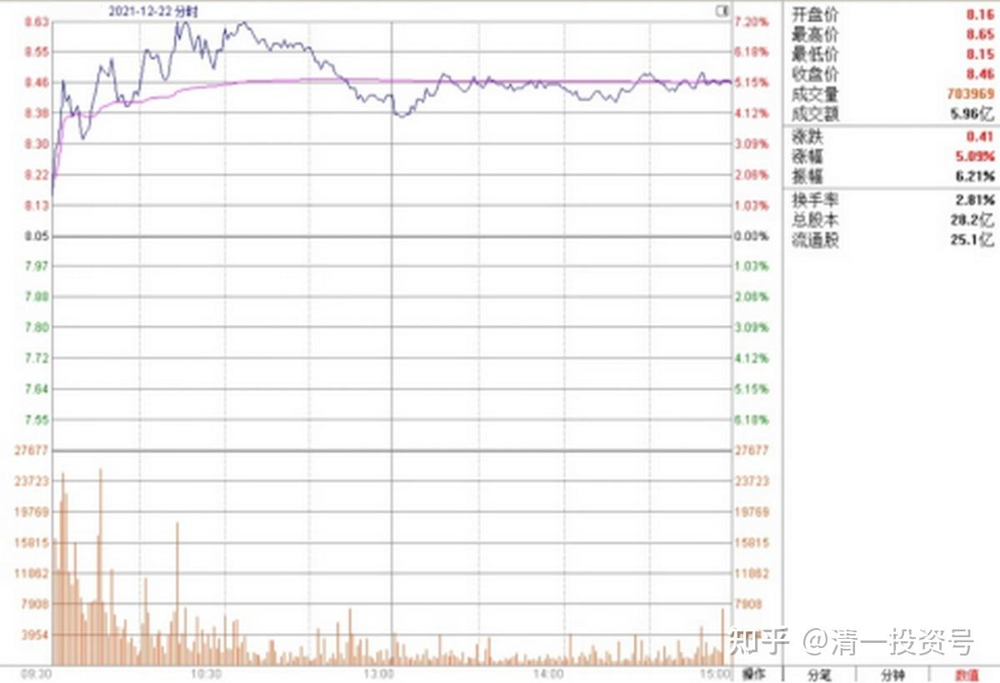
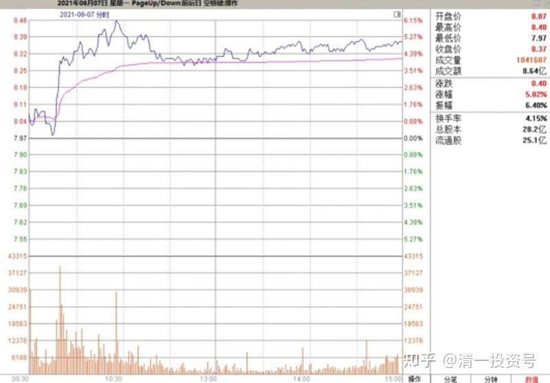
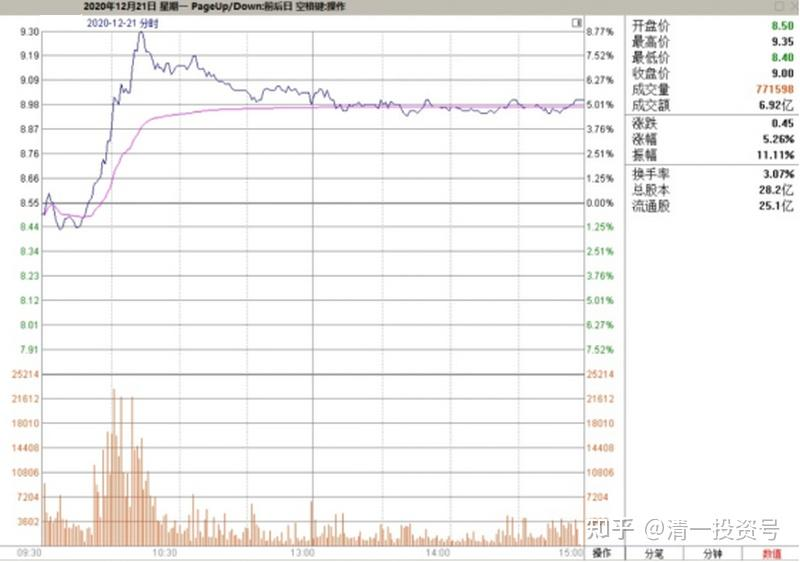
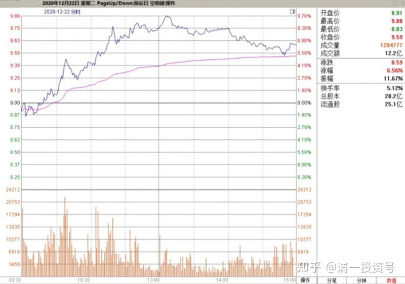
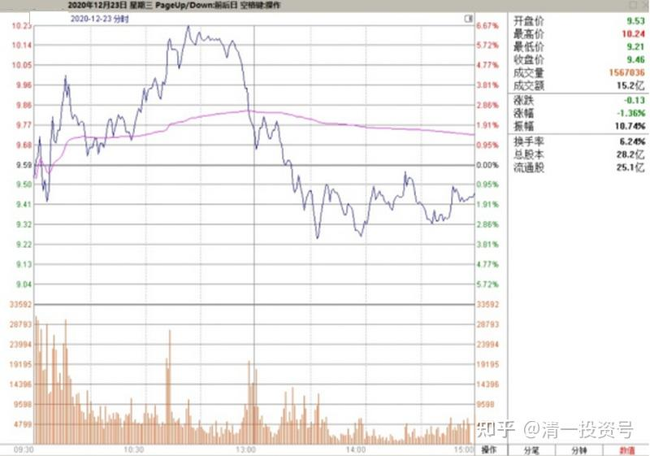
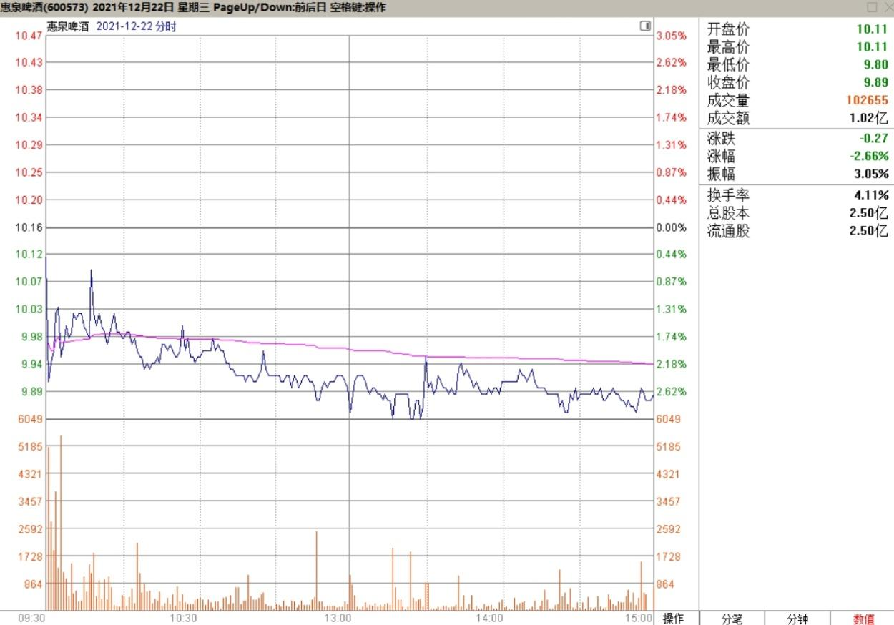
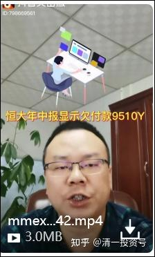

专篇11.主力、游资、右侧投机客纷纷进场

清一山长 2021年12月22日

昨天尾盘压价，说明今天市场有上涨的期待。主力不希望今天的起点太高。说明今天不是拉高行情，而是不得高的进货行情。但资金进场愿望强烈，今天开盘就跳空上涨，**开盘7分钟，总成交就突破了一个亿成交额**，比原来的一整天都高。出现这种情况，我认为是出现了“抢盘”行为。有实力的游资进场，或者是新庄进来了，老主力也许也想换换庄，给点筹码给新庄，大家一起发财。**这种局面，就说明“燕京要涨”的信息已经扩散出去，机动灵活的市场上的抢盘资金，得到消息后快速进场。**场上游资的特点，就是短平快，动作是比较激进的，大起大落。所以今天盘面上看，就是大笔的成交。现在已经超过4.8个亿了。

2021年12月22日YJ走势图

从量来来看，有点像出货的样子。但从走势图上来看，大量成交都是上午抢盘一路拉升造成的，不像是出货（出货是下跌中放量较多），所以除非是主力换筹。如果主力没有参与的话，有可能今天的上涨，就把大多数的套牢盘解放了。还把相当一部分底部买入的获利盘洗出去了（**这些人最可惜，正确的判断买进时机，却错误判断卖出时机，散户的眼光格局不够，只看到一两元的小利，根本看不清大势，所以永远赚小钱**）。今天看股吧里面，很多都是晒自己成功卖出了的单子，所以今天过后，股东人数肯定大幅下降，毛估估可能跌破7万人了。**现在是比较有趣的时点：主力、游资、右侧投机客纷纷进场。**估计快出现久违的涨停行情了。（不过燕京的主力很阴险。大约是2017年，也出现了类似的行情，游资抢盘，居然连续两天涨停。我以为燕京要启动了，所以手上的一些筹码就没有出，当时持股不太多）。但没想到主力偏偏还是打下来了，白白做了一回过山车。如果追涨的人，就损失大了。这一次主力会不会疯狂打压游资？我还不清楚。目前来看，价位上，已经到了可以打击游资还获利的点位（上一轮上涨就在这个价位打到6元多去了）。这一次会不一样吗？我们慢慢观察吧！真打了，要重新拿回筹码，恐怕就没时间了。

**兴 2021/12/22 06:32:47

没来的及上车的还有机会么？

**妮 2021/12/22 06:35:42

昨天看了山长信息，3点前8.08补了一些。

山长清一 2021/12/22 13:34:56

你们这些人真贪婪。我明知要涨，都不买，只是持仓不卖。有钱我买中国建筑去。你们呢？6元多不买，8元多来抢筹？一群疯子！见钱眼开。以后吃亏了自己骂自己去！不跟你们说了。燕京超过10元，我一样不提了！不然一群疯子高价入场，万一被套只会怪我！

**超 2021/12/22 13:38:20

感恩山长手把手的分析解读，紧跟不动。

**亮2021/12/22 13:38:38

要学真髓

山长清一 2021/12/22 13:38:43

看盘分享。一天只看开盘半小时，以及收盘半小时，其他时候，基本上是垃圾时间。没啥看头的。多数都是散户在表演。主力动向，会在这两个时间出现。如果没有指导性的盘面语言，就是这个股没有人关照，短期是没希望上涨的。这是短线常识，想学技术和看盘的人好好去研究。

**侠2021/12/22 13:38:44

又能看到山长分享了，太幸福了，感恩

**妮2021/12/22 13:54:46

担心房款不够，7块多忍痛抛了，回些款就多几毛钱接回来。

**宁2021/12/22 15:01:59

燕京握着不动。

**梅 2021/12/22 15:03:21

又能看到山长分享了，太幸福了，感恩

**莎 2021/12/22 15:14:57

期待山长多多分享看盘小常识挺有意思的

山长清一2021/12/22 15:15:36

今日尾盘，围而不攻，跟昨天的尾盘走势类似。正常情况下，明天还是涨势。没看出回调迹象（如果尾盘拉高，明天几乎铁定退回调了）。今天上看去坚定不移的8.50防线，其实对于主力来说像纸一样薄。明天一大早就破了。周线上看，成交并未有效放大。不过未来两天的时点是关键：本周大概率创成交新高。就看有多少了。今天总成交5.96亿，成功激发了市场的热情。上一轮，六月份，冲8.45元，用了8.64亿。

2021年6月7日燕京啤酒走势图

今天冲8.65元，冲高和涨幅都更大，居然只有不到六个亿的成交。说明现在跟6月份不可同日而语，9元以下，主力没有调整的愿望。这个股与惠泉很不一样，惠泉冲高过程中，通过不断的回调拉低成本。走得很辛苦。燕京一路走来，你们已经发现了：根本就不给做T的机会，假如你们模仿我原来操作惠泉的手法，早就被甩下车了。我就是看不出主力有回调的动作，一味硬冲，所以在守住手中的筹码不动。一股未少，坚守至今。所以，看懂盘面语言很重要，你们慢慢学吧。**如果要通过过去的走势来判断的话，成交超过9个亿就要注意了，可能这就是燕京要回调的信号。如果出现这种情况，我会把一部分（大约20%）抛掉的，落袋为安。**就算踏空也认了。因为80%还在手上，不影响我赚钱，分享一些风险资金出去也应该的。**如果成交不放大，我就继续坐轿子！**[大笑]

**华2021/12/22 15:20:26

又能看到山长分享了，太幸福了，感恩

**云2021/12/22 15:21:27

学习了：看交易量定主力是否出来回调的走势。成交9个亿的标准是否通用标准？

**红2021/12/22 15:22:25

感恩山长送出的智慧和财富大礼

山长清一 2021/12/22 15:22:57

去年的昨天21日，燕京冲高，收盘8.97元，成交量6.92亿。

22日，冲高9.56元，成交12.16亿。

23日，冲高10.21元，成交15.12亿。

2020年12月21日燕京啤酒

2020年12月22日燕京啤酒

2020年12月23日燕京啤酒

今年你们注意这几个数据。突破10亿的话，就要小心一点了。当然，不排除主力过于强悍，继续强拉的可能性。**如果风险嗜好低的股友，可以看到成交量新高的时候降一点仓位。我的计划是成交破10亿，走掉10-20%。成交破15亿，再走掉10-20%。**我不会空仓的，除非看到更好的机会。燕京折磨我这么久，还封我的号，我不会轻易饶了它的[大笑]。

山长清一2021/12/22 15:29:24

主力看我这样说话，会恨死我的。因为这就是主力正常操作的手法节奏，我完美复制。我不看价格，只看量，量是没法作假的。主力一旦出手抛货，量上就会看出来，我就一起走。主力走了20%，还要捡回来继续做的，所以会打低，我打低又再进来，跟随他同步，所以赚得比持股不动更多。因此主力很生气，他辛辛苦苦的干活，我啥不干，就跟着他白拿钱。吃也吃不掉我，所以——封我很正常。

**华2021/12/22 15:24:51

如果不是看了山长的分享，我可能会抛掉半仓燕京了，因为从6月最高8元多，一直到现在才涨到那个点。听了山长分析，现在知道未到时候。

**丽2021/12/22 15:25:47

谢谢山长分享，这么具体的指标我们还跟不好的话，那真的是人品不行了。

**东 2021/12/22 17:25:16 跟评主贴

大家玩空中跳的，高位追涨玩心跳的，就不要在这里显摆了。搞得山长都不敢给大家分享了。高位追涨，对了您偷着乐就好了。输了自己偷偷哭去。山长一直示范的是七元一下买入，现在分享只是让大家看透主力的手法，别被骗出局，增强大家的持股信心；也给有缘人一些看盘，操盘的知识。大家珍惜！

**巍2021/12/22 17:28:57

赞同，珍惜山长的分享，不消费山长。

山长清一2021/12/22 20:50:08

（2021年12月22日惠泉啤酒走势图）

刚看到惠泉啤酒，今天居然是啤酒板块跌幅第一。燕京今天是涨幅第一，惠泉在干嘛呢？感觉是主力借机在出货，成交量很大，一个只有燕京十分之一的股票，成交超过一个亿，这个成交相当于燕京的十亿级别了。上次我认为他们没有出完货，但又舍不得低价出手，就等现在燕京冲高的时候，卖给追不上燕京，就跑来追这个原来的“龙头股”——没涨还跌了的惠泉的小散户。未来，惠泉可能就像失去主力的珠江一样，长期横盘了。应该也不太会跌太多。两只股的差价，我卖掉惠泉换燕京的时候，是每股四元多五元，现在差距只有一元多了。这次换股增加了不少利润[大笑]。当初是六月份，惠泉涨到12元多～13元我就全部出掉的，两千多万资金，慢慢地换入了一直在7元左右徘徊的燕京。

**东 2021/12/23 10:33:44

今天，燕京，惠泉这么极端的分化走势，感觉原来的等燕京的股价超过了惠泉的股价后，用燕京换一部分惠泉的计划，不必执行了？

山长清一2021/12/23 10:45:26

@**东 你真是不义气。人一阔，脸就变？[大笑]

山长清一2021/12/23 11:05:57

继续公布啤酒行业研究成果：珠江2018年我5元买入的时候，燕京是7元多，我觉得不划算，就买了珠江，买成十大股东。后面就是珠江都冲13了，很多时间稳定在10元以上了，燕京还是7元多不动。当然，我大涨了的珠江，就全换燕京了。换了也不涨，我也不着急，等。最近燕京涨了，快涨到9元了，珠江也跌了，快跌破9元了，两个股马上接轨了，真搞笑。燕京的销量是珠江的三倍，利润还不如珠江。但旗下漓泉已经和珠江的利润差不多（主品牌就是亏损的）。股价、市值还长期不如珠江。现在会不会重新计价？燕京会高过珠江吗？高多少？当初没看基本面，看了肯定买燕京；当初看的是珠江有动静，有操盘手出没。退出珠江，是看出了珠江主力开始退却，股价正好高位。我当然同步退却。

今天这局面，实在意外。所以，市场先生就是个疯子，它给的定价，我们完全无法理解其逻辑，更不能跟它讲道理，我们只能利用市场先生。**我赌的是：一旦燕京的主品牌开始盈利，它的市值就一定超过珠江，甚至超过一倍都不稀奇的。**我们等着瞧。看是燕京涨上去呢？还是珠江跌下来。这个就全由市场先生说了算了[微笑]

【

2020年，珠江啤酒实现营业总收入约为42.49亿元，与去年同期42.44亿元相比，微增0.13%；归属于上市股东股东的净利润约为5.69亿元，相较于2019年4.98亿元，增幅在14%以上。

燕京啤酒子公司，燕京啤酒（桂林漓泉）股份有限公司2020年全年共产销啤酒90.7万吨，实现工业总产值36.48亿元，实现税金6.54亿元，利税总额12.33亿元。实现效益的同比大幅增长，连续19年成为桂林工业企业纳税首户，2020年，在疫情影响下，同比2018，啤酒销量下降了7.95%，利税上升了20.29%。
链接：[https://xueqiu.com/2250106976/173606027](http://link.zhihu.com/?target=https%3A//xueqiu.com/2250106976/173606027)

[https://zhuanlan.zhihu.com/p/414633424](https://zhuanlan.zhihu.com/p/414633424)】

**东2021/12/23 11:24:02

大多数人只看到了山长精彩的投机换股操作，却看不到山长对整个啤酒行业的研究，提前几年就看到了行业的变化，才有了最前面的痛失华润。山长对啤酒行业这几家基本面的研究也是非常独到，对燕京新产品U8定位女士消费，对精准的广告投放（针对女性这个蓝海）的认识，我自己是看不出来。这才有了后面换股的基础逻辑。我也跟着重仓一直持有珠江，后面的燕京。也是一直觉得惠泉的品牌力较弱，盈利能力不如珠江。当初建仓的就比珠江的占比少很多，没敢大仓位持有。现在燕京的势头这么好，真有点不想换过去了。

昨天见一个开饭店的朋友，说青岛的一款酒，夏天由43元一箱，涨了五元，前几天，冬天是啤酒的传统的淡季，一般不会涨价的，可是又涨了4元。估计其他酒企，也都差不多的。

山长清一2021/12/23 11:38:42

@**东 冬天涨价很正常，反正销量小，不影响大局。过一年夏天来了，大家也适应新价格了。不过半年就涨20%，幅度算是很大了。**啤酒企业的利润会成倍增长的。**

**驰2021/12/23 11:28:34

山长：据这个情况，恒大对中建影响在中建的可控范围？

山长清一2021/12/23 11:36:25

@**驰 中建，相关的基本面的事情，你要去问晕娜的，问我干嘛？我的能力圈是燕京[大笑]。我不认为中建会受到啥实质性影响，倒是股民会完蛋。

**参考链接：**

专篇1 [306篇.前缘1.雪球的最后一贴--胜利曙光都已经出现](http://link.zhihu.com/?target=https%3A//xueqiu.com/2017773236/247159187)

专篇2 [307篇.被特别关照的股--前缘2](http://link.zhihu.com/?target=https%3A//xueqiu.com/2017773236/247387457)

专篇3 [308篇.立此存照--前缘3](http://link.zhihu.com/?target=https%3A//xueqiu.com/2017773236/247580614)

专篇4 [309篇.见识传说中的拖拉机账户](http://link.zhihu.com/?target=https%3A//xueqiu.com/2017773236/247973779)

专篇5 [310篇. 拉升在即](http://link.zhihu.com/?target=https%3A//xueqiu.com/2017773236/248351982)

专篇6 [311篇. 进入右侧投资时代](http://link.zhihu.com/?target=https%3A//xueqiu.com/2017773236/248658236)

专篇7 [313篇. 小主力进货的阶段](http://link.zhihu.com/?target=https%3A//xueqiu.com/2017773236/249221851)

专篇8 [316篇.两轮回调对比](http://link.zhihu.com/?target=https%3A//xueqiu.com/2017773236/249675370)

[专篇9.主力的水军](https://zhuanlan.zhihu.com/p/619400004)

[专篇10.主力完成筹码收集](https://zhuanlan.zhihu.com/p/629948708)

