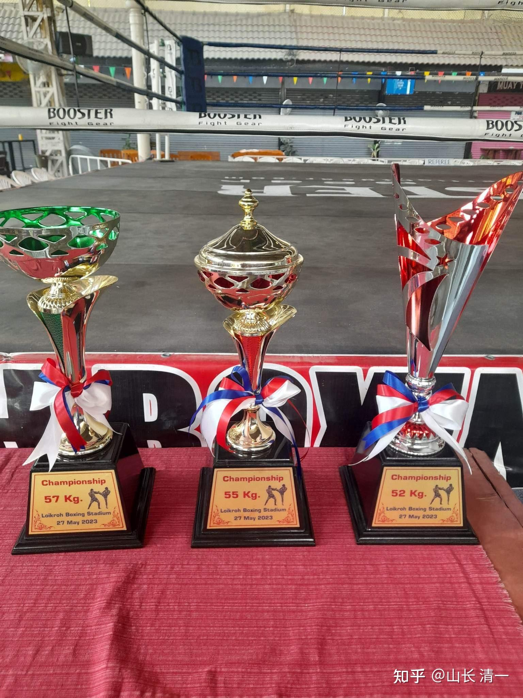
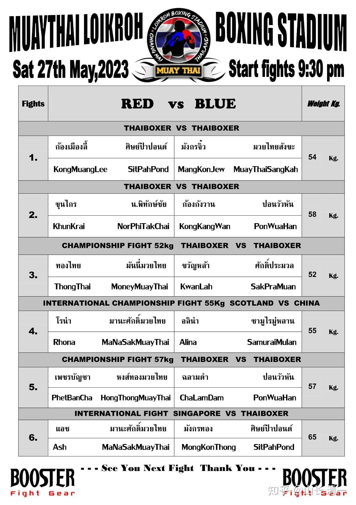
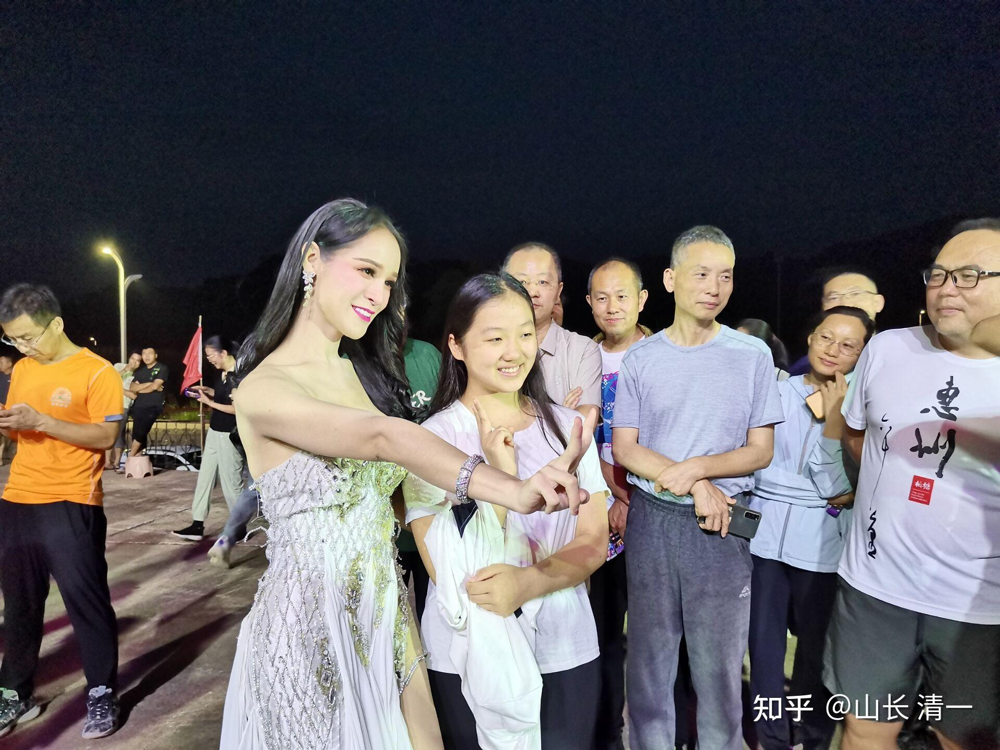

新教育的学生，有很多的社会实践机会。因为新教育认为会读书不如会做事，会做事不如会做人。会做事不如会做人。

比如：今天晚上，公主班的学生要去清迈古城，帮助拳场推销今晚的比赛拳票。因为今天是拳场的冠军赛比赛日。佳慧安排了去参加其中一场的冠军争夺赛。她的对手，是一个苏格兰白人拳手RHONA。上次谭木兰打的英国拳手,好像是亚裔混血儿。今天就是木兰首战白人拳手了！结果应该不会有啥区别。我们不认为白人比泰国拳手技术更高。不过英格兰人的拳击技术应该更好。往往是拳击手来泰国学泰拳，补充腿脚技术的。但我们对英国拳击并不担心。

*55公斤的就是佳慧的比赛。奖杯落谁家呢？*

推销拳票活动是公主们主动要求的社会活动项目。帮拳场就是帮自己、这种对外国人进行现场的推销和锻炼，非常考验公主们的沟通能力。她们还从小做各种事情，还去工地打工等等。这种培养出来的人，适应社会的能力超强。

另外：马上开始的暑假。公主们还要自己带夏令营学生学习体验。已经有100多个学生报名了。学生的年龄跟她们差不多。她们怎样才能搞定这些很可能不服气的学生呢？只能拼实力了。孩子们只认实力不认权威的！这种训练出来的孩子不适应社会？真是笑话！但是------居然有一些家长，认为---新教育好是好。只是曲高和寡。太脱离社会了。将来找工作不好找，因为无法与社会融合，只能当新教育教师。

这简直是大笑话----首先，只有少数的学生会留下来当教师，而且是最优秀的学生才有机会留校。大多数学生，都要走上社会的。没有任何一所学校的学生，毕业后都能做教师，就等于说教师比学生更多了。因为教师是没有毕业期的。如果新教育的学生，居然不如体制的学生适应社会，肯定是新教育的失败。虽然所有的教育系统，都有最终教育失败的学生。但我们显然看到：体制内学校培养的不能适应社会的废材太多了！而新教育的学生适应能力极其广泛，能力也很强。尤其是语言能力，沟通能力明显超越体制学生。去摆摊都比体制生更有优势。别说其他了。黑新教育，用这个理由太荒唐了！

下面是15岁的小公主徐逸凡，在磨丁当小助教的时候，学员对她的评价！

【这是昨晚小公主徐逸凡在跟人妖交流互动。虽然听不懂她们在说什么，但看得出来，她们交流顺畅愉快，看得出人妖很喜欢小公主，还流露出小公主很了不起的欣赏赞叹的神情。然后招呼自己的同伴跟小公主认识——她们都露出了他乡遇故知般的喜悦、真诚和亲切感，优雅又得体。完全没有了刚刚面对普通游客时的敬业的媚态、引诱、索钱之举。

大家忍不住赞叹：小公主真棒！

想想国内同龄孩子大多都睡眼惺忪地泡在题海中备战中考呢！而小公主已经拥有国际视野和思维，能熟练运用三语、四语与不同人沟通交流，能做很多成年人都做不了的事了！这差距哪能是用这辈子的时间来追得上的呢？

这足见：给到孩子怎样的教育太重要了！】

[!\[image\](images/img_004.jpg)

小公主与磨丁秀的人妖演员互动 https://www.zhihu.com/video/1645911527554355200](http://link.zhihu.com/?target=https%3A//www.zhihu.com/video/1645911527554355200)

你看上面的视频，小公主落落大方的跟泰国人交流。落落大方的样子，好不怯场。 而且她的语言非常熟练。泰国人不断互相说---她的泰语说得真好。你认为国内大学泰语系的毕业生，沟通交流和社会融入能力会超过小公主们吗？她才15岁呢。18岁会怎样呢？

[!\[image\](images/img_005.jpg)

小公主练清一太极 https://www.zhihu.com/video/1645914369753096192](http://link.zhihu.com/?target=https%3A//www.zhihu.com/video/1645914369753096192)

小公主不仅仅是学霸，中英泰三语俱佳。而且武功不错，太极练得很好。一般人还不是她的对手呢！

[!\[image\](images/img_006.jpg)

太极内围对抗示范 https://www.zhihu.com/video/1645914914094010368](http://link.zhihu.com/?target=https%3A//www.zhihu.com/video/1645914914094010368) [!\[image\](images/img_007.jpg)

https://www.zhihu.com/video/1645916659872518144](http://link.zhihu.com/?target=https%3A//www.zhihu.com/video/1645916659872518144)

以上是小公主在带成年学生练太极基本功。虽然一个15岁的小女孩，还谈不上啥高功夫。但能够让成年学员们心服口服的跟她学。这本事算是“不能融入社会”的新教育学生吗？你在体制内见过多少这样落落大方带成年人学习的学生？

更别说小公主每天写的课程作业，上课思考反省等，往往让成年学生们都自叹不如。

新教育是用实力来说话的，不是用啥虚头巴脑的“资格”。这种教育，才是最接地气的， 最适应社会和家庭需要的教育！

不过---我必须承认---新教育的学生，应该不适合去官场。务实的教育模式，培养出来的学生，很难适应中国官场的“场面话，场面活”。因此--想当公务员的，就不要送来学新教育了！