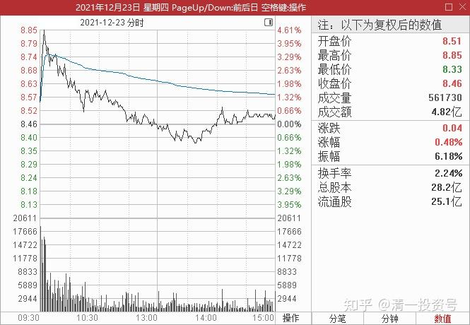
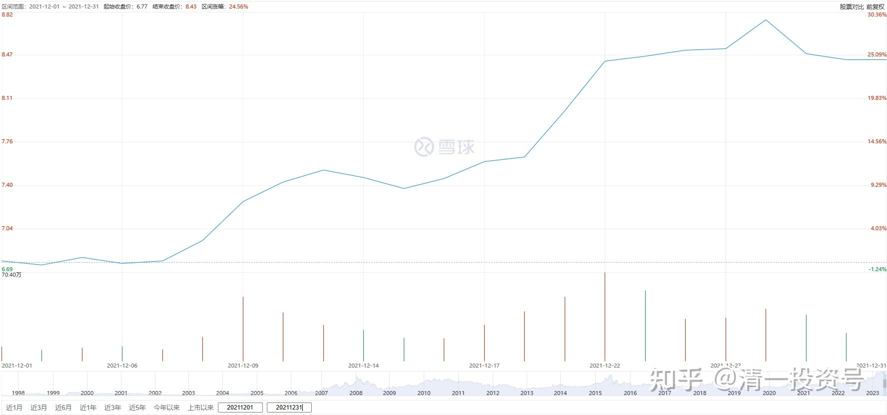
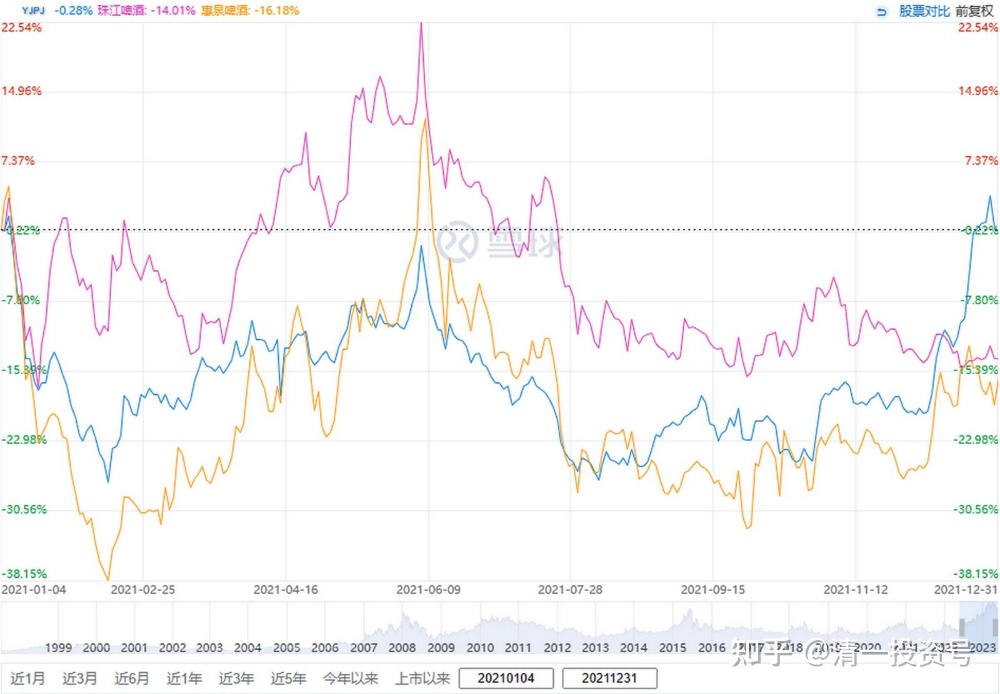

专篇12.进入震荡期

清一山长 2021年12月23日

**今天YJ盘面解析：YJ今天开始，进入震荡期了。**

高手们现在可以做T了。昨天之前，一直是主力吃吃吃的走势，不能做T，一做就被T下车来了，现震荡期，抓住机会的话，可以获取良好的超额收益。当然，看不懂的人就算了。今天开盘冲高8.89元，随机惯性下落，图形上很像出货，实际上不是。因为成交量没有放大。

但今天与昨天不一样，昨天是抢筹行情，一波一波的都是吃货，原来这个价格是高位成交密集区，很多套牢盘的，居然轻松越过。今天回调，但价格却一直是高于昨天的收盘价的，说明昨天吃进的货物，今天并没有吐出来。**主力珍惜8.5元以下的筹码不肯放出，意味着未来回调的空间，不太可能低于昨天的价格。**今天用来打压的筹码，不是昨天进的货，而是来自于今天冲高的筹码。

简单地说：**现在的主力不要开新仓了，只要激发人气，制造上涨效应。**但不想自己出资金来拉涨，这样会让自己买成股东的。所以，策略就是早盘用资金来一波强劲的拉涨，让跟风盘追进来，然后把筹码派发给这些人。但由于这些人，跟主力是未来的战友，所以现在还不能套住他们。只能浅浅的套几天就要给他们甜头——拉涨。只是要用他们的资金来一起做盘罢了。**以未来会走三步回两步的，节节走高，**不会像原来一样一路不断推高，不给做T的人补仓的机会。这种手法，也会吸引原来踏空，做T出局的人，找时机再度进场，因为现在真的有机会做T了。

所以，现在开始是示范赚钱榜样的时候了——让这些人进场，大家一起赚钱。主力示范，大家跟随。股价就慢慢走上去了，这也是赚钱效应快速传开的时候。赚了钱的人，都会得意地向周围人吹嘘，这个庄是善庄，不吃独食，一起分享。这样就吸引更多的投短线机资金加入，未来成交量会很活跃的。这是中级行情开启的时候，也是主力和散户利益趋同的一段庄散共舞的最美好时光，大家一起分钱，一起前进。

主力现在并不谋求真正的赚钱，虽然做T。**目前不是赚钱，是推高市场价格，拉升新进入者的成本，减少未来的抛压。主力会保持资金和股份的平衡，不再增加股数。**防止股份被卖光了，自己唱独角戏没人陪。虽然主力的账面持仓获利增加了，但也不急于兑现（现在一兑现，就马上打回原形，很快就回到6元去了，就等于这两年白做了）。

**主力的利润兑现，正常必须推高到13元一线，才有可能开始兑现。**这是最起码的空间差。但由于珠江和惠泉，都是13元左右开始兑现的，这个价位一旦达到，散户们都会争相逃走，**所以坦率说:13～15元，现在已经不可能是YJ的顶部了，走不掉的。**所以，必须是底部——也就是说：主力必须制造神话，有效地打破13元一线的“顶部区域”概念，打通上升通道，才有机会出货。YJ，不会是惠泉、珠江的重复，只是更高手法和空间的示范。【要实现这个思路，难度极高，但这个主力似乎早已准备好了】。

2020年12月YJ走势图

我认为：去年这个时候，YJ主力不但不乘板块拉升的时候，趁机拉升多赚一点钱再走，反而一路拖后腿，不让YJ涨，**原来就是要蓄积力量，等待今年这一波更加凶猛的上升。**不然去年拉高到了13元，10元上方套住了很多人，今年就难做了（说实话，去年如果真到了13元，我也走了，真没想到主力连个意思都不意思，所以跟随他做了过山车，好处就是我越买越多了）。没见到珠江、惠泉，今年就根本做不起来吗？现在就走不出像样的行情，因为没有人愿意跟到13元，只能10元上下玩玩。**现在的YJ，必须从8元多就开始，给跟风的游资甜头，才有可能在10元上方获得众多的拥护者跟进来。**

2021年YJPJ、珠江啤酒、惠泉啤酒走势图

大家现在知道了，主力坐庄不容易，甚至需要提前一两年就安排好进退的道路。没有去年乱拉一气，今天就进退两难。一些土豪只会拿钱买股票的，就把自己给买死了。到了合适的点位（脱离主力成本区之后)，就要制造赚钱效应，让人都跟随一起赚钱。所以未来的震荡拉升，就是做这个目的的）。

你们喜欢玩的就跟着玩吧！玩输掉就下车，换股去。我就计划下周跟随开玩了。正好课也上完了。**今天又买了1M的中国建筑，4.94元（珍惜中国建筑5元以下的机会，就如同珍惜YJ7元以下的机会一样[大笑]）。**不过YJ我还没有卖。至今为止一股未卖，当然我也不买。计划从下周开始，寻找机会做T，跟这个戏弄我的主力玩一玩[大笑]。

**参考链接：**

专篇1 [306篇.前缘1.雪球的最后一贴--胜利曙光都已经出现](http://link.zhihu.com/?target=https%3A//xueqiu.com/2017773236/247159187)

专篇2 [307篇.被特别关照的股--前缘2](http://link.zhihu.com/?target=https%3A//xueqiu.com/2017773236/247387457)

专篇3 [308篇.立此存照--前缘3](http://link.zhihu.com/?target=https%3A//xueqiu.com/2017773236/247580614)

专篇4 [309篇.见识传说中的拖拉机账户](http://link.zhihu.com/?target=https%3A//xueqiu.com/2017773236/247973779)

专篇5 [310篇. 拉升在即](http://link.zhihu.com/?target=https%3A//xueqiu.com/2017773236/248351982)

专篇6 [311篇. 进入右侧投资时代](http://link.zhihu.com/?target=https%3A//xueqiu.com/2017773236/248658236)

专篇7 [313篇. 小主力进货的阶段](http://link.zhihu.com/?target=https%3A//xueqiu.com/2017773236/249221851)

专篇8 [316篇.两轮回调对比](http://link.zhihu.com/?target=https%3A//xueqiu.com/2017773236/249675370)

[专篇9.主力的水军](https://zhuanlan.zhihu.com/p/619400004)

[专篇10.主力完成筹码收集](https://zhuanlan.zhihu.com/p/629948708)

[专篇11.主力、游资、右侧投机客纷纷进场](https://zhuanlan.zhihu.com/p/631628731)

