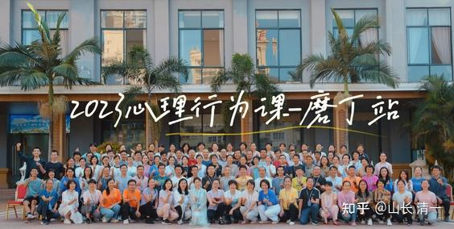

光吃稀饭的小公主安弈璇，不惧高大力壮的肉食男学员，正面对抗不落下风，最后还把男学员累垮了。证明吃素的体能并不差！也说明“身大力不亏，吃肉力量大"的说法有误。

[!\[image\](images/img_001.jpg)

小公主大战壮男，累瘫对手 https://www.zhihu.com/video/1646876920800411648](http://link.zhihu.com/?target=https%3A//www.zhihu.com/video/1646876920800411648) [!\[image\](images/img_002.jpg)

小公主大战60岁老头，让一只手输 https://www.zhihu.com/video/1646887764355461120](http://link.zhihu.com/?target=https%3A//www.zhihu.com/video/1646887764355461120) [!\[image\](images/img_003.jpg)

小公主逸凡对阵清一 https://www.zhihu.com/video/1646888402695028736](http://link.zhihu.com/?target=https%3A//www.zhihu.com/video/1646888402695028736)

上面对阵安公主的男学员，后来问我是不是小公主公主逸凡的力量更大？我是他为啥这样认为？他说是跟小公主逸凡对手的时候，被她打过一拳，觉得她的力量很大，挡不住。我说两个小公主的功力都差不多，因为内家拳是整身发力，感觉比一般人力量大很正常。只是两个小公主都没有学会脆快发力，目前发力速度较慢，很难伤人、但别人要伤她们已经很难了。还需要练习大约一年多后，才可以达到自如应对职业拳手的地步。大约相当于现在拳场上木兰的水平，现在只是能够对付业余爱好者。还打不了太极老头。

[!\[image\](images/img_004.jpg)

https://www.zhihu.com/video/1646880578644537344](http://link.zhihu.com/?target=https%3A//www.zhihu.com/video/1646880578644537344)

对战成年学员显得很强悍的小公主，遇到太极60岁老头，功夫就没用了。别人闭上眼睛都打不赢。差距实在太大。

这是在磨丁蕙兰酒店举办的【心理行为学】课程的一些有趣的片段。

[!\[image\](images/img_006.jpg)

学员自己拍的课程记录 https://www.zhihu.com/video/1649007015925182464](http://link.zhihu.com/?target=https%3A//www.zhihu.com/video/1649007015925182464)

小助教帮制作的l课程记录

[https://www.zhihu.com/zvideo/1648998611361869824](https://www.zhihu.com/zvideo/1648998611361869824)

学员反馈是：

来上我的课之前，是种种“怕”===怕上课。怕写作业。怕被看出来。

上了我的课后，是大哭：怪自己怎么这么笨！现在才来上课。干嘛不早一点来？就可以避免自己掉无数的坑了。可惜---有些坑已经无法避免了。比如有些人的孩子已经成年，宅在家里不出去。我说：几年前。孩子15岁之前来找我，我还可以教你矫正。现在来找我，唯一的方法，就是【赶出去，自生自灭】这一招了。让社会来教育他了。让家长放下使命，放自己一马。也放孩子一马。总比纠缠到死要好！