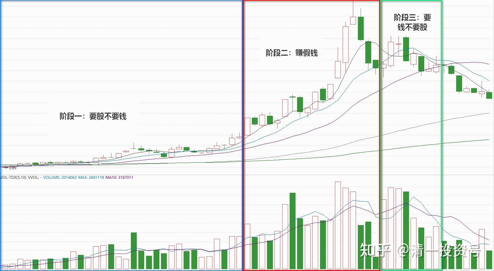
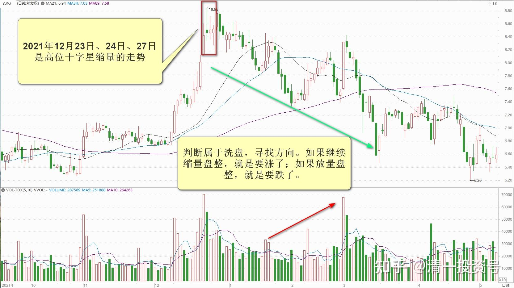
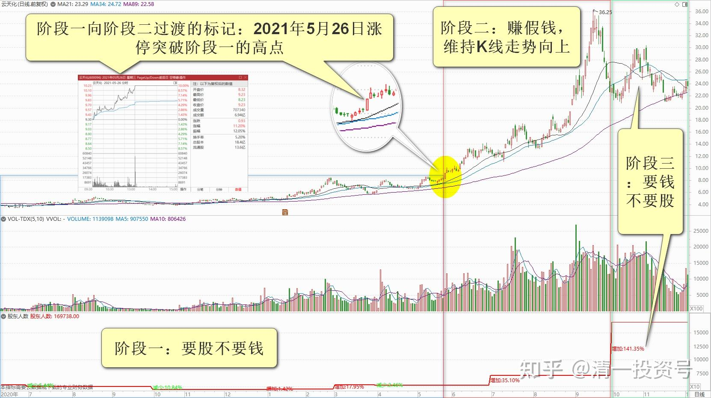
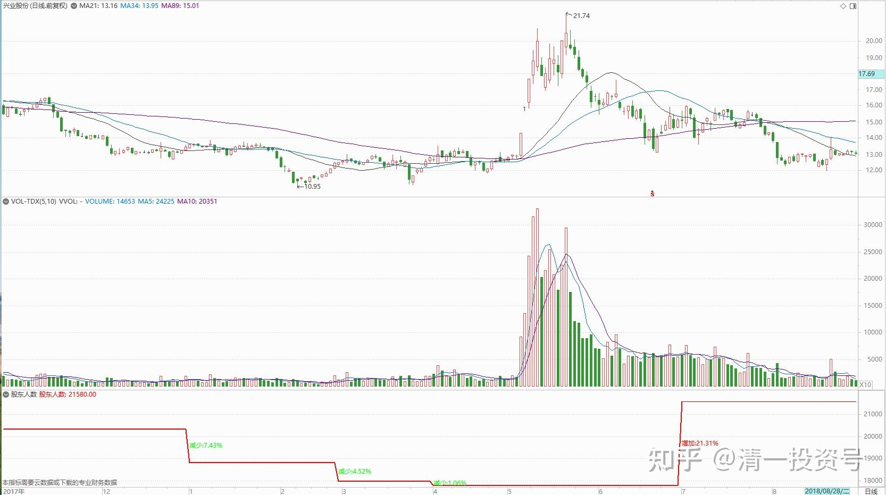
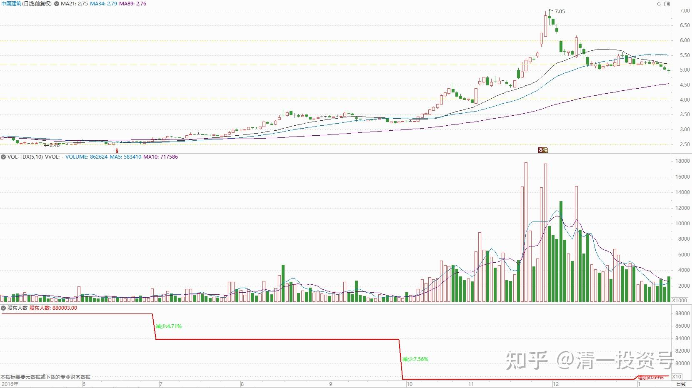
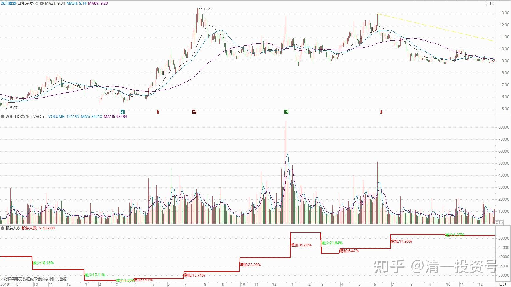
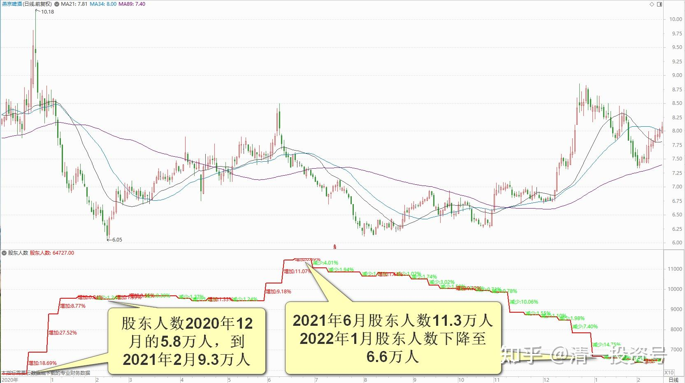

专篇14.高位十字星缩量及主力操作的三个阶段

清一山长 2021年12月27日

最近三天，燕京啤酒是高位十字星缩量的走势，判断属于洗盘，寻找方向。如果继续缩量盘整。就是要涨了。如果放量盘整，就是要跌了。我判断会在未来7天以内，会放量上涨的，这一次会超越9元整数关。可能未来会在9元以上继续盘整一段时间。看我的乌鸦嘴说的对不对了。错了道歉，对了算蒙对的。不过，不管对错，我持股如山。就算有一些操作，也是【不增不减】，不增加仓位，也不减少仓位。相当于只看不做，有狼群吃剩余的骨头，就捡一块舔舔。不贪心！

**华 2021/12/27 18:12:10

看山长解盘就是一种享受，总是那么幽默风趣，让人会心一笑同时又增长了知识！

山长清一2021/12/27 18:52:15

主力操作股票。有三个阶段。

**第一个阶段，是只要股，不要钱。**手上的钱，尽量换成股，越多越好。买和卖的目的，就是打压，越打越起劲，自己的账面越来越绿。因为它根本不在乎账面绿不绿。我也一样跟着学，经常买入后，就长期账户绿油油的，我也不管它。只要持仓的股数不断增加就好。就像燕京常年草原绿一大盆，现在才变中国红的（其实因为做T摊低了成本，比主力红得早很多）。因为现在是第二阶段了。

**第二阶段，是赚假钱阶段。**主力的持仓。不想继续增加股票了，现金也不净买入，只是倒腾的工具。只要增加假钱（账面浮盈）就行，不要真钱。每天买买卖卖的，控制和维护盘面的走势，避免出现K线走坏的情况。目前就是这个阶段了。账面利润慢慢增加，甚至大幅增加，但主力不为所动。这些全都是假钱，算不得真的。卖出套现了，才是真钱。

**第三阶段是只要钱，不要股了。**账面浮盈不断减少，股票也越来越少，但手上现金越来越多。这就是出货阶段。最终如果算市值，主力相比最高点，是“亏损”很大一笔，因为高位根本就出不了货。必须砸下来让散户觉得便宜，才能出货。各位看云天化，就是拉到高高的价位上，没有成交量的（主力没有出货），只要假钱，不要真钱（不卖股）。后来跌下来很多了，才大量放量。这就是要钱不要股的时间了——兑现时刻。

主力兑现的市值，往往只有最高价值的一半，但相对底部，至少有一倍以上的收益。对照云天化特别的明显，现在跌惨了，但相对底部来说，涨了几倍。所以我给的作业中，惨亏的这个下岗人员，就是不懂故事的基本道理。散户总以为账面上到过的位置，自己一定也更高再卖出。结果就是：可能永远也等不来这一天。比如中石油。主力聪明多了，不认死理。**但是会打出一个亏本价给你看。或者花钱买一个天价哄哄你玩。但它自己，从来不把这两个价看成真的。**

所以，我很久之前，就说：**我不抄底（这是神才做得到的）；我也不逃顶，这些数字都是主力画出来的**，我咋知道？相对底部，相对高点，就已经足够了，运气特别好的时候，偶尔会抄到底，逃到顶，如2018年年初的兴业，2016年底的中国建筑。就算是惠泉，我也没有逃到顶。因为时间太短，没机会窗口的，次高点已经足够赚了。跟庄的小狐狸们，为什么会被主力封杀？因为它们常常在第二阶段的末期就开抢，偷偷拿走最肥的一块肉。主力当然心疼了。主力的股数太多，只能做大波段，走不掉的。小狐狸咬一口就走，自己就饱了。仓位很轻。我现在算是胖狐狸的，有点走不动，所以容易被盯上。

最后，告诉大家一个数据——我研究了珠江啤酒，发现主力去年12月就被套住了，6月份也没有机会高位退出。散户接盘不如去年12月份积极，他好像被套住了。现在正在慢慢借燕京升高的机会出一点货。惠泉也差不多，所以走势与燕京形成了反差。

散户大增的股，在股价没有调整下来之前，你们最好不动。

**最好的标的，是股价最低，股东人数也历年最低的股。**2018～2019年的珠江啤酒，就是这个样子的。中国建筑也勉强算这个样子。所以长期持有就不怕套牢了。只有这种股，才敢推荐给你们。

燕京是低位放量（今年上半年大放量），其实不是最佳的，最安全的股。但由于是被主力做出来的，所以可以放心。我判断这个月股东数是持续缩量的，会从11万的最高点，缩到6万多户的，这个户数应该就是产极限值的。**等再次放量，你们就要小心了。**但——再次放量的时候，才是股价最高的时候。所以我们必须等股东数量先缩量，我们不动。**放量，股价大涨，我们就要先走了。因为股市规则，是先走的算白吃，后走的人才负责埋单！**[大笑]

**将 2021/12/27 19:10:41

感恩山长手把手教我们，能跟国王一起散步，吃到燕京的肥肉，真的是我们沾了山长很大的光，要是换着我自己判断，可能早就被踢下车了，所以老老实实做“傻猫”是最好的策略，感恩山长的引领，不但让我们清粉有了自己的家园，也让我们的财富增加，而我们只是做了一个跟随者！

**丽 2021/12/27 22:36:11

@山长清一 感谢山长的分享，看您昨晚发的财富课作业，还有今天这篇主力操作股票的三个阶段，我深深地体会到，没有山长时时的分享和教导，像我这样对股市一无所知的人，早就被财狼连骨头都吞进去了的，根本不可能有现在这样的表现，两个账户一直盈利。

每次看到山长长长的分享，有时还配上走势图，总是觉得很惶恐，自己怎么能有这么好的福报，能有这么好的老师，这么用心地手把手地教，每一次感动，都会想，我要怎么做，还能再做些什么，才能回报老师这样的用心和给予。

今天山长的分享，除了高价值的分析，看到最后，印象最深的是山长教导的【**不贪**】，这两个字，在雪球未被封禁之前，山长经常经常提，比如这下面的三段引用：

一、

[清一投资号：1篇.不怕吃亏，愿意吃亏](https://zhuanlan.zhihu.com/p/463931284)

清一山长 2021-04-22 11:59

简单地说：**看好一只股票，低位敢买。高位舍得卖。不要想鱼头吃到鱼尾，要留一些利润给别人**。正通10元我愿意卖出，因为当年这个券商鼓吹要到14元。我想：这14元给别人赚得了，我已经赚不少了，就走了。很满意，不贪心。结果——我逃掉了一个大坑。[中海外宏洋](http://link.zhihu.com/?target=https%3A//xueqiu.com/S/00081)，我6元卖出的时候，不是认为不会涨了。而是说：还有其他不涨的股可以买，干嘛不去救救跌惨了的股？你去看看去年的中国宏桥，当时多惨？才3元多，4元左右。所以，愿意大方地卖出宏洋，买入没涨的中国宏桥等等。今年反过来，我10元也卖出了中国宏桥，不是认为他不会涨到20元，而是觉得：你看[中海外宏洋](http://link.zhihu.com/?target=https%3A//xueqiu.com/S/00081)又跌回当初的买点了，跌破4元，买点回来吧！总是这样当好人，都去救落难王子，放掉光彩万丈的白马。结果账户也越来越好了。

一句话：**涨了要舍得卖。跌了要敢于买。套住了也敢买，要跟优秀的企业共度难关。这样，当你报不贪的心来操作，进出，就能得到最好的回报了，市场送给你的好心态的利润！**

二、

[清一投资号：8篇.黑天鹅无处不有——恒大启示录](https://zhuanlan.zhihu.com/p/463967312)

清一山长 2021-09-19 08:17

0.3元买进，50元卖出，大赚40亿。20元补仓回来。自以为至少是白赚30元的差价，美美地想包赚不赔。结果下跌，又补仓，最终赔光。真的是一场财富梦。数十亿的财富幻梦。

其实，**进了赌场，万一真赢了一次，就赶快离开。这才是聪明人。**40亿，你一辈子都花不完了，还要啥？400亿吗？

但，赢了一次，还想两次。赌场就是这样算定了你，遇赌必输！

70元成本，与0.3的成本，都不重要。只要上满杠杆，都一样是输光。

如果低调一点，只补回原来的头寸，不超仓。最终他至少还有60%的财富留下来，20多亿，也够了。

所以，**贪婪，是人生最大的敌人。企业的贪婪，也是企业最大的敌人，是自寻死路。**

三、

[清一投资号：7篇.股市不赌，游戏不玩，善存款，贵益友](https://zhuanlan.zhihu.com/p/463966574)

清一山长 2021-10-14 17:35

股市就是这样：**不尊重投资的基本规律，想赌，总有一天会把你输光光的。**赔率再高都不行，这就是巴菲特不让借钱炒股的根本原因。因为理论上是活不下去的。不管你赚多少钱都没用！

网上传芒格买阿里巴巴的故事。买完后就快腰斩了。如果芒格是全仓，加一倍的融资买入，现在就爆仓了。但他没有这样贪婪，现在他再用一半的价格，再买入相同数量的股票，大大降低了成本。这就是他的方式，保障了你不可能击败他。**他不用数学来炒股，他用常识和逻辑！**

——山长由始至终，都是这样的价值观，这样的教导：**不贪，给别人留点好处**。山长的知行合一，正合了《与神对话II》里说的：所有大师的秘密：不停地选择相同的东西。

前天晚上刘杰老师在慧心共读群给我们讲《鱿鱼游戏》，有人问：曹尚佑这么优秀，从底层晋升到精英阶层，为什么还会落到这样的地步。我的理解是，他虽然晋升精英，但是，他做了和山长教诲相反的事情：贪。他贪心太大，这正是匮乏身份的展示，结果就是60亿韩元的负债。如果他有山长的教诲，知道不贪，知道留些给别人，那凭借他的能力和思维，他会是完全不同的结局。看戏想自己，即便是这么卓越的精英都会因为贪心而如此下场，我们这样普通的人，更要把山长这两个字的教诲牢记心中，践行到方方面面。

**峰2021/12/27 22:42:35

@**丽 感谢**丽老师分享。戒贪，股市会放大贪的后果。道家讲“俭”，就是不贪，多余的饭不吃、多余的物品不要、多余的事情不做。

**参考链接：**

专篇1 [306篇.前缘1.雪球的最后一贴--胜利曙光都已经出现](http://link.zhihu.com/?target=https%3A//xueqiu.com/2017773236/247159187)

专篇2 [307篇.被特别关照的股--前缘2](http://link.zhihu.com/?target=https%3A//xueqiu.com/2017773236/247387457)

专篇3 [308篇.立此存照--前缘3](http://link.zhihu.com/?target=https%3A//xueqiu.com/2017773236/247580614)

专篇4 [309篇.见识传说中的拖拉机账户](http://link.zhihu.com/?target=https%3A//xueqiu.com/2017773236/247973779)

专篇5 [310篇. 拉升在即](http://link.zhihu.com/?target=https%3A//xueqiu.com/2017773236/248351982)

专篇6 [311篇. 进入右侧投资时代](http://link.zhihu.com/?target=https%3A//xueqiu.com/2017773236/248658236)

专篇7 [313篇. 小主力进货的阶段](http://link.zhihu.com/?target=https%3A//xueqiu.com/2017773236/249221851)

专篇8 [316篇.两轮回调对比](http://link.zhihu.com/?target=https%3A//xueqiu.com/2017773236/249675370)

[专篇9.主力的水军](https://zhuanlan.zhihu.com/p/619400004)

[专篇10.主力完成筹码收集](https://zhuanlan.zhihu.com/p/629948708)

[专篇11.主力、游资、右侧投机客纷纷进场](https://zhuanlan.zhihu.com/p/631628731)

[专篇12.进入震荡期](https://zhuanlan.zhihu.com/p/633057526)

[专篇13.永远回避风险，不亏损第一](https://zhuanlan.zhihu.com/p/635191087)

