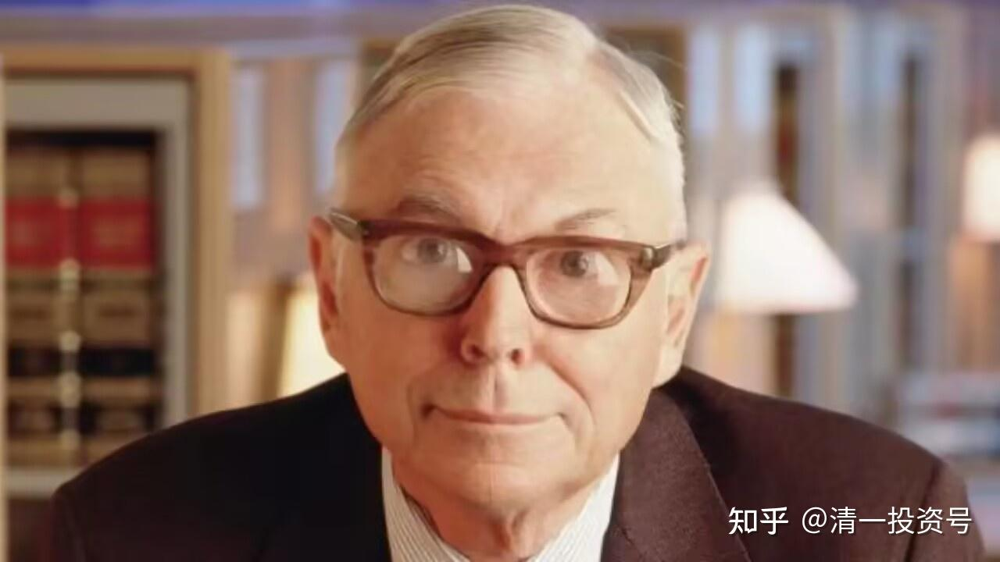

37篇.今日网校课程 查理·芒格的成功秘诀：课前作业

清一山长 2018年

作业：请阅读下面这段文字，并找出三个芒格言行中最吸引你注意的地方，你认为是你最应该学习和模仿的地方。并根据你的思维逻辑，写出为什么这三点你认为是芒格最重要的特质，最值得你学习和模仿？（请注意，你的选择，很可能决定了你未来的成功系数高低，请认真做好本次作业。）

**查理•芒格：用最干净的方法，只凭智慧取成功！**

2016-03-26 CHINA公社主张

**查理•芒格是一个完全凭借智慧取得成功的人**，这对于中国的读书人来讲无疑是一个令人振奋的例子。**与我们在社会上所看到的权钱交易、潜规则、商业欺诈、造假等手段不同，他用最干净的方法，取得了商业的巨大成功。**

1

巴菲特说他一生遇人无数，从来没有遇到过像查理这样的人。在我同查理交往的这些年里，我有幸能近距离了解查理，也对这一点深信不疑。甚至我在所阅读过的古今中外人物传记中也没有发现类似的人。

查理就是如此独特的人，他的独特性既表现在他的思想上，也表现在他的人格上。比如说，查理思考问题总是从逆向开始。

如果要明白人生如何得到幸福，查理首先是研究人生如何才能变得痛苦；要研究企业如何做强做大，查理首先研究企业是如何衰败的；大部分人更关心如何在股市投资上成功，查理最关心的是为什么在股市投资上大部分人都失败了。

他的这种思考方法来源于下面这句农夫谚语中所蕴含的哲理：我只想知道将来我会死在什么地方，这样我就不去那儿了。

查理在他的一生中，持续不断地研究收集关于各种各样的人物、各行各业的企业以及政府管治、学术研究等各领域中的著名失败案例，并把那些失败的原因排列成正确决策的检查清单，使他在人生、事业的决策上几乎从不犯重大错误。这点对巴菲特及巴郡（即伯克希尔•哈撒韦公司）50年业绩的重要性是再强调也不为过的。

查理对于由于人类心理倾向引起的灾难性错误尤其情有独钟。最具贡献的是他预测：金融衍生产品的泛滥和会计审计制度的漏洞即将给人类带来的灾难。2008年和2009年的金融海啸及全球经济大萧条不幸验证了查理的远见。

2

查理的头脑是原创性的。

他有儿童一样的好奇心，又有第一流的科学家所具备的研究素质和科学研究方法，一生都有强烈的求知欲和好奇心，几乎对所有的问题都感兴趣。任何一个问题在他看来，都可以使用正确的方法通过自学完全掌握，并可以在前人的基础上创新。

这点上他和自己的偶像富兰克林非常相似，类似于一位十八九世纪百科全书式的人物。

近代很多第一流的专家学者能够在自己狭小的研究领域内做到相对客观，一旦离开自己的领域不远，就开始变得主观、教条、僵化，或者干脆就失去了自我学习的能力，所以大都免不了瞎子摸象的局限。

查理的脑子就从来没有任何学科的条条框框。他的思想辐射到事业、人生、知识的每一个角落。

在他看来，世间宇宙万物都是一个相互作用的整体，人类所有的知识都是对这一整体研究的部分尝试，只有把这些知识结合起来，并贯穿在一个思想框架中，才能对正确的认知和决策起到帮助作用。所以他提倡要学习在所有学科中真正重要的理论，并在此基础上形成所谓的“普世智慧”，以此为利器去研究商业投资领域的重要问题。

查理这种思维方式的基础是基于对知识的诚实。他认为，这个世界复杂多变，人类的认知永远存在着限制，所以你必须要使用所有的工具，收集各种新的可以证否的证据，并随时修正。

3

事实上，所有的人都存在思想盲点。我们对自己的专业、旁人或是某一件事情或许能够做到客观，但是对于天下万事万物都秉持客观的态度却是很难的，甚至可以说是有违人之本性的。

但是查理却可以做到凡事客观。查理也讲到了通过后天的训练是可以培养客观的精神的。而这种思维方式的养成将使你看到别人看不到的东西，预测到别人预测不到的未来，从而过上更幸福、自由和成功的生活。

即使这样，一个人在一生中可以真正得到的真见卓识仍然非常有限，所以正确的决策必须局限在自己的“能力圈”以内。一种不能够界定其边界的能力，当然不能称为真正的能力。

怎么才能界定自己的能力圈呢？

查理说，如果我要拥有一种观点，如果我不能够比全世界最聪明、最有能力、最有资格反驳这个观点的人更能够证否自己，我就不配拥有这个观点。所以当查理真正地持有某个观点时，他的想法既原创、独特又几乎从不犯错。

4

一次，邻座一位漂亮的女士坚持让查理用一个字来总结他的成功，查理说是“理性”。

然而查理讲的“理性”却不是我们一般人理解的“理性”。查理对“理性”有更苛刻的定义。正是这样的“理性”，让查理具有敏锐独到的眼光和洞察力，即使对于完全陌生的领域，他也能一眼看到事物的本质。

巴菲特就把查理的这个特点称作“两分钟效应”。他说，查理比世界上任何人更能在最短时间之内把一个复杂商业的本质说清楚。

巴郡投资比亚迪的经过就是一个例证。记得 2003 年，我第一次同查理谈到比亚迪时，他虽然从来没有见过王传福本人，也从未参观过比亚迪的工厂，甚至对中国的市场和文化也相对陌生，可是他当时对比亚迪提出的问题和评论，今天看来仍然是投资比亚迪最实质的问题。

巴菲特说：“本杰明•格拉汉姆曾经教我只买便宜的股票，查理让我改变了这种想法。这是查理对我真正的影响。要让我从格拉汉姆的局限理论中走出来，需要一股强大的力量。查理的思想就是那股力量，他扩大了我的视野。”

5

查理的兴趣不仅限于思考，凡事也喜欢亲历亲为，并注重细节。

他有一艘世界上最大的私人双体游艇，而这艘游艇就是他自己设计的。

他还是个出色的建筑师。他按自己的喜好建造房子，从最初的图纸设计到之后的每一个细节，他都全程参与。比如，他捐助的所有建筑物都是他自己亲自设计的，这包括了斯坦福大学研究生院宿舍楼、哈佛高中科学馆以及亨廷顿图书馆与园林的稀有图书研究馆。

6

查理天生精力充沛。

我认识查理是在1996年，那时他72岁。到今年查理86岁，已经过了十几年了。在这十几年里，查理的精力完全没有变化。他永远是很早起身，7:30开始早餐会议 。同时由于某些晚宴应酬的缘故，他的睡眠时间可能要比常人少，但这些都不妨碍他旺盛的精力。

而且他记忆力惊人。我很多年前跟他讲的比亚迪的营运数字，我都已经记忆模糊了，他还记得。86岁的他记忆比我这个年轻人还好。这些都是他天生的优势，但使他异常成功的特质却都是他后天努力获得的。

查理对我而言，不仅是合伙人，是长辈，是老师，是朋友，是事业成功的典范，也是人生的楷模。他让我明白，一个人的成功并不是偶然的，时机固然重要，但人的内在品质更重要。

7

查理喜欢与人早餐约会。

记得第一次与查理吃早餐时，我准时赶到，发现查理已经坐在那里把当天的报纸都看完了。虽然离7:30还差几分钟，让一位德高望重的老人等我令我心里很不好受。

第二次约会，我大约提前了一刻钟到达，发现查理还是已经坐在那里看报纸了。

到第三次约会，我提前半小时到达，结果查理还是在那里看报纸，仿佛他从未离开过那个座位，终年守候。

直到第四次，我狠狠心提前一个钟头到达，6:30坐那里等候，到 6:45 的时候，查理悠悠地走进来了，手里拿着一摞报纸，头也不抬地坐下，完全没有注意到我的存在。

以后我逐渐了解，查理与人约会一定早到。到了以后也不浪费时间，会拿出准备好的报纸翻阅。自从知道查理的这个习惯后，以后我俩再约会，我都会提前到场，也拿一份报纸看，互不打扰，等 7:30 之后再一起吃早饭聊天。

8

偶尔查理也会迟到。

有一次我带一位来自中国的青年创业者去见查理。查理因为从一个午餐会上赶来而迟到了半个小时。一到之后，查理先向我们两个年轻人郑重道歉，并详细解释他迟到的原因，甚至提出午餐会的代客泊车应如何改进才不会耽误客人45分钟的等候时间。

那位中国青年既惊讶又感动，因为在全世界恐怕也找不到一位地位如查理一般的长者会因迟到向小辈反复道歉。

9

有一年查理和我共同参加了一个外地的聚会。活动结束后，我要赶回纽约，没想到却在机场的候机厅遇见查理。

他庞大的身体在过安检检测器的时候，不知什么原因不断鸣叫示警。而查理就一次又一次地折返接受安检，如此折腾半天，好不容易过了安检，他的飞机已经起飞了。

可查理也不着急，他抽出随身携带的书籍坐下来阅读，静等下一班飞机。那天正好我的飞机也误点了，我就陪他一起等。

我问查理：“你有自己的私人飞机，巴郡也有专机，你为什么要到商用客机机场去经受这么多的麻烦呢？”

查理答：“第一，我一个人坐专机太浪费油了。第二，我觉得坐商用飞机更安全。”但查理想说的真正理由是第三条：“我一辈子想要的就是融入生活，而不希望自己被孤立。”

查理最受不了的就是因为拥有了钱财而失去与世界的联系，把自己隔绝在一个单间，占地一层的巨型办公室里，见面要层层通报，过五关斩六将，谁都不能轻易接触到。这样就与现实生活脱节了。

“我手里只要有一本书，就不会觉得浪费时间。”查理任何时候都随身携带一本书，即使坐在经济舱的中间座位上，他只要拿着书，就安之若素。

有一次他去西雅图参加一个董事会，依旧按惯例坐经济舱，他身边坐着一位中国小女孩，飞行途中一直在做微积分的功课。

他对这个中国小女孩印象深刻，因为他很难想象同龄的美国女孩能有这样的定力，在飞机的嘈杂声中专心学习。如果他乘坐私人飞机，他就永远不会有机会近距离接触这些普通人的故事。

10

查理虽然严于律己，却非常宽厚地对待他真正关心和爱的人，不吝金钱，总希望他人多受益。

他一个人的旅行，无论公务私务都搭乘经济舱，但与太太和家人一起旅行时，查理便会搭乘自己的私人飞机。他解释说：“太太一辈子为我抚育这么多孩子，付出甚多，身体又不好，我一定要照顾好她。”

11

查理一旦确定了做一件事情，他可以去做一辈子。

比如说，他在哈佛高中及洛杉矶一间慈善医院的董事会任职长达 40 年之久。对于他所参与的慈善机构而言，查理是非常慷慨的赞助人。但查理投入的不只是钱，他还投入了大量的时间和精力，以确保这些机构的成功运行。

查理一生研究人类失败的原因，所以对人性的弱点有着深刻的理解。基于此，他认为人对自己要严格要求，一生不断提高修养，以克服人性本身的弱点。这种生活方式对查理而言是一种道德要求。在外人看来，查理可能像个苦行僧，但在查理看来，这个过程却是既理性又愉快，能够让人过上成功、幸福的人生。

查理就是这么独特。但是想想看，如果芒格和巴菲特不是如此独特的话，他们也不可能一起在50年间为巴郡创造了这样了不起的业绩。

查理•芒格与“股神”巴菲特相伴50年

12

有人问查理，如何才能找到一个优秀的配偶？

查理说，最好的方式就是让自己配得上她/他，因为优秀配偶都不是傻瓜。

晚年的查理时常引用一句话来结束他的演讲：“我的剑留给能够挥舞它的人。”

13

与查理交往的这些年，我常常会忘记他是一个美国人。他更接近于我理解的中国传统士大夫。

旅美20年期间，作为一个华人，我常常自问：中国文化的灵魂和精华到底是什么?

客观地讲，作为五四之后成长的中国人，我们对于中国的传统基本上是持否定的态度的。

到了美国之后，我有幸在哥伦比亚大学求学期间系统地学习了对西方文明史起到塑造性作用的 100 多部原典著作，以希腊文明为起点，延伸到欧州，直至现代文明。

在整个阅读与思考的过程中，我愈发觉得，中国文明的灵魂其实就是士大夫文明，是一个如何提高自我修养、自我超越的过程。

孔子《大学》曰：“正心，修身，齐家，治国，平天下。”

在古代中国，士大夫文明的载体是科举制度。科举制度不仅帮助儒家的追随者塑造自身的人格，而且还提供了他们发挥才能的平台，使得他们能够通过科举考试进入到政府为官，乃至社会的最上层，从而学有所用，实现自我价值。

科举制度结束后，在过去的上百年里，士大夫精神失去了具体的现实依托，变得无所适从，尤其到了今天商业高度发展的社会，具有士大夫情怀的中国读书人，对于自身的存在及其价值理想往往更加困惑。在一个传统尽失的商业社会，士大夫的精神是否仍然适用呢？

晚明时期，资本主义开始在中国萌芽，当时的商人曾经提出过“商才士魂”以彰显其理想。

从工业革命开始，市场和科技逐渐成为影响人类生活最重要的两股力量。近几十年来，借由全球化的浪潮，市场与科技已经突破国家和地域的限制，在全世界范围同步塑造人类共同的命运。对于当代的儒家，“国”与“天下”的概念必然有了全新的含义，“治国”与“平天下”的当代解读早已远远超出政府的范畴。

在当代，市场与科技代替古老的科举考试制度，为怀有士大夫情怀的读书人提供了前所未有的舞台。可以说查理就是一个“商才士魂”的最好典范。

14

首先，查理在商业领域极为成功。然而在与查理的深度接触中，我却发现查理的灵魂本质却是一个道德哲学家、一个学者。

正如前面所提到的，查理对自身要求很严。他虽然十分富有，但过的却是苦行僧般的生活。他现在居住的房子还是几十年前买的一套普通房子，外出旅行时永远只坐经济舱，而约会总是早到45分钟，还会为了偶尔的迟到而专门致歉。在取得事业与财富的巨大成功之后，查理又致力于慈善事业，造福天下人。

查理是一个完全凭借智慧取得成功的人，这对于中国的读书人来讲无疑是一个令人振奋的例子。

**他的成功完全靠投资，而投资的成功又完全靠自我修养和学习，这与我们在当今社会上所看到的权钱交易、潜规则、商业欺诈、造假等毫无关系。作为一个正直善良的人，他用最干净的方法，充分运用自己的智慧，取得了这个商业社会中的巨大成功。**

在市场经济下的今天，满怀士大夫情怀的中国读书人，是否也可以通过学习与自身修养的锻炼，同样取得世俗社会的成功，并实现自身的价值及帮助他人的理想呢?

15

2010 年初，与查理相濡以沫50年的太太南茜不幸病逝。几个月之后，一次意外事故又导致查理仅存的右眼丧失了90%的视力，致使他一度几乎双目失明。对于一位86岁视读书思考胜于生命的老人而言，两件事情的连番打击可想而知。

然而我所看到的查理却依然是那样理性、客观、积极与睿智。他既不怨天尤人，也不消极放弃，在平静中积极地寻求应对方法。

他尝试过几种阅读机器，甚至一度考虑过学习盲文。后来奇迹般的，他的右眼又恢复了70%的视力。我们大家都为之雀跃！然而我同时也坚信：即使查理丧失了全部的视力，他依然会找到方法让自己的生活既有意义又充满效率。

无论顺境、逆境，都保持客观积极的心态——这就是查理。

本文作者：美国对冲基金喜马拉雅资本创办人，芒格家族财产管理者，[李录](http://link.zhihu.com/?target=http%3A//finance.sina.com.cn/money/fund/jjzl/2020-05-05/doc-iircuyvi1356811.shtml)。 文章精选自“ Better Read ”，原文载于[《穷查理宝典》中文版序言](http://link.zhihu.com/?target=https%3A//xueqiu.com/6432534821/227973598)，有删节。另有参考《文明、现代化、价值投资与中国》 （李录，中信出版社）

