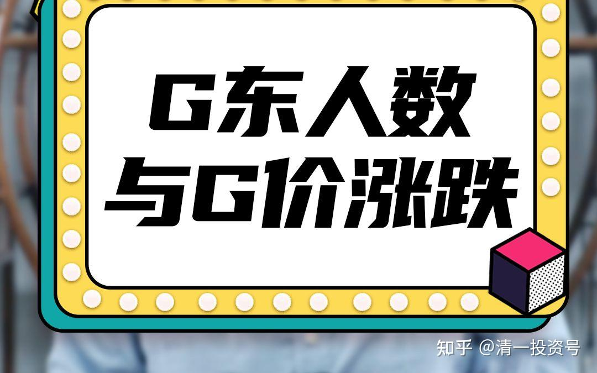
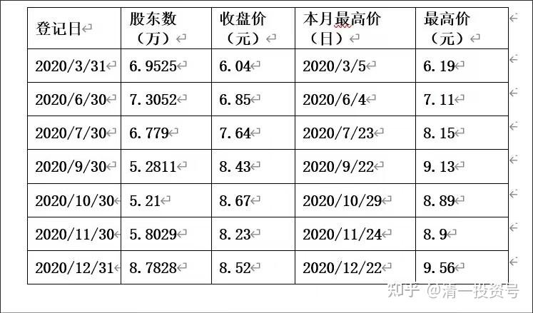
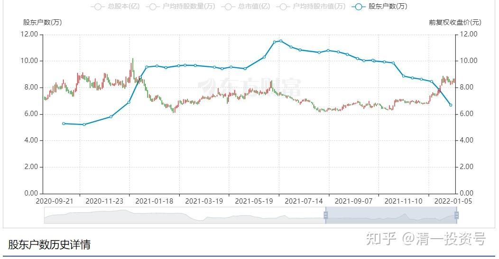
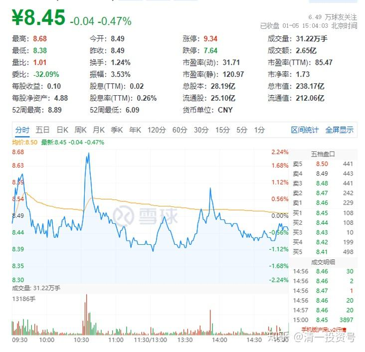
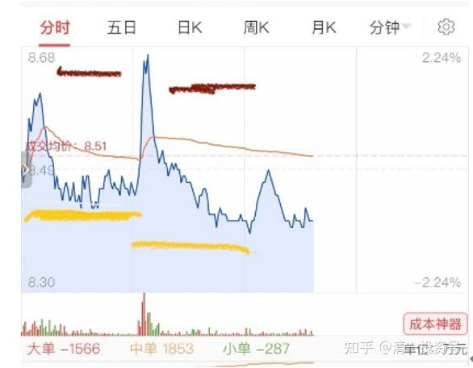

专篇17.股东数所传递的信息

清一山长 2022年1月5日

截至2021年12月31日，公司股东总户数为66,800，较12月20日78360减少了14%。一句话，10天时间少11560人——几个月前，YJ股东人数最多是11～12万人的。最近的拉升，已经很成功地让一半以上的人下车了（虽然股东人数据上没有减少一半，但是有不少人减仓之后，会留100股作观察仓。这样股东人数不会显示减少，但持仓可以几乎就是空仓了）。就像泸州老窖、五粮液、顺鑫农业、迎驾贡酒等，我依然是股东之一，但持仓数最多千股。在我看来就是空仓了。我认为：目前的YJ浮筹，清洗得已经差不多了。很难指望跌破6万户。

**现在的走势，就是洗盘，让新的短线客进入，主力现在已经不想要增加股份了，但也不想卖股换钱。**所以是震荡格局，制造上下波动，创造一点做T的空间，赚一点小钱，也让市场活络，吸引热钱。所以跟之前的16个交易日连涨14天不一样了。这个期间主力一直是净买入的。你可以算出主力的持仓成本，就在这个区间（7～8元区域）。

2020年9月21日至2022年1月5日区间股价与股东人数

不过，预期涨过10元之后，股东数就会开始增加的。大批短线客会涌进来了。2020年，YJ突破8元之后，股东数大幅减少。9元～10元去股东数大幅增加。就是长期持有者换仓给短线客了。YJ现在的磨叽，就是等这批人来接手的（如果主力的目标位是13-15的话）。**如果目标位更高，筹码就不会在10元～13元放出来的，你们就看不到这区间股东数的大量增加。只要股东不增加，就可以安心持股**。但可能我们很难即时看到股东数据。因为这时候，为了掩藏主力的进出趋势，YJ官方可能会采取措施，不再10天公布一次股东数了（按规定是每季度公布一次即可，YJ非常奇怪的10天就公布一次，还没有见过这样做的第二家上市公司）

**炯2022/1/5 9:59:49

是不是YJ与庄家联手在做局，配合各种消息面（股东人数、销量、利润、冬奥会等），拉高股价后，双方合作共赢？

**超 2022/1/5 10:00:54

YJ可能就是最大的庄家。

**闻 2022/1/5 10:08:51

随喜赞叹，感恩山长智慧引领，创造和付出，是我们一生最大的快乐。

山长清一2022/1/5 13:11:29

刚给天使班上完课，吃完饭回来看，今天的YJ居然画心电图[大笑]。很少见。**这种图形出现，一般来说叫做“试盘**”。看看压力重不重，还需要洗多久。一上午就出现两次，颇有些急迫，不知道下午如何走。出现这种图形，**聪明的做法是高抛低吸，乘机赚取额外的差价，但最正确的做法，是捂股不动。**除非你特别有把握，才顺势做T。

**彬2022/1/5 13:16:09

我不是聪明人，但是可以在山长的指导下做最正确的事，感恩山长。

**雯 2022/1/5 13:50:40

山长，您说的上午的两次试盘（心电图）是指我黄线画的包括波峰的线段呢？还是红线画的不包括波峰的短线段？是否是庄家先拉一把，然后再观察盘面情况？具体庄家是怎样操作才形成了这种图形呢？下午到目前为止是否又小试了一次盘？下午这次好像只是稍稍拉了一把，波峰比上午的两波低了很多，这是什么盘面语言呢？

**雯2022/1/5 13:59:08

哦，第一问取消，健康的心电图就是有波峰的。可能我的问题比较初级，有别的同学知道吗？

山长清一2022/1/5 14:08:20

有必要问我吗？你自己看到这图怎么想的，盘面语言就是怎么读的。不就是“遇到冲高赶快卖，卖后一定给你机会低位补回来的。你要舍不得卖，以后就越冲越矮，越盘越低了。所以，下次要记住——冲高赶快卖。见好就收。别贪心！只要有赚就行了，反而还会跌下来给你买的）。难道你们不是这样想的吗？

**琪 2022/1/5 14:09:37

山长不是说了吗？正确的做法是捂着不动！

**雯 2022/1/5 14:12:29

庄家真是心理行为运用高手！那我们就反着想就好了。感恩！

**参考链接：**

专篇1 [306篇.前缘1.雪球的最后一贴--胜利曙光都已经出现](http://link.zhihu.com/?target=https%3A//xueqiu.com/2017773236/247159187)

专篇2 [307篇.被特别关照的股--前缘2](http://link.zhihu.com/?target=https%3A//xueqiu.com/2017773236/247387457)

专篇3 [308篇.立此存照--前缘3](http://link.zhihu.com/?target=https%3A//xueqiu.com/2017773236/247580614)

专篇4 [309篇.见识传说中的拖拉机账户](http://link.zhihu.com/?target=https%3A//xueqiu.com/2017773236/247973779)

专篇5 [310篇. 拉升在即](http://link.zhihu.com/?target=https%3A//xueqiu.com/2017773236/248351982)

专篇6 [311篇. 进入右侧投资时代](http://link.zhihu.com/?target=https%3A//xueqiu.com/2017773236/248658236)

专篇7 [313篇. 小主力进货的阶段](http://link.zhihu.com/?target=https%3A//xueqiu.com/2017773236/249221851)

专篇8 [316篇.两轮回调对比](http://link.zhihu.com/?target=https%3A//xueqiu.com/2017773236/249675370)

[专篇9.主力的水军](https://zhuanlan.zhihu.com/p/619400004)

[专篇10.主力完成筹码收集](https://zhuanlan.zhihu.com/p/629948708)

[专篇11.主力、游资、右侧投机客纷纷进场](https://zhuanlan.zhihu.com/p/631628731)

[专篇12.进入震荡期](https://zhuanlan.zhihu.com/p/633057526)

[专篇13.永远回避风险，不亏损第一](https://zhuanlan.zhihu.com/p/635191087)

[专篇14.高位十字星缩量及主力操作的三个阶段](https://zhuanlan.zhihu.com/p/635191930)

[专篇15.准备起跳](https://zhuanlan.zhihu.com/p/636886203)

[专篇16.大幅回调，老手加高手](https://zhuanlan.zhihu.com/p/638552635)

