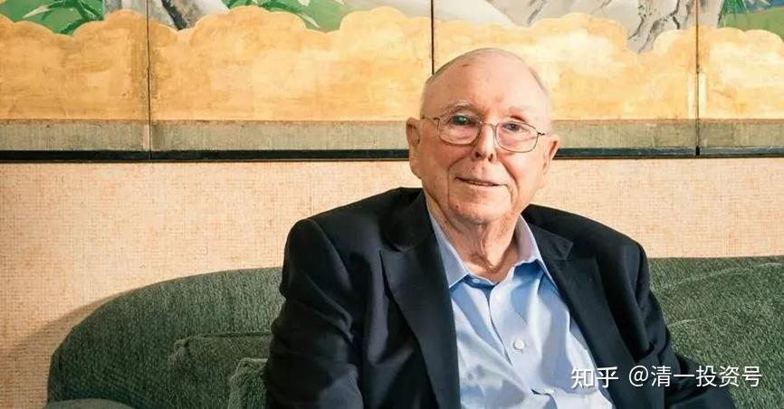
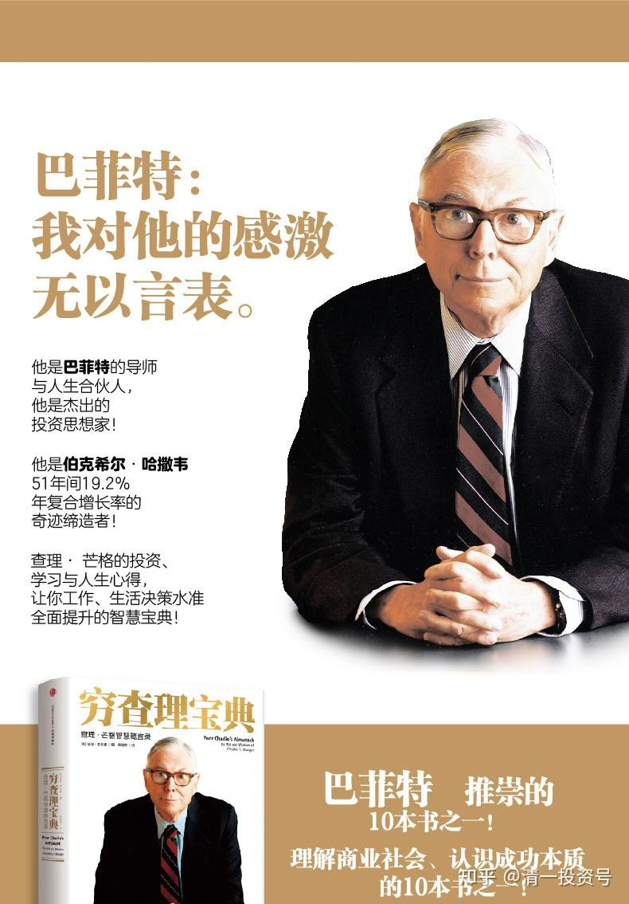

39篇.今日网校课程：查理•芒格的成功秘诀1——逆向思维

清一山长 2018年

**在这世界上有两种钱，一种叫轻松钱，一种叫辛苦钱，西方把它叫做easy money。当然了，跟他相反的应该是hard money。大多数人都只能去挣那种非常辛苦的钱，有多辛苦呢？**

**一、用命赚钱的辛苦**

假设你挖出一个矿，这个矿有钱了，一帮流氓就找上门来了，要你把矿让给他们。你们不懂得这个概念，我就说一下吧。别人投30万去挖一个矿，给你一个探矿点、给你一个探矿资格证，30万、50万、100万得到这个资格证，你可以去挖。那么你挖出矿的概率是多少呢？可能90%是没矿的——白挖了。所以对于你来说，一个矿山挖出来矿的价值是多少？比如说，30万一个探矿权的位置，能够挖出矿来的矿山的价值是多少？最起码是300万，对不对？这叫盈亏平衡点，你要算概率。所以，这个时候你为了保证能够赚钱，你就必须去挖十个矿。其中有一个矿是300万，甚至于更高，你就赚到钱了。没有呢？你就亏了。当然，我说的是打比方。我知道有一个矿是800万的开采权，800万开采权万一没矿，这800万就丢水里面去了，对不对？但如果你花了800万或者多少万，开出矿来了。这个矿可能会值1000万、2000万、3000万，甚至可能价值1个亿。但是价值1个亿的情况很少，能够值1000万、2000万已经很不错了。当然，也有可能值更多。

这时流氓找上门来了，你花了800万，流氓说：“我给你800万,你把矿给我，你干不干？我再让你赚点钱，给你1000万，你干不干？”那谁愿干这种事情？肯定不干，不干怎么办？打——杀——把你这个老板吓跑、打跑，甚至杀死。比如丢个炸药包来，把你的矿炸塌、把你人炸死。这样你在那边，你觉得你没他狠，搞不过他，你认输了，就撤走了。那么，这些人赚了多少钱呢？其实这些人说来说去也就赚了几百万，了不起几千万，最多也就是赚了几千万。但是他们要面临的是：第一，生命。不只是自己的生命，家人的生命、朋友的生命、员工的生命，都会受到威胁。这种钱辛不辛苦？想不想挣？

**二、牺牲自由与尊严的辛苦**

好的，如果你说，这种矿价值高，我就说一些小价值的东西。这边当地卖鱼的市场上，要给嘿慑汇交税的，甚至你搞一个什么东西，别人就要找你拿钱的，赚的钱有多少呢？很少！卖鱼的能赚多少钱？对还是不对？你都要去交这些税、你都要去和嘿慑汇去搞关系。你要是去办歌厅、舞厅，其实歌厅、舞厅办起来还不见得能赚钱呢！但是这些人到你那，你都得好好去招待好。辛不辛苦？这时候你有没有尊严、有没有荣誉、有没有自由？没有了。

好了，那么一些大老板，像我们学堂的一些家长大老板身价上亿，他们有没有尊严、有没有自由？

张老师：***，你昨天看到那帮大老板，你感觉他们有没有自由？

学生1：没有。

张老师：有没有尊严？他们没有面子、没有尊严，他们不得不去做很多很恶心，不愿意做的事情。他们要打官司、要见鳏缘，鳏缘要见他们，他们毫无办法，他们还要用各种方式买断鳏缘。我敢跟你打赌，这帮人都给鳏缘买过各种各样的东西，甚至包括女人在内。他一定会干这样的事情，不干不行。只要别人要什么，你就得提供什么。过几天大家要做的作业，其中一道题很有意思，就是你们有没有人知道XXX这个人？

学生1：XXX？

张老师：对。一定知道吧？很有名吧？她就被别人用一百多万给买下来了。20年前150万噢！便宜吗？20年前，100万至少相当于现在的1000万吧，对不对？买了之后干嘛？接待鳏缘，接待那些高鳏。怎么买定的？她是贵为全国有名的歌星，唱的歌很甜美噢！但是她自己的自由都没有。这就是在中国！在中国,美貌、才华、金钱，甚至顶尖的权利，如顶层高鳏，都不能为自己买到尊严和自由。

XXX的事情估计有些人听了都很吃惊是吧？不知道原来她是被买下来的人。那个时候你看她唱的那个歌，哇，好像觉得她好迷人、好有尊严、好有面子，背后的心酸，你真不知道。所以你们能够过一种自由、有尊严的生活，很了不起、很难得。特别是有自由、有尊严，又有权利、又有金钱，更难得。

**三、只凭智慧取成功**

所以你们看到的**芒格是一个特例，就是非常有尊严的这种人，赚到了大钱，而且获得了尊重——极度的尊重，不是因为他赚大钱，而是因为他的思想、他的品行，当然也包括他令人羡慕的成功——坐拥几百亿资产。**对不对？那么他怎样赚的这笔钱，这就是开头第一句话的意思——“**用最干净的方法，只凭智慧取得成功**。”我们社会上看到的权钱交易、潜规则、商业欺诈，而查理·芒格用最干净的方法取得了财富上的巨大成功。

我在十几年前退出商界，进入了今日学堂，去办学堂去了。其中有一个很核心很核心的理由就是，我发现我的企业越大，我越要违背自己的良心。当我是一个小个体户的时候，没人管我。但当我变成了一家行业第一的、有影响力的企业时，我发现ZF在关注我，各方面都在关注我。然后我不得不跟他们进行沟通，不得不做一些很恶心的事情。你不送他钱，他就会来整你。所以不好意思，我也干过这样的事情。不得不干，当时我觉得好恶心，我不愿意干，后来我就退出了。

因为**我更想追求有自由、有尊严的生活。关键就是我想明白了一件事：原来我没钱，穷得要死。因此，我不得不忍着恶心去赚钱，有时候不得不牺牲自己的尊严和自由，所以我很理解那种感觉。**但是我觉得我已经有了钱了，特别是我生活要求并不高，我觉得日常生活我已经能够过日子了，我就不愿意再过这样的生活了。当然我那个时候没有昨天你们看到的老板他们那么有钱，但是我觉得我的钱够了，这就是一个人的要求。我觉得我可以活下去了，我可以不看领导的脸色、不看鳏缘的脸色，也不用做关系，因为我知道我会投资。另外我还想做点有价值的事情，所以做了今日学堂，当时我的决策是大量的投资。2005年、2006年这次机会我抓住了，那时候已经开始退出商界了。然后，办学堂是为什么？办学堂是追求理想。所以就是这样过来，你们没这个体验，你们很难体验到！

那些老板们虽然天天告诉你他赚了多少钱，好像很风光很风光，住着多大的房子、住着多豪华的办公室，拥有多贵的名车，其实他们的心是很苦的，甚至他们的家庭是不幸福的。我不要这些东西。

但是我真的很羡慕巴菲特、芒格他们有的财富成功，但是他们不需要去做这些事情。特别是在中国潜规则就更多了，我以后不愿意我的孩子去做这种事情，他们不需要去挣钱去。这里面我们就可以看到了，他的成功是一个奇迹。特别在商业世界当中互相争夺很厉害、互相竞争非常激烈，甚至要动用各种各样的关系，甚至要动用嘿慑汇、动用红慑汇，红慑汇就是利用鳏缘，嘿慑汇就像刚刚我说的抢矿，那是最低层的。靠能力，只要发展大了之后，你不得不涉及这些东西。都很狼狈！

那么我们就要想他这样超级的成功，到底是什么东西支撑了他？他一定有过人之处、他一定跟一般人不一样，我们就去观察他。其实一个人是立体的，你没去从中找到你的共振点。你的共振点是什么？你仔细观察一下，你就是什么样的人。你可以观察一个人的成功度、可以关注他的幸福度、也可以关注它的思维度。所以这就叫“仁者见仁，智者见智”。不稀奇的！

同样一个苹果，有人看到它会用它赚钱，有人说我可以吃。说可以吃的人是消费者，用它赚钱的人是经营者。用它赚钱的话，有人说，我可以把它做成苹果派，像麦当劳苹果派，我可以赚更多的钱。有时候可以做成果冻、有时候可以打成果汁，各种各样的方式。经营者有各种各样的思维的，吃是最简单的，你们是哪一种，就看你怎样去观察他。

我希望你们去检查自己的思维方式，每个人自己检查再互相检查一下，回头配对。我来检查你是什么样的思维方式，这里先给大家做示范，示范就是我的思维方式——我怎样看他的。我相信我是用我的眼光去看他，但是由于他比我高，我还看到了他比我更高的思维，因此他就帮助了我、他就提升了我。或者他有我想不到的地方，我在看到的时候有种很好笑的感觉。我觉得他应该是老子的徒弟，但是他是西方人，他有没有读过《道德经》，我不知道。为什么呢？他用的词汇没有那些词，但是他悟到的道理跟我看老子悟到的道理是一样的。这一点你们观察到没有？没想到是吧？

**芒格成功的秘诀——逆向思维**

**查理•芒格是如此独特的人，他的独特性既表现在他的思想上，又表现在他的人格上。比如说，查理思考问题总是从逆向开始。要明白人生如何得到幸福，查理首先研究的是人生如何才能变得痛苦；要研究企业如何做强、做大，查理研究的是企业是如何衰败的；大部分人更关心如何在股市投资上成功。他关心的是为什么大多数人都失败了。这就是他的思维方式。**

我说过思维方式、价值观和知识体系，你们有些人是只抓知识，没去抓思维框架。**这个东西，你突然发现它就是思维框架——它的思维模式不一样。这种思维模式，他用了一个名字叫“逆向投资、逆向思维”。**

**其实这种思维就是道家思维，叫阴阳。**为什么叫阴阳？阳就是看得见的，阴就是看不见的；阳就是你看到的这一端，阴就是你看不见的另一端；阳就是显现出来的，阴就是没有显现出来的。因此，它就是阴阳鱼。道家思维方式就是要把这两个东西补全，没有补全就不是道家思维方式。

所以看到了幸福，必然还有另一端叫不幸福。光去研究幸福的人叫单极式思维，其实是很愚蠢的——就像西医一样愚蠢。西医只看一点，只往一头去上面死追，结果永远追不到头。

他学会了东方思维方式，看相反的一点，而且两点他一定结合。他追求的是成功，但是他总去看失败，他看不看成功？他绝对看，但是更多的是在关心跟成功相应的失败。他关心的是人生的幸福，但是他同时去研究为什么人会不幸福，对还是不对？光去研究幸福，幸福都是相似的，甚至是平淡的，成功也都是平淡的，他就看不见后面的东西。

幸福不就是家庭和睦、亲亲爱爱，同时心情快乐、身体健康。这些东西都很普通吧。无论你的健康如何，你要知道怎么样会健康，怎样会不健康，然后怎样把这个不健康改掉，对不对？你要知道怎样不生病，你就要知道病是怎么来的，并把这个怎么来的那个路给它堵掉，病就不来了。这种模式是不是我经常在给大家说？我为什么能够超越一般人，因为我就是这种思维模式的人。

你们仔细看了这一点，马上就想到山长也是这种人。也就是**在这个世界上，成功者一定是懂阴阳的，但不一定用这样的词**——他用了“逆向投资”，他看到相反的那一面。

同样，我们看李嘉诚也是这样的人，李嘉诚说，他99%的时间在研究失败，马云也是这样说的，对还是不对？天天想我这家企业、我这家公司的问题，不是说我天天吹我这家企业有多好，我天天在看今日学堂的问题，对不对？我教导你们是不是——你要天天找你的毛病？跟他的思维模式是不是一模一样？

但关注这种东西别人会说我偏激，为什么？他们是普通人、他们是蠢货，他们不理解这种思维模式，他们不是这种高级别的人，他们就是只能看见阳。他们认为阳上加阳就好了，快乐就更快乐——像小孩子，你要快乐，你要快乐，你要快乐，所以，以后你会快乐？错了！因为你以后要快乐，现在要关注你的痛苦，哪些东西会导致你痛苦，对不对？

比如现在你天天吃，吃得饱饱的，饿了你就痛苦。你从来不知道饿的滋味，因此万一哪一天你偶尔挨一次饿，或者是当你挣不到饭吃，你就会痛苦得不得了，甚至你觉得就要死了。但是你经常挨饿的话，你觉得饿不再会给你造成痛苦或不愉快，对还是不对？

类似的东西就是**你一定要研究相反的东西，甚至故意去体验一下相反的东西**。你们上个星期看的《极盗者》，他为了热爱生活、为了珍惜生命，他去做的事情，反而是去体会如何面临死亡，甚至必须付出生命，但是他绝对不是不爱热爱生命，反而是太热爱生命了。这一点，你们好好去思考。

这些卓越者都有类似的思维方式。在你们看来他是极度的危险，在他看来是极度的对生命的尊重和爱惜。我们看他是把生命那么轻而易举就丢掉了，他看的就是我要让我的生命发挥最大的价值。这就叫相反思维——高人通通是相反思维，或者叫道家阴阳思维。

这是核心，你们如果不掌握这个模式——永远成不了高人。我看你们的作业，大多数人没提到这一点，没注意到他这种思维方式的独特之处。这一段出现在第一段，难道不是最重要的吗？你们就没去关注它，很遗憾！

查理•芒格最突出的一句话，就是他经常说的话：**我想知道将来我会死在什么地方，这样我就不去那儿了。就是他天天在研究死亡，原因是因为他热爱生命；他天天在研究错误，因为他想要拥抱成功；他天天在研究失败，目的是为了获得完美的结果。今日学堂做的是很类似的事情，所以我们叫精英学堂，是因为我们是这种思维模式的人。**

你们要做能够实现这种思维模式的人，当然你们未来会很成功，你们也很容易考取今日大学；不能适应这种思维模式的人，甚至不愿意去多想的人，你们就只能做一般的人、普通的人。普通人也不错，没说你不好，我们不需要所有人都是卓越的人。你越卓越，这种思维方式在你身上会越强地体现出来。

可惜这种思维方式是无法教的，必须你自动的去搜寻它、自动的去对这个位。包括如果你想武功上练好，不是说我去找最好的武功，而是说我怎么样不会被人打败，以及我知道我怎么样被人打败，我就知道我怎样去打败别人，对还是不对？你天天在研究打败、失败，你当然就会成功。你天天挨人打，你当然就知道怎么打人了。

特别是你挨高手的打，你和高手打，高手打你打得好痛快啊！好漂亮！就像我一样，**我喜欢高手打打我——别人打你是看得起你**。但是我每次挨打之后，一定不是白挨打的，我就想他怎么打得那么漂亮？再过一段时间我也可以打得更漂亮一些了，而且是用我的方式打出来的，因为我不是模仿你，我要达到的效果——怎样把你打得很狼狈。

**（学生1），今天我打你们，你们狼不狼狈？我打你没事吧？如果我想出手的时候，你们会有什么感觉？你会有小鸡的那种感觉，对吧？你们会有完全无法反抗的感觉，只要我想进攻的话，是不是？然后，漫不经心地。这就是因为我被打，而且我去体验打，我要先挨打。让你们挨打就是个原因。

不过话又说回来，你们也没几个人愿意挨打，多难受啊！练多了，以后就习惯了。像他们几个小家伙们——至上小组的人，别以为跟我在一起全是享福，经常被打得鼻青脸肿的，经常被打得鼻子流血的，然后经常哭。现在还好些，你们不太会哭了是吧？今天没人哭是吧？原来挨两拳就开始哭起来了，因为你没那种感觉。

原来那种感觉，现在看得好平淡好平淡了之后，慢慢地你发现你更不容易哭了、更喜欢笑了。有时候挨了一拳，还笑一下。嗯，挺好的！但一般人呢？挨一拳，他就马上在那妈妈呀、姐姐呀——因为你没有过这种挫折的感觉，所以我们去体验。

我们为什么要自己打？因为你们是互相有控制的，而且是有保护的。这种情况下，其实你们不会受伤，你们已经被保障了不会受伤，当然会口鼻流血一下，会痛那么一下，但是你就是要找这种感觉的。就跟你们上次看的《极盗者》一样，是吧？但是到外面去，在没保护的情况下，如果你从来没经过这种训练会很危险。

所以这就是你们要学会的思维模式——反阴阳！

参考链接：

[《穷查理宝典》中文版序：书中自有黄金屋](http://link.zhihu.com/?target=http%3A//www.youyiyan.com/chapter/view/64176.html)

[中文版序：书中自有黄金屋](http://link.zhihu.com/?target=http%3A//www.youyiyan.com/chapter/view/64176.html)

[书中自有黄金屋（《穷查理宝典》中文版序）](http://link.zhihu.com/?target=https%3A//mp.weixin.qq.com/s/eTPmxsItOVhdpxsasQ6Lkg)

[有声书 ｜《穷查理宝典》（合集）](http://link.zhihu.com/?target=https%3A//www.bilibili.com/video/av416913628/)

