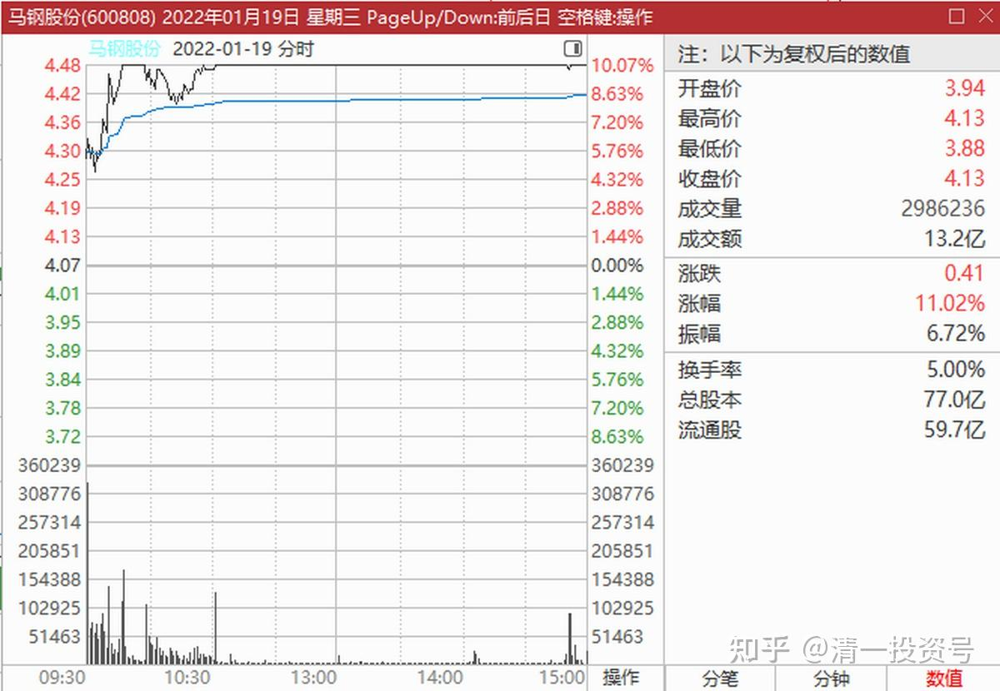
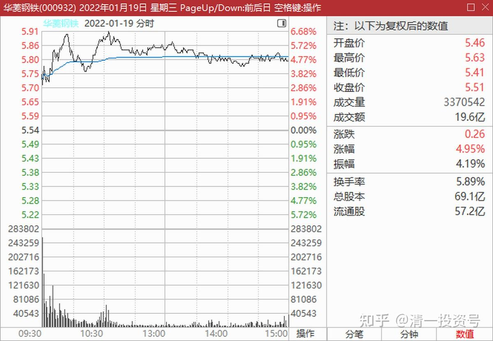
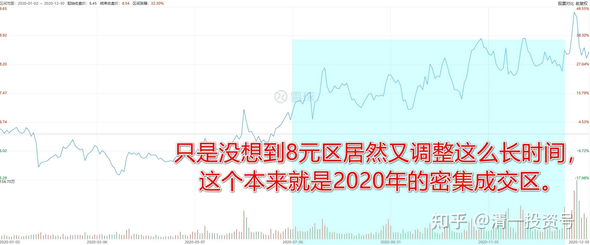
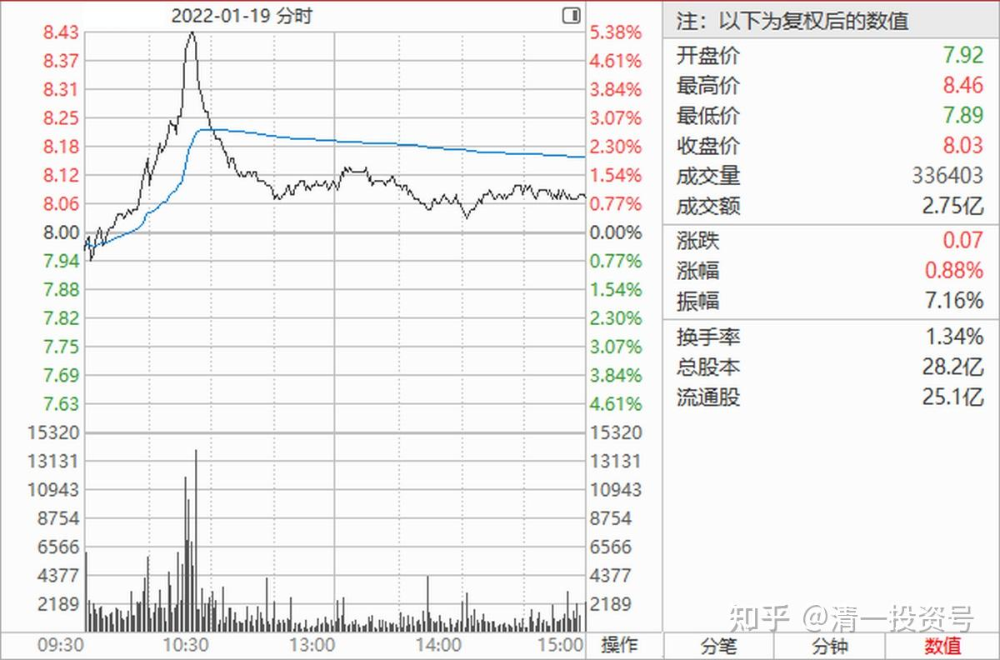
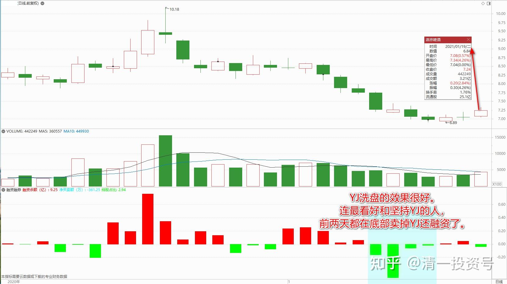

专篇20.暗示洗盘快结束

山长清一 2022年01月19日

今天刚辅导完回来，看看盘面。重仓股马钢和华菱钢铁大涨超5%。开始脱离我的买入区了，所幸马钢入仓了已经数百万股。因为马钢已经被宝钢兼并，所以它绝无可能倒闭。同时宝钢有下属公司分红必须超过50%的要求，这样买马钢比宝钢划算得多，估值也更便宜，分红率更高，何乐而不为？

买华菱钢铁的原因，是它的竞争力似乎很强。汽车板、船板的制造供应，比宝钢还厉害，算是单项冠军吧！我喜欢长期持有这些冠军股。今年的钢铁股的分仓，看样子是成功的布局。

YJ今天开涨了6%。似乎暗示洗盘快结束了。现在继续回落中，但看样子，不太可能跌破8元到七元区调整了。已经够强势的了。**只是没想到8元区居然又调整这么长时间。这个本来就是2020年的密集成交区，**调整长一点很正常的。直接就破位的话，未来调整幅度会很大。现在先行调整，9元以上怎么走就不好说了。不一定出现我原来计划中的“最佳做T区域”了。可能短期就突破压力位，或者是慢慢推土机推上去，但很难出现跳上跳下的行情了。很遗憾，其实我喜欢跳上跳下的，获利空间会更大。

2022年1月19日YJ啤酒

山长清一2022/1/19 13:25:58

YJ洗盘的效果很好。连最看好和坚持YJ的人，前两天都在底部卖掉YJ还融资了。说明这破位下杀，对很多看多者来说吓得不轻，认为主力难说会击破7元区下去调整，所以纷纷落袋为安。我一股未少，但也一股没加。除非它真要跌破7元，我肯定要加仓了。或者中建涨破7元，我换仓7元的YJ[大笑]。

YJPJ日K线图（2021年1月）

**东 2022/1/19 18:18:47

这两天看雪球好多人减仓了YJ，有网友私下交流也受不了了。有山长前面的分享，知道YJ基本面非常好；YJ的操盘太老辣。我是一股都不敢动，心里还算平静。

**丽2022/1/19 18:33:28

谢谢山长分享。雪球专组的11位伙伴，得益于这一年来整理山长的雪球专栏和非专栏文章，越整理，越坚定相信山长的投资逻辑。这两天群里讨论，周围的人都在慌，又是跌破20日线，又是回到8元以下，慌得六神无主，我们却非常定。还笑说，不涨还好，反正知道终究会涨到高处去，涨了还忙，又没有山长的雪球分享，卖了还不知道买什么好。现在是觉得**东老师上次在这里说的很是形象——【能安心做傻猫，是福报最好的】【保证股市的收益率肯定能站在前百分之五】

**参考链接：**

专篇1 [306篇.前缘1.雪球的最后一贴--胜利曙光都已经出现](http://link.zhihu.com/?target=https%3A//xueqiu.com/2017773236/247159187)

专篇2 [307篇.被特别关照的股--前缘2](http://link.zhihu.com/?target=https%3A//xueqiu.com/2017773236/247387457)

专篇3 [308篇.立此存照--前缘3](http://link.zhihu.com/?target=https%3A//xueqiu.com/2017773236/247580614)

专篇4 [309篇.见识传说中的拖拉机账户](http://link.zhihu.com/?target=https%3A//xueqiu.com/2017773236/247973779)

专篇5 [310篇. 拉升在即](http://link.zhihu.com/?target=https%3A//xueqiu.com/2017773236/248351982)

专篇6 [311篇. 进入右侧投资时代](http://link.zhihu.com/?target=https%3A//xueqiu.com/2017773236/248658236)

专篇7 [313篇. 小主力进货的阶段](http://link.zhihu.com/?target=https%3A//xueqiu.com/2017773236/249221851)

专篇8 [316篇.两轮回调对比](http://link.zhihu.com/?target=https%3A//xueqiu.com/2017773236/249675370)

[专篇9.主力的水军](https://zhuanlan.zhihu.com/p/619400004)

[专篇10.主力完成筹码收集](https://zhuanlan.zhihu.com/p/629948708)

[专篇11.主力、游资、右侧投机客纷纷进场](https://zhuanlan.zhihu.com/p/631628731)

[专篇12.进入震荡期](https://zhuanlan.zhihu.com/p/633057526)

[专篇13.永远回避风险，不亏损第一](https://zhuanlan.zhihu.com/p/635191087)

[专篇14.高位十字星缩量及主力操作的三个阶段](https://zhuanlan.zhihu.com/p/635191930)

[专篇15.准备起跳](https://zhuanlan.zhihu.com/p/636886203)

[专篇16.大幅回调，老手加高手](https://zhuanlan.zhihu.com/p/638552635)

[专篇17.股东数所传递的信息](https://zhuanlan.zhihu.com/p/639002631)

[专篇18.突破9元是燕京的基本目标](https://zhuanlan.zhihu.com/p/640000051)

[专篇19.YJ、惠泉今天盘面语言对比](https://zhuanlan.zhihu.com/p/640550916)

