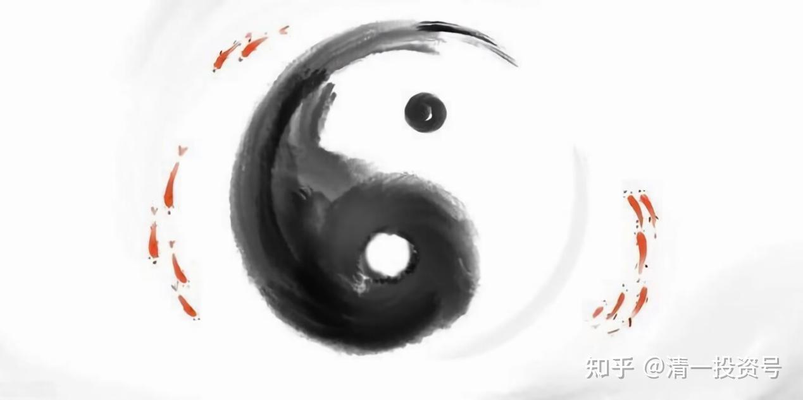

41篇.今日网校课程：查理·芒格的成功秘诀2——清一派成功学思维模式

清一山长 2018年

**一、清一派成功学**

成功是非常容易的——“清一派成功学”。**我经常用这种思维模式做事——很容易的成功学方法做事。**发现了没有？我告诉你们怎样战胜哈佛、耶鲁医学院的？告诉了没有？说吧，什么思维模式？（学生：就是研究它们的问题，知道我们该做什么。）我们的出手是什么？怎样赢他们？就是我们尽量不犯错误。因为他们做得越多，错误越多。只要我什么都不做，我只要没错误，我就一定赢过他们。

**这种思维模式是不是利用了我们对世人的了解？这就是清一派成功学。你看我什么都不做，我都比你成功。这种事情，成功难道来得不是太容易了一点吗？**

为什么我会有这个特征，在这个社会？李**你投资为什么赚钱了？我们家长群赚钱最多的为什么赔得要死、赔得一塌糊涂？因为他太喜欢做了。难道你比他聪明吗？如果你有那么多钱，你现在就要被别人羡慕死了，就是你有那么多投资，你的总额就会很大。他花了很大的总额，结果还把自己弄赔了，因为他太“勤奋”了，“勤奋”到随时随地都在看行情，随时随地都在操作，他不操作他手就痒。因为人是这样的，**人是有严重缺陷的生物。**

请大家记住，每个人照镜子，既然我们有严重的缺陷，就要学会一条——**少做事**。因为我们做得越多，我们失败的几率就越大。因此，老子教的就叫“无为”。

**说穿一点，“无为”就是不要乱做事。但是什么时候做？我有九成把握的时候我才去做，没把握我不做，我就看着，发呆、发傻。**只有我觉得做这个东西怎么都不吃亏了，我偶尔做一做。比如股票涨一涨，我觉得这个家伙涨得我自己都不好意思了，我就做一做，把它卖掉呗！跌得所有人都怕死了，跌得我自己都害怕了，为了不“害怕”，再多买一点股票压压惊。

当你用这种思维模式去做事的时候，你说你会失败吗？那么剩下的时间干嘛？看不清，看不清就不动，装死——趴下来装死。当你用这种策略，你突然会发现，90%以上的基金公司、专业机构都不是你的对手了。因此，打败专业对手很容易。怎么容易？少做！所以，**这就是“清一派成功学”。**

**二、聪明反被聪明误与谋定而后动**

**成功学是什么呢？就是我们要了解人性，世界上绝大多数人都是有严重缺陷的人。**因此，世界上绝大多数人做的事情都是错误的。**我们只需要认认真真去研究，找到少数几次关键的机会，尽量地不动，然后我们不就成功了嘛？**

卓蓝，你今天的成功是不是因为你没动？今天你在今日学堂成功，甚至你在全国范围内的成功，包括聪颖，如果你们2012年的时候动了，今天会是什么结果呢？你们现在是大众，无名的大众，可能不差，但是也好不到哪儿去。

那么，你们在2010年进校以来，你们经历了你们身边很多同学、朋友的离去。你们2010年进来，你们绝对不是最优秀的。那些比你们优秀的，他们都太聪明了——但是主要是他们的家长都太聪明了，他们自己也自作聪明，他们自己也觉得我在这儿待着闷呐、待着烦呐，待着这不舒服、那不舒服，这有毛病、那有毛病，他们总想去追求更美好的——他们去换股，换来换去，换到现在。你们因为没动，因此你们成功了，因为你们没发现有什么一定要动的理由。

虽然你们也曾经有过担忧、有过彷徨、有过其他选择。我为什么提卓蓝呢？因为那时候你肯定有过——“是不是离开学堂更好？”，肯定也想过这些问题。我们那时候没干扰你，因为这是你的命，让你们自己决定。好吧！你留下来了，留下来了你变成了小天狮，你变成了比当初比你强的同学更强的人。聪颖更稳定一些，但是还不是有过想走，“妈妈，我想回家了”，肯定有。因为那个时候你是凡人、愚蠢的人、笨蛋——会犯错误的人。

因此那时候你选择不动，甚至选择某一个你认为比你强的人——最简单你可以选择相信我，因为我肯定比一般人思维要强一些，你在周围应该不太容易找到比我更强的人，这个答案应该问题不大。

第二，当然这种人（我）很强，会不会骗你？像今天讲的故事，很强的人可能会骗你，他有本事不一定把他的本事教给你。你们更不应该做这种选择，是因为静慧就在你们班上，对还是不对？我让自家的女儿跟你们接受一样的教育。

因此，看样子不动的条件要好得多。周围跟你鼓动的那些家长、那些人，不知道什么人，他们不像是很有脑子的人。当你抱这种观点，这是很朴素很傻的观点，你就开始选择不动，然后你静静地在这里待着，待那么多年。

当初在你们之前的一批人，你们知道，假定当初张钟瑞的同学——第一个在学堂的同学，一直跟张钟瑞到现在，他会比张钟瑞或你们现在任何一个人都成功很多，但是他动了。现在他连三流学校都考不起，什么都不是，一大堆的毛病，或者最多考上三流学校。

**当然，也不是说一定不要动，万一你走到错误的路上呢？要不要动一下？但是想不清楚的时候，千万不要动。想不清楚宁肯保持现状，然后使劲去把这件事情想清楚，想清楚了，果断地动。**

像体制学校，我要从那出来，我是肯定想过，想了又想，想好了动。我创立一个新的教育方式，我想一想，想好了动。现在我们也在动啊！比如说我们要创立半年、甚至四、五个月突破一门新外语，是不是也在动？但是是我拍拍脑袋，今天想了明天就动吗？那是一、二十年的成果，二十年的研究，是不是？那么，我一直在想这些东西，一直在研究，最后确认来确认去，这件事情好像可以做。

所以，**我说出去的话，做出来的行动，很少有失败的**。你们观察一下结果，因为我都不是吹的。我说半年就是半年，半年肯定成功，一个学期肯定成功。因为我有很多例证，我研究了很多资料，都证明它必须成功，一定会成功。关键我还找到了能够做得到这样的人——不是我们，我看到有人在做，而且我研究了他的资料，研究了他的一些书籍，国外的，我发现还没我的手法先进，我更通晓语言的原理。

所以，这件事情是必定成功的。所以这就叫动，不是不能动，要动，但是要怎么动？**古人说的那句话，“谋定而后动”。**

所以，当你会这个——会动，第一，要成功，要比一般人成功该怎么办？**不动！不动你就比一般人成功了**。就像李**，因为她没动，她比大多数喜欢自作聪明的人投资更成功，这就是她的优点。但是她没有我成功，我比她又成功很多。因为什么呢？我会动。那到底动还是不动？但是我动的多不多？很少！我的A股账户几个月都没打开了，但是我买了，我丢在那儿了，看着它。所以我也不太动，我动得很少，但是我动的那几次都很关键。我动的时候基本上都是该动的时候了。想好了，就去动；想不好，算了，不管你。

所以，这个世界上，动的人必须很聪明，你想清楚才动。脑子必须超级聪明，脑子不聪明的人，把脑子丢掉，不要了，丢的是什么脑子？丢的是笨脑子。**你承认你笨，你就把你的笨脑子丢掉了，你跟随聪明人去做。**聪明人可能不够聪明，但是你知道你去做肯定更笨。

因此在我们这个地球上，**要做成功者非常简单**，有人已经教了就是长期、稳定、耐心钻研，一门深入，其实就是教你不要动，是不是？然后你再学一点动的本事，学会眼光之后，再偶尔地动一动，你就会获得超级的成功。

**三、心中有定而知进退**

讲到这里，验证一下书中是不是老子教的东西？老子教的东西在查理·芒格身上是不是很清晰地看到了？**非常清晰地看到了这个结果。**但是中国人很奇特，中国人是老子的同族人，同文同种。很多中国人现在很浮躁，非常浮躁——一天看不到结果就开始着急；看到一点结果，就开始兴奋。没有定心，没有稳定、沉静、安详。**在这样的社会上，恭喜各位，你成功太容易了，只要你的心有定。那么这句话是不是又是古人教的——“知止而后有定，定而后能静，静而后能安，安而后能虑，虑而后能得。”**一大堆的东西，教的是不是《大学》里的？教的就是一个东西，教你要定下来。

我们看到去年损失最大的财富学员，也是不会定。我们的一些老师决策也很多。比如说，元霄，几年前你想想还不如死了算了。你看你做出来一个判断，幸亏你行动力差。如果那时候你行动力超强，想到就做到，会怎么样？现在要后悔死了，是吧？别的也一样。

好吧，还有一些人，你也见到你身边一些人，哇，心情不爽，你觉得现在有压力，然后他们做出一个更聪明的决定——我要辞职。他们觉得很聪明，但是时间推移过去之后，慢慢觉得，好像越来越想抽自己耳光，是吗？当然你看到的并不是最明显，朱云龙看到的人更多。

朱云龙，你觉得过去你认识的那些人中，他们喜欢动，比你喜欢动。你呢？你其实够傻的——十年都还没动。但是你想想那些动的是不是比你动得更自在、更好、更辉煌呢？你发现没有，他们没有更开心、更自尊、更自由，真的没有！

但是他们当初绝对觉得朱云龙傻乎乎的，甚至很多人会说：“傻瓜，你怎么还待在那个鬼地方、那个山沟里面？”但是因为他没想清楚，他也不是说我想清楚了我待在这里最好，他其实经常在想，我是不是该走一走了。但是他也是跟元霄一样，行动力不强，1.0的通病。但是你们2.0行动力强一些，会不会做出更多的蠢事不知道。

所以，**行动力有些时候弱，也不见得不是个好事。但是，行动力是该动的时候就要动。好，阴阳说完了——道家思想对我影响最大的一个点。**

**参考链接：**

[39篇.今日网校课程：查理•芒格的成功秘诀1——逆向思维](https://zhuanlan.zhihu.com/p/641398367)

