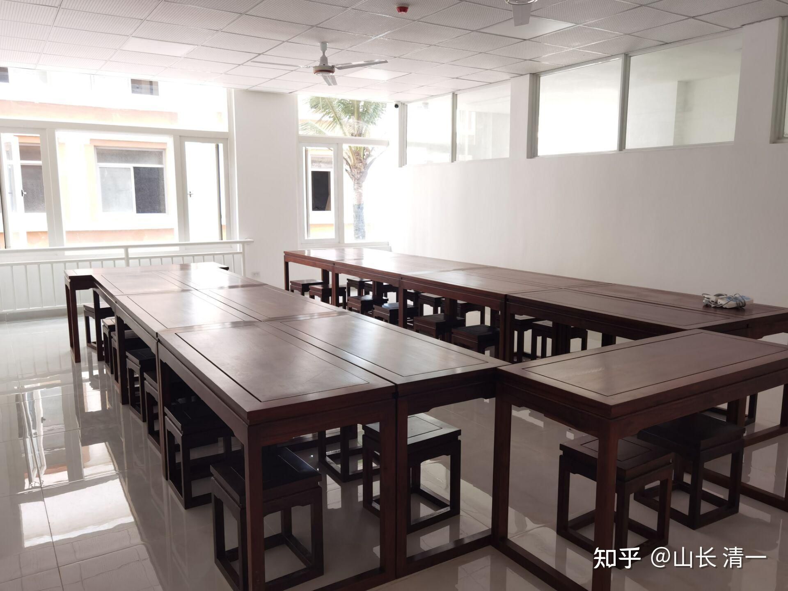
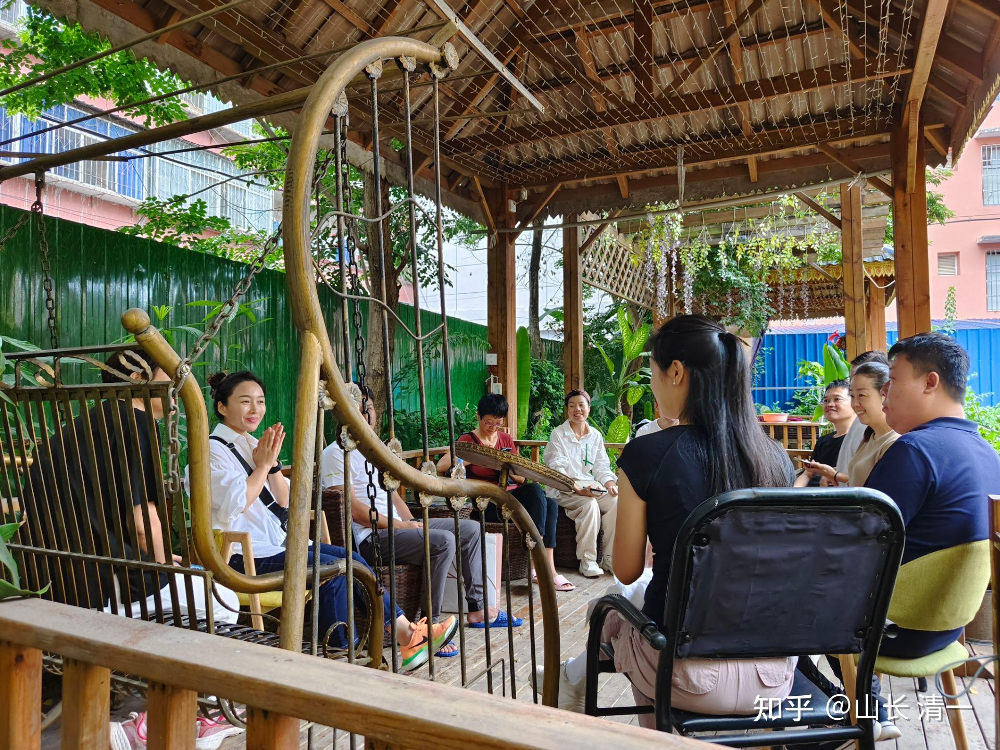

从理论上，我一直认为：任何国家的12年体制教育的课程，都可以在三年之内完成。也有个别人去尝试过特别学习方式，的确是成功的，有结果的。只是----全世界范围内，从来没有一个任何一所学校，任何一个班级，敢于集体去尝试这种教学方式。也没有成建制的教学方案和安排，没有整个班级，学生们一起去成功挑战K12的历史。

[这就是今日学堂：把普通人培养成天才的中国第一学校！（海外版）_哔哩哔哩_bilibili](http://link.zhihu.com/?target=https%3A//www.bilibili.com/video/BV19K411g7tp/%3Fspm_id_from%3D333.788.recommend_more_video.3)

很多家长，依然不相信：怎么可能，这么简单3年就学完12年的课程？全世界这么多的教育专家，难道就是吃素的吗？这么简单的事情都不懂？全世界都在等你一个退休老头来研究基础教育创新？

就算已经有个别案例出现了。家长们也会认为---这种超出正常的成绩，只是少数天才，才能做到的，我们的孩子是普通人，肯定做不到！

真是奴性太强了。人类已经被工业化体制教育，训化了上百年。忘记了自己具有更大的本领！可以用更短的时间来完成原来的学业要求！

于是，为了给中国人一个示范，我计划第一个吃螃蟹！今日国际学校，决定成建制地专门举办针对性的班级，把三年学完十二年，作为教学目标来完成。很多家长和学生，也很支持我们的尝试。大家一起愿意用三年时间来检验自己和挑战这一世界记录！

[今日国际学校的个人空间-今日国际学校个人主页-哔哩哔哩视频](http://link.zhihu.com/?target=https%3A//space.bilibili.com/487498588/)

而且---为了防止一些“假装不明真相”的挑剔者，在我们拿出最终的教学结果后，却去恶意猜测，攻击我们做出来的成绩是“作假的”，偏要说我们是拿学习很久的人，甚至是外国留学的学生，来冒充三年学习12年的本土学生（毕竟，现在中国的骗子的确太多了———），我们就利用网络时代的优势，对这个班的学生学习情况，学习进度等，放在网上，一切透明直播。连续三年坚持下来，我们一直在不断直播孩子们的整个的学习过程，让外界更加直观地了解学生的进步情况，真实地反应学生的学习水平和学习状态。相信我们的，就跟随一起学习，一样能取得不俗的学习成果。

今年6月份，就是我们提前承诺的【三年学完12年】到期验收的日子（2020年9月开学，连续经历了6个学期，今年6月30日结束第六学期）。示范班其实是2022年9月份，才开始真正学习K12课程的，之前两年，其实是要补习英语基础。第三年，才开始系统学习可汗学院等课程，全方位学习K12。如果严格一点说，可以吹我们可以【一年学完K12]----完成语言基础的情况下才开始学习具体K12课程。毕竟我们是外国人，外语基础需要先补上才能学习原版教材。一旦我们培养的学生语言过关，达到母语国家的学生水准，我们还真的，只需要一年就可以学完K12了！这个结论，是不是比我们公开宣称的结果更惊人？就是怕吓人，我们才不敢说一年学完K12语数外，数理化的。

但学了K12课程，不等于通过了K12，达到了K12的毕业要求。就像学了拳术，自己吹牛厉害，表演厉害，但是不算真功夫。必须通过严格的社会检验标准才算！因此---我们的学生，学习三年后，对于是否达到了K12的毕业要求，要去拿国际权威机构的考试，用成绩来检验我们的教育成色！不能自己吹牛的！

只要通过国际通用的高中毕业资格考试，就能够完全证明这些学了三年的学生们，是否真的达到了国际高中毕业的水平。---最终的成绩，证明我们的学生取得了优等毕业生的成绩水平。远远超过美国高中毕业的平均水平。不仅仅是通过而已！

美国很早就有了这个检验的标准。美国在全世界设立了1200个考试中心，对全世界完成了K12和高中教育的学生，进行高中学业成绩资格考试检验---GED考试。凡是通过该考试，拿到合格成绩的学生，就有该机构发给学生一张【美国高中毕业资格证书】。认定持有者是具有美国高中毕业的水平，可以享受与正规学校毕业的高中毕业生完全一样的升学，就业的待遇资格。这是美国由于比较开放，很多人因为各种原因，而无法在学校学习。为了对这些人的学业水平进行检验。美国为此特别开办的一种国际性质的考试项目。帮助这些使用各种“特殊学习”方式，获得有效成绩，通过考试者，就能拿到基本上是全球认可的【美国高中毕业资格证书】！毕竟---美国常年有200万学生在家上学。还有很多学生中途辍学工作等。这些人，就可以在不回学校上学的情况下，完成必要的学业资格证明！通过这个考试，任何人都获得到在正规学校学习的学生完全一样的学业资格认证和考试认证！而且不限制参与者的国籍----这就是GED考试。目前，对中国人来说，很多人还不知道这个考试。更不知道---拥有这个考试通过的证书后，你就获得了世界范围内的“高中毕业文凭”。就不用去担心学籍问题了，更不用去跟什么普通的中小学从小挂学籍跟学，或者跟教育局的官员们去找关系，卷什么学籍，学位，文凭，结业证书等等了！也不被这些教育利益集团控制和使用了。拿了这个美国高中文凭，虽然现在在就业上，并没有啥优势（高中毕业能找啥好工作？）。但该证书，已经足够让你可以有资格证明自己拥有高中毕业身份，你是有资格申请入读世界上很多优质大学的。即使是不接受GED证书的大学，只要你通过一个跳板---比如上泰国知名大学，你可以以在校大学生的身份，申请进入全世界几乎所有的大学---少数不认GED考试的大学，也肯定认这些接受GED考试入学资格的世界知名大学的学生资格身份！

下面是今日国际学校首届【三年学完12年】示范班的考试成绩 （两个班学生的成绩比较）。远远超过美国人的平均水平。

今日塾示范班的GED考试成绩，最高分的两名学生取得了746，742的好成绩。最低分的两名同学是594和581分。也就是说---即使是班级最后一名的分数，也完全达到了GED的毕业水准。全班平均分是667.5分！远远超过GED的高中毕业合格要求。

作为对照比较的清一塾特战班，最高分的两名学生成绩分别是：735，721分。虽然没有超过示范班，但差距也不大。最低分的两名清一塾学生的成绩分别是：566分，515分。全班平均分657.7分。两个班级共44人参与教学实验，全部也就两个学生没有达到GED的毕业证书要求。也就是说----其他的所有学生，虽然年龄仅仅14岁左右，但全都可以达到了美国高中毕业的要求，获得正式的【美国高中毕业证书】。不过---遗憾的是，这个证书不设年龄的上限，你60岁都可以去考。但设置得有下限----不到16岁的学生，不能正式去考试，不能拿证书，只能参加模拟考试。 我们就只能等孩子们到了16岁以后，去拿官考证书。但不是我们水平不够。由于考试难度更大的SAT（美国高考），就不设考试年龄限制，已经有这两个班级的学生，去国外考试，并拿到了超过1400分的好成绩。但我们并不鼓励学生在15岁之前就去卷考试，因此不支持现在去考SAT。内部要求必须15岁以上，才能去参加SAT考试，并拿到官方考试成绩用于升学使用！

各位想了解GED考试，可以看这些介绍！

[GED国际高中文凭适合哪些学生~](http://link.zhihu.com/?target=https%3A//baijiahao.baidu.com/s%3Fid%3D1605504405650196553)[美国GED考试辅导机构（美国GED考试全讲解）_考而思•惟世](http://link.zhihu.com/?target=https%3A//www.wsszzx.com/new/3558.html)

今日示范班，已经在全世界的眼睛下面，连续示范了三年，学完12年K12课程的任务。证明：体制教育的课程真心不难，只要认真学习，真的三年就学完了！

剩下的时间干啥呢？现在平均年龄才14岁的学生，总不能傻乎乎的去考试，上大学，争取早日当工具人吧？现在学完了K12工具人的基础教育，我们总要开始学一些有价值的内容了。

因此，今日示范班的带班教师和学生们决定：第四年的教育示范活动，将继续示范新教育的魅力：从第四年，开始，我们不再卷考试，不再学培养工具人的教材课程。我们会学习一些对一生更有价值的东西。比如演讲，辩论，写作，社交等。

从2023年9月份开始，示范班将深度学习【演讲与口才】。学生们将以总统演讲，总统辩论，以及名人的大学演讲为模仿和学习的对象，让自己成为具有“总统范”的人，拥有“总统气质”。我们不再学习英语和课程。我们使用英语来提高英语水平。在“总统模仿秀”表现比较好的学生，我们会把他们的视频放出来，供大家判断---像不像原版模仿！（肤色肯定就学不来了）。

我们还要学习深度的论文写作。强化科技阅读和学术词汇的学习。因此，我们也会同步进行阅读强化活动。把一些科普文章缩写后放出来，供大家更加节省时间的去获得更大容量的信息。简单地说，我们要学习【罗辑思维】的方式，把一本原版的英文作品，要用6分钟的时间来提炼出核心内容，并演讲给读者接受信息。而且是完全的英文版。这对学生们的学术英语水平的提高是很重要的。这项训练。也有助于学生在考上名牌大学后，取得学业上的优胜地位。比国内的科举考试训练，更能够体现思维教育的优势！

另外：2024年，示范班多数学生就满15岁了。由于今日国际高中的入学标准，是按照世界TOP100的大学入学标准来要求的。学生们将去考美国高考SAT，必须取得1400分以上的成绩才有可能被录取。但我们不想去让学生卷考试。而且对我们来说，1400分以上的成绩是很容易的。因此----我们的安排，是2024年第八学期的最后两个月，老师才带领学生去备考SAT。之前的学习安排，都依然只学习最有价值的，对学生一生都很重要的能力和素质教育，核心思维提升的教学内容！

欢迎大家更多地了解新教育！当心---不学新教育，你的孩子将浪费大量宝贵的生命，去卷一些垃圾课程。而你孩子的对手，却轻松地越过高点，取得学业和职场上的全面优势！家长们要学会帮助孩子，去发现更新，更美好的教育道路。而不是放弃思维，跟随大众走几百年前的老路。这样太傻了！

*精致的老挝红木书桌*

*小公主负责主持的户外学员讨论课*