下面照片，是小公主们与南塔省教育局副厅长交流。主要讨论怎样帮助老挝的学生来今日国际学校学习的问题。老挝官员很友好，小公主们反馈与跟国内的官员不一样。比较亲民！他对我们学校和小公主们的表现非常的欣赏，说他会推荐最优秀的学生来今日国际学校上学。

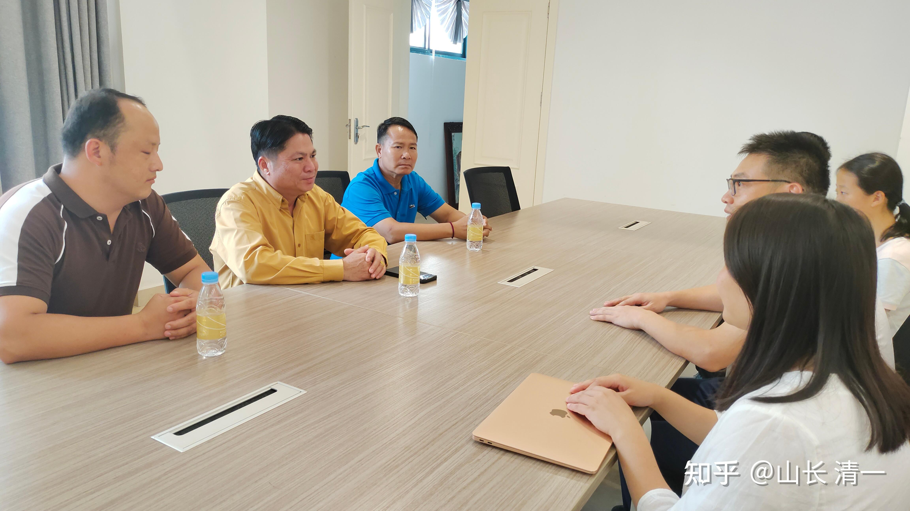

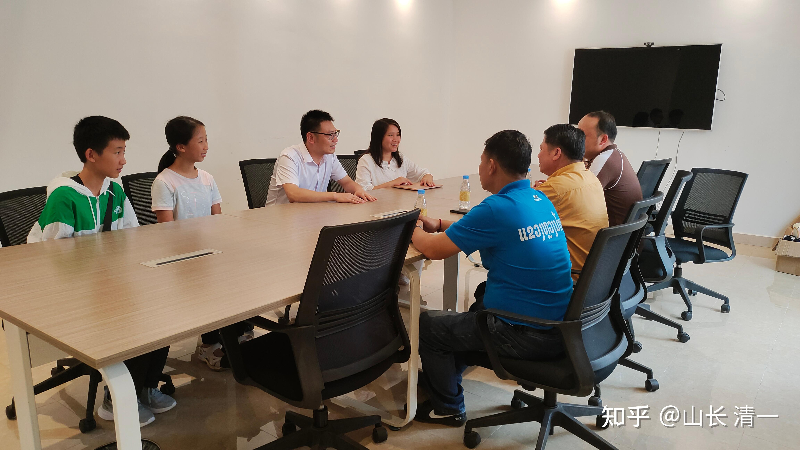

小助教与学员一起在学校的教室内，一起讨论当日的课程内容。

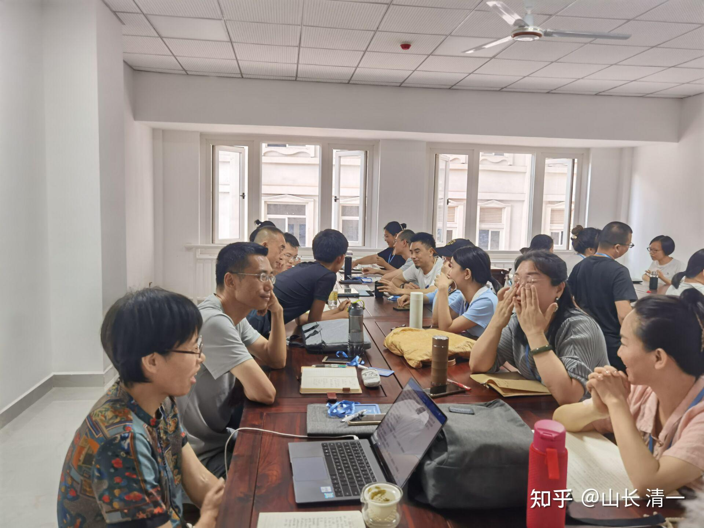

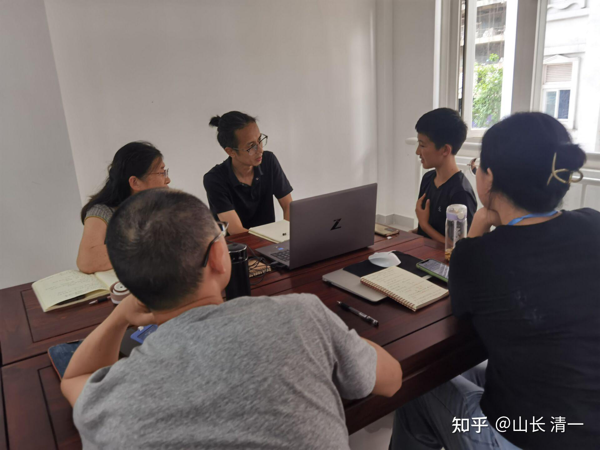

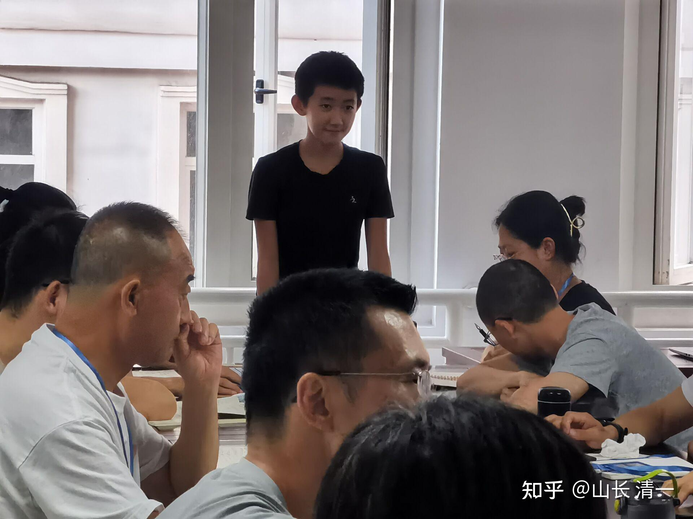

*第一次做小助教的M。有点不够放松*

蔡助理拍的傍晚的磨丁城区风景，像是P过的照片一样

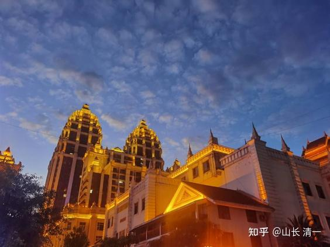

*磨丁城的灯光初现*

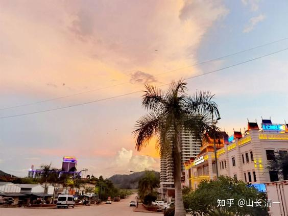

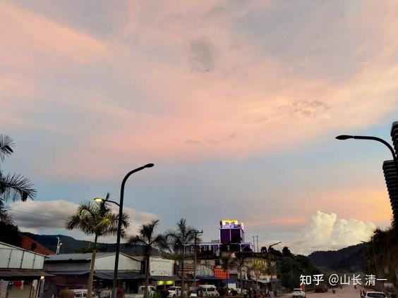

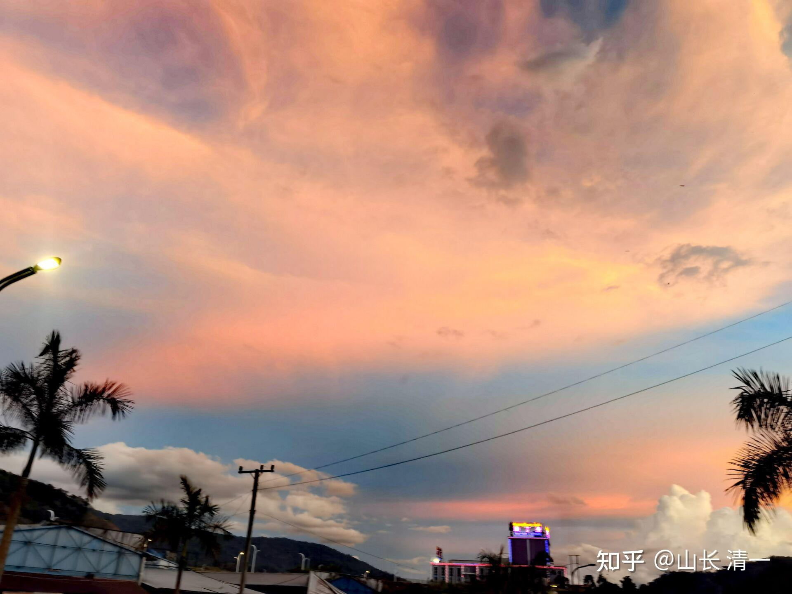

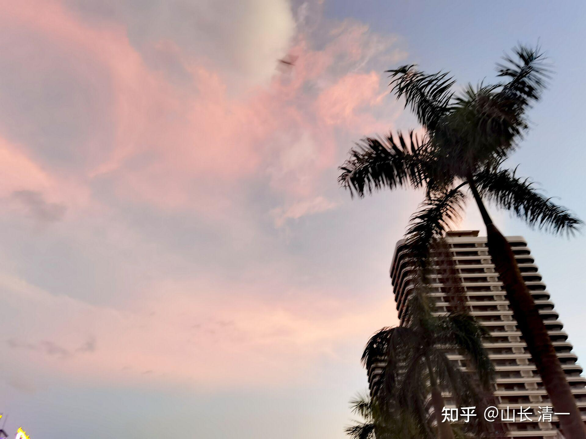

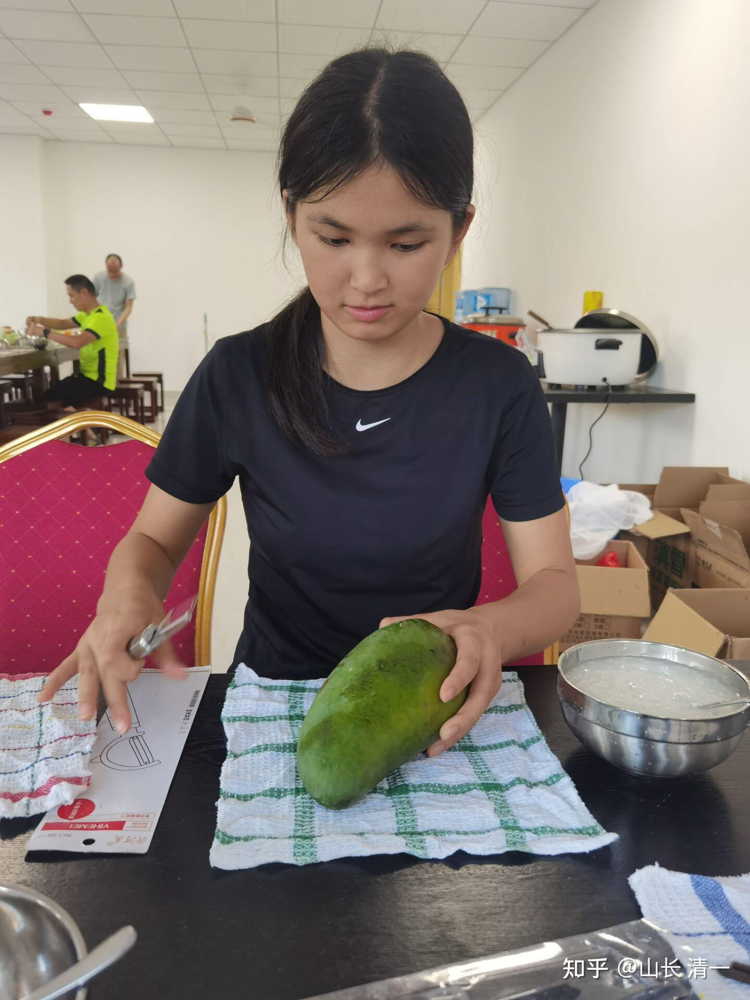

*公主自助餐：芒果配稀饭。营养又健康*