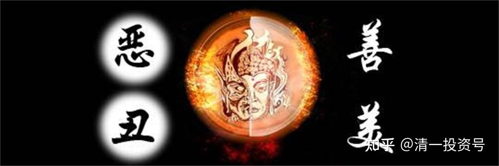

42篇.老子股经（二）——强分违背天性

清一山长 2007年4月22日

王弼版原文：天下皆知美之为美，斯恶已；皆知善之为善，斯不善已。故有无相生，难易相成，长短相较，高下相倾，音声相和，前后相随。是以圣人处无为之事，行不言之教；万物作焉而不辞，生而不有，为而不恃，功成而弗居。夫唯弗居，是以不去。

帛书版原文：天下皆知美，为美恶已；皆知善，斯不善矣。有无之相，生也，难易之相，成也，长短之相，形也，高下之相，盈也，音声之相，和也，先后之相，随。恒也。是以圣人居无为之事，行不言之教。万物作而弗始也，为而弗恃也，成功而弗居也。夫唯弗居，是以弗去。

**一、强分概念，违背天性**

老子不分真善美。他没说“真”，反正不分“善美”。他为什么不分？因为老子不认为有这样的东西！他说，你可以去分一下，分分好玩可以，但它并不是真的存在，它是不存在的。就像“有”和“无”，他认为是不存在的。既然不存在，怎么去分？既然“有和无”不存在，那么“美和善”当然也不存在。

“美和善”是什么？是评价。中国古代说“沉鱼落雁”，我们都认为这是形容一个女子很漂亮，是吧？但原文没说她漂亮，原文是说：西施呀，我们认为她美，但鱼一看到她就会说，“好奇怪啊！好难看的人！”“咚”，吓得跑了（众笑）；天上大雁看到那么丑的一个人，“哇，哪有这么丑的人！”“咚”，掉下来了（众笑）。那叫晕倒，是吧？它们没觉得她们美。也就是说，**我们认为美，别人可能认为不美**，对吗？

在老子看来，**“善”跟“不善”只是一对概念而已。这对概念不一定是真的，是你强分出来的。既然是你强分的，所以它就没有必要**。那么，我们这个社会做的事情是不是跟老子是相反的概念？我们的社会就叫强分美善。

**强分美丑就违背了天性，违背了自然之性**。老子强调“道法自然”，强分美丑显然是老子不支持的，所以千万不要把这一章看成老子推崇美、推崇善。

“有无相生，难易相成，长短相形，高下相盈，音声相和，前后相随。是以圣人处无为之事，行不言之教”，这也说明了这个道理。老子已经告诉你不可强分，既然不可强分，为什么还分了那么多有无、难易……其实，这些也不是要分开的，老子说这些是“看你怎么说”。既然“看你怎么说”，说不清楚的话“我就不说了，我就不要去分那么多东西”，这叫“处无为之事，行不言之教”。分那么多东西，强行推崇这个、推崇那个，整个社会都被搞乱了。

**二、强分美丑，追求畸形**

就像现在的女孩子，每个人都知道什么叫“美”，然后通通一窝蜂去选美，那可麻烦啦！美容院每年几十亿的产值就是这样起来的。这些人有钱，就在广告上推来推去，这个叫美啊，那个叫美啊，这个叫健啊，那个叫健啊！抽脂、吸脂，再往身上注射肉毒素。这些东西都是剧毒之王啊！往你身上搞，稍微多一点的话人就会死的。美容都是用这些怪玩意的。

你们知不知道什么是肉毒素？我们大户室里有两个女的就干过这事。眼睛注射肉毒素！眼睛原来是耷拉着的，然后把它一割，肉毒素一搞，“啪”起来了，看起来好精神的样子。还有人脸上有皱纹，就去注射肉毒素。肉毒素很快就把皮肤毒死了，毒死了之后，新皮就赶快长出来弥补它，所以看起来好精神，变年轻啦！肉毒素就是尸毒啊！你把一块肉放在那儿放得臭了、烂了，一塌糊涂、臭得要死的时候，里面就含有很多肉毒素了，拿这东西往脸上打进去，美容喔！

**为什么有这样的东西存在？因为我们强分了美丑**。这个社会搞那些选美活动，不就是搞这样的事情吗？选啊选啊，这叫美女，大家都向她学吧！所以，**这是经济产物下的一个畸形的东西，这种畸形的东西让很多人去追随。当很多人去做时，这个社会的心态就会变化。变了之后并不是说有什么好处，只是对某些人的腰包有好处，对当事人没好处**。你以为对那些天天去臭美的人有好处？

**三、强分失根，难得智慧**

我住的那个地方，有个四五十岁的半老太婆喜欢穿淑女屋的服装。淑女屋是十几、二十来岁的女孩喜欢穿的。她喜欢打扮得清纯可爱，我每次都不敢看她，脸上抹得像什么似的，说实话看得有点恶心。这些女人，她们打扮是想吸引男人，想给男人看，怎么不问问男人的想法是什么？很奇怪的！很多女人自以为是地搞一些怪七怪八的东西出来，自以为很好看。**这些都是很蠢的行为，因为她心中有一个美的标准：年轻叫美，把脸上涂得乱七八糟的叫美**。

所以，**强分这种标准出来让她的心不再安宁。这些人普遍有一个特点，就是有焦虑症**。我觉得也有一些神经病，经常关心莫名其妙的东西，而且不知道在搞什么。

比如说炒股吧，我告诉她买武钢，那伙计买了之后赚了两分钱就“嘣”跑掉了。当时2.50元，到2.52元她就把它卖掉了，现在涨到了10.5元左右，估计还有向11元冲的劲头。好了，这个事情她是这样，别的所有事情她都这样。我当时买江淮汽车，3.4元买的，现在正向11元冲击。她也买了，也是赚了几分钱、一毛钱“嘣”就跑掉了。

这就叫焦虑，整天不知道在干吗。她又要整天待在股市里面去，又要说“我无法承受风险，哎呀，跌一分钱我都受不了”，天天在说这样的话。**她以为她是谁啊！买进去就涨停？！这种人就是典型的心理已经完全被破坏了**，已经没用了，而且还蛮恶心，经常做一些莫名其妙、神经质的事情来。

这种情况就意味着：**强分这些东西，强行去分好和坏，强行去分风险不风险、利润不利润、赚钱不赚钱……强行去分这些东西的时候，把它分得太清楚，反而失去了本根，得不到智慧**。

**四、强分赚赔，必出问题**

这对炒股都有帮助。**炒股的时候，你要不要去强分赚还是赔呢？其实很多人不一样，很多时候其实是买赔，他知道买了之后可能会下跌，但他还是会买。为什么？因为他认为他买的是趋势，趋势不应该赔，现在暂时赔，赔一点，他根本看都不看，更不在意**。

就在前几天，我看我的账户，跳水一样“唰唰唰”直往下跳，要不要惊慌失措逃跑？**周围人全在逃跑，我不逃跑，反而把一大笔资金“唰”地买进去，以很低的价格买进去。当时买进去，是不是我认为它要涨？我根本不知道它会不会涨，我只认为这个价格绝对没问题，我看出了它各种各样的迹象**。

那天如果大家看报纸就知道，上星期四有个今年以来的第二次最大的跌幅，非常大，很多股票差不多要跌停，我的也差不多要跌停。但是我看出这是一次假象，根本不担心，我买了就准备它下跌。结果出了一个笑话，我买了之后突然涨回来了，结果那天我不但没损失钱还赚了钱，还额外多赚了10万，笑话吧？但是周围的很多人都损失了，特别在下跌过程中就怕，拼命地跑。

那就代表什么状态呢？**我不是去看赚和赔，而是根据我心中道的准则，符合商道的、符合投资者的准则去做。根据这个准则去做，我没有什么好担心的，就是套了我也认了，我也觉得很正常**。

没想到，我这样选择的结果是迅速地上涨。星期四当天损失几十万，然后回来几十万，不但没损失，其实我还多赚了十万。到了第二天，我买的股票涨停，大仓“哗”一下上去了。

这些东西就很奇怪，但是在这个奇怪当中，**如果你强分喜怒哀乐，你就完全被它所控制。你被它所控制，你就是世界上最可怜的一群人**。

我再告诉大家一个笑话，同样是这个股，当天就有20%的震幅，第二天又涨停，30%的空间就没了。跟我一个大户室的，他也买了这个股，看着“哗”往下跌，一紧张，全部卖掉。第二天看着跳空上涨，又赶快追进。这一天之内我得了20%的好处，他呢？他也得了好处，得了5%，但是头一天跌的时候他把它卖出去了，损失了很多，所以最后他的账户并没有增加，有可能还减少了。

这叫不叫笑话？这就叫笑话。**一个人不明白这些基本道理，只是被情绪所支配，强行地分这些东西的时候，可能就会出现很多问题**。

**参考链接：**

[38篇.持而盈之，不如其已；揣而锐之，不可长保（上）](https://zhuanlan.zhihu.com/p/641031041)

[40篇.持而盈之，不如其已；揣而锐之，不可长保（下）](https://zhuanlan.zhihu.com/p/642329173)

