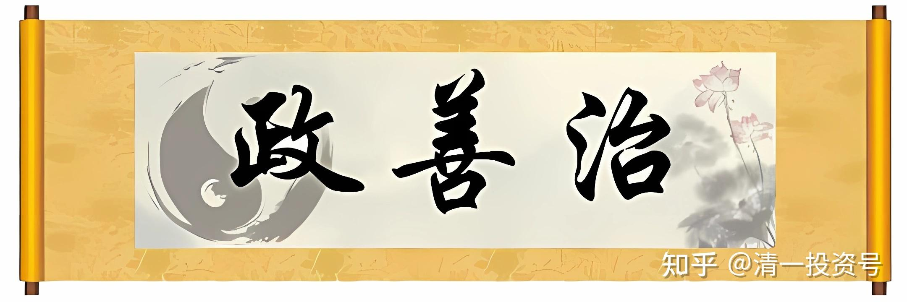

44篇.老子股经（三）——善于管理、治理

清一山长 2007年6月3日

王弼版原文：上善若水。水善利万物而不争，处众人之所恶，故几于道。居善地，心善渊，与善仁，言善信，正善治，事善能，动善时。夫唯不争，故无尤。

帛书版原文：上善似水。水善利万物而有静；居众人之所恶，故几于道矣。居善地，心善渊，予善信，政善治，事善能，动善时。夫唯不争，故无尤。

**一、股市政策的影响**

“政善治”。这句话也是一个学科的来历，“政治”就来源于这儿。什么叫“政治”？政治学，“政”要善于治理，要有条理，为政最怕没条理。

最近股市大跌，就是咱们为政有问题。上个星期传言印花税要调整，结果股市跌了一下。跌了以后，财政部鳏缘马上出来辟谣，说“我们没有这个计划，没听说要调整的问题”。别人一看国家没有这个计划，就连涨两天。

到了5月29日晚上凌晨12点钟，财政部在网上突然公布消息，从5月30日起，股票交易税上调3倍。这个消息导致了很多股票到今天为止三天跌停。最近几天中国证券市场的财富，第一天就损失了1.2万亿，到今天为止损失了2.9万亿。惨不惨？

据说北京、上海的人在游行啊！很多股民的市值一下子就垮下去了！我就看到周围有几个人的账户损失惨重。我还知道一个私募基金经理，最近在这个消息的打击之下，他自己一个人管理的基金每天损失一千多万，连续损失了三天，大概损失了四五千万。严不严重？这就是“政善治”在咱们中国的体现。

不过，我觉得ZF这样做有它的道理，这是玩谋略、玩诡计。但这个诡计对于小老百姓其实损害不大。你说它没损害？绝对有损害。真正损害最大的是大东家，他们这次措不及防，包括我观察到好多地方的大东家被套，惨重被套，损失以亿为单位。

所以，国家有国家的考虑，就是要套中套。套住最大的是谁呢？肯定是大东家，当然小百姓也套。小百姓损失两万块钱，大东家可能损失两个亿，反正是2.9万亿财富就丢掉了。“万亿”是什么概念呢？大概一万亿的话，用一百块钱的人民币一张一张地连起来，可以绕地球一圈，这就是“万亿”。你们自己算吧！三天就损失了这么多，绕地球几圈的人民币财富没了。

学生15：本来这些东西都是虚的、抬起来的东西，泡沫涨起来，现在一下子没了。

张老师：对啊！虚以控实。不过，幸亏我把晓莉的东西都变成实的了。晓莉的钱实实在在地躺在账户上面，把原来高点的财务给她保住了。

这就是“政善治”。在中国，ZF不守信用造成了损失。有人说亏就亏吧，赔就赔吧，但是撒个谎，ZF的公信力就大受打击。这就是现在闹得最凶的一点。闹得最凶会导致什么结果？不知道，我们就观察后事吧。

**二、为政之道**

“政善治”，我们不说水，我们说人，我把它理解为道家的人格理想。当一个道家的人物要求“政善治”的时候，比如在座各位将来做了领导，“政善治”就是要求你们做事要很有条理，而且还要“言善信”，这样你们就会变成一个很好的领导。当然，要做到有条理不容易。

我最怕跟当官的打交道，为什么？当官的最没条理，他们脑子里面不知道在想什么东西。而且当官的会干一些很笨很笨的事情，笨到我简直目瞪口呆。你别以为他们聪明，其实不聪明，他们就喜欢在那里和稀泥。和稀泥的功夫天下第一，但是让他们去做事，很多人根本都做不成。有少数当官的是精英，他们可能升得很高，但是很多精英都跑掉了。

比如，我曾经跟省ZF做过一单生意，营业额是12000元。生意大不大？不大吧！这么小的一桩生意，每次都是叫我去讨论什么安排呀、合同呀，搞来搞去。每次去都请我吃饭，我都吃得烦了。还找一大堆人来陪我，其实可能是我在陪他们！我就这样想。搞了一个星期还搞不定，后来我受不了了，我找到助手，让他们下次去搞这个东西去。

这桩生意花了一两个月的时间才做完，从开始谈到安装完一套音响，到最后付款完全搞定，跑了N次。这就是我们省ZF的效率。后来我就特别怕和他们做生意，不赚也罢，赚了也赚得不舒服，他们还觉得对你蛮好的。

（标题、图片为编者所加)

**参考链接：**

[38篇.](https://zhuanlan.zhihu.com/p/641031041)[老子股经（一）](https://zhuanlan.zhihu.com/p/644751640)[持而盈之，不如其已；揣而锐之，不可长保（上）](https://zhuanlan.zhihu.com/p/641031041)

[40篇.老子股经（一）持而盈之，不如其已；揣而锐之，不可长保（下）](https://zhuanlan.zhihu.com/p/642329173)

[42篇.老子股经（二）——强分违背天性](https://zhuanlan.zhihu.com/p/643941532)

[46篇.老子股经（四）——“无为”的智慧](https://zhuanlan.zhihu.com/p/646940810)

[48篇.老子股经（五）——无之以为用](https://zhuanlan.zhihu.com/p/648281618)

[59篇.老子股经（六）——炒股炒的是“阴阳”](https://zhuanlan.zhihu.com/p/677787344)

