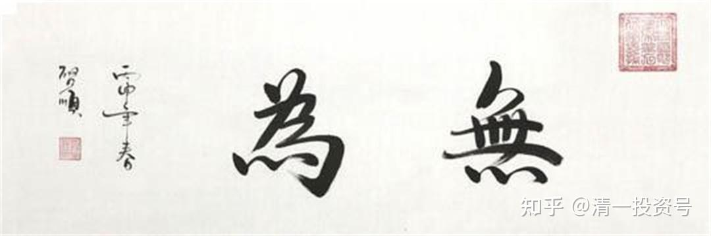

46篇.老子股经（四）——“无为”的智慧

清一山长 2007年6月10日

**一、不该动的时候就不动**

王弼版原文：载营魄抱一，能无离乎？专气致柔，能婴儿乎？涤除玄览，能无疵乎？爱民治国，能无为乎？天门开阖，能为雌乎？明白四达，能无知乎？生之，畜之，生而不有，为而不恃，长而不宰，是谓玄德。

帛书版原文：戴营魄抱一，能毋离乎？抟气至柔，能婴儿乎？涤除玄鉴，能毋疵乎？爱民活国，能毋以智乎？天门启阖，能为雌乎？明白四达，能毋以知乎？生之畜之，生而弗有，长而弗宰也，是谓玄德。

最后回过头来再讲“爱民治国，能无为乎”，我认为这应该是第十章的最后一句话才是对的。

这句话的核心就是“无为”这两个字。**“无为”，指的是一种很高的修为，不是代表你不做事，而是知道什么时候该做、什么时候不该做，而且人生中你需要做的时候是很少的**。

中国古人说了个笑话，是道家说的笑话。有个人得了一张天下无双的良弓，他觉得这个弓实在太好了，然后怎么样呢？他就专门请人在上面雕了个行猎图，雕完之后觉得“哎呀，十全十美，已经到了高级的地步”，结果一拉，“嘣”，断了。

道家人就是这样想的：弓的功能就是拿来射箭的，它不是拿给你看的，不是拿给你去雕个图。要雕图，那就不要拿去射箭呗，就摆在那儿，你看我的弓多漂亮！也好。但你把它雕完了之后又拿去射箭，那它只好断了，多可怜啊！这就叫背离本质，忘了“质”和“用”的关系。

大家了解了就会发现，道家的智慧真的很有价值、很有意思。你看，那张弓，你要不要雕一点花的东西？雕，就叫有为；不雕，就叫无为。我知道什么时候不去做这样的事情，这叫不叫智慧？

**像买股票的时候，知道什么时候不去买和卖，是需要大智慧的**。说起来简单，涨了把它卖掉，跌了把它买进，简单吧？但你做不到啊！**比如这个股，十块钱买的，涨到十一块钱了，你卖不卖？**（学生回答：看情况）对，聪明，学会了道家的东西——**看情况。如果涨到十一块有可能要往下掉，你就得卖；如果要涨到二十块，你卖不卖？**

我曾经买过一个股，两块钱买的，涨到三块七，我把它卖掉了，结果它最高涨到一百块钱，你说我蠢不蠢？那个时候我就不知道啊！那个时候，我有为好，还是无为好？无为啊，**不该动的时候我就不动**，对不对？等它涨到一百块钱的时候我再动，好不好？这个东西难不难？难极了！这就叫“无为”。太难了！

如果跌，跌到多少钱买？**十块钱买的，跌到九块钱你要不要买？不知道，你得观察，这就叫你要自认为自己无知**。

我经常说的话就叫“不知道，看情况”，别人会说你这人好无知哦！你这人好笨哦！明明说不知道的人，自己说，哎，该买了，该卖了，这就叫聪明，这就叫有知。别人有知，说自己不知道，所以看起来笨笨的样子：“我不知道，我还得研究，研究到一定地步，这个时候我该动了。”包括这次大跌当中有些人逃掉了，过两天他又杀进去了，一下又跌了30%，你说他损失大不大？他说好冤啊，还不如等到最后！但是，怎么知道什么是最后呢？这就需要大智慧。

所以请大家注意，不要嘲笑老子，“无为”是大智慧，不是一般人做得到的。**不是不动，是该动就动，不该动就不动。该不卖我就死不卖，我在那等着，笨笨的**。但很多中国人不会，中国人的古传统教育失传了。

我发现有些人在股市里面很认真地折腾来折腾去，一天要弄好几个来回才会舒服。有一个人特别好玩，这人大概只有50万的资金，在大股市里面算很少的资金，但是一年可以做几个亿的营业额，大吧？天天在那买进、卖出，买卖个不停的。这种人就叫“有为”。但是，“有为”的结果是什么呢？他永远赚不了很多钱。他很聪明啊，非常聪明，**他的这种智慧如果真用对了地方会赚很多钱的。但是他太聪明了，天天在那有为，结果反而没有什么实际的收入**。

**二、相似的状态如何判断**

清一山长 2007年4月22日

学生16：张老师，儒家提倡“忠孝礼义”之类的，这样是不是太“有为”了一点？

张老师：儒家跟道家不一样。按照儒家的观点，孝和不孝，有时候很不好说的。儒家是中人之资，所以它会特别强调分得很明白。但这种明白，像“二十四孝”，在我看来完全是瞎扯蛋，这是我个人的观点。但是，对于大众来说还是有效的。

我们就用“王祥卧冰求鲤”这个故事来说吧。王祥躺到冰上去，把冰融化了，鲤鱼跳出来了，就拿回去给他亲人吃。我们再想想，以父母的观点而言，如果父母真有一颗慈父之心、慈母之心，儿子睡到冰上去，如果他把身体冻坏了，甚至他冻死了，然后父母伤心。如果儿子用这种方式让父母伤心，那他是孝还是不孝？

道家就比儒家多几个脑子，他就想想，这样好像是不孝。你们仔细想过没有？所以，孝就是不孝。王祥卧冰，很可能是不孝。这是很极端的例子。但是，儒家就会从一个思维去把它发挥到极致，还把它广为传扬，这正好反映出儒家的人没有道家的人聪明。而道家的人能看到现在，还能看到将来，看得很远很远，需要有很多思维才能观察到结局。

所以各位，希望大家真的学会道家，实在学不会，做儒家也行，死板点，但也是个好人。但是，如果真的学不会，还是得承认学不会，因为叫他转思维角度，他怎么都转不出来。比如“王祥卧冰”，我很轻松就可以转出另外一个角度，我还可以转另外一个角度，对我来说毫不费劲，但有的人就死都转不过来。拿王祥来说，为什么卧冰是不对的？有的人发傻，想不出来，因为他转不过来。其实，转不过来是常态。但如果你转不过来，很多事情你就不能去做，你不要去做一些比较大的事情，也不要去做一些风险很大的事情。

比如股市上，为什么很多人炒股会犯错误？他看了一本书，书上告诉他这种状态是什么状态，他就对着去做。当时在股市上恰好就是这种状态，比如**庄家进货跟庄家出货，状态就非常像，盘面上几乎一样。所以，进就是出，出就是进，用《老子》来理解很正常。那么，到底是出还是进呢？你就要用别的指标来理解了**。比如说，时间、空间、距离、位置，你把它们结合在一起，你就会判断得很清楚。如果你不结合呢——“哎，他在进货呀”，结果别人在出货；“哎，他在出货呀”，其实别人在进货。

这里你们听不太懂，但是有一点点小经验的人就知道这很难的。所以有时候我坐在那就想，他是出呢还是进呢？因为看着都像一样的行为，很像。包括这一次为什么我逮到一匹大黑马一下子短期之内赚了很多钱，原因就是我看得出，在别人认为他是在出的时候，我认为他真正的目标是在进。他为什么进我不知道，但是我认为他的心情很急迫，那么这时候就果断介入。这很简单，但在别人看来，觉得很不可思议。这里面就需要道家的智慧。我希望将来各位当中也能出几个这样的厉害角色，去跟外国人斗一斗。

**参考链接：**

[38篇.持而盈之，不如其已；揣而锐之，不可长保（上）](https://zhuanlan.zhihu.com/p/641031041)

[40篇.持而盈之，不如其已；揣而锐之，不可长保（下）](https://zhuanlan.zhihu.com/p/642329173)

[42篇.老子股经（二）——强分违背天性](https://zhuanlan.zhihu.com/p/643941532)

[44篇.老子股经（三）——善于管理、治理](https://zhuanlan.zhihu.com/p/644751640)

