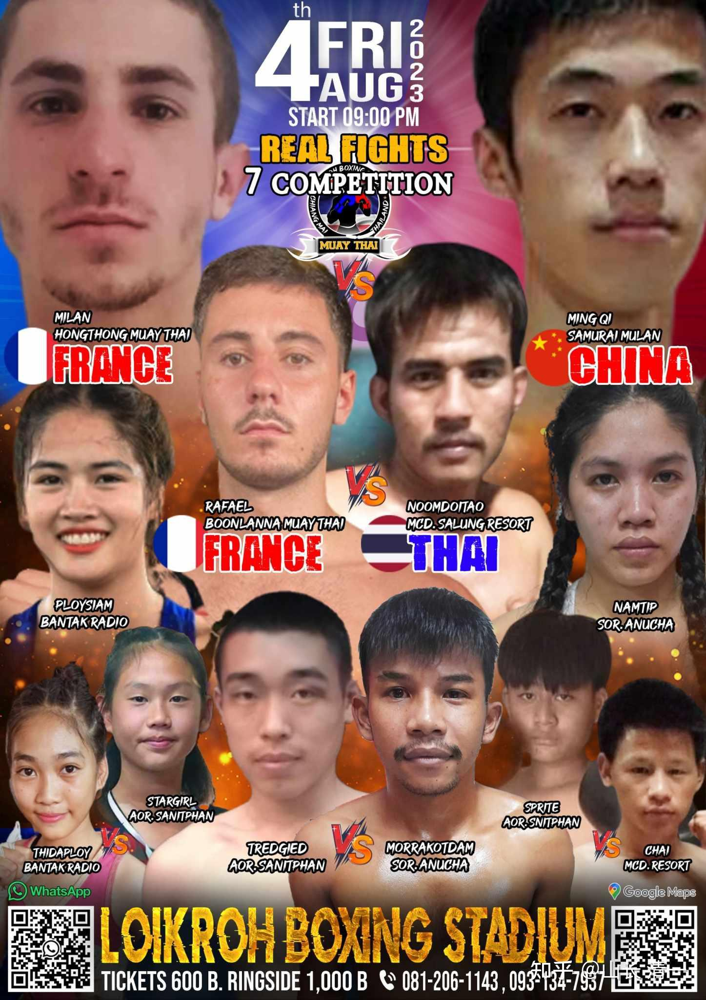

今天发布两个可能大家关心的太极征泰的消息：

第一个消息是：明天晚上，清一武士将要和法国白人拳手作战。之前木兰们已经打过英国人，爱尔兰人，菲律宾人了。但清一武士，应该还是首次与白人国家的拳手交手。法国拳手一般都更擅长拳击，这些拳手，来泰国打拳是要强化自己的腿法和内围技术的。因此我交代武士们：不要和他们拼拳。倒不是拼不赢，但我们干嘛要去在对方熟悉的圈子里面比功夫呢？不如用我方擅长、白人拳手最不擅长的腿法和内围战技术收拾他们吧。不过，为了摸清虚实，让武士第一回合就先不积极进攻，保存体力，同时探听虚实。第二回合再强力输出！

上次木兰首战英国拳手的地区冠军决赛，英国拳手刚开始趾高气扬的，满脸的看不起中国人的骄狂劲。觉得安排她来打中国拳手，是看低了她（因为国外普遍知道中国拳手不如泰国拳手）。以为是一场送金牌的轻松比赛，一开场就拿出一副凶狠的劲头，想要快速KO木兰，展示武力。但比赛中，英国人却被谭木兰狂虐一顿，打得她还不了手。输了这场志在必得的金腰带比赛，赛后她哭得一塌糊涂的。当时还说要报仇，问我们是否愿意打安排二番战复仇。我们当然答应了。但后来也不了了之，估计是没信心赢回来！这一回应战的男拳手，也来自这个英国拳手的泰拳馆，不知道是否是来“复仇”的。我们会认认真真打好比赛的！

[https://www.zhihu.com/zvideo/1605144033730478080](https://www.zhihu.com/zvideo/1605144033730478080)

*首次武士对阵法国白人拳手海报*

第二个消息就是：木兰佳慧决定暂时退役！由于她在技术和心理上，都已经进入了瓶颈期，继续再打比赛，重复浪费生命，已经没有意义了。不像泰拳手，不断重复自己是一个职业，要赚出场费的。我们虽然拿的出场费比泰国拳手更高一点，但没有把打拳作为职业来看。只是作为人生发展的一个过程。佳慧退下来的规划，是要把更多时间用来学文化课程，因此将来更多是跟公主们在一起学习和练习。另外，她还愿意来做公主们的陪练，帮助小公主们获得更好的实战能力！我们会用团队的力量，未来去取得更辉煌的胜利！

当然，佳慧还不想放弃武术，希望自己学文的同时，继续坚持练传武，深化对传武的理解。正好现在的公主们练习新的太极格斗技术，与首批的木兰们使用的并不太一样，属于更新的版本。抱架的姿势，和格斗的要领，都已经做了较大的改变，技术上会更安全。对于拳法，手法上，肘膝技术上的要求会更高。但要求的训练难度也更高。一旦练出来之后，与对手对战，对手的肢体，肌肉的力量将基本上不起作用。打更大的体重拳手，甚至女生打男拳手，都不会在力量上，反应上输给男生。这样的话，公主们要实现决战男生的目标，就更有把握了。反正我们现在也不急于求成，就让公主们慢慢练。

新的太极技术，就更加“不像泰拳”了。出拳更没有泰拳的风格和影子，看起来打法更怪，站立方式也会让对手摸不著头脑。因为正面根本不暴露，让对手没有打击点，防守上更加严密。让泰国人很难用挨打后就赶快抱住我们的内围战来避免自己挨打！这样对手的一身力气就无用武之地了。因为我方是侧身对敌，正面暴露极少。如果硬要冲上来抱内围，面对的我方的肘部，膝盖，基本上是找死的！当然这种技术就不可能像泰拳和拳击一样发力和技术动作了，这是一门全世界实战格斗擂台上，都没有见过的技战术。掌握之后，未来的擂台实战中，估计腿法的使用会大量减少（目前的木兰在与泰国拳手对抗中，已经明显减少了腿法攻击，强化了拳肘的攻击，但还需要进一步提高效率），现在教的这种打法，更像传统太极一些。实战中，如果她们的太极功夫真的练出来了，也许连迎门三脚都不用了，就可以直接用手和肘膝轻松KO泰拳对手。

这种太极实战技术上的改进，其实大家应该知道---主要目的，并不是针对泰拳的。现在泰拳已经明显被我们征服，不需要更多的技术，只需要去更多熟悉练兵，强化也有技术就够用了。现在没必要再把泰拳当做老虎来打，不再是我们的假想敌，只是我们的练兵场。现在清一武道馆的主要目标，是进军西方的拳击项目---世界第一广泛的格斗运动。这也是中国在发展上非常低级，拳击上相对的世界地位很低的一个格斗运动项目。泰拳其实擅长腿法的使用，不太重视拳法。认为拳击没啥杀伤力。的确拳击职业赛，可以打12回合，都无法KO人。说明拳的攻击力的确不够强大。但泰拳往往三五个回合都会累死人，KO率还超高，多数是腿和肘膝KO的。相对拳击KO的并不多。因此，为了对付泰拳，我们也不得不练出更厉害的太极腿法，来克制泰拳的扫腿优势。昨晚清一武士也用太极腿法，再度KO了泰拳手。但我们如果要对付世界拳击高手，特别是女生要来对付实战水平，训练强度，技术战术，综合实力，都远远超过女拳手的拳击界的男拳手时候，我们去模仿采用拳击的技术，是根本没有希望击败拳击的。因为这项运动，全世界参与的人太多。技术已经非常的成熟。要打出实在的成绩来，不仅仅要刻苦练习，还非要过人的天赋不行。因此，也必须采用比征泰难度系数更高的太极技术来对付。

[https://www.zhihu.com/zvideo/1448721587410857986](https://www.zhihu.com/zvideo/1448721587410857986)

上面这个视频，是日本的格斗天才，踢拳的世界冠军那须川天心，因为自己在世界踢拳界已经没有对手，决定转战拳击界。踢拳其实拳击技术比泰拳更强调一些，播求进军踢拳，也花了很多功夫来学拳击。这个日本人也凭借过人的实战经验，在拳击比赛上击败了很多职业拳击手。因此他错误地估计了自己的拳击实力，居然想要和世界拳王一战比个高低。结果却被美国拳王梅威瑟狂虐，第一回合就被KO了。当然，梅威瑟也知道，如果用踢拳技术的话，他未必能赢。所以他两赛前就约定了---如果那须川天心敢用脚来踢他，踢一脚就要赔100万美金。所以----那须川天心只能老老实实的跟他拼拳。却发现梅威瑟的拳，比腿更重。直接打得他满地乱滚。他的女粉丝都看哭了！

这说明拳击运动，与踢拳（日本为了对付泰拳发展出来的赛事）还是有很多不一样的。我们的木兰拳手，虽然也能击败拳击手，但没有遇到顶尖的拳击手。特别是女拳手拳击上基本上没法和训练更加有素的男拳手竞争。所以，我的策略，就是目前的几个木兰和武士，继续征战泰拳。现在的公主武术小组，主要学习更新的拳肘格斗技术，用于征战新的领域---拳击项目，以及做好MMA作战的准备！

MMA这个项目很有意思的。虽然可以用腿脚攻击，用肘，用膝，但我们很难看到MMA对战中，双方有精彩的腿攻和肘膝攻击。要么是精彩一点的拳击大赛，要么是双方滚在一起的地面控制技术的比拼，观众们看半天都不知道双方在玩什么！所以场面上其实是很无聊的。因此，真正的MMA擂台比赛的实战主要技术，其实是拳头。以及地面控制技术，比如巴西柔术。为啥规则上可以用，但实战中双方却不用腿和肘膝呢？因为一用，就会被弄到在地上双方进入地面战。所以，不喜欢打地面战的拳手，MMA场上互相主要对攻的技术，居然就是----拳击比赛！而且是移动距离较远的拳击比赛（怕进入地面战）。下面这场UFC实战，就是拼拳互殴的比赛，双方都把脸打得变形了。

[【UFC冠军战】史上最佳女子比赛！张伟丽 VS 乔安娜-扬杰柴克_哔哩哔哩_bilibili](http://link.zhihu.com/?target=https%3A//www.bilibili.com/video/BV1k5411A7fW/%3Fspm_id_from%3D333.337.search-card.all.click)

看了这场比赛， 你就知道为啥现在的公主，要去专修拳斗技术了？第一批武士和木兰，为了对付泰拳腿法，迎门三脚是首要的功夫。拳斗技术只是辅助。现在要打拳击，打MMA的话，拳斗的技术必须是第一位的。其他腿法等就是辅助技术了！正好太极拳的拳斗技术含量世界第一（过去的荣耀），我认为内涵远远超过拳击。不过难度也极高。要求在对方控手的前提下再攻击，还要求贴身使用抖身技术，否则上场后就会技术失效。所以---能否在孩子们身上展现出来太极拳斗的艺术，还是一个未知数。不过我会耐心等待的，不会急于求成。等孩子们实战上能够打出来了，才会上场的。太极十年不出门，就是因为这种粘连控制的打法特别难练，不想快打快收的外外家拳直接。现在，我就算提升了训练强度，选择了更会动脑子的拳手，应该会提前一些实现太极实战的技术，但也不会简单地两三年就能上场。估计等上三五年就够击败职业拳手了，不需要10年。当然，如果遇到悟性较高的拳手，在最快的情况下，三年以内就可以出成果，公主们利用上高中的三年时间业余练习太极格斗，就可以击败职业对手。她们上大学的时候，就可以业余去打比赛，还可以代表她们的大学去参加各种世界格斗赛事！