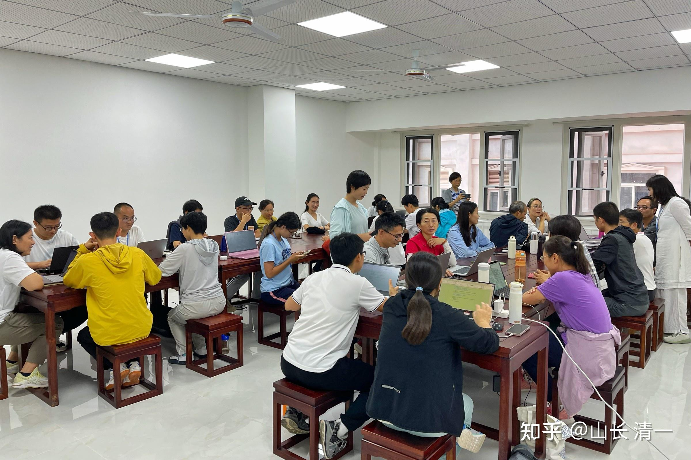
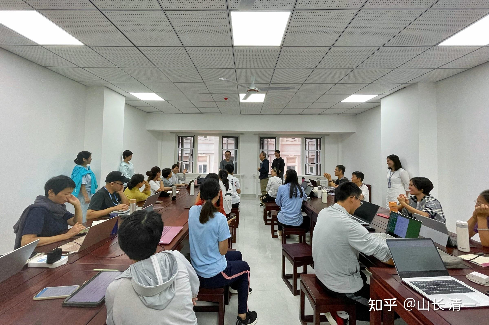
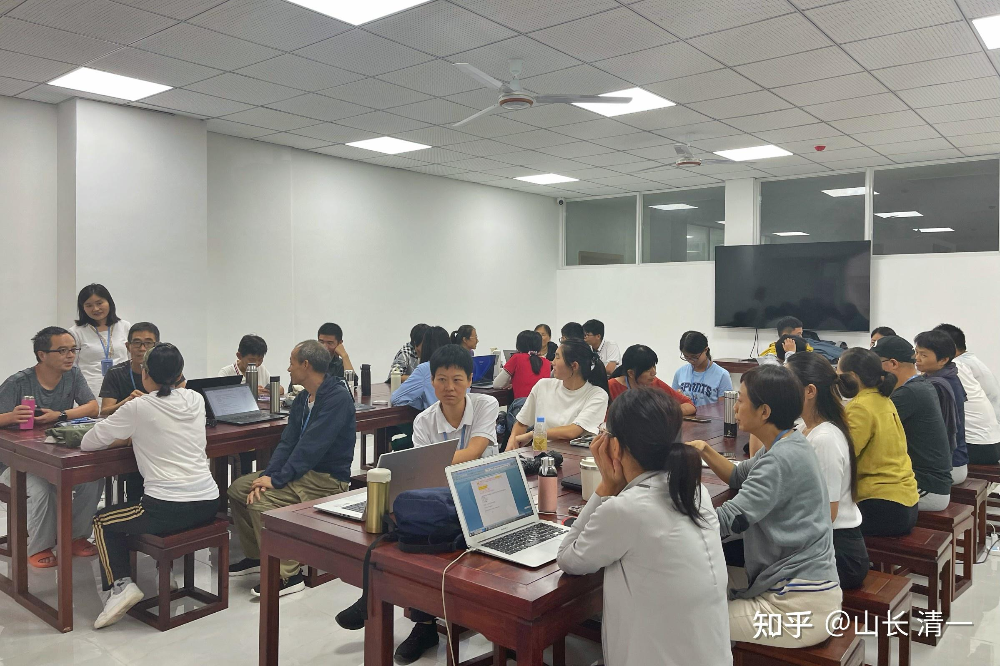
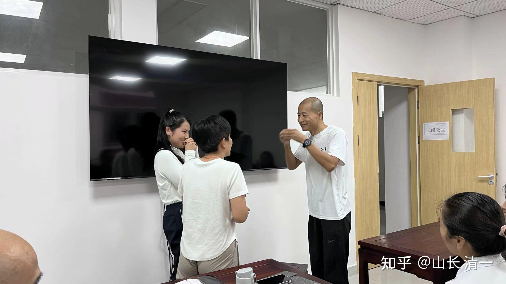
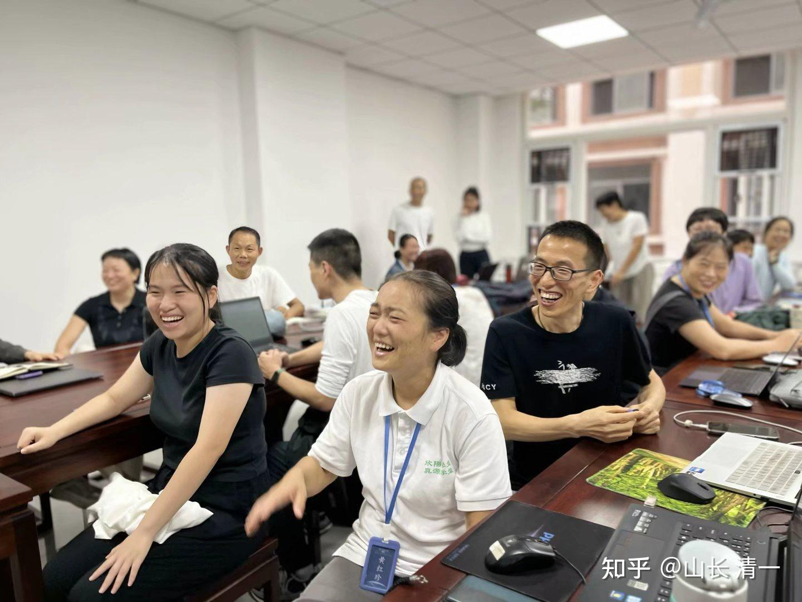
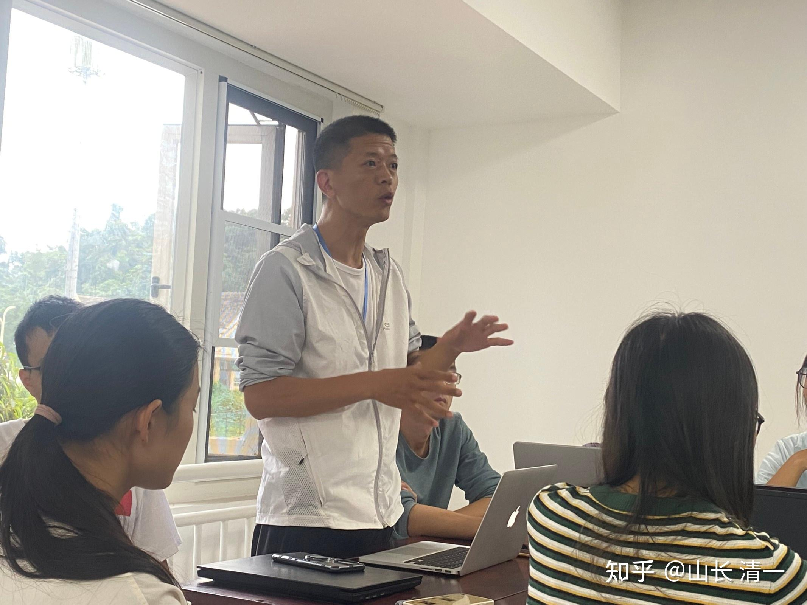
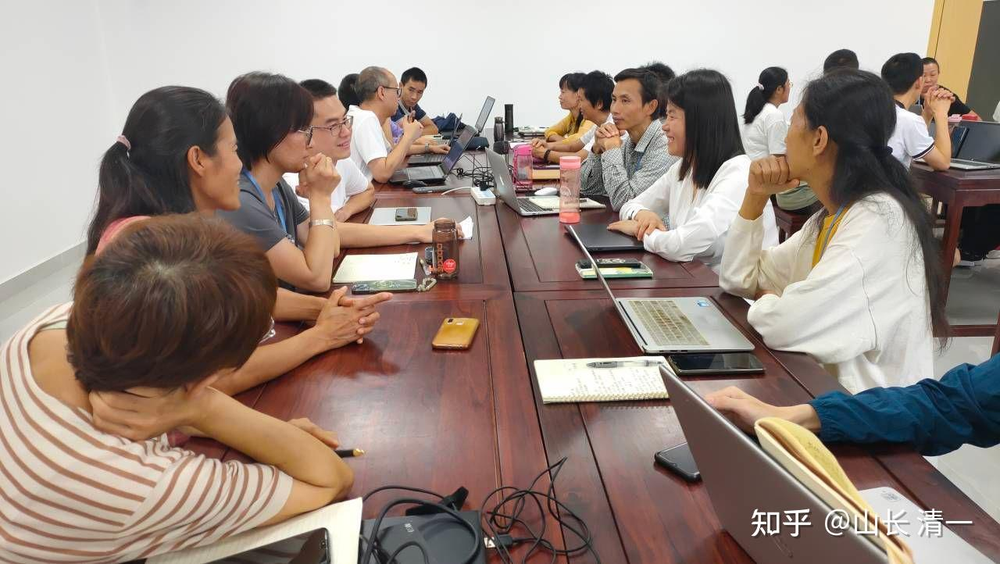

磨丁特区：今日国际学校的教室内。本周是21天【江湖心理行为学】的课程现场，201人在现场。下周刘老师的慧心课程，还有190个学员要来，总共就有300多个学员一起上课了。但国际学校目前的宿舍容量是一千名学员。教室也有更多，我们有足够的容量来供学生们上学！但我们不会招收这么多学生，理由很简单---保证教学质量！

很多老清粉现场学习，还有一些参加过6年前的上一期江湖课。总共两百个学员。这里是小组课后讨论的现场-----心理行为系列课程的学习方式，不是听老师讲课，而是更多的时间自己要讨论，要做作业。要把刚听完的课程练出来。难度极高！但学员的收益很大！

*学员演练课程内容环节 *

*学员演练是最快乐懂，常常把小组成员都逗笑*

*学员发言，辩论*

**11 蔡X媚（已提交）**
**第三天课程总结日记**
今天上课印象最深刻的有两点：
1. 山长做任何事情，总是干脆利落，并且十分安心，这是因为山长对于任何事情都有清晰的思维和自己的原则。比如弟弟死了，评估父母的身体和心理受不了刺激，所以选择不告诉父母，不管他人评价如何，只求父母安康；小明慧和Ella运动偷懒，把她们赶出去自己在外面待一天，原则是家里不接受偷懒的人，前提是之前给孩子做过训练，孩子们脑子不笨，社会治安也还可以，如果孩子死了，他也会接受，这是孩子的命不好。而普通人被妄心掌控，这个想要那个也想要，导致经常纠结，最终什么都没做好。而我如果也想有山长那般清晰的思维和自己的原则，每天要保持学习山长的东西，因此课程结束之后，每天保持至少0.5小时看博文和道德经讲解。今年之内把道德经讲解看完。
2. 人世间的四大执著：爱恨情仇。什么都要放下，否则就是无尽的轮回。我今天做到最好，即使明天死了也无所谓。重要的事情在生前清醒的时候就要做，重要的话在生前清醒的时候就要说。做人要有更加长远的规划意识。
**下午讨论第三题**
“以自我为中心“信念模式如何在你身上体现？你准备如何改进（举事实案例，给落地方案）
1. 对孩子有控制之心，希望孩子按照我的想法和要求去做。
比如孩子暑假在家，我会帮助孩子做每日的计划，但是孩子年龄小时间观念不强，自我管理较弱。当孩子因为一些事情拖延导致计划没有完成之时，我就会进行一些提醒和催促，希望孩子能够高效快速地完成计划中的事情。
2. 这种做法有两个问题。第一、以自我为中心，希望孩子按照自己的想要的节奏，以高效的方式做计划中的所有事情，这样会导致我把孩子的责任承担到自己的身上，而孩子会觉得是在为妈妈成长，不为自己的成长负责；第二，对孩子期待太高，孩子年龄小，自我管理能力需要逐步培养，需要父母的耐心引导，计划表的时间安排的比较紧凑这样不仅让自己有压力，让孩子也有压力。
3. 改进方案：
1）在心上觉知自己对孩子的执著，逐步放下这个执著，尽心尽力地去培养孩子，但是同时要接受孩子未来可能会成为一个普通人的结果，接受孩子有自己的命运。
2）把自己的孩子当别人家的孩子去教养，放下期待，要有耐心，小步前进，逐步帮助孩子养成自主管理的习惯。比如初期时要制定灵活宽松一点的计划安排表，并且让孩子感受到做好时间管理的好处，比如会有亲子游戏、阅读时间等。
3）培养孩子思考的习惯，允许孩子犯错和自己做主，减少说教。在保障孩子安全的情况下，让其充分体验自己的选择带来的结果。

**3 明仪（已提交）**
最近三天听电影课的感受就是
1、很多点都正好戳中和对应我现在的状态，好幸运！今天感触最深的是相当老大的人际交往模式，和爱恨情仇的问题。

2、今天的课程的内容，我觉得如果我更早一点想通这些，或者听懂这些，我跟当年的伙伴的合作会好很多，很多事情不用发生或者说可以更好，我其实在很多时候都有更好的做法。但是换个角度来想，如果没有这几年的经历，可能也不会像现在这样能够理解这些。今天看到学员们讨论时候问的问题，情景演练时候的样子，的确是都想做老大的模式，就是我是对的，每个人的依据各不相同，有的人是我是道德典范，有的人是我的逻辑是对的，总之我是老大，你们应该听我的。当无法取得理想的结果的时候还挺困惑不解和受挫的。在这几年前从小开始我就是这种，一根筋和犟的跟牛一样的脑袋，转不了弯，也放不下自我，心中没有别人，从不能理解别人到不想管别人，只有自己，不愿意去跟任何人融合，但看到他们，我感觉可能有些人玩几十年的模式让我几年内玩的淋漓尽致，玩绝了，完整的看到了这种模式的始终。
这种模式的结果就是自己会活在一种不断的冲撞中，挣扎强撑，但毫无意义。就像是赵心川，他不用死，查老板，他不用去打架，不用去拼死拼活（当然这也需要一些说话的技巧）。很多人会以为拼赢了心就可以安，就像是彭掌门以为获得地位，把太极之位留在他们家就好，但这多难啊，他不仅自己要劳心劳身拼过别人，还要让自己的孩子也拼过别人，有了这个心他就一生都是争斗不断。成功概率小，而且做的事情都是在破坏。关键是要来之后做什么？为什么他想要太极掌门的位置，为什么一定要留在自己家？因为他认为太极是一个好东西，以及他爱他的家，所以想把一切好的都留在家中。但是最后他给家里面带来的争斗，并没有让自己的家更好。最重要的是他自己和家人其实都活得不好，至少不是最幸福的版本。
一个像彭乾吾这样武功高的人，他如果去认认真真教学生，他就能活在爱的状态当中，但为什么要去乐此不疲的让自己活在防范别人的状态当中？可能是当年他以为自己是传承人，结果师傅传了周西宇，他的心就住在了要证明自己当中。但到底为啥一定要是自己呢？这可能就是人的一种习性，然而这一种执念，就会让自己遇到很多的障碍，所以未来自己一定要非常的当心这种习性和执念——为啥要自己想做什么就去做什么？为什么一定要是自己的是对的？为什么别人还必须由自己的价值观去统一，甚至自己不服的人就不应该存在呢？
问题是，如果自己想怎么做就怎么做，想做什么就是什么，那就是强盗的逻辑，就会离心离德。如果不惜与众人为敌，那就是希特勒。如果认为别人必须按照我的逻辑和规则来做，一厢情愿终究是不会成功的。按照与神对话中来说，灵魂要体验爱就要有恨，所以世界上人们扮演各种不同的角色，其实是很正常的。没有理由去要求所有人都是好人，就算我认为做好人是正确的也是我的事情，不是所有人都要去做好人。当我们希望世界按照自己希望的方式来转的时候就会希望用能力去实现，如果我有能力欺负别人，别人就只能听我的，没能力就很郁闷。就像彭掌门觉得我心眼厉害，我就应该是第一，但是遇到比自己厉害的就只能当仆人，遇到可能会超过自己的人就认为对方会威胁自己。而且，真正要去做自己想做的事情，不一定需要跟别人争，很多时候都不用争，不争还可以避免冲突，无谓的消耗。
谦和让，能够消解冲突。就像是周西宇不去管那点钱，就不会暴露自己了。如果别人想当老大，你服他，其实不一定就是由他来主宰你了。我以前很讨厌别人控制我，有时候就是你不要我的认可，我会认可你，但我感觉到你一定要求和绑架我认可你，我就会就是不认可你，然后就激起更大的矛盾。但是有时候我其实也没那么想当别人的老大，所以就会觉得最佳的局面就是能不能你别管我，我也不管你，就是散沙，所以就不是若即若离，而是离。其实有什么关系呢。如果以服务之心去做，就都没事儿了。
从另一个角度来说，成功是事业运也命也，不是自己能够决定的。因此心安在这上面就安不了了！但是帮助别人，为别人提供价值，却是时时刻刻可以去做的，那才能够安心。
有几句话印象深刻：“处处帮人就是德，处处铺路就是德，处处与人交好就是德，不要摆出很狂傲的样子，等着你来巴结我，那就是缺德”。今天山长好想讲到一种境界是，与所有人都是朋友，我想要努力去达到这种境界。

3、 障碍一个人的东西是爱恨情仇，查老板的做事动机就是情，我觉得我的信念就是一个查老板。比如，警长花了大价钱来包场，是给了他很大的尊重，但是他认为这个人跟他没有情，就看不到对方的好处。他不屑于这种所谓世俗的关系。但是周西宇在他最烂的时候拼命的救他，他内心期待别人对他无条件的付出，一旦他觉得得到了，就也可以对对方无条件的付出。但是这种关系双方都是没有自尊的，你期待别人主动对你好，是不尊重对方的自尊，你不是期待用你最优秀的一面去吸引对方，是自己没有自尊。真正懂得尊重别人，一定会对别人很恭敬。
最恶心的就是，我是垃圾你也要爱我，你如果不爱我就不是真爱。我目前还不会这样想，因为我也不能接受自己是垃圾。但是我会觉得我没有信心也不知道怎样跟别人建立关系，所以如果别人愿意来跟我建立关系，感觉他好像可以信任，我就要好好珍惜，可是这样就会吸引来想要利用自己的人。所以还是要改变，更多的理解别人，尊重和恭敬别人。
山长说，“问世间情为何物，值得人生死相与”，以及一语道破情的本质就是匮乏，觉得我缺一个男人。我一直不觉得我有想男人，因为我觉得我到目前为止所认识的男人都没什么好想的。但是我今天突然想明白厌即是恋，有可能这也是一种匮乏？因为觉得没有，所以缺？那其实真正超脱的境界就是上面说的要想清楚：“问世间情为何物，只教人生死相与？”，这样一想，会有一瞬间的感受，情也是一个很空的东西。
另外一个今天很震撼的片段就是，何安下跟师傅说自己不要名不要利，就喜欢过一个女孩还能放下，非常的感动。如果要跟师傅学习，要能够放下，没有放下就不会有得到，因为惦记的东西太多了，就不可能专心做事，专心学习。就像彭乾吾，他爸爸那么厉害，他从小跟着他爸，那他其实只要不要执着地位利益那些，就能够学出来了，但是他放不下。所以跟师傅学习，要拿出自己的专心来，因为心诚则灵。对于自己来说，也需要专心于自己真正想的目标。