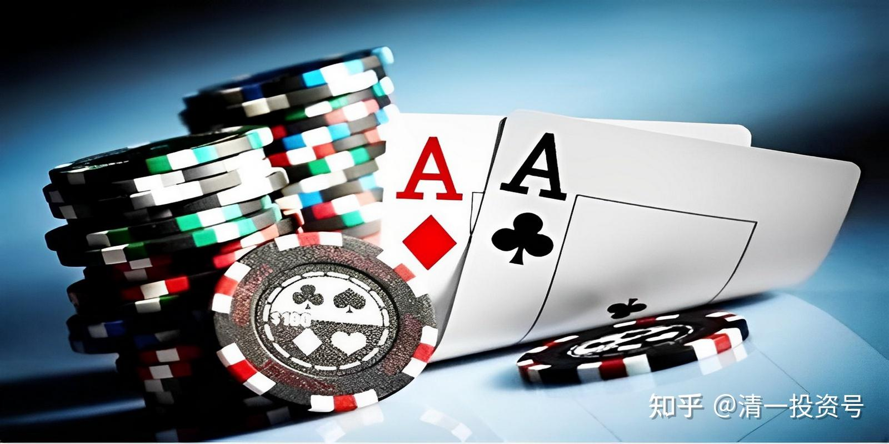
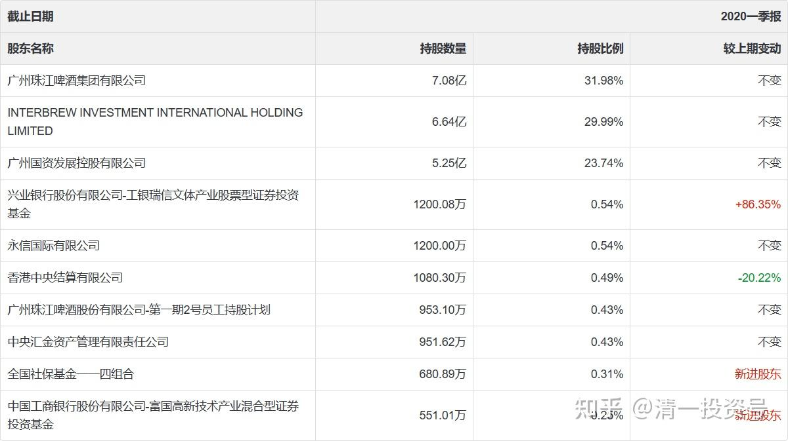
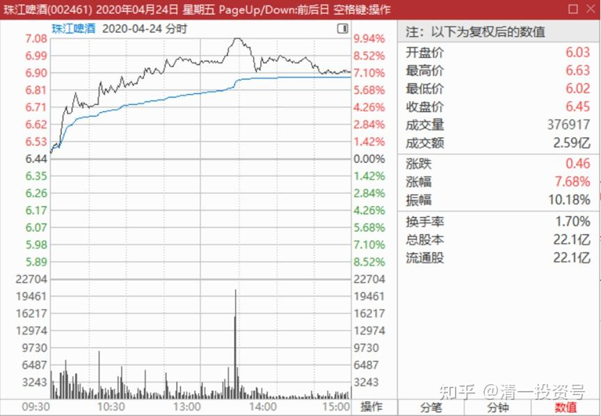
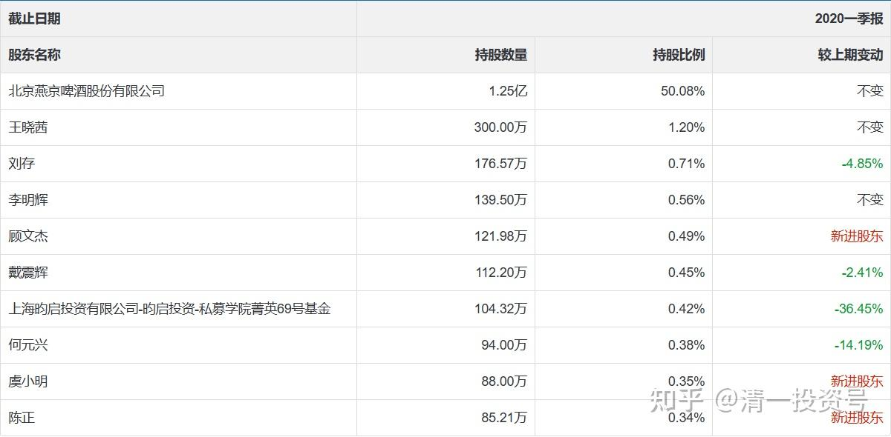
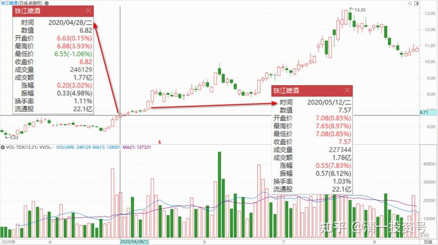
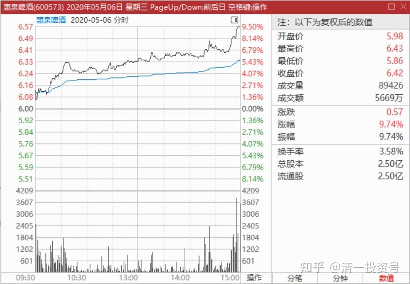
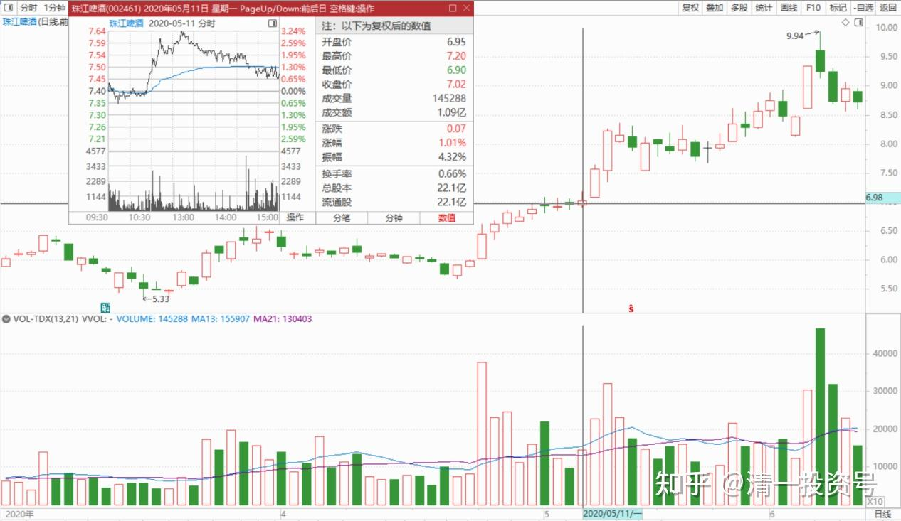

25篇.筹码收集完毕，正在养股

清一山长 2020年3月28日～5月12日

一、市场上的隐形人——庄家

清一山长2020-03-28 10:03:16

预期一季报机构持股将更加集中，就算我持股不动，也几乎铁定会跌出十大股东，其实我现有的持股数量，是高于12月底年报数字的，今年最高的时候，珠江是超过5M持仓的……

《[24篇.守住筹码很不易](https://zhuanlan.zhihu.com/p/648860208)》[https://zhuanlan.zhihu.com/p/648860208](https://zhuanlan.zhihu.com/p/648860208)

清一山长2020-04-24 01:09:55（上文续评）

**今天出一季报，果然跌出了十大股东。**最后一名居然是550万股了。新进了三家基金，增仓动作非常明显。显然，2月份的量能放大，就是这些基金干的。换仓成功。而且比老基金的成本低不少。时间成本就更划算了。

现在，啥时候涨，就由这些基金说了算了。涨了就有人气了，现在压着，散户也不关注。**散户永远是热情追涨的积极分子。**

老酒鬼888回复清一山长:

生活中，道长见过庄家的样子没？

清一山长2020-04-25 11:26:54回复老酒鬼888:

当然见过了，不止一个。还有一些超级机构，操盘手等。还一起吃过饭的。豪华餐，别人请的，见了两三个团队。“独狼”见过的就更多了。印象最深的一个团队，用了一个亿本金，两年赚到了20个亿。特点：核心人物，说话特别直接，没废话。生活，着装都很不讲究。不爱社交，会高价请人来专门做团队的社交和对外关系联络。对人性研究极深，鄙视大众。2015年年中，4700点的时候，我们见面，一见面就问：今年赚了多少？我说，一个小目标。多少本金赚的？两千多万。嗯，勉强合格。我问他，答：已经赚了几十个小目标，超过十倍收益了（惭愧，没法比）

另外一个庄家的形象：此人现居上海。五年前见的他，居城里面的别墅豪宅，价值上亿。收藏了很多艺术品，抽一支两千元的雪茄。告诉我，他的保姆身价千万，都是跟他买股票赚到的。说现在（2014年），保姆的持仓是全仓青岛啤酒，根本就不看盘。他说：这是非卖品，养老用的。这人原来号称“牛散”，经常在上市公司十大股东里面露面。我见他是已经收手不做了，改“价值投资”。估计重仓青岛啤酒。以他的资产数量，进入十大很正常，但我没有看到过他的名字上榜。也许只是保姆买了青岛？

这就是中国市场上的隐形人，说出来让你们知道：原来真有一群这样的人。

这个故事说明：做保姆，也要做牛人的保姆。当年知道给李嘉诚当个司机，也有千万身价。现在知道国内也有千万保姆的。一跟就20多年。

清一山长2020-04-24 11:39:03

基金完成进仓，是该拉升了。我相信一季报出来后，散户看到珠江价格依然在基金的成本位置，但基金持仓明显增加，肯定会积极追进的。所以，今天大涨，是快速脱离成本区的需要。以后怎么走?我不知道，尽量做到与机构和基金共舞吧！

由于依然持有4M多的仓位，珠江账面浮盈多了2M多资金，都是纸上富贵，一股没有多，资产并未增加。没啥值得高兴的。除非想卖掉。现价我还不想卖！

清一山长2020-04-24 16:08:28

$珠江啤酒(SZ002461)今天冲一下涨停就歇菜了，很好。说明机构的意图是“还不快走呀，你看冲不上去了”。明天大概率珠江会跌的，让你今天的判断“正确”，想走的就快走。本来今天逆势上涨就很古怪了，成交放大到2.59亿，应该有不少走的吧！冲涨停的时候，我睡觉去了，不然也许就卖掉一点[微笑]，我喜欢涨停价卖货的感觉。

其实，今天冲涨停，也可以说是资金抢筹的表现。现在的价格，都是机构的成本线左右，没啥赚头的。好戏在后头。

二、果然进了十大股东

清一山长2020-04-25 09:06:21

$惠泉啤酒(SH600573)$ **今天出年报公告了：果然进了十大股东，排名第五位。**创了个记录，啤酒行业唯一同时拥有两家上市公司十大股东地位的自然人。虽然这个身份重叠的时间只有一个季度！今年一季报，就已经被珠江踢出十大股东了，尽管我并未减仓。惠泉的一季报应该还会在，估计还得混个两年。

这个身份，一直以为没用。公司连盒饭都没给一份。但对外还是有点用处的，相当于资产信用证明。在泰国银行转款去证券公司买股的时候，因金额较大，引起了银行方面派人来查询资金来源，是否有匹配的资金实力，我在国内是否拥有正当的企业？我就把珠江啤酒的年报转给他们，说明了自己从2018年起就是十大股东，还是第五大股东，他们真的去认真查验对照了名单，还要了护照去比对。以后就再也不问了，对我态度非常的客气，马上就开通了证券买卖资格（问询之前，账上虽然有资金，但有限定导致无法正常买入股票）。估计泰国管理部门怕贩毒的资金进入银行金融系统吧？

十一面回复清一山长:

印象中，山长还持有燕京啤酒，啥时候也进下十大股东[合十][合十]

清一山长2020-04-25 09:21:16回复十一面:

你像是希望我找倒霉呢？燕京的持股数量超过惠泉不少，是我主要的亏损股之一。没当燕京十大，都亏了几百万。要真成了燕京的十大股东，不亏几千万才怪。不过珠江的账面，最高也亏过两三百万的，没多久就变成了赚1500万，都是假的！

清一山长2020-04-28 10:42:03

$珠江啤酒(SZ002461)$ 从图形上看，真像是开始启动的样子。量价都上来了。只是不了解，现在启动似乎不是时候。大盘其实并不好，国内外局势也不好，逆势启动，劳而无功。本来是犯不着的。故意这样做，就有点“打劫”的嫌疑了。

清一山长2020-05-12 10:24:22(续评上贴)：

现在答案有了**：核心筹码的确已经被”劫走“了，二季度筹码会更集中，现在正在示范”赚钱效应“。**我相信大多数持有珠江的，账面都是赚钱的，都比较快乐。好口碑就要来了，珠江很可能成为重庆啤酒第二。她的利润上升和市场都更好一些，与德国啤酒研究的大学产研合作，也很有利于提高产品创新的档次。

清一山长2020-05-06 15:26:18

$惠泉啤酒(SH600573)$ 自龚建强一季度退出后，本人荣升第三大股东。表示对今天的冲涨停表示不理解！也许就是不想让老龚赚钱？他出局就涨？

几千越甲回复清一山长:

阿弥陀佛，千把万就做第三大股东？

清一山长2020-05-06 20:01:50回复几千越甲:

去年年底，还是中国两家啤酒上市公司的十大股东呢[滴汗]！这说明中国的啤酒企业门槛太低？未来发展前途较大？还是啤酒绝对不能投资，都是“散'户门在炒？肯定没前途？

三、筹码收集完毕

清一山长2020-05-12 10:20:14

$珠江啤酒(SZ002461)$ 昨天的走势，尾盘明显是派货图形。但这个价，派货也没有多少利润，而且上方其实没啥压力，已经控盘了。就想主力干嘛不直接拉呢？弄个回调，看起来像“上吊线”的样子。今天就知道结果了——让昨天拿货的小散们赚钱，培养拥护者，跟随者。“上吊线”变“盘中回踩行情启动线”了。

**机构坐庄，无非杀预期，杀持股心态，获得筹码后，就要开始“养，套，杀”三招。**顺鑫农业启动前两年，就是“杀预期，掠夺筹码”的模式，让坚持看好的长期持股者拿着恨恨的，后来有点小涨幅就逃跑掉。不过主力老这样做也不行，这样做下去，这个股就没有人气了，走不远。为了培养人气，就必须“养股”，不断上升的同时，还要故意打下来制造回调，还要让敢于追入的股民赚钱，自己要吃点小亏，做出赚钱示范效应。比如昨天拉升，其实很轻松。不需要回调可以拉更高，但下午就是故意打出一个回调来，刺激买气。这些一回调就敢买入的小散，就要让他们今天就赚钱，来个高抛低吸。遇到回调再捡回，不小心就丢了筹码，不得不高价继续买入。这样人气就越来越好了。主力赚钱不能吃独食，要分给参与者的。人气越好，将来涨得越高。

所以：恭喜各位。**珠江大约已经筹码收集完毕，正在养股。**不断的小幅涨跌，上移，让持股者都赚钱的时候来了。这是最幸福的时候。

（中建还在杀的阶段，杀持股信心，这时候要跟主力比耐心），顺鑫农业，如果我没耐心，很早就会被丢下车了。珠江也考验了我快两年的持股耐心，是否快结束考验，进入下一阶段了？

清一山长2020-05-12 11:11:37（跟评上贴）

7.8元左右，我故意地高挂了7.86元的“高价”，十几万股的单子，就看他抢不抢。结果悲剧了，没多久一单就被抢走了[捂脸]，直接就过7.9元了。难道说明主力还在吃货吗？剩下的俺就先不卖了。先看看动静再说。

Vincent-zhanglong回复清一山长:

中建这种也有庄家呀？国家队坐庄。海外机构买个2亿股，股价都没啥起伏。

清一山长2020-05-12 11:24:54回复Vincent-zhanglong:

有呀。AB就是中建的大庄家，超有爱心，专门低卖高买。中建现在不涨，就是因为他要出货，亏本出货，还有30亿股没出完。正好是低价买入的时候。如果是他买货的时候，就可以出给他了。他现在卖的货，是2017年，2018年买的。2018年我就11.35元倒给他大量的中建，现在五元了，再买回来。感谢主力AB[干杯]

(标题、图片为编者所加)

**参考链接：**

[YJ走势果然神鬼难料\[表情\]](https://www.zhihu.com/pin/1604810289215668226)

[发表今天的想法，就是非常的感谢，感谢这…](https://www.zhihu.com/pin/1604504352521158656)

[8篇.初谈燕京](https://zhuanlan.zhihu.com/p/594537053)

[9篇.起码十年不涨就值得一起守候了](https://zhuanlan.zhihu.com/p/596134341)

[11篇.啤酒系列4：连连出台的质疑文让我加紧了买啤酒的行动](https://zhuanlan.zhihu.com/p/598382916)

[12篇.啤早期珠江啤酒、燕京啤酒的换仓记录](https://zhuanlan.zhihu.com/p/602033762)?

[13篇.买卖操作后的富足之心](https://zhuanlan.zhihu.com/p/604162057)

[14篇.珠江的破位急跌，名曰跌停进货法](https://zhuanlan.zhihu.com/p/606062514)

[15篇.金融市场是考验心态和修为的地方](https://zhuanlan.zhihu.com/p/608010478)

[16篇.啤酒系列9：买入的理由不是因为要涨，而是因为没有多少下跌空间](https://zhuanlan.zhihu.com/p/609653689)

[17篇.只记住一件事：低价不卖，高价不买](https://zhuanlan.zhihu.com/p/611574943)

[18篇.炒股美德——亏赚两相宜](https://zhuanlan.zhihu.com/p/611564523)

[19篇.啤酒是一个难得的大潮](https://zhuanlan.zhihu.com/p/613467605)

[20篇.投资啤酒股是买困境反转的行业](https://zhuanlan.zhihu.com/p/615531121)

[21篇.绝不买入超过卖出仓位的数量](https://zhuanlan.zhihu.com/p/617161408)

[22篇.它很可能是下一个重庆啤酒](https://zhuanlan.zhihu.com/p/645392522)

[23篇.危机时刻好公司不用担心](https://zhuanlan.zhihu.com/p/646998882)

[24篇.守住筹码很不易](https://zhuanlan.zhihu.com/p/648860208)