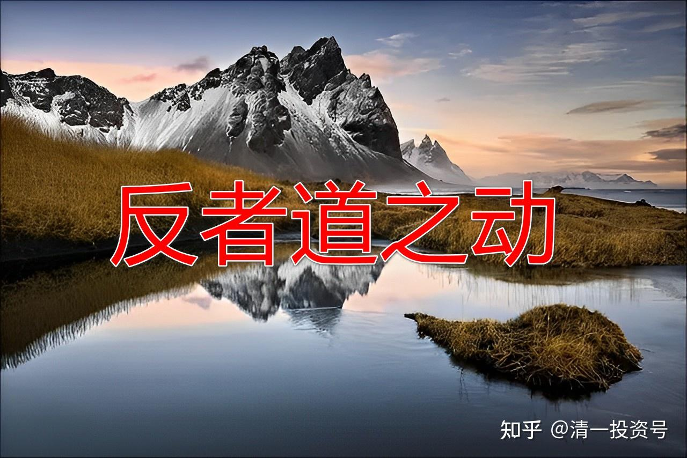
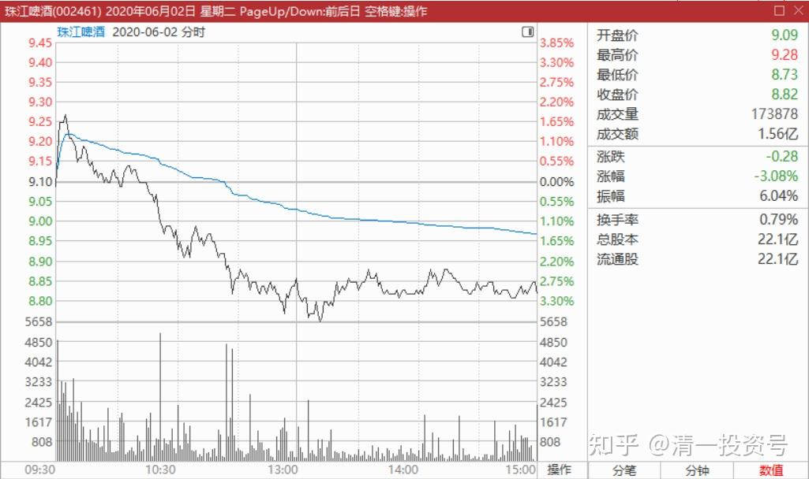
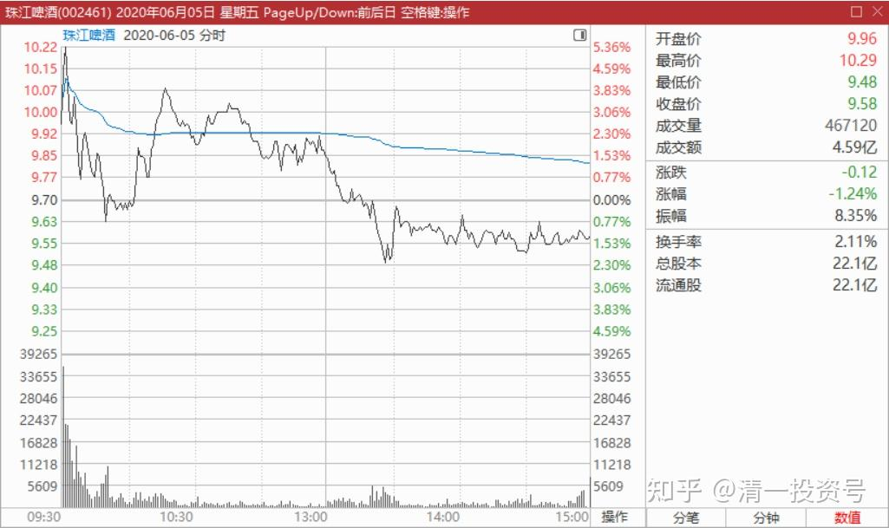
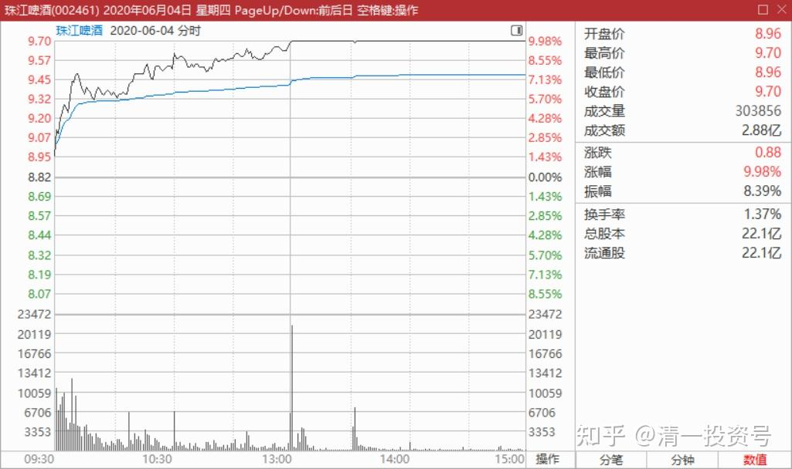
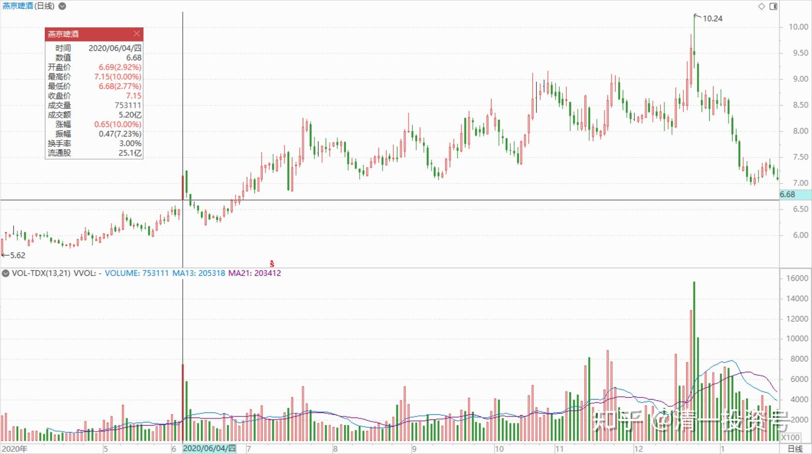
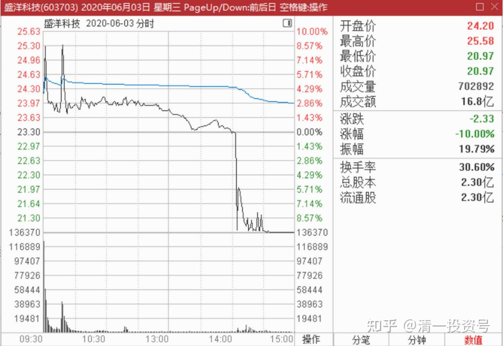

28篇.看图要反着看

清一山长 2020年6月2日～4日

**一、看图，反着看就对了**

清一山长2020-06-02 12:45:10

$珠江啤酒(SZ002461)$

这图形，挺像出货的。不——是真的在出货，出了一部分货。价跌量升，上午成交已经过了一个亿。前期拉升，获利盘不少。现在出掉一些，很正常。只是出货的图形，摆得这样难看，倒是意外，倒像是个完全不懂的新手在操盘。昨天9元多挂了一单10万股，却被一口吃掉。我正在心疼呢。看来还有捡回来的机会。原来我判断是在8.5-9元之间震荡一段时间。昨天我还以为主力太强了，改到9元为底部呢！只占了两天就掉下来了。敢碰8.5元我就把抛掉的部分再买回来，不碰就算了。算是做T做飞了。

**看图，反着看就对了。看起来是市场在抢货，其实不是抢货。**你跟着抢就错了。**看起来是出货的，不一定是真的出货，**特别是真的出货但又故意给你看出来的，就要多几个心眼多想一想了。可能只是想高抛低吸，降低一些仓位成本。9元以上，已经很不错的利润了。但故意做的出货图，说明长期趋势未必改变。**只有出现好消息漫天，股价忽上忽下的跳来跳去的，但时间长就是不涨，反而慢慢跌一些，就有可能是真的出货了。**因为主力一两天不可能出光的。段永平出达美航空，用了大半个月也没出完。珠江主力要出货，没有一两个月高位震荡是不够的。我也慢慢地跟随瞧瞧。

今天上午我练功去了，刚回来看到的图，仍不住点评几句。看样子下午也没啥看头了，就不看了，休息去了。

[珠江啤酒：控股股东方面拟减持公司不超0.54%股份](http://link.zhihu.com/?target=http%3A//kuaixun.stcn.com/egs/202006/t20200602_1978178.html)

[http://kuaixun.stcn.com/egs/202006/t20200602_1978178.html](http://link.zhihu.com/?target=http%3A//kuaixun.stcn.com/egs/202006/t20200602_1978178.html)

清一山长2020-06-02 23:25:12（评论上文）

永信国际原来是“一致行动人”。不然也就1200万股，没超过5%的股东，也算不上什么大份额。还不到一天的成交量，1%的份额都不到。对市场的影响，主要是心理影响。

明天肯定要跌一阵了，虽然15天后才会开始减持。但小散总是喜欢跑得快的。也许我9元以上减持掉的20W，有机会捡回来了？不要多，给我5毛就行[赚大了]。这个公告也说明：珠江的拉升期快到了，未来半年内？永信，应该是珠啤的财富投资公司之类的。用持股多赚一点差价，比正主儿无论涨跌都只能看着好一些。也因为此，所以股价涨到天上企业也没啥好处，对维护市值自然兴趣不大。永信想退出的话，也许配合一下，半年内出个好点的业绩报表是必要的。

**二、示强，同时也会示弱**

清一山长2020-06-04 10:31:15

$珠江啤酒(SZ002461)$

看不懂了[为什么]。如果珠江要秀身材，干嘛不冲涨停？都涨8.3%了，差这一口气吗？这样来推升珠江，要耗费更多的资金。难道不是秀身材，而是继续吸货？高价抢货？这个价格来抢？这种手法来吸？不是太简单粗暴了一点吗？

看不懂就挂眼科吧。9.5元附近卖了1000手，用于纪念今年的最高涨幅。回款用于买中国建筑了。

清一山长2020-06-04 10:54:50评论上贴

今天的大盘下跌，但珠江却逆势大涨，很多持股不坚定的筹码，一看收益丰厚，而且珠江不够强，应该都会跑掉。**所以示强，同时也是示弱。**高手[很赞]

如果主力是这样操盘的，明显志在长远，原来跑掉的人，是不懂珠江的雄心壮志。示弱你认为真弱了。**如果这个逻辑是对的，珠江的未来想象空间就很大了。**最新的月报表明：珠江啤酒产能吃紧。总产能220万吨，居然产能吃紧？其他啤酒巨头都是吃不饱，产能利用率能否达到70%都是问题。满产满销，带来的利润要比产能空置好得多。也许珠江是该飞起来了。

借股修行回复清一山长:

感恩老师分享！我的珠江啤酒已经1.3倍的收益了！从2014年的投资小白，开始上您的财富课，到这次跟着您全程操作珠江啤酒，对您的财富课又有了全新的理解的领悟，越来越觉得当初我决定上两次财富课是对的！[大笑]

清一山长2020-06-04 11:27:58（跟评上贴）

此刻（上午11:24），冲涨停五个价位。只有230万股的筹码压盘。一笔就可以扫光。还是算了，认怂跌下来慢慢盘[俏皮]？

**三、进入狂欢时刻**

清一山长2020-06-04 12:02:53

$珠江啤酒(SZ002461)$ 总结：这段时间，珠江一直在不断地冲高后回落，让做T的小散们吃甜头，就是为了今天！我相信今天在冲高过程中卖掉的聪明人，现在只能遗憾地看到珠江冲涨停了。控盘水平真高，佩服。

从现在起，珠江进入狂欢时刻。右侧投资者将大量进入，左侧投资者逐步退出。这是利润最丰厚的时段，也是聪明人大展身手的时段。追涨杀跌的热门，热门股的风范，啤酒龙头的地位，将带给你心跳的感觉。恭喜各位熬到今天的珠江朋友们！

发份回复清一山长:（跟评上贴）

非常感激山长在思维和教育方面对我们父子的引导！

非常感谢山长在雪球上分享投资理财理念，以及您将个人对珠江啤酒全方位思考分享给清粉！（六位数的馈赠，心里怕怕的）南通陈小峰 敬

清一山长2020-06-04 13:32:18回复发份:

别怕，当清粉要习惯赚钱[很赞]，也有习惯把钱用到该用的地方。顺鑫、珠江都给了我九位数的利润，它们都是我建设泰国大学的恩主。我们的清迈大学校园建设正在加快进度中，今年预计还要新开工三栋宿舍楼，每栋2000平方。建好后就可接待国内的清粉了[大笑]。

洪睿彰回复清一山长:（跟评上贴）

我刚打赏了这个帖子 ￥6元，也推荐给你。感谢老师分享[献花花]

出掉一半仓位，成本已经负挺多了。本来想出三分二的，看到消息有点多就出少点吧！

清一山长2020-06-04 15:40:04回复洪睿彰:

可能你出早了。珠江今天成交很少。燕京比她多多了。惠泉市值是珠江的十分之一，成交是珠江差不多。所以——珠江是三大啤酒股里面最有前途的[大笑]。

不过赚了就好，躲到中建里面，起码安全性高，可以安心睡觉。

清一山长2020-06-05 16:33:35（跟评上贴）

昨天说了珠江就要开始给你“心跳的感觉”。今天就给表现了。你们看珠江今天的K线图，早上开盘轻松突破十元，是不是很兴奋？追进去就被套牢，是不是很郁闷？中间拉高，是不是很有希望？就因为玩得太精彩，今天珠江创造了近期的最高成交记录，比昨天的一路冲涨停要刺激得多。参与人多得多。珠江——今天的人气股。

清一山长2020-06-04 13:45:11

$珠江啤酒(SZ002461)$

多方用两百万股扫掉了涨停的压单。现在仅仅是两万股的涨停价封单，就没人能打掉？空方如此孱弱无力，也是醉了！难道空方都阵亡了吗？[大笑]既然如此，**我涨停价卖10%的老规矩**，就改改？先看看动静？**因为勾引我卖，我就偏不卖。有人想要勾引我买，我就偏要卖。**我就是个逆反期的[俏皮]。

清一山长2020-06-04 14:51:06

$燕京啤酒(SZ000729)$ 久违了，死气沉沉的燕京，今天终于涨停了。百万元的亏损，和百万元的大赚，有时候只差一天！所以别太在意账面的盈亏，看好了，就多买一点。今天出10万股燕京纪念一下，纪念燕京难得的涨停。赚钱了，要学会分享！**申明：现在燕京依然是低价，不是出货的时候。**

清一山长2020-06-04 22:22:49

$燕京啤酒(SZ000729)$ 燕京现在还不是出货，我认为不是。虽然成交量有点大，可能有些人出了。但图形上不像。有人想看什么是出货，我找到一个，昨天用16个亿走出来的血汗图，钱都流到骗子的手上去了。一天之内涨停到跌停，成交量30%。赚了全跑了，股价跌回原地。盛洋科技，大家见识一下什么是游资的庄家进货与出货的手法。

清一山长2020-06-04 15:33:55

$惠泉啤酒(SH600573)$ 下午睡去了，起来看快收市了，一看盘，我持有的三大啤酒，全都涨停了。今天是啤酒节吗？

为了庆祝这一天的啤酒节，赶快把惠泉卖出了20万股。表示本惠泉第三大股东，非常愿意与大家分享惠泉的胜利果实，绝对不吃独食，非常愿意分享。

今天燕京也涨停价卖出了10万股，道理也是一样的。以后如果它们跌了，我会再买回来的，尽大股东维护市值的微薄之力[俏皮]。

1月份，我说过今年是我的啤酒年，主仓坚持投在啤酒上了。在茅台高歌声中，继续品我的啤酒苦涩味。即使是疫情打击惨重，也没有减仓啤酒，反而不断加仓。只是减掉了我的医疗股（健康元和新华），都用来补仓啤酒了，我就认啤酒的死理。结果这两年都输给市场了，还被人笑话。

今天看样子，大家都开始来喝啤酒了，虽然理由怪怪的。啥“地摊经济”的推动，**我买啤酒的时候，**可不是冲着地摊经济来买的，**是冲着中国啤酒是世界最低价来买的。**我在泰国，啤酒最便宜都要50多泰铢一瓶。中国凭啥当水卖？所以一路买买买，2019年底，买成了两家啤酒上市公司的十大。一路持有KW股级别的啤酒，死不放手，现在依然是这么多。

不过，说啤酒符合“地摊经济”的需要也很合理。地摊上，恐怕喝茅台不太对劲。喝瓶啤酒，很正常。这里感谢各位喜欢喝啤酒的大神赞助支持。

今天告诉小女儿：爸爸买的啤酒都涨了，赚了很多钱。所以，说明啤酒是个好东西。等下带她去买芒果庆祝一下，爸爸要不也买点啤酒情庆祝一下？结果12岁的小女儿，一本正经地说：这只能说明买啤酒的股票很好。但买啤酒喝的人很傻！泰国虽然很热，但我去年来泰国后，一瓶啤酒都没有喝。小女儿今天看样子也不支持我喝，就算了，吃两只芒果庆祝好了。大家喜欢喝，就多喝点中国啤酒吧。以后万一涨到泰国啤酒的价格，地摊上就不如喝二锅头实惠了。（一瓶泰国啤酒的价格，真就是一瓶光瓶牛栏山的价格，中国原来是五瓶啤酒，才能换一瓶二锅头）。但啤酒的销量，要比牛栏山多多了。所以我才卖掉顺鑫追啤酒的。就等着它“价值发现”的一天。

**参考链接：**

[12篇.早期珠江啤酒、燕京啤酒的换仓记录](https://zhuanlan.zhihu.com/p/602033762)

[13篇.买卖操作后的富足之心](https://zhuanlan.zhihu.com/p/604162057)

[14篇.珠江的破位急跌，名曰跌停进货法](https://zhuanlan.zhihu.com/p/606062514)

[22篇.它很可能是下一个重庆啤酒](https://zhuanlan.zhihu.com/p/645392522)

[23篇.危机时刻好公司不用担心](https://zhuanlan.zhihu.com/p/646998882)

[24篇.守住筹码很不易](https://zhuanlan.zhihu.com/p/648860208)

[25篇.筹码收集完毕，正在养股](https://zhuanlan.zhihu.com/p/650255857)

[26篇.现在最应该做的，就是稳稳的做好轿子](https://zhuanlan.zhihu.com/p/651196882)

[27篇.股票交易风格与伴侣选择](https://zhuanlan.zhihu.com/p/653139189)