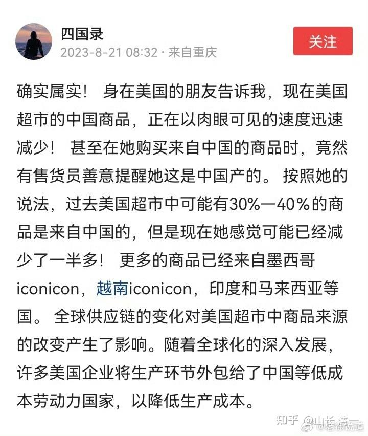

**过去40多年，从1979年开始，美国开始拉拢中国，与苏联对抗。中国得到了融入世界，为世界打工的机会。创造了过去40年的经济发展奇迹，以及全民创富的奇迹！我们很多人，因此从穷人变成了富人。让大家都欢欢喜喜的认为---未来日子都会越来越好的。其实就是过去40年越来越好罢了，其他时间，中国人都很艰难！上升不是历史的必然。下降也是不可避免的事情！**

**但未来40年。我认为是阶层下降的40年。很多“资产阶层”会破产，很多中产的下一代，会降级成劳工阶层。劳工阶层虽然是底层了，降无可降。但收入和待遇都会下降。就像日本人一样，也许需要打几份工才能谋生。只有从事高科技的精英人才。资本和资源的掌控者才会活得很好。**

**因为---现在，美国和欧洲，正在竭力停止对中国的依赖。正在把产能转向中国以外的国家。主要就是东南亚和南美洲。这个转变的过程，就是中国就业不断减少，经济停滞的过程。未来年轻人将很难得到工作就业的机会，而且工资也不会高。 日本失去的30年情况，会同样发生在中国。未来，年轻人为了获取更好的工作机会，未来的老板们为了获取创业的机会，就必须国际化发展。前往【未来的中国】去开创事业，这些都不是发达国家。五眼国家一样很卷，缺乏工作机会。**

**简单一句话：过去40多年的老经验不再有效了。上大学不再有价值了（除非一流大学），大多数人上完大学之后和中学毕业生一样，只能去从事体力工作！就像现在的研究生和大学生，几百万人都去当美团骑手。上普通的大学和专业，就成了一种投资上的浪费。除非你把上大学看成一种镀金的工具。**

**几年前，我们就预判到了这种变化，因此把办学的重点，转移到【三语教学】上，突出小语种学习的价值和地位。把海外就业，作为未来的就业方向。现在来看，是超前于国际形势的。符合未来发展趋势的。可惜---大多数家长，依然在狂卷中国高考。陷入到了越来越卷的竞争中。给身心造成了越来越重的负担！**

**现在，欧洲和美国，都把【脱钩中国】当成一种政治任务在完成，这种情况下，注定大多数人的工作机会会溜走的。我们还是务实一点，不要继续把过去40年的老黄历拿来当未来发展的范本了！**

这个是重要的信息，墨西哥，也许会成为40年前的中国---最受发展潜力的国家。拉美的贫困化，是美国有意疏远拉美的结果。因为美国不期望身边有一个富裕强大的邻居。宁肯把机会给遥远的亚洲。造就了东亚四小龙的崛起、以及后来中国的崛起。当年美国为了对付苏联，拉拢中国，给了中国为全世界打工的机会，才有过去的40年发展。现在美国和欧洲，都在全面地围堵中国的经济，估计也只能让身边的南美洲各国获益了。这就是三语高中首选西班牙语作为重要小语种学习的原因。因为这里注定是未来40年的【机会之国】。想要发展的人，必须选择这些国家，而不是继续在中国死卷到底！

中国未来的经济，大概率会走下坡路的。很多人会过得很艰难，少数人【掌握顶尖高技术的人】会过得很好。但普通人会特别的艰难。但这些美国支持的国家，中下层发展会更有机会的。未来就业很难，当家长的要知道为孩子谋取发展的空间。别像泰国一样，清迈大学（全国第三的大学）毕业的学生，只能去街头摆摊的人很多。因为制造业不行的话，是没有职位提供给年轻一代的。

如果你将来，不要去过下面的生活，就要为自己和孩子的未来。认真的谋划了！

[今纶：像野草一样活下去：高校教授一个月送2000单外卖](https://zhuanlan.zhihu.com/p/654038440)