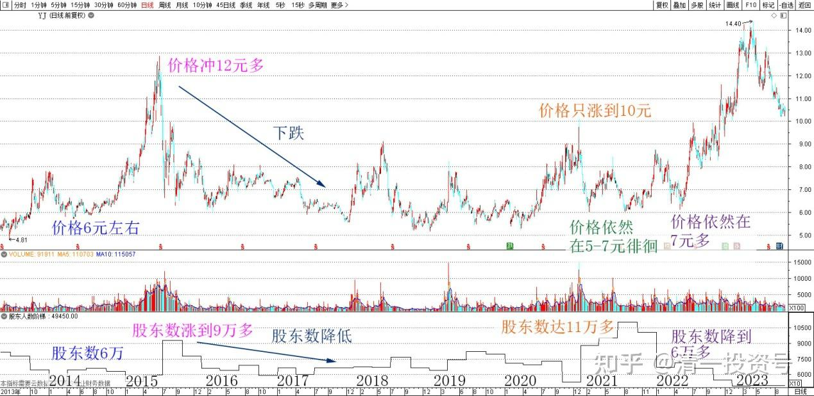
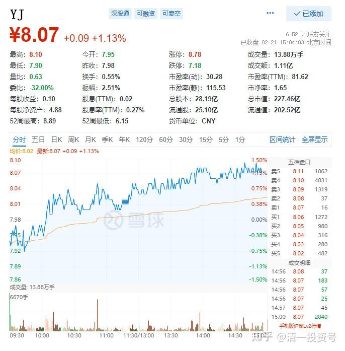
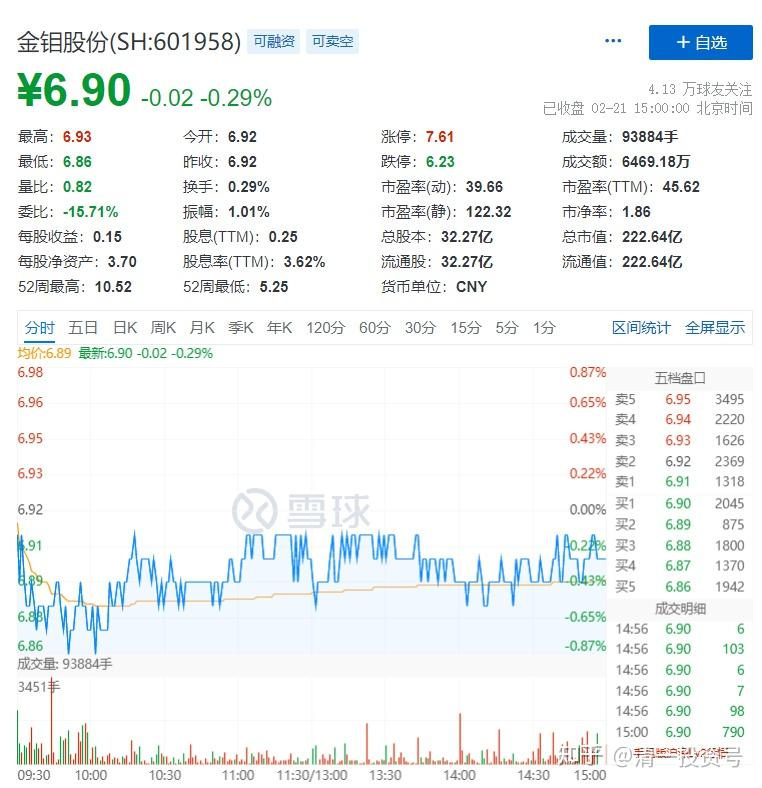

专篇23.主力未走，迟早变盘

清一山长 2022年2月21日

**1.主力没有走**

2014年YJ最低迷的时候，价格是6元左右。股东数是六万左右，跟现在的情况差不多，只是价格抬高了一两元。

2015年年中，价格冲12元多的时候，YJ涨了一倍，股东数涨到了9万多。说明主力的股票被散户拿走了。后来下跌，股东数继续降低。

最怪异的是2020年年底这一波。燕京只涨到了10元的价格，但股东数破纪录的新高，达到了11万多人。比2015年的12元多股东数更多。说明啥？说明主力真的把股票大量卖出了？但有点不对劲的就是：股价并没有创新低。依然在5-7元的底部徘徊。

但去年我被封杀以来，我们看到股东数就持续减少，从11万多降到现在的6万多了。说明暗中有人开始收集筹码，但股价依然停留在7元多的位置，说明主力的操作很成功。散户大量退出，但股价没涨多少。个人判断想要继续大幅降低已经不现实了——再降一倍，继续降到3万多吗？历史最低股东数？我看不太现实。

现在的YJ很“友好”，每隔十天就公布一次股东数。**只要数量不大量上升，就是主力没有走**。别说主力了，我要走的话，至少也得增加几千名散户来接盘呀？从成交上看，能买万股的散户都不多[为什么]。大户就像是蓝鲸，散户像是虾米。虽然少少的，多吃一点就吃很饱了。所以不要嫌弃这些散户，估计是中国的股市制度培养了这么多的小散户（国外和香港一手至少千股，而且交易费很高，频繁交易很吃亏的）。这是中国股市养的“磷虾群体”，全世界独一无二。我常常对着成交单沉思：大量100股，两百股的成交回报，这些人在玩啥游戏？赚了赚不多，赔了也赔不多。估计就是当个游戏来玩的吧？**你们就继续慢慢看戏好了。燕京主力是个超级长线主力，只能学唐建华一样，趴着不动。别的啥事都不干**。

**2.盘口挂单清淡**

今天冲8.06元，一单扫掉50多万股，现在自然回落到8.01元，但8.06元只有4万股却不去拿？为啥？货太少了。去拿把价格拉升了。如果压盘多一点，就会被一口吃掉。但市场上，其实没啥成交的。**盘口挂单清淡**（相对原来上下十档挂架，基本上都是挂的千手单相比，现在每个价位挂的数量都只是百手单，说明活跃的交易者越来越少了）。**变盘是迟早的事情。就看心情了**。（上下都可能大幅增加成交量，就看他的心情是想上涨，还是想下跌了。在一个交易清淡的市场上，都很容易做到）。你们比较YJ和金钼股份的差异就很明显了。市值差不多，价格也差不多，但是金钼的挂单量就大得多。现在跌了，成交不高。但原来的成交量比燕京大多了。所以金钼股份明显没有被控盘。

[272篇.主力未走，迟早变盘声音免费在线播放-喜马拉雅](http://link.zhihu.com/?target=https%3A//www.ximalaya.com/youshengshu/77991214/666611951)

**参考链接：**

专篇1 [306篇.前缘1.雪球的最后一贴--胜利曙光都已经出现](http://link.zhihu.com/?target=https%3A//xueqiu.com/2017773236/247159187)

专篇2 [307篇.被特别关照的股--前缘2](http://link.zhihu.com/?target=https%3A//xueqiu.com/2017773236/247387457)

专篇3 [308篇.立此存照--前缘3](http://link.zhihu.com/?target=https%3A//xueqiu.com/2017773236/247580614)

专篇4 [309篇.见识传说中的拖拉机账户](http://link.zhihu.com/?target=https%3A//xueqiu.com/2017773236/247973779)

专篇5 [310篇. 拉升在即](http://link.zhihu.com/?target=https%3A//xueqiu.com/2017773236/248351982)

专篇6 [311篇. 进入右侧投资时代](http://link.zhihu.com/?target=https%3A//xueqiu.com/2017773236/248658236)

专篇7 [313篇. 小主力进货的阶段](http://link.zhihu.com/?target=https%3A//xueqiu.com/2017773236/249221851)

专篇8 [316篇.两轮回调对比](http://link.zhihu.com/?target=https%3A//xueqiu.com/2017773236/249675370)

[专篇9.主力的水军](https://zhuanlan.zhihu.com/p/619400004)

[专篇10.主力完成筹码收集](https://zhuanlan.zhihu.com/p/629948708)

[专篇11.主力、游资、右侧投机客纷纷进场](https://zhuanlan.zhihu.com/p/631628731)

[专篇12.进入震荡期](https://zhuanlan.zhihu.com/p/633057526)

[专篇13.永远回避风险，不亏损第一](https://zhuanlan.zhihu.com/p/635191087)

[专篇14.高位十字星缩量及主力操作的三个阶段](https://zhuanlan.zhihu.com/p/635191930)

[专篇15.准备起跳](https://zhuanlan.zhihu.com/p/636886203)

[专篇16.大幅回调，老手加高手](https://zhuanlan.zhihu.com/p/638552635)

[专篇17.股东数所传递的信息](https://zhuanlan.zhihu.com/p/639002631)

[专篇18.突破9元是燕京的基本目标](https://zhuanlan.zhihu.com/p/640000051)

[专篇19.YJ、惠泉今天盘面语言对比](https://zhuanlan.zhihu.com/p/640550916)

[专篇20.暗示洗盘快结束](https://zhuanlan.zhihu.com/p/641509884)

[专篇21.现在是新主力的成本区](https://zhuanlan.zhihu.com/p/642330561)

[专篇22.成熟投资者的思考方式](https://zhuanlan.zhihu.com/p/655404597)

