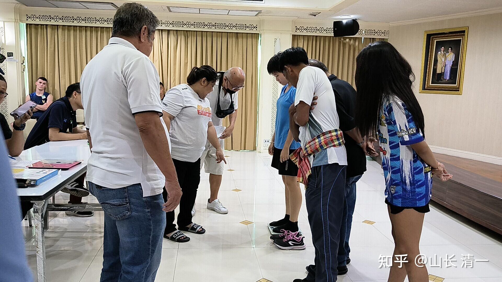
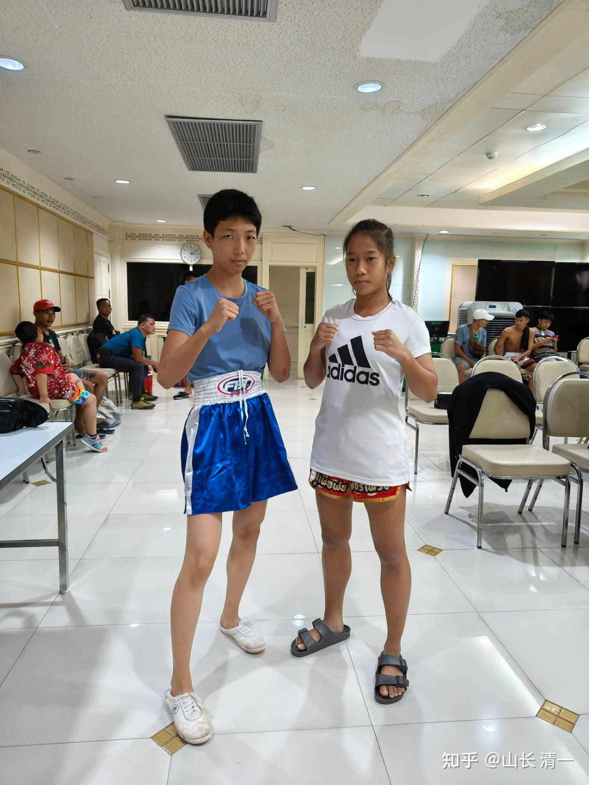
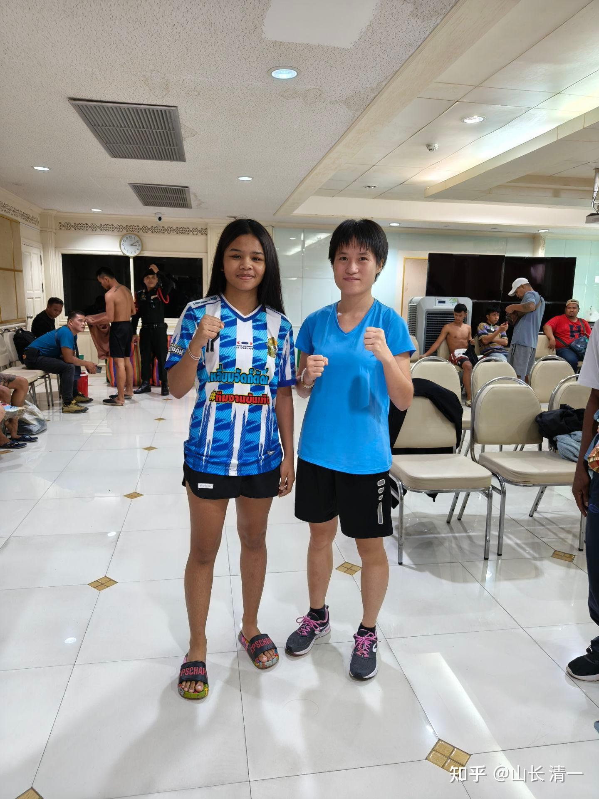
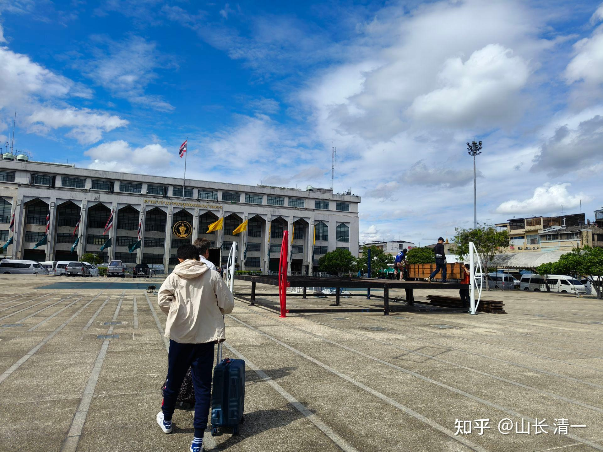

从老挝特区回昆明，现在终于回清迈了。昨天带同学们新选出来十大公主去梅州大学聊天，大家都很开心。答应以后每周陪她们一天做“团建”，她们特别开心，要求下次团建的时候，我带她们一起读【教父】。我觉得还是读【论语】比较好。

木兰们最近正在备战曼谷拳赛，明晓和谭木兰都要参赛。这是一个重要的节日庆典拳赛，对象是泰国人，不是外国游客。由于对手比较强，都是打过仑披尼的拳手，其中一个拳手，上次在仑披尼比赛中，第二局就把对手KO了。因此这次赛事相当于仑披尼比赛，基本上，只有地区冠军一级的拳手，才有资格参加仑披尼比赛。这次安排我们的人参与这种节日庆典赛事，一方面，应该是泰国人对自己拳手的自信。认为可以在节日赛事中，用自己的冠军打垮外国拳手，让泰国民众节日开心。这种庆典赛事，是为了取悦泰国观众的。因此---基本上裁判结果和过程，都会对我们的拳手不利（原来在内围战中，常常有我们刚取得控制，要打出攻击，就被裁判强行叫停，不让我们出手的裁判行为）。另外，如果打完五局比赛，没有ko对手，一般也是算我们输。就像上次谭木兰打满三局没Ko世界冠军甜水，就判我们输。但甜水下来后自己承认，再打两局她肯定被KO了。泰拳手还是很诚实的、但以后甜水就再也不肯出来跟我们打比赛了！因此，我让孩子们不要计较结果。只管自己打好，对得起自己就好。

另一方面，赛事主办方让我们参赛，也是想要测试我们的拳手，是否有实力去打仑披尼。但提出来的条件很奇怪---说如果打得比较【好看】，就可以帮我们安排仑披尼比赛。（不是打赢比赛）

这个要求就有点奇怪了！好看不好看，依照是泰国人的审美观。他们认为扫腿更好看。但我们的拳手打法与泰国拳手不一样，不喜欢用扫腿。因此，可能就算是赢了，也不能去打仑披尼吧？必须要“好看”一些。不会打扫腿就不好看？我准备将来让木兰们学跳舞，如果能够用跳舞来比赛，打格斗。应该会很好看的！

*称重过程*

昨天的曼谷赛前称重，两人均顺利过关！因为她们都没有减重，都按自己的正常体重报的比赛级别。我们不需要玩这种多几公斤肉用来打泰国人的“格斗技巧”！超重也照样打！

*拳手合照*

明晓的对手：看上去有点拘束。个子不高---主要是明晓瘦高的体型。其实手长脚长，场上是有优势的。瘦的好处就是臂展更长。缺点是肌肉力量较差。我们用的是骨力，不担心肌肉力不足的问题！

谭木兰的对手配对照。这个拳手，气质上看起来成熟很多，身体也很结实的样子。应该比明晓的对手更难对付。赛前看起来更加轻松愉快的拳手，都更厉害、起码心理素质好。到了这个级别，拳手的技术都差不多。双方拼的主要就是心理素质了。木兰们的技术，一直以来都是压制泰拳手的，比赛中吃亏的就是心理素质，比赛经验不足。

赛前两个木兰来找我，要我指导一下打法。我的格斗大法就是：当玩一样打，不要有心理负担，不要求结果。不追求赢。只要求尽量打出自己的水平来就行了。输赢无所谓的！

前一天，我跟两个要出战的木兰过招，测试了一下她们的水平。技术上还是很容易控制她们。速度和转换上，可以打得她们没机会还手。不过一旦击中她们（虽然没发力），她们格挡的时候，弄得我的手上脚上都会痛。跟公主们过招就不会这样。而是相反---我不出力，公主们格挡时候她们自己会痛。因此，木兰们实力这一年多来进步很大，身体结实多了。反应也快多了。我能想象泰国人在场上有多么的无力----泰国就是硬派打法，没想到出现了比她们更硬的木兰拳手！

去年在赛前泰国拳馆训练的时候，泰国拳手看到木兰拳手们，每天都会拿一个木棒子来敲自己全身，感到不可思议（中国传武的传统练法，内外家都有的）。认为她们有“自虐”倾向，看她们像是“怪物”一样。老问她们痛不痛。木兰们说不痛还认为硬挺着嘴硬。这次我到清迈，行李箱里面就背了十几根擀面棒，送给十大公主们，每天打自己用。没有硬度，没法打泰拳的。这些老祖宗传下来的练法，证明很有效。过去百年的中国拳手打泰拳失败的原因，我认为与硬度不够很有关系。场上被击中几下就失去能力了，啥技术都用不上。而泰国拳手硬抗打击的能力普遍比中国拳手强。就是从小7-8岁就上场打拳，强行练出来的硬度。从小被KO多了，自动耐打了。我们的拳手都是半路出家。从小没有打比赛的机会。现在17-18岁来打，自己不强化练硬度怎么行！所以，想要上场的小公主们，都在自觉练硬度。上次在磨丁特区，一个成年人跟15岁的小公主对磕手，使劲磕打。小公主们觉得有点疼了。还以为自己不行。但第二天发现：成年学员的两只手臂全都青紫了。自己的手上，却一点痕迹都没有，打完后也没痛的感觉。后来，就再也没有学员来找小公主们“比武”了。其实，公主们的小腿硬度更强！磕腿更容易赢。小腿迎面骨很难练抗打击。泰拳练出来了，因此中国拳手很不适应。对我们来说是小意思！

*赛场现场*

昨天提前去赛场看的照片。是在一个政府机构的门前，露天广场的比赛。泰国人的节日庆典比赛。看今晚的结果回报吧。我也不期待啥结果，当练兵了。等她们彻底练好了，我会出面来安排仑披尼的【中国日】的。泰国是个很务实的地方，只要愿意出钱办赛事，他们是什么拳手，都可以给你拉来打比赛的。再多花一点，甚至可以放水的。只是我们要的不是结果，不是拿来忽悠人，而是要一场一场的击败泰拳拳手，打出他们的恐中症。目前已经见效了。很多打过的泰拳手，已经拒绝和我们的拳手打比赛，觉得跟我们打完很吃亏，容易受伤。因此跟我们打比赛不划算。我们的赛事安排已经越来越困难了。的确，又要泰国人的出场费，又要KO泰国人，的确这群中国人有点过分。等我们彻底练好了， 我们也出钱回报一下泰国拳界吧！现在，我们只做该做的事情---老老实实的打拳！不给我们安排【好比赛】，不让我们打出名气，我们就等著，让自己更成熟之后来自己安排！甚至请泰国的金腰带们来中国参赛！计划是春节前后，我们出钱在国内，举办一场中泰大战比赛！清粉们都盼望着回国比赛呢！

现在的公主们，是【下一代木兰】，目前练法与第一代木兰不一样。是提升版的太极格斗术，更强调身法步法，拳法也是加强版。外加强化版的肘膝攻击训练。将来也许公主们上场比赛，根本不用出腿（放弃优势的太极迎门三脚），就可以击垮泰拳手了。目前正在做赛前准备。最快春节前，公主们就会上场用这种打法打泰国人了！