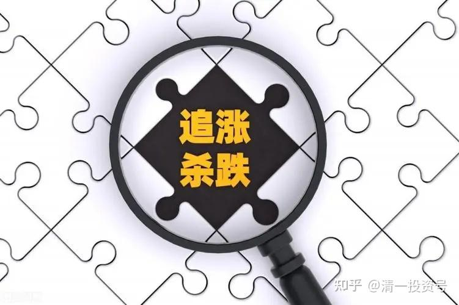
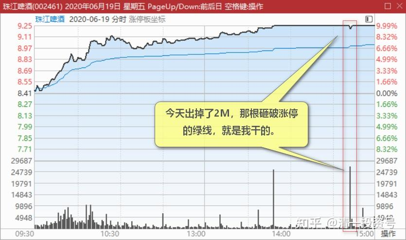
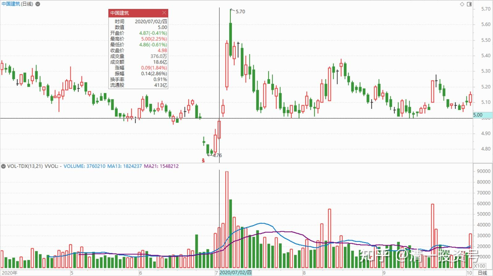
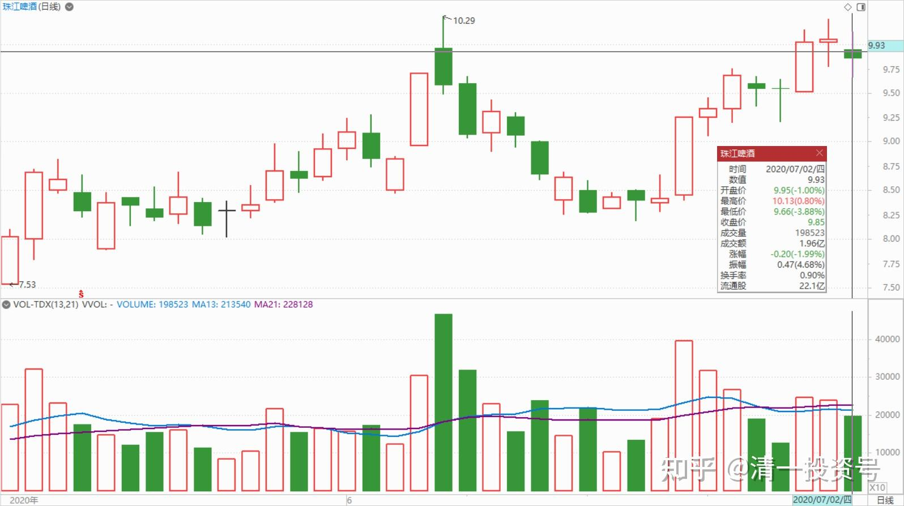
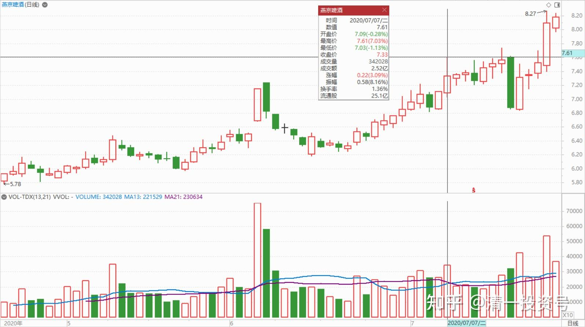
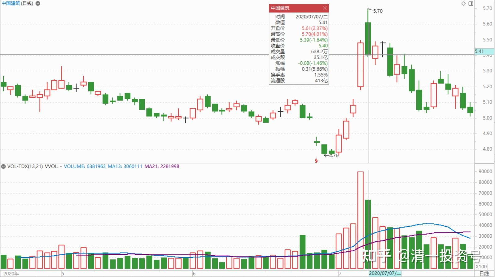
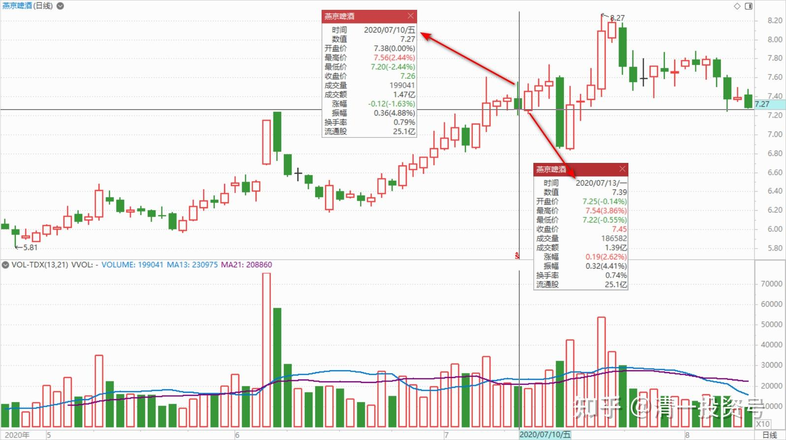

30篇.给做短线人的建议

清一山长2020年6月19日～7月13日

一、砸破涨停板

$珠江啤酒(SZ002461)$

今天出掉了2M，那根砸破涨停的绿线，就是我干的。截图纪念一下。还留有不少份额，坐等它秀风姿。上次9.7元没出，9.25元来出，我的脑子一定有病，就要跟赚钱过不去。上次三家啤酒全涨停了，我以为啤酒的风来了。现在就珠江在吹风。我不如先撤掉一些军，看看风向再进啤酒。珠江如果卖飞了，就陪重阳一起守燕京啤酒吧！好酒大方送给别人，苦酒就自己留着慢慢喝[捂脸]。

记录一下：我卖之前，封单是7M，卖出的单子都是小单，没啥成交量。我观察了一回其他股票的表现，看燕京，中建的表现。回头看就只有3M多了。我赶快打单卖出2M，盘面上筹码快速减少，跌破涨停价，加速下跌。但很快就有2M的量补上来，封住了涨停价。看样子今天的任务就是维持涨停。后来，就没有啥像样的卖单了。尾盘成交只剩40多万股封单。从成交量看，没有新的封单加入。主力意图不明。不过出台来秀身材，总是要收点门票钱的。看它怎样收吧！

蛰伏2020回复清一山长:（评论上贴）

14:42分的时候我跟我媳妇说“怎么突然撬开涨停板了，我去检查一下！“当时想难道是山长干的？果然！！！哈哈哈[捂脸]，只是涨停打开不到三秒钟就又被死死的封上了，我马上也挂了个卖出单，一成仓位。看来卖少了[哭泣]，感谢山长的分享[干杯]

清一山长2020-06-19 16:49:41 回复蛰伏2020:

你们别跟我，我是反指。卖掉了就涨，买入了就跌。等我卖掉多涨了一会再卖也不迟，不像我量少了卖不出去。买股的，抄底燕京就好，我的燕京账户还是绿色的[捂脸]。

二、**买了中建睡觉去**

清一山长2020-07-02 15:05:47

$中国建筑(SH601668)$ 两天就完美填权[赚大了]。仅需两天，就把跌了七周的失地全部收复。**慢慢跌，磨的是持有人的耐心和信心**。**给的是有心人买入的机会。**感谢中建，给了我好几周的安全建仓时间，虽然仓位满到不好意思再买，不然就觉得我太贪婪了。但我依然不愿意它现在就太早开涨。我最理想的配置，是一个月之后，中建再开始涨。这样我在酒类的大仓位，就可以全换建筑了[大笑]，现在有点头痛，酒类大涨了换啥？如果找不到换的，就只好死拿持仓当酒鬼，现金不想拿。全球放水，现金可能不太值钱了。

啤酒今天看盘：珠江明显出货痕迹，但控制良好，主力不想下杀出货。未来随消费潮流上涨应该问题不大。燕京啤酒走势非常稳健，良好。惠啤酒泉也走势良好，有机会。未来都会很好。继续守望中。

清一山长2020-07-07 10:11:34

$燕京啤酒(SZ000729)$ 守了很久的燕京，目前酒类股第一重仓，比我当惠泉第三大股东的持股数多几倍。可是长期让我账面绿色，近期才转为红色。前几天在6.67元还加了几十万股。现在终于要开始表现了吗？

质真如渝回复清一山长:

燕京今天涨停山长卖不[笑]

清一山长2020-07-07 10:33:26回复质真如渝:

上周涨停我肯定会卖。卖掉后买中建。珠江就是这样干的。

这周涨停卖掉买啥呢？没找到标的。就只好不卖了。重阳一季度还在大幅增仓，至少加了6000万股。重阳7-8元肯卖吗？

既然承认自己笨，就老老实实跟大佬吧！燕京你们别跟我，跟重阳比较靠谱。我是跟他们的，也跟他一样套了几年。他原来的成本是7元以上，一季度新买的，应该降到6元了。跟了就别自作聪明，看他们走了，你再走不吃。

珠江主力是谁，我一直不知道，就算了，不跟了。留一点负成本的仓位挂眼科。

刘一韦回复清一山长:

燕京抄您底了[加油]

清一山长2020-07-07 10:36:53 回复刘一韦:

恭喜[赞成]。认真一点，要抄我的底，逃我的顶并不难，很容易比我赚更多。我示范了4.99元买入中建，市场就给了你们三天时间来抄我的底。燕京给了更多时间，更多空间，所以好好珍惜。**现在才来看的，都是帮我抬轿的人。未必不能赚钱，但风险比抄我的底大多了。**

清一山长 2020-07-07 20:11:24

$中国建筑(SH601668)$ **做庄，要有庄德，才有人气。**当个好的大哥，就要让小弟有机会赚到钱，要让小散能够跟上，不能一骑绝尘的跳空拉升后跑掉。这个股就没人气了。所以，主力再有钱，也不能太用力拉。**今天的大股票回调，就是给小散上车机会的。早上的高开，是给周末急吼吼要入市的，最热情的右侧人上车的。**十几亿元的股票，已经成功地卖给这些热情追捧的人了。10点以后，就是维持一下盘面的。所谓的维持，就是不能跌。如果有人害怕，要跑了，主力就接手筹码。甚至还拉上几分钱，一毛钱不到的样子。有人想要筹码了，就抛出一些。筹码尽可能分散一点，这个主力不是为了赚钱，是为了拉升，为了长远。这样才能积累人气。5.7元被套住的，明天性急就割肉。如果不急，本周肯定给赚钱机会。我认为明天不会跌了，因为人气难得聚起来。聚起来让她慢慢冷掉，太可惜了。不符合主力的意图。因此明天应该涨一点，小涨，还是大涨，就说不定了。看心情和计划。我猜是早就安排好的的节奏。反正不会让昨天的180大涨变成一日游了，就是个笑话了，起码给个一周游吧？策划准备了这么久？上面的意思，还要给美帝一点颜色看呢。哪会这么轻易泄了？我不相信主力就是为了一点小零钱。就为了套住这6亿追涨的小股民的。这点生意太小意思了。不用昨天费这么大力气来做局的。

靠感觉买股票回复清一山长:（跟评上贴）

去年六块多开始买，全仓拿到疫情来，没赚钱，跑去买医药股了

清一山长2020-07-08 10:26:56 回复靠感觉买股票:

你没懂我说啥：说明白一点，就是：

第一：您这种类型的人，最好别炒股了，因为您注定就是来亏本的人。赚了是你运气好，赔了是你的真本事。你当然也会赚到钱，跟上赌场一样，没有一个赌徒没有赚到钱的，但注定所有赌徒全都会赔钱。只要你没有离场，所有你赚到的，最终都会赔回去。因为：你们这些人，根本没有投资逻辑能力，你就是庄家主力的一碟小菜。

**第二：想赚钱，买了中建睡觉去。十年后再来看账户。这样，任何最聪明的庄家，都割不了你的韭菜了！**

以上建议，对没有投资逻辑的所有人都有效。虽然我知道你们根本不会听。那你们就任人宰割吧！感谢你们为中国股市提供的流动性。[献花花]（注明：没有投资逻辑能力的人，就是知道我买啤酒，但不知道我为何买啤酒的人。知道我买中建，但也不知道我为啥买中建的人。凡是只会跟市场，却看不懂市场的人，都是没有投资逻辑的人。你们一旦跟不上，走错了，就亏掉了）

老韭菜的投资日记回复清一山长:（跟评上贴）

老师您好，啤酒的逻辑我真的没搞懂，您能说说吗？

清一山长2020-07-08 11:09:29 回复老韭菜的投资日记:

向我提问一次，是一万元，您没看我的雪球规则吗？请您先打赏吧[俏皮]！既然想做消费者，您就要习惯支付才行！也必须具有支付能力。

覺清2020回复老韭菜的投资日记:（跟评上贴）

老兄，山长已经分享过逻辑了，很早就分享了，免费的您不看。还要问老师，您不觉得很浪费时间吗？[笑] [笑] [笑]

清一山长2020-07-08 11：30:44 回复覺清2020:

**有钱，就可以消费别人的时间。**自己可以不学，不动脑子，没关系，请人帮你学，帮你动脑。叫做借助“外脑”。

**没钱，就自己努力学习！**想买外脑买不起，就自己发展内脑。

这个是世界通行规则，很正常的。

我欢迎大家消费我，浪费我的时间。只是对于偷偷摸摸私信我，评点自己持仓票的人，我从来不理。公开可能会回复一些问题。是我做的公益项目，虽然不收费，可能比收费更有价值。算是积功德吧！

中国还是有识货的人。我收到的咨询费，也还是不少的。是不是总有人爱给我钱。

几年前，一个老板想见我，我对见有钱的老板没兴趣。就说要见我是要收费的，按小时收。每小时一万元。老板来了，消费了我五个小时。觉得很值。让我给了账户，第二天账户上多了50万，每小时，他给了10万。因为觉得物超所值！

到底值不值呢？这老板用我给的建议，一年后股票就多赚了几千万。企业上的收益，家庭的收益，就不好计算了。老板一直说：这是他最划算的一次咨询。

你们想问我啤酒的投资逻辑？我的啤酒投资项目，已经赚了两千多万。预计未来还要赚千万。有心的老板，真想投进去的话，搞不清为啥买?就拿出区区一万元来好好咨询，评估可行性。是否一本万利不好说，一本千利应该还是有的，这利润率超高了。

请我做教育咨询，更划算！肯定是一本万利的。因为教育才是我的真正核心竞争力。投资只是业余爱好，票友级的[俏皮]。欢迎正规的打赏提问我。

**三、对做短线的人建议**

清一山长2020-07-10 10:32:42

$燕京啤酒(SZ000729)$ 大盘跌，啤酒涨。有意思。后面说的是啥意思？得好好去理解下。

清一山长2020-07-13 11:04:42

$燕京啤酒(SZ000729)$ **燕京，惠泉这样慢慢涨的话，不用理他的。除非出现急涨快涨，甚至涨停，就可以走掉一部分，减减仓**。等回调再买入，做T成功。**如果大涨了不回调，反正你已经赚到了钱，不要去想赚到上涨的每一分钱。就认输，下车找别的股票去。别死追。剩下的持仓，就耐心等更高的机会。**这样把手上的持仓逐步卖出，心态会比较好。账面也会比较好看。收益会比等到最高再卖差一些。但如果回调，你的持仓成本就会更低。不会着急**。如果总是追涨，杀跌，很快账面持仓成本就会让你绝望——**你比历史最高价还高。无法解套的绝望，你就会乱做一起，亏得更厉害。

以上是对做短线的人建议。**做长线的，燕京就看重阳，他都不动，你有啥好动的。**

(标题、图片为编者所加)

文章音频链接：

[373篇.给做短线人的建议_清一投资号文章同步音频_免费在线阅读收听下载 - 喜马拉雅](http://link.zhihu.com/?target=https%3A//www.ximalaya.com/sound/667117625)

**参考链接：**

[12篇.早期珠江啤酒、燕京啤酒的换仓记录](https://zhuanlan.zhihu.com/p/602033762)

[13篇.买卖操作后的富足之心](https://zhuanlan.zhihu.com/p/604162057)

[14篇.珠江的破位急跌，名曰跌停进货法](https://zhuanlan.zhihu.com/p/606062514)

[22篇.它很可能是下一个重庆啤酒](https://zhuanlan.zhihu.com/p/645392522)

[23篇.危机时刻好公司不用担心](https://zhuanlan.zhihu.com/p/646998882)

[24篇.守住筹码很不易](https://zhuanlan.zhihu.com/p/648860208)

[25篇.筹码收集完毕，正在养股](https://zhuanlan.zhihu.com/p/650255857)

[26篇.现在最应该做的，就是稳稳的做好轿子](https://zhuanlan.zhihu.com/p/651196882)

[27篇.股票交易风格与伴侣选择](https://zhuanlan.zhihu.com/p/653139189)

[28篇.看图要反着看](https://zhuanlan.zhihu.com/p/654521213)

[29篇.行情还没完，后面还有大机会](https://zhuanlan.zhihu.com/p/655878269)

