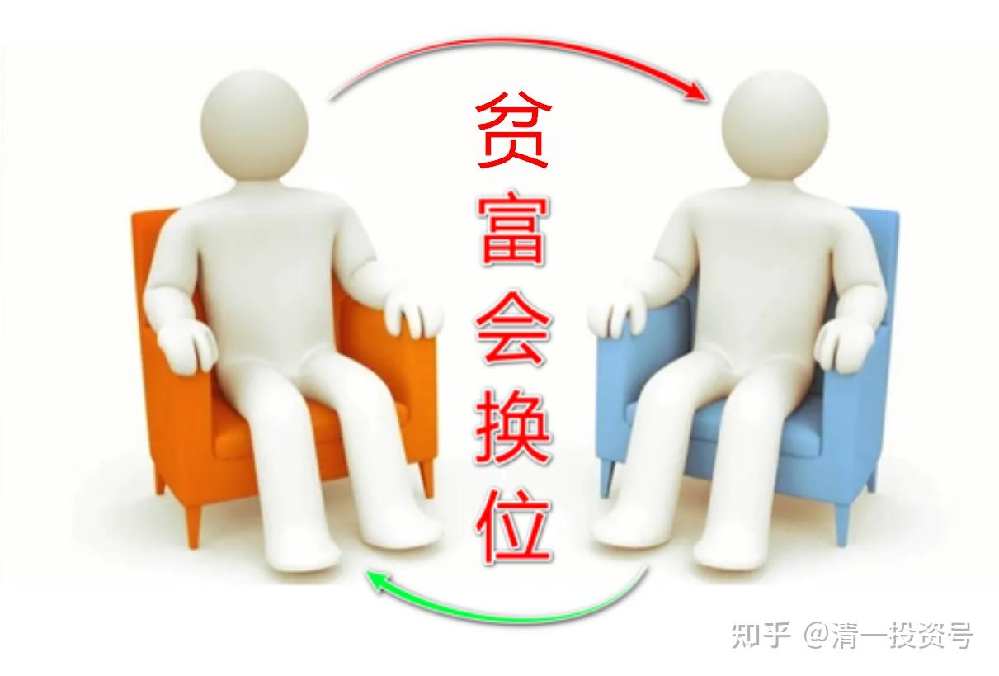
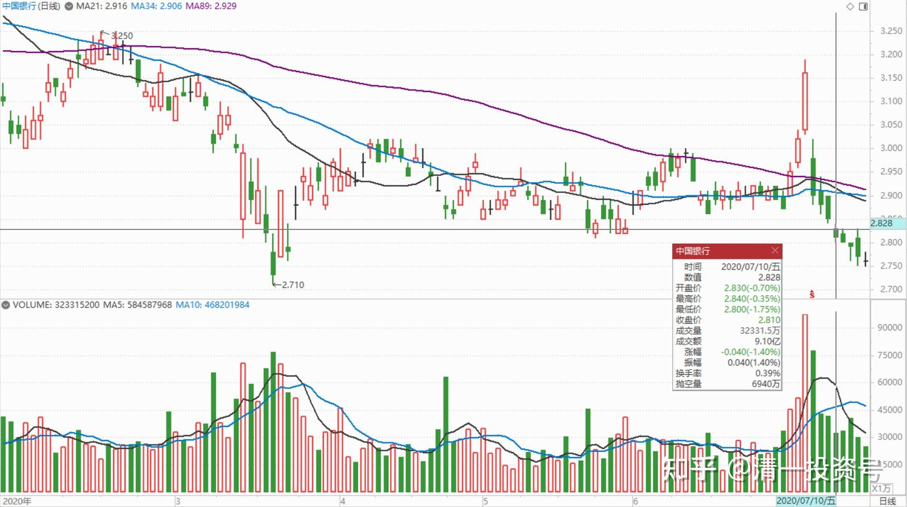
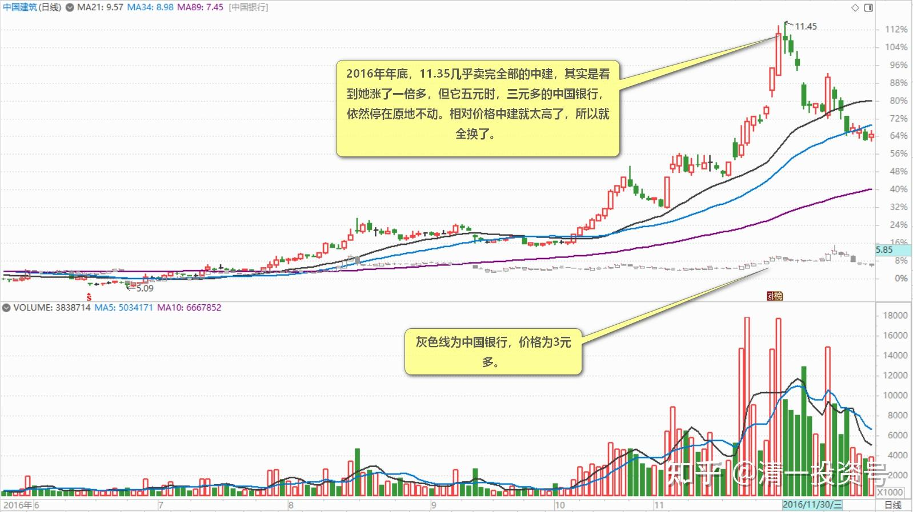
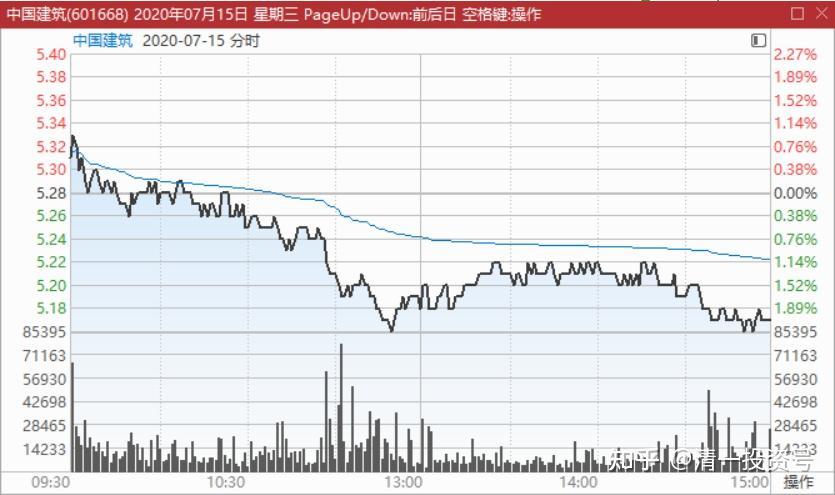
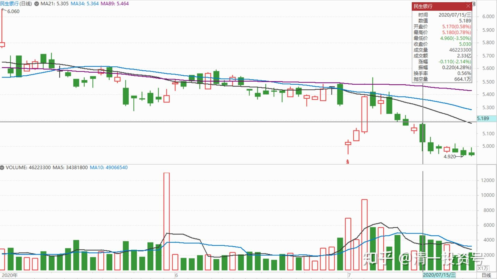
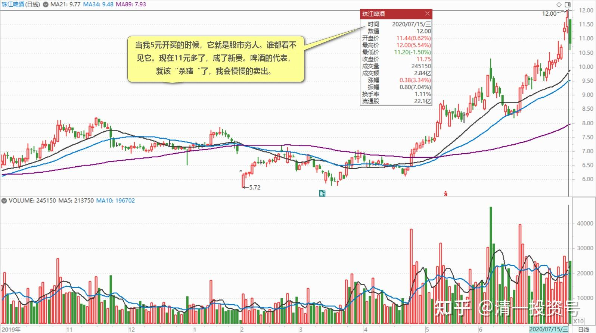
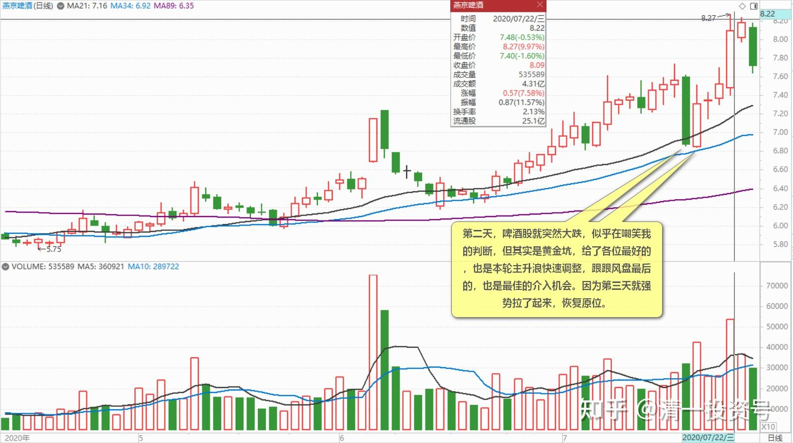
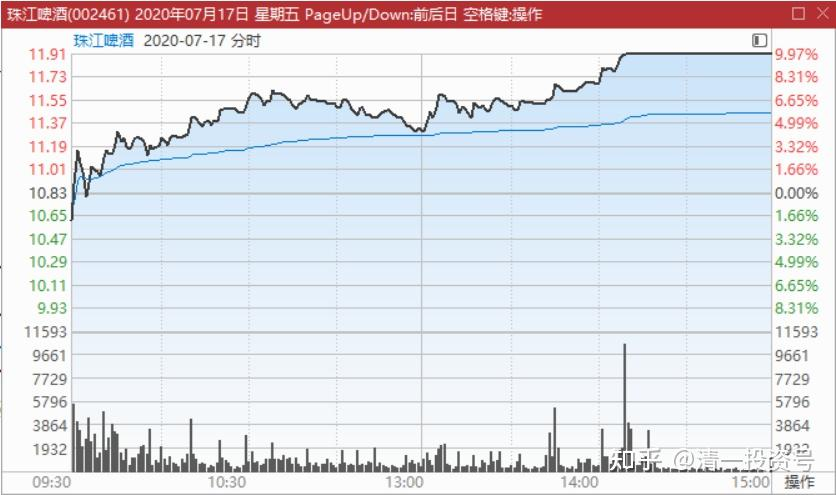

31篇.股票也分贫富，贫富会换位

清一山长 2020年7月10～7月22日

**一、要获得世界的金融发言权，就必须让银行系统获得信任**

清一山长2020-07-10 16:17:22

$中国银行(03988)$ 今天意想不到的会大跌，看兴业银行等都跌惨了，这个美好的日子（我认为大跌是美好的日子，大涨也是），不纪念一下实在不够意思。尾盘这段时间，就花了几百万元，买了两只最烂的四大行H股$农业银行(01288)$入手价格2.96元。中国银行入手价2.81元。

理由：银行，四大行。跌得实在不对劲。特别是农行，复权权价都跌到前期平台了。把中国牛市的涨幅全都抹光了。看除权价就更难看了。中国银行，更是代表中国人的脸面。被外资这样打脸，我们有点爱国心的人心中也不好过。就出来，买点四大行，给“中国牛”助助威罢了。虽然我也不知道“中国牛”在哪里。其几天吹“牛”的大V们，今天在买买买吗？

换个角色来想：如果我是美国人，肯定不乐意中国股市走牛，**绝对要利用香港市场来影响中国市场。**他们在香港有很多的手段可以使用，牛熊证，期权等等。其中，打压中国的银行是最好的选项。想把中国股市玩残，把国人对牛市的幻想打消，最好的办法，就要拿中国的代表性银行下手，比如四大行等下手。成交单上，农行总共分了八笔成交，平均每笔成交十万股左右，显然不是散户作为。

这样子，肯定就是不能买银行了，注定被美国人打压的。不过，可以再反过来想呀？**中国想要获得世界的金融发言权，就必须让银行系统获得信任。就算保不了普通的银行，一定会不惜代价保四大行。如果要有中国牛市，也会拉四大行的。**所以，买四大行，可以像买保险一样。不用担心会破产的。我赌中国赢。所以买中国银行！

下周会再跌吗？我就再买[大笑]。如果被套牢了，我就假装自己是价值投资，是来吃股息的人，守住等明年再说。

如果短期内就涨了，我就学投机客，只有市场给了20-30%利润，我卖了就跑。然后拿着资金等下一次机会。

晕娜回复就不帅：（跟评上贴）

依我看，中建股价到了你说的涨幅，山兄应该会减仓，但，不会清仓。我瞎猜，山兄会把盈利留作底仓，这钱反正也是白捡的，即便出现较大回撤，也不太心疼。

清一山长2020-07-10 16:55:49回复晕娜：

如果中建慢慢涨，稳定的上涨，涨了50%我都不会卖。但涨快了，涨急了，我会出掉20-30%的仓位。短期大涨了，涨到我认为买其他股收益比它更大了。也会跑掉。（2016年年底，11.35几乎卖完全部的中建，其实是看到她涨了一倍多，但它五元时，三元多的中国银行，依然停在原地不动。相对价格中建就太高了，所以就全换了，没想到歪打正着，后来中建就跌了，中银又涨了一波，纯属我运气好罢了）。只要我看中的股票跌急了，我都会额外加码买进一些仓位，多吃一点。涨了就减掉一点，保持余地。一般这种灵活配置仓位，不超过20-30%。这些仓位，是用来做T投机的。可以明显地增加持仓收益。以后中建作为主仓，不会轻易全部卖出的，不像原来对待中建的态度（原来的主仓是啤酒，我也没有完全卖出，一直在增增减减的，要不就做T逐步减低成本，T失败了，就逐步退出），**中建未来取代啤酒，成为长持的主仓。**时间可能漫长（除非啤酒涨太快）。也可以两个类别一起走。只要谁涨多了，我就会换股的。**总仓位，保持平衡状态，永远拥有一批低估的股票拿分红就好。**

**二、看空不做空，一股也没有卖出**

清一山长2020-07-15 12:06:38

$中国建筑(SH601668)$ 昨天果然被我言中：中建真的在出货。

但我看空不做空，中建一股也没有卖出。这几天我中建上的账面浮盈快速下降，“损失了”几百万。但心态淡然，反正一股未少。我准备她跌破五元后，再继续加仓。不跌破，就维持好了。谁创新低纪录了，我去买点做纪念品。赔赚都不管！

今天拉黑了一个同时关注我以及晕娜，嚷嚷“中建还我钱来”的傻瓜。我最后买入是4.81元，晕娜的最后买入价格是4.77元。现在都还是赚的。你跟我们几元跟的？你要嚷嚷，自己嚷嚷。把垃圾信息推送给我的，绝对拉黑无赦。我不喜欢垃圾制造者！

我就算是4.81元买的中建，但绝对没说这个价格就不会跌。买入后，已经公示：我准备中建可能跌到3.5元的可能性。晕娜的观点，**大致上认为，按照历史上最低记录也跌不破4.5元（0.67倍PB）。我认为，可能历史就是用来打破记录的，不排除破四的可能。但我不会恐惧。**我要做的是：打破记录之时我依然在场，还不损分毫（指股份数量不会被平仓，不指金额涨跌）甚至还增仓。

这个策略，使得我在珠江啤酒上越战越勇，最终创下酒类股利润最高记录。想要打破这个记录，恐怕只能靠燕京了[笑]。因为燕京我也是越跌越买。最终仓位超过了珠江最高的时候。

熊市，是布局的时候，有啥好慌的。

牛市是收获的时候，可以喜悦，但别疯狂！

熊市和牛市，都是我们的朋友。

**三、股票也分贫富，贫富会换位**

清一山长2020-07-15 11:48:23

$民生银行(01988)$ 上周我说，离本轮“牛市”上涨的起点，还有5个点。今天就到位了。现在看几天前标题大叫牛市来了的大V帖子，是不是很讽刺？

上涨的时候，留一份清醒，不要酒不醉人，人自醉，别一兴奋就融资追涨，借钱买股。我上周一，还看到有人卖房一把梭哈要大买券商的。本周如何过呢？热锅上的蚂蚁吧？

**下跌的时候，留一份糊涂，不要过于计较账面的得失。赚不了钱，就多赚一点股。抱**慈悲之心，用分红，省下来的生活费，继续买一点这些逃命人的逃命筹码。给他们机会拿钱回家。

本次“牛市”，我看空不做空，也不卖出。造成账面跌了不少钱（反正也是虚的）。但心里踏实。本来这些涨跌就是虚的。你一个股也没有少。当然，我也有一些股创了新高。可惜现在的仓位不重了。重仓的话，依然会卖掉红股，去买跌惨了的“惨股”。我喜欢“杀富济贫”[俏皮]。

鸣人coo回复清一山长：（跟评上贴）

杀富济贫，山长果然朋友啊[哭泣]！

清一山长2020-07-15 12:52:28回复鸣人coo：

**“杀富济贫”的含义：股票也分贫富的。**古人说：富在深山有远亲，穷在闹市无人问。股票也一样。有远亲的股票，经常被人说：“俺原来也买过”的股，就是“富股”。但明明买了这个股，要不都不敢告诉人，生怕让别人知道买了这“穷鬼股”的，还有买了这种股，就一直骂娘，就是“闹市无人”的“穷股”了。

**股票也跟人一样，贫富会换位的**。不会永远“阶层固化”：一只股票，一旦涨了，就像穷人脱贫，变成了富人一样，不再是一脸的寒酸样，不再是没人理睬的烂股，不再被股民们无视，甚至鄙视，骂娘了。它换了豪华的外表和衣裳，换上了“热门股”的标签，还经常动不动就玩两个涨停版之类，经常跳到媒体热点推送，让粉丝们激动不已。这股票变富人了，名人了，这时候，也不跟穷人玩了，它身价高了，就只跟超级有钱，愿意大把花钱的富人交朋友了。富人们也与跟它交朋友为荣，不会斤斤计较养股需要的钱，多几毛，少几元。现在谁手上没有招商，没有茅台，都不好意思说自己是炒股的。你手上，如果有这种富股，继续花钱养着就不划算了。富了，就该“杀”了，跟猪一样，肥了，就该宰了——我们把“富股”好好地卖给有钱的富人，让它去过好日子就行。比如我还做过十大的珠江，当我5元开买的时候，它就是股市穷人。谁都看不见它。现在11元多了，成了新贵。啤酒的代表，就该“杀猪“了，我会慢慢的卖出。

相反。有些“穷人股”，缺钱，缺资金关注。所以一直跌跌不休的，天天被粉丝骂娘。所以，**卖掉不缺钱的“富股”，买入缺钱的“穷股”，越被骂得凶的股，越多花钱买点。这样子，就是“杀富济贫”，我就是“股市上的梁山好汉”**[加油]

当然，我还会用股市赚到的钱，用来每年给几十个学生提供免费上学，供吃供住的机会，代人养孩子。也是另一种“杀富济贫”吧？**把从股市上富人手中抢来的钱，用来送给最需要优质教育的普通人家，让进不了名校的优秀学生，去读一个学费让人望而生叹的私立精英学校，也算现实生活中的梁山好汉了**[大笑]。

**四、大盘跌，啤酒涨**

清一山长2020-07-15 15:03:28（主贴1）

$燕京啤酒(SZ000729)$ **大盘跌，啤酒涨。高股息的蓝筹跌得找不到北。微利的啤酒却涨出阶段新高。**为啥？

价投们会卖掉啤酒去买兴业，中建。但趋势投资者，应该会卖掉兴业和中建买啤酒。

谁对？我认为趋势投资者对。啤酒强势本身，就是现在和将来要走强势路线的明牌说明，

谁错？卖掉啤酒去追蓝筹的人错。蓝筹可能今天跌了，还会继续跌。

我跟谁？谁都不跟，光看不练！

中建、兴业，我看空不做空，想都不要想空。茅台倒是很想做空，但真不敢做空[俏皮]

燕京、惠泉、珠江，我看多不做多。维持现有仓位即可。

成本的故事回复清一山长:（跟评主贴1）

好一个看多不做多，竟无力反驳

清一山长2020-07-15 16:27:53回复成本的故事:

我早就看多，做多了啤酒，早就重仓了啤酒。是2019年两家啤酒公司的十大。现在也还是一家啤酒公司的十大。现在才来做多啤酒？这眼力也太差了吧。现在做多，只好拿钱买门票了。我在轿子上坐稳就好[俏皮]。

爱玛生活笔记回复清一山长:（跟评主贴1）

是珠江的十大吗？

清一山长2020-07-15 16:55:31回复爱玛生活笔记:

是2019年底，珠江唯一的自然人十大。

清一山长2020-07-22 13:49:51（跟评主贴1）

我一周前写的这个看好啤酒强势，已经最适合右侧进入的帖子，现在回过来头来看，是不是价值无穷？有34万人看了这个帖子，几个人真买了啤酒？你有多少钱去执行本帖的原则，你就有多少相应的利润，珠江、燕京，都很慷慨地给了你右侧大赚的机会。特别是我写帖子的第二天，啤酒股就突然大跌，似乎在嘲笑我的判断，但其实是黄金坑，给了各位最好的，也是本轮主升浪快速调整，跟跟风盘最后的，也是最佳的介入机会。因为第三天就强势拉了起来，恢复原位。珠江当日涨停。今天，燕京也冲涨停了。而不相信这一天我判断啤酒已经走强，蓝筹，中国牛没戏的论断，继续死守大蓝筹的，只能望洋兴叹了。干嘛不把啤酒的钱挣了再来买大蓝筹呢？我就是这样玩“价值投机”的[赚大了]。目前我的啤酒持仓很重，去年底就公开说，今年我的投资业绩，就靠啤酒了。啤酒没戏，我的账户就会很难看。看来今年还不错。我今天再说一个：明年的账户记录，我靠中建。中建有戏，我就有戏。没戏，我洗了睡等[大笑]。

(标题、图片为编者所加)

文章音频链接：

[376篇.股票也分贫富，贫富会换位声音免费在线播放-喜马拉雅](http://link.zhihu.com/?target=https%3A//www.ximalaya.com/youshengshu/77991214/669295448)

**参考链接：**

[12篇.早期珠江啤酒、燕京啤酒的换仓记录](https://zhuanlan.zhihu.com/p/602033762)

[13篇.买卖操作后的富足之心](https://zhuanlan.zhihu.com/p/604162057)

[14篇.珠江的破位急跌，名曰跌停进货法](https://zhuanlan.zhihu.com/p/606062514)

[22篇.它很可能是下一个重庆啤酒](https://zhuanlan.zhihu.com/p/645392522)

[23篇.危机时刻好公司不用担心](https://zhuanlan.zhihu.com/p/646998882)

[24篇.守住筹码很不易](https://zhuanlan.zhihu.com/p/648860208)

[25篇.筹码收集完毕，正在养股](https://zhuanlan.zhihu.com/p/650255857)

[26篇.现在最应该做的，就是稳稳的做好轿子](https://zhuanlan.zhihu.com/p/651196882)

[27篇.股票交易风格与伴侣选择](https://zhuanlan.zhihu.com/p/653139189)

[28篇.看图要反着看](https://zhuanlan.zhihu.com/p/654521213)

[29篇.行情还没完，后面还有大机会](https://zhuanlan.zhihu.com/p/655878269)

[30篇.给做短线人的建议](https://zhuanlan.zhihu.com/p/657061174)