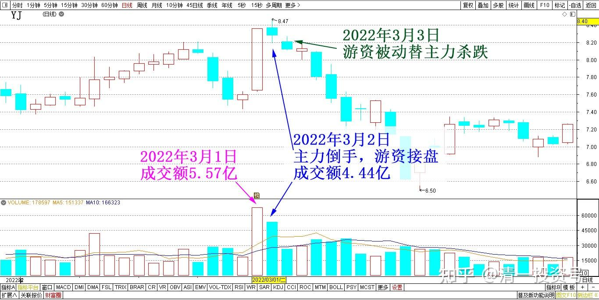
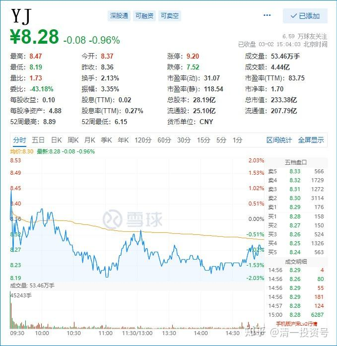
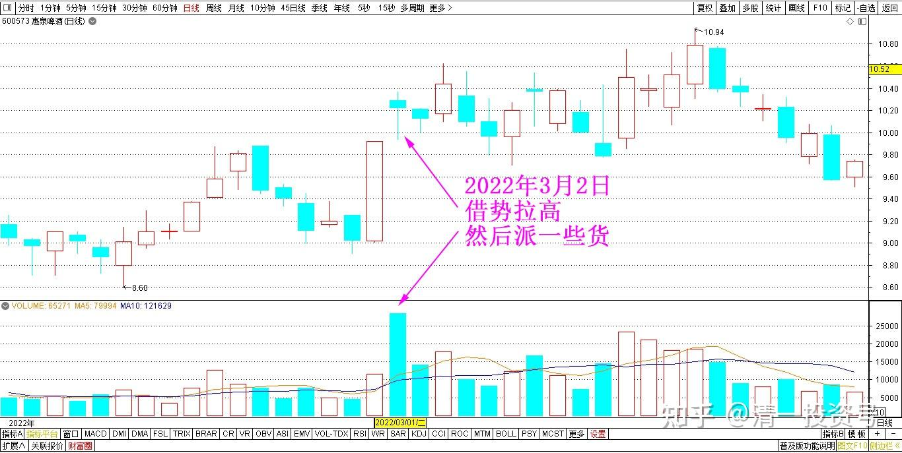
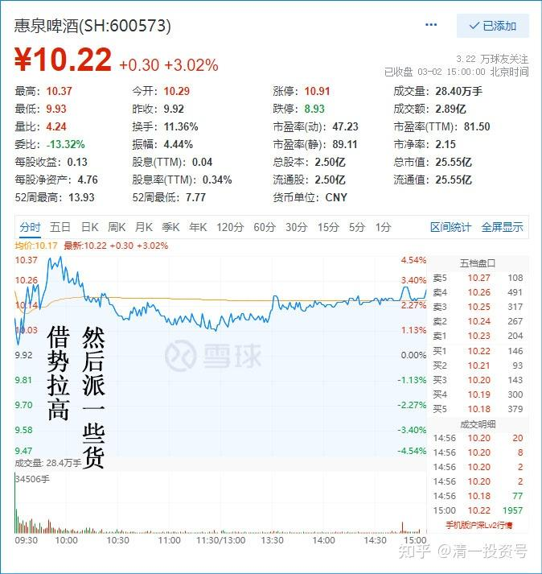
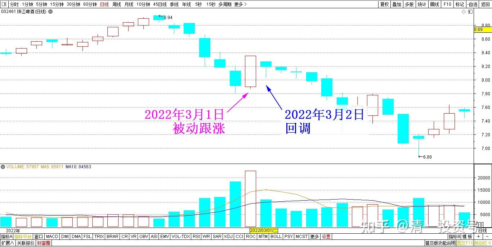
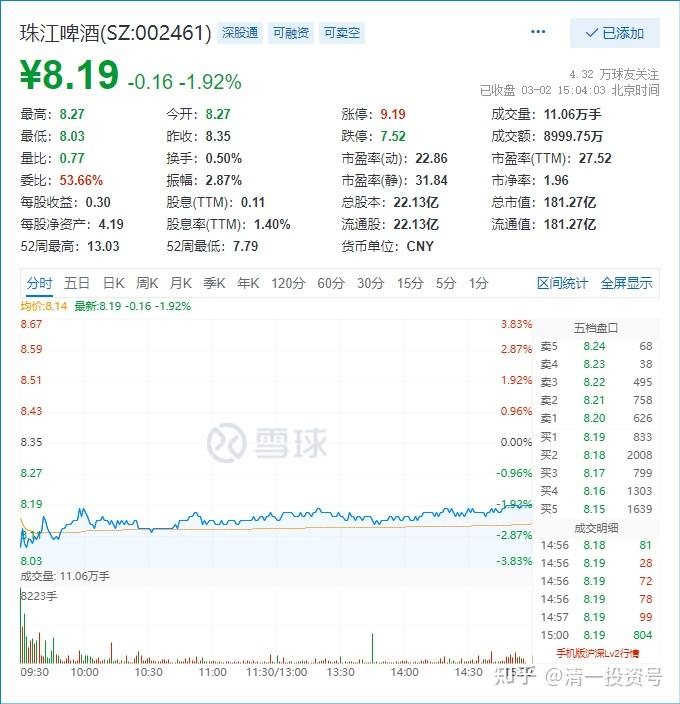

专篇26.主力倒手，游资被动替主力杀跌

**清一山长** **2022年3月2日**

说明一下：今天上午。价格没涨，YJ的成交，却跟昨天大涨8个多点是一样多，都是三个多亿。所以我说是很不正常的。昨天下午涨停了，也才5个多亿呢！今天看样子，收市的时候，成交量估计与昨天差不多，再少也不会低于四个亿，也许就是五亿的样子。所以我认为：**今天一定是主力在倒手，把昨天吃进的份额重新吐出来了**。只是接盘应该是专门追龙虎榜的游资，快进快退的，否则不可能有这个量。拉涨了有这个量正常，下跌了有这个量绝对不正常。理论上说：如果我的判断正确，今天抢进来的游资，**如果看到今天的走势不对劲的话，说不定明天会主动杀跌走人，不恋战。昨天的走势，技术上是突破走势，最正常的走法就是继续上涨，最符合主力的利益。所以游资进来抢盘。**但YJ主力一贯习惯愚弄人，**所以反手把昨天拉涨的筹码扣回来，给了游资，所以，游资会被动替主力杀跌的。**如果拉涨，就是主力替游资抬轿子了。我认为YJ主力才不会去干这么雷锋的事情。不过：YJ主力一向摸不透他们的想法，喜欢出奇兵。我这是正常的推理，不一定会对。我现在只看不动。敢重新跌回去，我就全部重新买回来[大笑]。

YJ 2022年2月～3月 日线图

YJ 2022年3月2日 分时图

比较——惠泉今天的走势正常得多。也因为正常得多，所以惠泉没有啥余味。空间不大才会这样走。

换句话说：**惠泉今天的走势，才是正常的，借势拉高，然后派一些货出来。这是典型的游资出货走势**。今天惠泉冲进来的人，大概率被套。不过如果将来YJ上涨的话，惠泉作为跟随者，也不好跌的。所以不好说风险多大，关键看YJ未来了。如果惠泉价格低于YJ，我会很乐意换一些惠泉在手上的。高于——就算了。

惠泉啤酒 2月～3月 日线图

惠泉啤酒 2022年3月2日 分时图

珠江今天走势也是正常的**。珠江现在没有主力，昨天是被动跟涨。今天回调。典型的弱势，没有看头。**不知道一年多前率先领涨的华南小霸王，今天变成了过去的YJ一样，弱鸡！

珠江啤酒 2022年2月～3月 日线图

珠江啤酒 2022年3月2日 分时图

文章音频：

[381篇.主力倒手，游资被动替主力杀跌_清一投资号文章同步音频- 喜马拉雅](http://link.zhihu.com/?target=https%3A//www.ximalaya.com/sound/671795910)

**参考链接：**

专篇1 [306篇.前缘1.雪球的最后一贴--胜利曙光都已经出现](http://link.zhihu.com/?target=https%3A//xueqiu.com/2017773236/247159187)

专篇2 [307篇.被特别关照的股--前缘2](http://link.zhihu.com/?target=https%3A//xueqiu.com/2017773236/247387457)

专篇3 [308篇.立此存照--前缘3](http://link.zhihu.com/?target=https%3A//xueqiu.com/2017773236/247580614)

专篇4 [309篇.见识传说中的拖拉机账户](http://link.zhihu.com/?target=https%3A//xueqiu.com/2017773236/247973779)

专篇5 [310篇. 拉升在即](http://link.zhihu.com/?target=https%3A//xueqiu.com/2017773236/248351982)

专篇6 [311篇. 进入右侧投资时代](http://link.zhihu.com/?target=https%3A//xueqiu.com/2017773236/248658236)

专篇7 [313篇. 小主力进货的阶段](http://link.zhihu.com/?target=https%3A//xueqiu.com/2017773236/249221851)

专篇8 [316篇.两轮回调对比](http://link.zhihu.com/?target=https%3A//xueqiu.com/2017773236/249675370)

[专篇9.主力的水军](https://zhuanlan.zhihu.com/p/619400004)

[专篇10.主力完成筹码收集](https://zhuanlan.zhihu.com/p/629948708)

[专篇11.主力、游资、右侧投机客纷纷进场](https://zhuanlan.zhihu.com/p/631628731)

[专篇12.进入震荡期](https://zhuanlan.zhihu.com/p/633057526)

[专篇13.永远回避风险，不亏损第一](https://zhuanlan.zhihu.com/p/635191087)

[专篇14.高位十字星缩量及主力操作的三个阶段](https://zhuanlan.zhihu.com/p/635191930)

[专篇15.准备起跳](https://zhuanlan.zhihu.com/p/636886203)

[专篇16.大幅回调，老手加高手](https://zhuanlan.zhihu.com/p/638552635)

[专篇17.股东数所传递的信息](https://zhuanlan.zhihu.com/p/639002631)

[专篇18.突](https://zhuanlan.zhihu.com/p/640000051)[破9元是燕京的基本目标](https://zhuanlan.zhihu.com/p/640000051)

[专篇19.YJ、惠泉今天盘面语言对比](https://zhuanlan.zhihu.com/p/640550916)

[专篇20.暗示洗盘快结束](https://zhuanlan.zhihu.com/p/641509884)

[专篇21.现在是新主力的成本区](https://zhuanlan.zhihu.com/p/642330561)

[专篇22.成熟投资者的思考方式](https://zhuanlan.zhihu.com/p/655404597)

[专篇23.主力未走，迟早变盘](https://zhuanlan.zhihu.com/p/656816805)

[专篇24.涨停但不像拉升出货](https://zhuanlan.zhihu.com/p/657944680)

[专篇25.裘国根清仓式减持华能国际电力港股](https://zhuanlan.zhihu.com/p/659254254)

