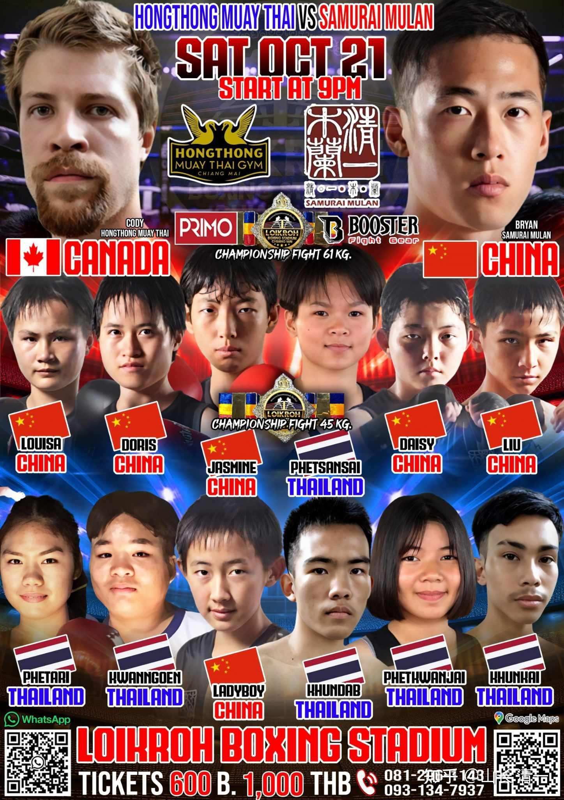

所有的实战格斗武术，都不是招数动作的比拼，而是功力的比拼。是拳手怎样获得在有最强大力量支持下的招数有效击中目标。以为比划几个动作就是武术？其实这只是跳舞！

所以：功力练习。是所有的格斗拳手都必须掌握的技术，而且是拳手们每天强化的最重点的练拳内容。

泰拳手常说：要维持比赛的状态，最重要的就是每天都要坚持跑步10-15公里。只要一段时间放松了，上场的状态就会很差。很容易被KO。

泰拳手还要大量的时间，去练习跳绳。每天必须坚持用全力打活靶，打沙袋。这些其实都是功力训练的方式。新拳手和老拳手的区别，主要是功力不同。技术上，招式上，其实练好之后，就没啥原则性的区别了！

经典的拳击格斗，强化自己功力的方式，主要是练习俯卧撑，哑铃，战绳，各种器械等等。目标无非是增加身上的肌肉群。这样练出来的打击力量，还是很强大的。一拳把人放倒，打碎一个人的下巴。绝对是没问题的。

副作用是啥呢---用太极的说法，就是练的是僵力。变化不够灵动。遇到训练有素的人，有力气也用不出来。另外--身体上有大量的肌肉，对心脏负担巨大。所以---拳手往往刚开始打的时候体重较轻，但越打越重。会跨越很多个级别。一些跟我们木兰过招的泰国女拳手，一年多一点，重量就增加了10多公斤。越打越累，力量虽然大了一点。毕竟体重在这里，但反应的速度。灵活性，反而下降了。

因此---往往西方标准的运动员，都有心脏病，篮球等项目尤其严重。如果加上选手的生活习惯不良，叠加大量肉食和喜欢喝酒精饮料等，身体的衰退速度更快！所谓的现代竞技体育，其实根本就不健身，不养身。还不如天天散步的老人家的运动，对健身更有利。当然---运动总比不动好，总比宅男好一些，起码精气神都不错。

太极拳法的训练，几年来，几个小木兰的体重并未明显增加，基本上维持在原地。但小木兰们的筋骨力量都增强了不少，甚至比一些男生的力量都强了。因为太极拳法的训练。，重在提升筋骨力量，不在肌肉力的增加。肉越多，心脏负担就越重。一些干干瘦瘦的内家拳的老头，身上爆发出来的力量也很强大。因此，这绝对不是西方训练方式能够理解的。如果内家拳的拳手，崇拜西方的体育理论，去模仿西方的格斗训练方式，训练出来的，就是西方的力量肌肉，叠加中国的拳法，四不像，就练废掉了！这么多年来，可以说一百多年了，中国人一直崇拜洋人。认为都是洋人的好，特别是体育界。格斗界的人，基本上都是读不进书，考不上大学的学渣，才去混体育圈的。没几个真有学问的人练拳。所以，体育圈。格斗圈，更是一昧的崇洋媚外，以西洋技术理论为榜样，也是可以理解的。读不懂古书的人，怎么可能传承传武呢？

很多传武不能打，原因就是：要么练拳人根本就没有去练功力。只练了招数动作。上场自然毫无作用。要么用了西方的力量训练方式，导致自己的技术用不出来。只能打王八拳。因为这些传武传人，根本就不懂功力训练了。也吃不了这个苦头。

国家体育总局，倒是有武术上【功力比赛】，内容就是空手劈砖，头碎石碑这类的东西。看起来很吓人，但实战中根本用不上。因为这些所谓的功力训练，脱离了实战格斗的技术体系。所以当然就是没用的杂技！

太极，传武的功力训练方式，我看现在，是基本失传了，没看到有人练。陈家沟倒是非常重视功力训练，要么用一些古代外家拳的训练方式猎奇。真实的格斗训练，就是用现代格斗的散打技术在训练。西方格斗的模仿品。再打一套拳，表示自己是“太极传人”，自欺欺人的玩“传武”。现在，可能只有靠我们的拳手，有机会来恢复一下传统的练法，正本清源，把老祖宗教的好东西传承下来。

一些传武门派，有用石锁等练习功力的。这种东西与西方的哑铃，杠铃等差不多，属于练肌肉力量的，双重发力，基本上是外家拳一派的。

内家拳练习发力的工具，其实核心就是”大枪“---大杆子。现在，各派太极，也自称有大杆子的练法，枪法练习。我看了一些名家的示范视频，认为他们根本不懂大杆子是练啥的！都是双重发力。各位看看这个是啥？

[超燃 太极大枪修习 内附高手视频 新人第一次用pr剪辑_哔哩哔哩_bilibili](http://link.zhihu.com/?target=https%3A//www.bilibili.com/video/BV1AK4y1U7b1/%3Fspm_id_from%3D333.788.recommend_more_video.-1)

假如你要问这个“内家高手”：你练的这东西，实战中该怎么用？他肯定不知道。据说练弹抖力，怎么用出来呢？大杆子这不是练习枪法。而是用器械练出拳法来。根本就不需要玩什么“化枪为拳”，而是“枪拳合一”。两者本质上是一样的。我要求木兰们出拳实战的时候，就像手上有一个虚的大杆子出击一样去打人。这样练出来的功夫才能实战。上面视频练出来的东西，只是表演罢了！别当真了，他自己都不知道怎么用！

[六集大型纪录片《藏着的武林》——揭秘真实的传统武术_哔哩哔哩_bilibili](http://link.zhihu.com/?target=https%3A//www.bilibili.com/video/BV1mh411f7My/%3Fp%3D2)

不过---中国的传武，由于没有自己的平台。只能设法进入【国家权威平台】。而这个国家权威平台。就是中国大学的武术专业。只有获得这个文凭。似乎才是“正宗”。在这种情况下，传武的拳二代。三代们，为了获取正宗资格，不得不把自己的传统拳改为“国家标准拳”，去迎合国家套路。看着纪录片中的老拳师，为了一个上大学的资格，让孩子年复一年的练体操，不觉心酸。因为没有真正的中国武术的展示平台，也只能去练体操了。如果真去研究打实战，这么多年，这孩子一直听话练习，如果这种传武拳，真有实战能力的话，是不是早就打出来了？如果就是打不出来，是不是就死心算了：让它灭绝算了？这样不死不活的瞎混下去，不就是误人子弟吗？

我听说：一个很有名的门派的掌门人，非遗传承人，为了取得【国家武术段位资格证书】。自己本人（不是儿子），不得去去练啥“段位拳”，练起来难受和别扭至极！最终没办法，找了高层的领导，托人过关。勉强给了个武术六段的称号。

我知道多名非遗传人，老拳师都在为自己的后代操心。他们认为自己一辈子练武，都没有一个好地位、原因就是没有进入体制。所以--都想拼命把孩子送入体制去。第一步，就是设法把孩子送去中国的体育大学的武术专业“深造”、拿个正规文凭。就像这个视频里面一样---丢掉传统，迎合现代。这种中国的武术文化和土壤里面。哪里可能有传武的发展空间呢？等这批老人死了，传武就真的灭绝了！因为中国就没有给真正的传武一个生存繁衍的机会。国家只给了假传武一个舞台---表演和比赛。至于传武实战----别说传武了。就算是拳击，以及现代格斗项目，基本上拳手想要靠比赛来生存是完全不可能的。这些项目，全靠国家拨款支持。得不到皇粮的机构，只能靠骗家长搞培训来生存。这种背景下。中国武术怎么会有发展机会？

因此，看透了这点之后，我们不可能指望靠国家来给我们弘扬传武。只能靠自己了。我们在【小国大赛场】，在泰国这样一个小小的格斗大国，这样一个全世界拳手都会来学习提升训练的地方，在实战的赛场上，练出我们的实战传武，打出我们太极的实战威风来。别人说借船出海。我们是出海借船。先在海外开花，再回国效力！学当年的华侨出国创业。然后回国帮助中国发展经济。我们出国练兵，回国后帮助中国发扬国粹，迎接万方来客！

训练手段上，我们也非常的“传统”。完全不同于现代格斗的训练科目。早上甚至以【拳舞】来做开场体能训练！完全创新（复古）的做法！

清一武馆的人，练习大杆子。不是为了使用枪法（似乎也没有枪法比赛）。但要用枪法来练出太极的劲力来，场上要实战的。因此找的是4米多五米的大杆子。我们在泰国，也找不到国内的蜡木杆子，只能找泰国用于建筑材料做泰式老房做屋顶的木材。一整根树木做成的大杆子，特别重，大概20-30斤，也很粗，一只手握不住。这比较符合老祖宗大杆子的原材料选取方式---简单化。我让拳手们用大杆子来扎树干，有两棵树就给孩子们戳死了。虽然泰国的树多，也耐不住他们这样戳。后来就把两个轮胎捆在一起，吊起来让他们戳去。

练法是用开合劲，旋身劲去发力戳轮胎，一次要打击两下。还不许站原地，必须移动中发力攻击。还必须单腿发力，用上钻翻劲来打。不能用双腿支撑发力，平举平刺。这种大负荷重量的大杆子练下来，人会特别累，体力消耗巨大。但----练出来了，出的就是功力。这种练出来的拳手，跟对手一搭上手，只要用上了开劲，对方就飘起来了。用上了合劲，对方身子会被定住一样移动不能。然后被随后跟上来的旋身拳击倒。

古书上传说祖师们就是这样打人的。后世都不相信。其实就是后人们没有踏踏实实的练功力，所以一样的招数，你用就用不出来，两者根本就不是这么一回事。一个简单的云手，带上功力之后，去接住对方打上来的拳。对方就是飘的，看上去就是手无力抵抗转开暴露自己的中线，直接把自己的脸凑上来挨打的样子。看热闹的会说是两人配合的。实战中对手会告诉你接手后对方的力量非常的强大，接不住被打。只能怀疑对方吃了禁药。

真太极招数不复杂，看起来简简单单的，真的就是套路中一样的动作。没啥惊人的地方，也不怪异，平淡无奇的样子。只是练过功力的人，使用出来就效果惊人。而没有练过功力的人，这样的动作，是不可能发出力量的，练出来就是笑话。没有教你发力体系的拳术，不管叫什么名字。啥传武，太极八卦形意。只要招数动作，就全都是体操表演。

古人说：练拳不练功，到老一场空。指的就是这种练武的功力。

现在的太极骗子，天天告诉你：拳打千遍理自知！教徒弟天天练套路，练招数。以为天天练拳多遍，这就是练功。 这只是瞎胡闹。你每天练几十遍，练上几十年的太极套路，你依然不会真太极！依然上不了擂台。

相反：一个拳手天天只练野马分鬃一式，天天想怎样用出来，最终练出了功力。这一招野马分鬃就可以打遍天下无敌手！不是招数厉害，而是功力不一样了。

想学套路很简单，我们的拳手，一个星期就可以掌握一个完整的传统太极套路。去参加国家体育总局数组织的传武全国比赛。还可以拿个金牌啥的。但拿来玩玩，做做表演没问题，拿来用，是没可能的。

可惜的是：中国一大堆学太极的人，有几个人，愿意一个野马分鬃招式，就学三年五年的？中国还有这种踏实认真的学生吗？

靠到处教拳谋生的传武大师们，如果教了学生三五年。每天只反复的用不同方式，教学生一个去练野马分鬃，他还收得到学费不？

因此---不是传武不行。而是传武的土壤已经没有了。所以练不出来了。

如今，我们用泰国的实战比赛环境。用我们不计名利的态度，用每天的汗水来浇灌真太极。用踏实的态度来认认真真恢复传武的威名吧！

*中国日拳手对决海报-----其中两场冠军赛*