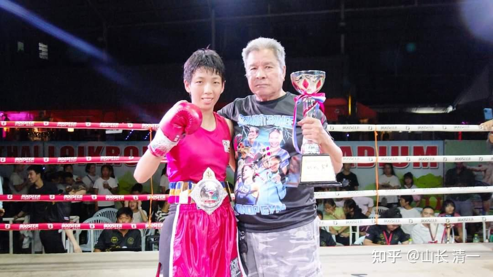
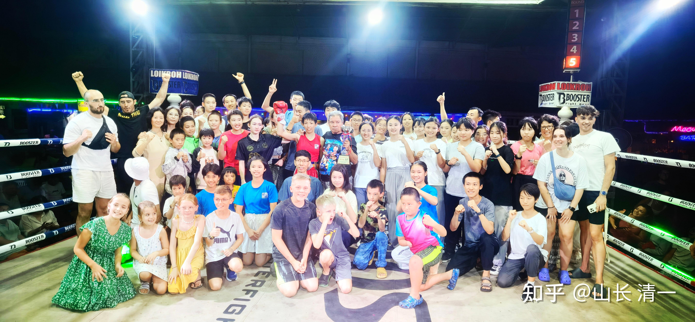
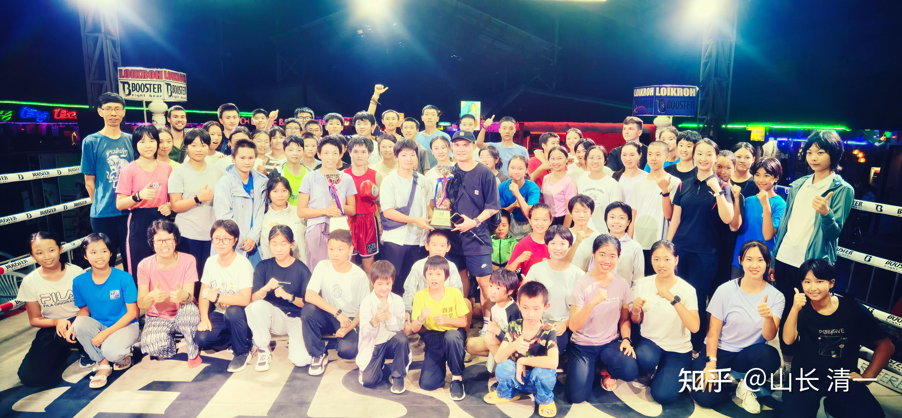
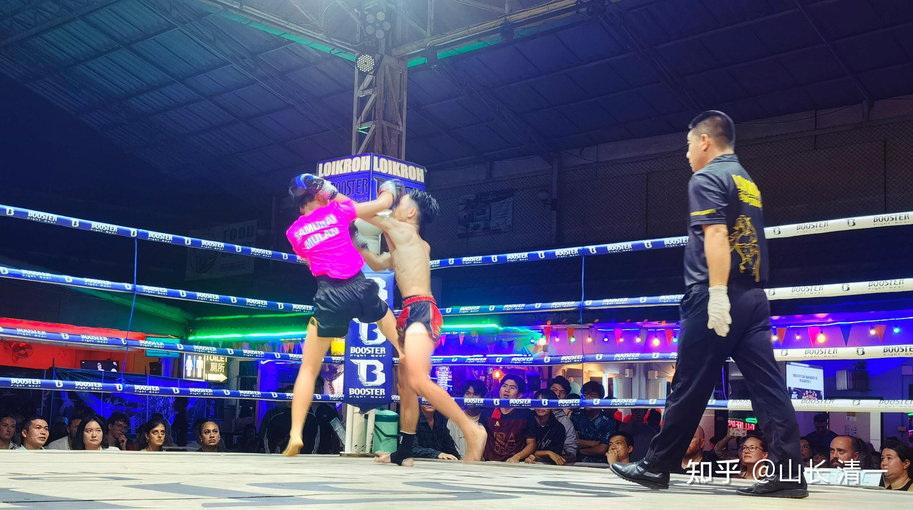
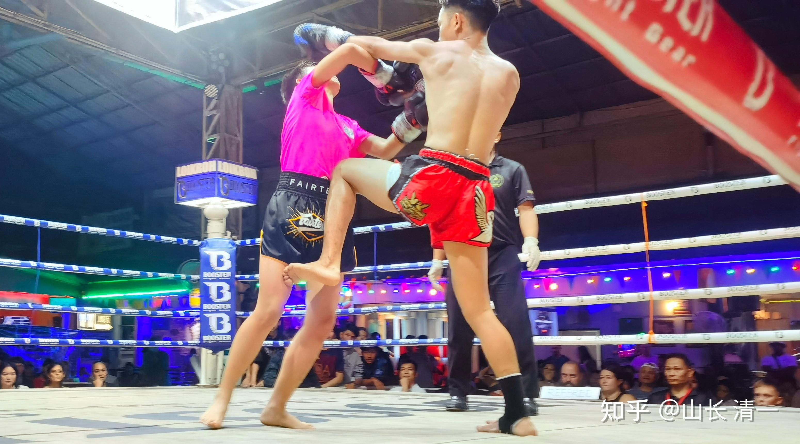
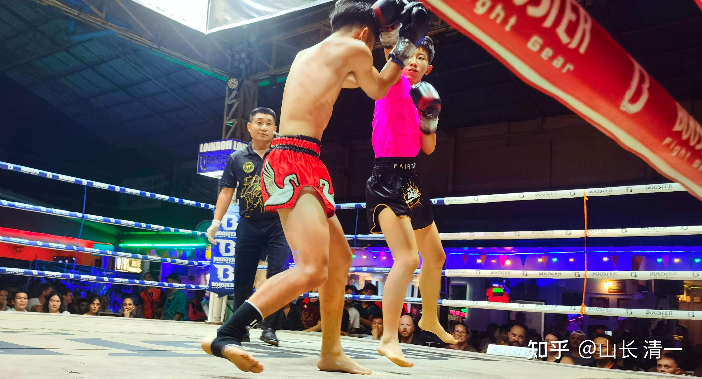
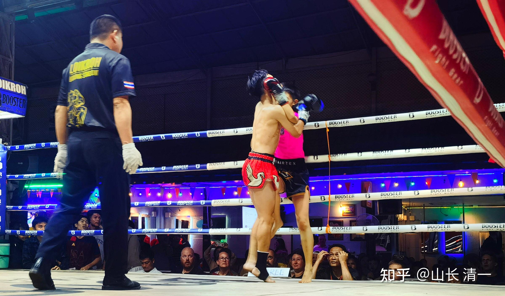

第一次的中国日，上一个春节的这次首界中国日比赛。我们环境很差，周围都是“敌人”：不仅仅泰国主办方潜规则我们，欧美白人就等着看中国人的笑话。甚至一批去看比赛的中国人，都在鄙视和嘲笑我们，想看我们的笑话。这些人还拿钱给泰国拳手，赌中国人输。公开在赛场上高谈阔论，我们国内买职业拳手来比赛等等。

昨天第二次的中国日，清一木兰拳馆，气氛完全的翻转，我们赢得了现场所有人的尊重。

**1：我们赢得了拳手的尊重。**每一个上场的拳手，都是泰方精心选择的优秀拳手，都非常认真的对待木兰拳馆的拳手，并全力作战，竭力支撑到最后。泰方拳手多次终场的时候跪拜，表达服气和敬意！他们内心真的承认木兰拳馆的拳手，是他们值得尊重的对手。

加拿大白人拳手，刚开始上场狂傲，以为可以轻取自己更瘦，体重更轻的对手明祺。他们两身高差不多，但一看就知道洋人的肌肉要比明祺多多了，绝对不是61公斤，我估计是70公斤左右。但高体重压不住我们的高技术，接下来西洋人无力对抗，被一路狂殴，多次被击倒，差点打崩溃，女友都跑上去安慰他，勉励支撑到终局后。铃声一响，就马上跪下l了---因为都累垮了。后来，连他自己都不相信---泰国方居然判了他赢比赛， 奖杯拿到手里很别扭尴尬的表情。在场的一些外国人，都觉得这个比赛结果太扯了。这个赢家---也对明祺很尊重---中国人不好对付！他是偷来的胜利！

**2：我们赢得了现场中外观众的尊重。**现场观众，有很多外国人是为了木兰拳手们的表现而欢呼的！明晓夺得金腰带之后，我们的学生们涌上台去合影。不少西洋人也一起站到台上，为木兰拳手的精彩表现而自豪！几个洋人孩子也上台合影。还有一个泰国私立学校的校长，也带自己的孩子来现场观战了！我们客场身份，生生转变成为了“主场”！

**3：我们赢得了泰国裁判和主办方的尊重！**

原来的泰国主办方，对我们是傲气和高高在上的样子。经常是一个瞧不起中国人的样子。遇到事情，根本没有任何商量可言的，对我们非常的不公平！

这一次，首先是相对公平了很多----七场比赛没有KO，但还是判给了我们四场比赛的胜利。虽然按照我认为真正的公平，应该是我们6胜一负**。五场是大比分压倒性胜利，一场是小比分非压倒性胜利。**唯一真正输掉的一场比赛，是明慧对阵男生的比赛，实力的确差一些。但泰方也明显作弊了---说了是上一个体重不能超过45公斤的新拳手。因为明慧就是这个体重的。赛前主办方，都一直保证对手才44公斤。你看真的吗？场上拳手一对面，站在一起对照，就知道肉眼可见的比明慧重很多。对手的身高虽然与明慧大致相当，但身体明显比壮实，整个要比明慧大一圈，明慧看上去要瘦弱很多。这也导致了明慧场上发挥不好，打不动对手的局面。但即使如此，明慧的内围战也没有吃亏，对方更重也无法摔倒明慧，而且明慧内围战不断击打对手，他还应付不来。脸上中了不少招。当然，对手应该也是比较新的拳手，上场也有些紧张，发挥也不是太好。所以打下来，明慧的确没有给对方太多伤害。如果按照中国散打的规则算点数，明慧应该是赢的。但如果按照泰拳的规则算，重击才能得分。轻击就算击中重要部位也不给分。因此张明慧应该是输的。因为明慧的很多打击比较无力，没有打动对方，不算分。因此我们可以承认这一场输了。但考虑对手又是男的，又是年龄大，又是超重，可以理解得到目前这个结果，小明慧也没有受伤（只是累坏了，今天一直在补觉，休息），我们的结果也不算差！

明祺的比赛，对手根本没有造成啥有效的攻击。反而自己经常出招落空后，就被立即还击，多次被击退位。位移明显，光迎面拳就中了很多次连续拳，还多次被击倒！明慧告诉我，赛后在拳手更衣室，她看到这个洋人一直坐着，用很多冰块顶在头上（应该是敷头），一脸郁闷的样子，不知为啥？我告诉明慧肯定是他的头部受伤了，应该是明祺的内围肘击中了他。另外拳也多次迎面击中他。他打下来这场比赛，真心很不容易，被虐惨了。

最终判胜的原因，我认为是主办方要给泰方的泰拳训练馆一个面子----昨天这个拳手是代表泰国有名的HONGSONG拳馆来参加的比赛。这是泰国各种赛事的主要拳手提供方之一，拳手经常去仑披尼，迦南隆比赛。馆长是仑披尼冠军，打过700多场比赛。泰国有多家分馆。泰拳馆是靠本国拳手出成绩来维持拳馆的名气，但泰拳馆都是全免费培养本国拳手。靠外国人收费来维持运行的。日本人也类似---中小学学生学格斗，去武道馆训练，都是不收费的。这就是中国职业拳赛不太可能有前途的原因----中国只有有钱人才能来玩格斗训练和比赛，普通人，不然连训练费都付不起。中国的武道馆，不仅不对学生免费，往往反而要靠收取中小学生的培训费来赚钱，用学生家长的钱来反哺一下成年职业拳手不去工作专职练拳的经济缺口。而且---中国人宁肯堆钱去旅游吃饭买东西，也不愿意经常花钱去看比赛。这种结构体系和价值观体系，跟国家体育一向是举国体制，国家豢养的运动员。因此，格斗世界也只能培养出急功近利的拳手，培养不出更多真正的格斗爱好者。无论传武还是现代格斗，这种格局都没有办法持续下去。与日本，泰国等拥有良好的格斗土壤。与浓厚的拳手有一定社会地位的国家社会气氛相比，差距巨大！

昨晚上场的加拿大人，就是泰拳馆的主要营业的主要对象---洋人金主。这些都是真正的格斗爱好者，他们是自己出钱，来泰国的泰拳馆训练的职业拳手。据我所知，欧洲的拳手，格斗爱好者，都会定期来泰国充电培训和比赛（中国张伟丽的备战，都是来泰国进行的）。我看他的场上技术，抱架和训练方式，原来应该是学拳击的底子。应该是来泰国拳馆训练泰拳，要补上腿击技术，练腿功的。但他的拳被中国拳手全面超越，完全施展不开。泰国学的腿法，对付清一武士也根本用不上。因此，泰国人也怕金主对泰国拳失去信心，因此有意发奖给洋人一点安慰。不仅仅是对这个洋人拳手，也是泰国人对被击败的这群泰拳粉丝洋人群体的一些安慰，就算是虚假的安慰也很重要，避免他们兔死狐悲，失去对泰拳的信心。所以赛事的主办方，才不顾自己的荣誉，坚持要让洋人赢，一定要给个面子。不仅仅是对泰拳训练馆的关系照顾，也有对洋人的吸金考虑，夺走我们的金腰带去安慰一下受伤的洋人，是可以理解的做法。不然---真按照昨晚场上的实力，判出来6:1的战绩，洋人是不是要怀疑泰国非常的知名泰拳馆，怎么还打不过中国人？将来谁还找他们学泰拳呀？夺人财路如同杀人父母。因此坚持要尽量想要判泰方和代表泰方拳馆的洋人赢，也是可以理解的！

但主办方肯定也考虑了这个结果对我们的不公。所以在赛后特别送了一个【最佳拳手奖】的奖杯给我们。安慰我们被丢掉的胜利，其实这个奖杯昨天主办方应该给明祺的。不过----其实泰方尊重的也不仅仅是拳手（甚至内心泰国人，是不太喜欢我们这种总是击败泰国拳手的中国人）。昨天泰方的尊重，不仅仅来自于拳手的优秀表现，也是外围的学生和家长，中国人的观众群体，也是主办方必须考虑的对象。如果做得太过分了，也得罪中国金主。

这就是真相-----一切都是利益。毕竟是商业比赛，不是奥运会。不能指望我们在泰国人的地盘上得到真正的公平待遇！对我们来做，权当练习的机会，为我们将来走上世界巅峰，做好充足的准备！

*赛后获奖的学生合影*

对于我个人来说，昨天也是具有家族历史意义的一天！

张明慧昨天的表现，是一个非常重要的突破！也是她对我们的张氏大家族的荣誉做出了重大的创造和突破的一天，成为为我们的张氏家族创造了“第一”的一天。

*赛前照片 主办方摄影师拍摄*

一：张明慧的爷爷，是我们张氏家族的第一个大学生（211大学）。

二：张明慧的父亲，是我们张氏家族第一个大学教师（985大学）

三：张明慧自己，是我们张氏大家族中，第一个走上武术擂台实战的人。张氏大家族一向非常重视教育，很多子弟基本上都以考上知名大学为荣，学风很旺盛。现在也有多名大学，中学教师和各行业的中上层岗位。但张氏家族从来没有武术上的追求和名分。我也是半路出家（大学才开始练武的）。张明慧是张氏家族第一个走上职业格斗擂台的人！将来也会拿到世界知名大学的资格。为家族文风之余，补上武道传承的创造！

*以下照片由宋老师拍摄*

如果一个孩子：总在想自己能为家族做点什么的的创造和贡献？她就是家族的贡献者，奉献者。而不是总想从家族里面捞点啥好处。消耗，消费家族的人。只有这种孩子，才能让家族发扬光大。必须拥有这种思维，才是真正的“家族传承人”。可惜---大多数富人家庭，哪里懂啥家族传承，以为有钱就有一切。其实培养出的都是一群消费者，不可能实现真正的家族传承的！

对于法脉---清一大家族来说，张明慧也创造了公主班的一些第一记录：她是公主班第一个走上擂台的小公主，而且首战就是打男拳手，创造了职业泰拳的“世界记录”。她的突破，也是公主班的突破。给了她的同学信心和希望，不再惧怕与职业拳手对战。会认真的练习提高自己。未来一年内， 公主班将有多名小公主，会站在泰拳职业拳台上的！昨天这一战，是公主班未来三年内，去取得泰拳，拳击全国冠军的起点站！是她们未来五年，在世界上取得奥运冠军的起点。

公主班的辉煌历史，刚刚开始进入开创的起点！这个起点还非常的高，是公主班未来伟大成就的起步！张明慧昨天晚上走出来的小小一步，是公主班未来大大一步的开端！

另---内幕消息 :张明慧下场后，对自己昨天的场上表现很不满意，认为根本没有打出她练习时候的水平。她也要克服自己的心理弱点。因此，她想要在半年之后，再与这个男拳手打二番战。她现在要潜心苦练出自己的本领，半年后要跟对手比比----谁的进步速度更快！

【有个小笑话----昨天比赛完后。场下张明慧和Ella一起，去向泰国的对手表示感谢。并表示想打二番战，将来会再跟他比一场的时候，对手表现非常的友好。还亲了一下她的脸，真把她当“可爱的男生”了。Ella大惊失色，来告诉我这事。我问明慧感觉如何：她说---泰拳手只是亲她的身份---假女人身份。是一种礼貌，表示尊重她伪娘的怪异选择罢了。昨天并没拿她当女生看，所以，没啥好多想的】

昨天的比赛：国内是安排了有直播的。一些朋友在线上看了全程比赛！赛后一个学员说：

小明慧是一个蓝孩子，就是和平型人格。我有一次去买早餐，她在我前面排队，结果所有人都插队，她也不说话，就在那里等。我看不下去了，等排到我的时候，我就让她先买了。[调皮]

居然女打男。我真的看哭了！[强]几度不敢睁眼。

@0179叶林琳上海 明慧的确是一个“蓝儿童”。本性是追求和平、回避对抗的。她违反本性，参加格斗比赛的唯一原因，是内心深处要捍卫家族的荣誉。因为她的哥哥姐姐，都没有学父亲的武学本领。她作为山长女儿，认为自己有责任去捍卫家族的武道方面的荣誉。幸亏太极给了她这种机会，可以用融合对方的方式来格斗。不一定要用对抗和拼杀的模式。当然---必须将来拥有很高的技巧才行。比如木兰们跟我打，就不容易造成对抗，处处引进落空，如果不想杀伤对方，就可以轻松摔翻对方，控死对方，让对方根本无法攻击，也无法防守，只是不断的失去平衡。这样双方都不容易受伤，看起来甚至像是跳舞，但最终让对手毫无办法。如果想要伤对手，更容易，雷霆一击，就可以让对手绝望。胜负分明！这就是（打人容易控人难）。张明慧不喜欢打人，但要学会更高级的控人的话，难度比“打赢比赛”要难多了！必须超越第一阶段---会打人。对她来说，练太极是一种很不容易的挑战。但我们人，就是在挑战自己的弱点的时候，成长起来的！