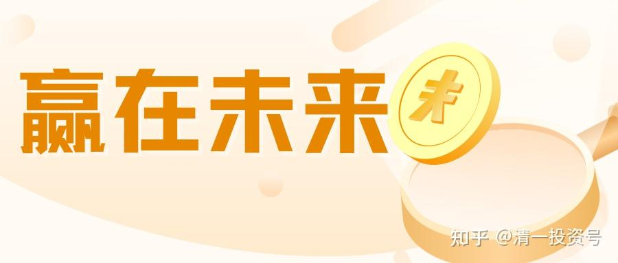
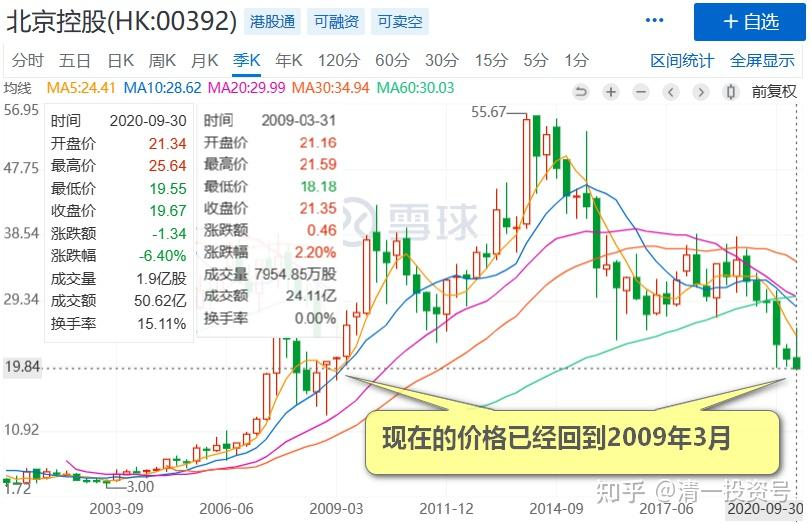
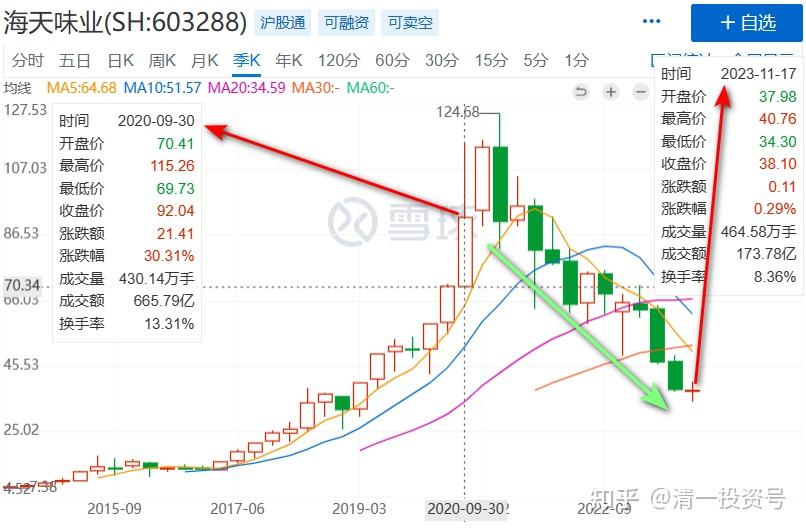
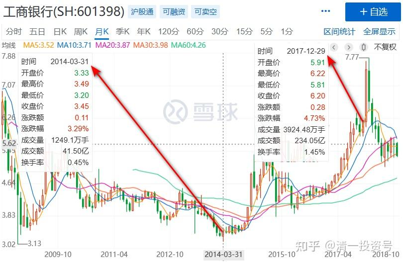
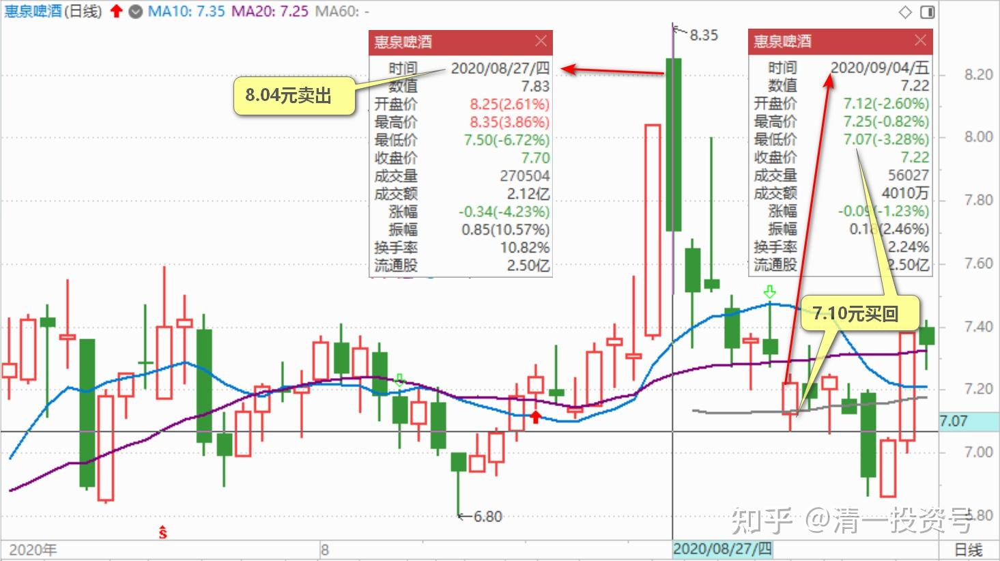
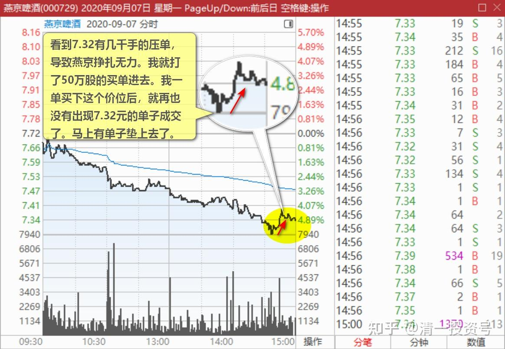
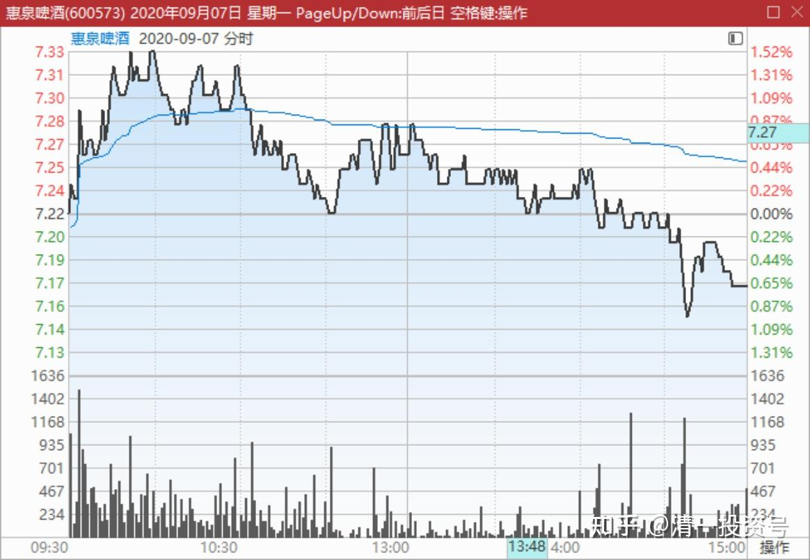

39篇.我用钱来赌啤酒赢、赌中国建筑会赢

清一山长 2020年8月31日-9月4日

**一、我更愿意持有燕京**

好一场血战！自己已经尽最大力量增持，北控是有生以来最大的一笔投资，仓位已经超过张裕B，成为第一大重仓股……

[每股北控值多少？ 好一场血战！自己已经尽最大力量增持，北控是有生以来最大的一笔投资，仓位已经超过 张裕B ，成为第一大重仓股。每股北控，到...](http://link.zhihu.com/?target=https%3A//xueqiu.com/5842207545/158076700%3Fpage%3D7)

清一山长2020-08-31 18:25:00（跟评上文）

这个股，我看是13年的最低价位了。的确惨。我在35元关注过一小段时间。因为管财主当时一直在提到它具备的"熊市防守价值"。我没看懂逻辑，一直没买。现在看来没防守住熊[为什么]。

不过，我认为现在买这个股，问题不大。只要你去想：最近13年任何点位买入，长期持有到现在的人，没有一个人能够赚到北控的钱。我现在买入，无非再等13年，看它会不会创造26年都不赚钱的纪录。您能这样想，就不会太苦了。**不过目前，我更愿意持有燕京，而不是北控。**燕京如果最近大涨了，不排除会买点低价的北控，留着等13年看看。当13点也算了！利润来自北控的企业，亏点钱还给北控，也可以接受[大笑]。

**二、我用钱来赌啤酒赢、赌中国建筑会赢**

清一山长2020-09-04 08:02:01

$海天味业(SH603288)$ 市盈率111倍。您拿钱投海天的话，估计一百年回本。分红率0.49%，活期利息都不到。估计够买酱油拌饭吃，坚持一百年，就拿回本钱了[牛]。当然，也许海天是成长股，估计中国人未来人口会下降，每天会少吃一口米饭，但每天都会多吃一口酱油的[大笑]。

另外，海天市值，可以拿来把四大“基建狂魔”全部买下来了。很纳闷特朗普怎么就要打击四大基建。干嘛不去打击海天？或者是因为知道特朗普看不上海天，我们才狂炒海天？看样子四大惹了特朗普没好处[大笑]。

世间成长路回复清一山长:（跟评上贴）

虽然海天贵了，但你这样算回本是明显不对的，那些银行有的才几倍市盈率，你几年回本了吗？

清一山长2020-09-04 08:30:36回复世间成长路:

银行还真的大多数都四五年回本了。我们用宇宙行来对照：2014年年中，工商银行5倍的市盈率。四年后，收盘价5.4元。是不是正好回本了？而且，市盈率没有提升，还是5倍左右。海天四年后，能涨到400元的股价吗？[俏皮]。

现在银行的估值，基本上相当于2013年至2014年上半年的水准。四五年后，难说又是一倍。

北北w9z回复清一山长：（跟评上贴）

4年后到400真的不可能吗？你扪心自问下，茅台破700的时候你心里是不是也说过类似的话。

清一山长2020-09-04 09:26:12回复北北w9z:

我可没说不可能，真要说，海天破4000都有可能。五六年前，我认为只值两元的某很烂的教育股，还破过400呢！所以，我从来不做空。不敢跟中国酱酒，中国酱油的勇士们去作对。

但我也绝对不想加入你们，我才不会去赌海天四年后一定过400。所以我一股都不买[大笑]。**我的钱，用来买啤酒了。**说明我认为四年后啤酒涨一倍的可能性，比海天要大。**我用钱来赌啤酒赢[俏皮]！我还赌中国建筑会赢。**欢迎你们用钱来赌海天赢！当然，谁赢，谁输，就真不知道了。市场先生会给出答案的。也许是您赢，提前恭喜您[赞]。

sunpeak回复清一山长:（跟评上贴）

你不算它每年的增长么？按每年15%的增长，大概16年后就翻十倍

清一山长2020-09-04 11:41:56回复sunpeak：

如果您此说就算是事实，您也真相信您自己是用这个逻辑来做投资的。并愿意按照这个逻辑来买股，那么我问你：**中国建筑每年都有15%以上的增长，上市以来的常年ROE，都在15%以上平均。而且手上已经拿了未来五年的订单，可以保证未来的这种增长是确定性的。**现在它还按净资产打折出售。您干嘛不买同样是15%成长的，目前是低价的，才0.8PB的中国建筑？偏要去买110倍PE，32PB的海天？

第二：**海天企业的成长，跟您投入资本的成长，是不可能成比例增长的。**就算是您说的是对的，海天16年后，他的企业内在价值的确提升了10倍。万一它的价格，只是从110倍PE，提升到了11倍PE。您的这笔投入，赚钱了没？万一将来企业价值涨了10倍的海天，居然也来学中建，就算是成长股，市场先生也给了个垃圾股的价格，16年后它只卖5PE。您说，您赔了多少钱？不算利息？

我问的这两个问题，都是投资的基本常识。如果您不懂的话，只好说您没常识了[大笑]。我相信您是懂的[赞]，祝您发财！

晕娜回复清一山长:（跟评上贴）

中建沪股通，每天都有公布持股信息。中建半年报至今，沪股通增仓1.4亿股。

山兄是老江湖，我就不评论了，发个中建沪股通最新的截图。

清一山长2020-09-04 12:10:18回复晕娜：

**除非想做T，否则中建就是拿了睡觉的股。**看样子，我拿它抵抗金融风险的目的达到了。美股大跌800多点。中建就只跟跌了一分钱，给美国人一点点面子[大笑]。

清一山长回复2020-09-04 12:45

[很赞]。人，活得简单一点好。

**我买了啤酒，不涨也不急。天天想：反正我是十年没涨的股票价格买入的。**就算股票没赚到钱，公司也没赚钱。**只要看到每天消费者都在大口灌啤酒，就知道公司运转良好。**总有一天，他们会让你赚钱的，就当老巴买可口可乐。十年不涨也认了。泰国的啤酒公司老板，位列十大首富。

**买了中建，就更简单了。涨不涨根本就不管，天天想：今天，每天，我的公司又赚了一个小目标。**一想就觉得自己的腰杆越来越粗壮[大笑]。

清一山长2020-09-04 09:54:11

$惠泉啤酒(SH600573)$ 今天买回8.04元卖掉的惠泉，已经买回来一半了。这个股市，真的会有人白白送钱给人的，感谢[赚大了]。我还要感谢美国人（我也不知道惠泉啤酒跟美国人有啥关系，但美国跌了，它非要跌，所以我也感谢美国人）。今天最低价7.10元买入，就只有7.09元挂单的几万股没有成交。其他都成交了。

**三、有人就是不喜欢看燕京上涨**

清一山长2020-09-07 15:24:17

$燕京啤酒(SZ000729)$ 下午睡了一觉，快收市了才来看看盘。**一看燕京跌了超过5个点了。看到7.32有几千手的压单，导致燕京挣扎无力。**我看不就是几千手吗，至于这么压力山大的样子。就打了50万股的买单进去，买掉了这个价位。心想如果再有大单搬出来，今天就再买50万。反正大跌我就要动用我的风险准备金了。结果——没大单了。都是只有几万股摆出来，就算了。我也不追高，拉高，免得犯扰乱股市的罪名。今天买进的股，不准备长持。**下次急涨就会卖出。继续充实风险准备金余额，急跌，就会再次动用更多的风险准备金。**

清一山长 2020-09-29 11：28：23 （跟评上贴）

这个帖子，就在告诉各位：我认为燕京7.32元，是没啥风险的。可以动用我的风险预备金去买。你信了，跟我买了，虽然会套几天，但不用担心的。现在赚一块钱了。我上次示范操作后，燕京没几天跌破7.10了，真是打我的脸。但我会怎样做，你猜都猜的出来：我只会继续动用风险金买买买。前几天看看历史成交记录，发现这段时间，我买入了超过2M的燕京，到今天市场送了我2M的利润。感谢市场，又可以多支持一些优秀学生来学习了。

A股上泡了二三十年，我看这些K线，基本上还是看得懂的。外国股，港股就不行了，个股做波段，基本上做不准。只好死拿股息率分红一条路，意外涨了就撤（最近两只港股私有化，赚了一点小钱）。

Maxwell_Max回复清一山长:（跟评上贴）

如果把泰国的Chang啤酒弄到个渠道代理商在中国卖，特别是广东，估计会挺受欢迎啊！

清一山长2020-09-07 15:39:18回复Maxwell_Max：

你真不懂行[滴汗]。泰国啤酒最差的都是50泰铢一瓶，折合11元左右。还没有中国的啤酒质量好。高端一点的啤酒，更贵，主要是国外的。中国原来同级别的啤酒，才2元一瓶。现在听说3元多了。拿泰国啤酒来国内卖？你钱多了找抽呀！

清一山长回复2020-09-07 16:09

搜了一下，还真有泰象啤酒。99元6瓶。这就是泰国最便宜的啤酒了，京东的确比泰国市场上更便宜。居然还真有人买[为什么]。搜了一下国内的瓶装啤酒比价（网上基本上都是罐装），只看见金星啤酒，59.9元一箱六瓶，关键是第二箱才9.9元。70元两箱。远远比泰国啤酒便宜。但市场上的本土瓶装啤酒，最低端的，比网上的这个价更便宜，只要三四元一瓶。

清一山长2020-09-07 15:47:58

$燕京啤酒(SZ000729)$ 我在7.32元买入后（图上显示的是7.35元的红线），时间是14:44分。很快就到了7.39元。然后——**并没什么成交量，其实没啥抛压盘。**最后成交价是7.34元。量也不大，十几万股。**说明：有人就是不喜欢看燕京上涨。**能压就压一点。但我7.32买单还没有成交完的部分，他就是不去碰。啥意思？**显然也不想卖给我。我一单买下这个价位后，就再也没有出现7.32元的单子成交了。**马上有单子垫上去了。

清一山长2020-09-07 16:18:25

$惠泉啤酒(SH600573)$ 今天尾盘7.17元继续补回一些8.04元出掉的单。还差十几万股就全补回来了。补回比卖出的时候麻烦多了，单子少。还是涨停过瘾。想要补回的时候，遇到跌停更过瘾[大笑]。目前看，可以继续守住三大的位置，不至于跌出10大。

鲲鹏4vo回复清一山长:（跟评上贴）

山长老师在十大，我就坚定加仓

清一山长2020-09-07 18:36:15回复鲲鹏4vo:

第一：我是补仓，不是加仓！别混为一谈。

第二：我持仓成本才5元多，您是多少？

别自己乱买，瞎说跟我的。你喜欢跟，就跟重阳好了。别跟我，我这个十大没他牛。另外，他十大里面，就占了四大。第十大都比我这三大多十倍股票。谁才是大腕？该跟谁？您还不知道吗？

(标题、图片为编者所加)

**文章音频**：

[394篇.我用钱来赌啤酒赢、赌中国建筑会赢_清一投资号文章同步音频](http://link.zhihu.com/?target=https%3A//www.ximalaya.com/sound/685961528)

**参考链接：**

[12篇.早期珠江啤酒、燕京啤酒的换仓记录](https://zhuanlan.zhihu.com/p/602033762)

[13篇.买卖操作后的富足之心](https://zhuanlan.zhihu.com/p/604162057)

[14篇.珠江的破位急跌，名曰跌停进货法](https://zhuanlan.zhihu.com/p/606062514)

[22篇.它很可能是下一个重庆啤酒](https://zhuanlan.zhihu.com/p/645392522)

[23篇.危机时刻好公司不用担心](https://zhuanlan.zhihu.com/p/646998882)

[24篇.守住筹码很不易](https://zhuanlan.zhihu.com/p/648860208)

[25篇.筹码收集完毕，正在养股](https://zhuanlan.zhihu.com/p/650255857)

[26篇.现在最应该做的，就是稳稳的做好轿子](https://zhuanlan.zhihu.com/p/651196882)

[27篇.股票交易风格与伴侣选择](https://zhuanlan.zhihu.com/p/653139189)

[28篇.看图要反着看](https://zhuanlan.zhihu.com/p/654521213)

[29篇.行情还没完，后面还有大机会](https://zhuanlan.zhihu.com/p/655878269)

[30篇.给做短线人的建议](https://zhuanlan.zhihu.com/p/657061174)

[31篇.股票也分贫富，贫富会换位](https://zhuanlan.zhihu.com/p/658569494)

[32篇.主力志在长远](https://zhuanlan.zhihu.com/p/659254835)

[33篇.宁愿套牢也不想踏空](https://zhuanlan.zhihu.com/p/660596526)?

[34篇.我的投资不需要别人来打气](https://zhuanlan.zhihu.com/p/661931571)

[35篇.明显是市场的错误定价](https://zhuanlan.zhihu.com/p/663378280)

[36篇.研报的几点信息](https://zhuanlan.zhihu.com/p/664613658)

[37篇.啤酒生意不简单，不是投钱就可以弄](https://zhuanlan.zhihu.com/p/665812265)

[38篇.低位吹票和高位吹票](https://zhuanlan.zhihu.com/p/666484929)