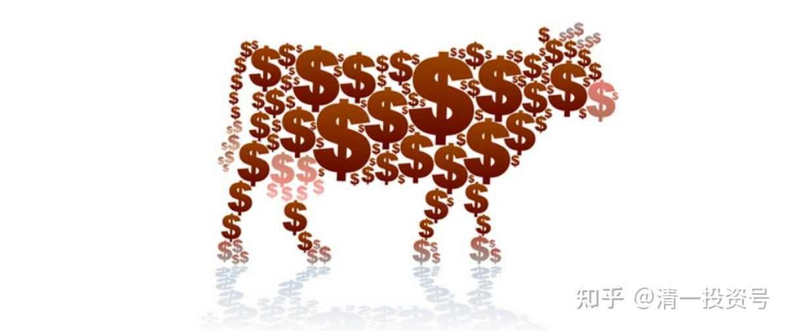
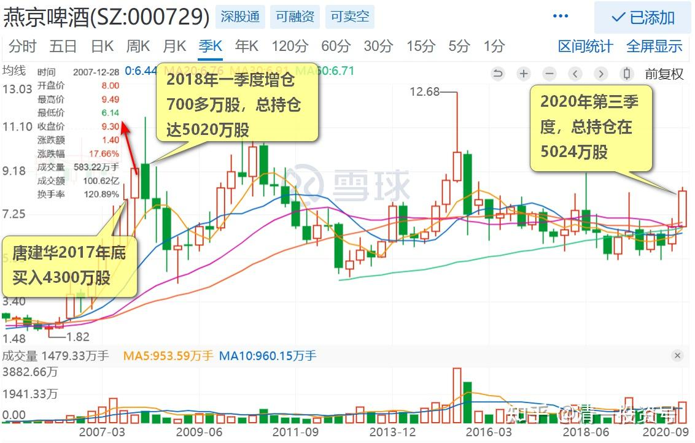
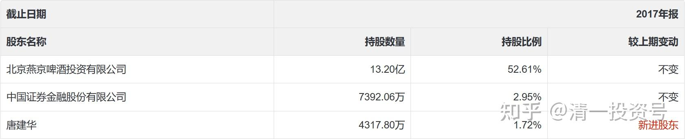
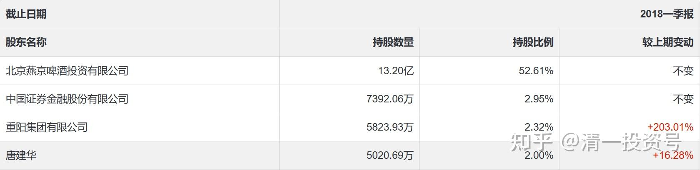
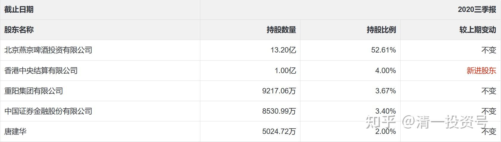

40篇.这种企业，以后一定成为现金牛

清一山长 2020年9月7日

**一、燕京十大的唯一自然人股东**

$燕京啤酒(SZ000729)$ **股东研究：燕京十大，有一个特别的，也是唯一的自然人股东：唐建华。**

他是2017年年底进入十大的，4300多万股。这段时间的价格，是在6～7元之间波动。所以他的建仓成本就在6～7元。更靠近6元？还是更靠近7元？**我看了2018年一季度，他增加了七百多万股，总持仓达到5020万股。**这段时间的燕京，价格在7元到8元多波动。他此时依然继续大量买入，证明他认为7元以上买入是不贵的。所以，我估计2017年，他应该也是靠近7元的价格，快速买入的主仓。而不是6元左右慢慢吸入的。所以**，我认为他的总体持仓成本，应该就是7元左右。**如果算上资金利息，他持股到今天，是亏损的状态。资金成本，就算是按照5%来计算，就是3年乘以0.35元，接近一元的成本了。每年增加0.35元的成本（重阳的持股多数也是信用账户的，就算是自有资金，也要算成本的），此后唐建华一直居证金和重阳之后的第四大股东，一直没有减仓动作。即使几次燕京冲破9元、8元，也没见他减仓。**说明他认为燕京8～9元，不是他想要卖的时候。**的确，现在他的燕京持仓成本，已经接近8元了。甚至我们都没看出有减仓的痕迹。比如他的股票数字稳住个位数都“不变”，似乎连做T都没有做。因为如果做T，很难每个季度的股数，几乎是完全相同的。总有一点小的差距。

现在唐建华马上就持有燕京三年了，现价依然在他的持股成本区，不，是低于他的持股成本区。此股三年不鸣，会不会一鸣惊人？我们就等着瞧。由于燕京就是迟迟不涨，也让我的燕京仓位越来越重。这是好事——**熊市不赚钱，只能赚股。**燕京的股，我的确是越赚越多了。老唐稳稳地坐着不动，重阳也不动。我还从珠江捞了一大票转投过来的，我更应该淡定一点。**抱着继续等三年的耐心，来好好的守护燕京[大笑]**！

**二、这种企业，以后一定成为现金牛**

晕娜回复清一山长:

【[宁南山：如何毁掉一个中国品牌？欧美资本最清楚](http://link.zhihu.com/?target=https%3A//video.weibo.com/show%3Ffid%3D1034%3A4546600987459617)】

[【南山见解】如何毁掉一个中国品牌？欧美资本最清楚_哔哩哔哩_bilibili](http://link.zhihu.com/?target=https%3A//www.bilibili.com/video/BV115411b7HE/)

山兄：您看看这个视频。燕京的价值，是否与视频说的事有些关系？

清一山长2020-09-08 14:29:17回复晕娜:

**啤酒的赛道，要比日化好得多。日化现在是现金牛，将来的啤酒也是。这种快速消费品，市场价值极高，不是现在的一点市值能够比的。**啤酒行业这十年，都在打内战，互相的消耗战。看谁活下来。很多小啤酒公司，地区性的啤酒公司，都死了。有些企业，合资找外国人投靠，也是一种没办法的办法。活下去，是第一位的需求。就像当年的日化品牌一样。等市场战打完了，谁都知道灭不了对方了，大家就会停手，开始进行利润修复，估值修复，所谓的产品升级。现在已经开始了这个进程，所以我现在会大量买入。**现在是最好的时机，十年前买的，太早了。现在给了低价卖，不买是傻瓜。**我也不计较他的PE和分红低。**这种企业，以后一定成为现金牛**。我会持有很久的，像你的中建持有方法一样。**我不会快速赚了就跑。只是会利用市场节奏不平均，会换股赚些差价。**

(标题、图片为编者所加)

**文章音频**：

[396篇.这种企业，以后一定成为现金牛_清一投资号文章同步音频](http://link.zhihu.com/?target=https%3A//www.ximalaya.com/sound/688291612)

**参考链接：**

[12篇.早期珠江啤酒、燕京啤酒的换仓记录](https://zhuanlan.zhihu.com/p/602033762)

[13篇.买卖操作后的富足之心](https://zhuanlan.zhihu.com/p/604162057)

[14篇.珠江的破位急跌，名曰跌停进货法](https://zhuanlan.zhihu.com/p/606062514)

[22篇.它很可能是下一个重庆啤酒](https://zhuanlan.zhihu.com/p/645392522)

[23篇.危机时刻好公司不用担心](https://zhuanlan.zhihu.com/p/646998882)

[24篇.守住筹码很不易](https://zhuanlan.zhihu.com/p/648860208)

[25篇.筹码收集完毕，正在养股](https://zhuanlan.zhihu.com/p/650255857)

[26篇.现在最应该做的，就是稳稳的做好轿子](https://zhuanlan.zhihu.com/p/651196882)

[27篇.股票交易风格与伴侣选择](https://zhuanlan.zhihu.com/p/653139189)

[28篇.看图要反着看](https://zhuanlan.zhihu.com/p/654521213)

[29篇.行情还没完，后面还有大机会](https://zhuanlan.zhihu.com/p/655878269)

[30篇.给做短线人的建议](https://zhuanlan.zhihu.com/p/657061174)

[31篇.股票也分贫富，贫富会换位](https://zhuanlan.zhihu.com/p/658569494)

[32篇.主力志在长远](https://zhuanlan.zhihu.com/p/659254835)

[33篇.宁愿套牢也不想踏空](https://zhuanlan.zhihu.com/p/660596526)?

[34篇.我的投资不需要别人来打气](https://zhuanlan.zhihu.com/p/661931571)

[35篇.明显是市场的错误定价](https://zhuanlan.zhihu.com/p/663378280)

[36篇.研报的几点信息](https://zhuanlan.zhihu.com/p/664613658)

[37篇.啤酒生意不简单，不是投钱就可以弄](https://zhuanlan.zhihu.com/p/665812265)

[38篇.低位吹票和高位吹票](https://zhuanlan.zhihu.com/p/666484929)

[39篇.我用钱来赌啤酒赢、赌中国建筑会赢](https://zhuanlan.zhihu.com/p/667678766)