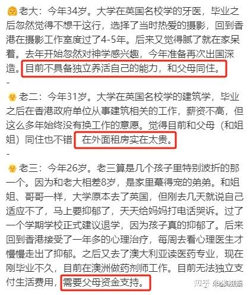

**有人总结：教育越趋于精英化，养出来的小孩越没用，书读得越多越缺乏狼性。**

** 真是误读了精英教育！在我看来，这些校园很漂亮，大量外教的国际名校，就是一个精心设置的骗局，装模作样骗有钱人的。这种国际学校的目标，根本就不是培养人才，而是让傻瓜们交智商税！如果你认为花了大钱就是精英教育了，你这就是交了智商税！**

**各位先看案例：看完后我再解析！**

转：楼主的同事认识一个香港朋友，曾是驻上海的外资行高管，家里很有钱。养了三个小孩，**从托班到大学一路国际路线，人均花费2000万。**

如今都已经成年，成果如下：

看完了？挺失败的是吧？30多年了，这个外资高管的大傻瓜，花了6000万，得到这个结果，很不甘心。觉得怎么会这样？

如果换了我的做法：这30年，我用这些钱，不断地投入中国的股市，用来买股票，现在的市值，至少是10亿以上（真没吹的。30年增值15倍，不过分吧？）。我是32年前才用1.2万元入市做股票的，今天已经是三家公司的十大股东了。这个人当年投资给孩子的资产，比我投资给股市的资产高得多。因为过去的30年，就是中国经济快速成长的30多年。只要投对了，收益惊人！6000万元投入，换来10亿，真的不多，甚至是太少了！连我真是投资收益的十分之一都不到。可惜我就没这么多钱来投，资金太少了。

那么：我们算算。这个本来非常财务成功的家长，30年后，他退休了。现在他拥有10个亿的本金，他能来做什么？如果用来继续买高息股，他每年可以收到大约6000万到一个亿的股息，相当于他投入的原始本金！我每年的股息，比我历年来投入的本金都高。一点也不稀奇！

这笔钱，他如果用来开公司，发工资，可以养多少员工？支付10万元的年薪，可以养600---1000个员工了！

如果他的公司的员工，每天的工作，就是只干一件事情：就是员工负责每天想办法来讨好他，每天都让他开心？做不到就开除。你觉得现在，他每天会不会活得像一个国王一样神气？

如果他更有情怀一些，拿来举办中华武道馆，支持拳手去打奥运，为国争光，他会不会是一个很有情怀的大伟人？恐怕国家领导人，都要接见他，表彰他的功勋吧？

如果他拿这些钱来支持一些女孩读公主班，做中国最好的女人，做天下女性的榜样。他是不是大善人？

而且别忘了：这些钱，还仅仅是红利。他的本金根本没动，还会随著经济成长而不断成长。他只要管理好，可以在他死后100年，继续做善事，作伟人！他为外资打工30年，现在退休做好事，他就“永远活在中国人民的心中”了，这样，不是也挺开心的吗？

可是---这个大笨蛋，却拿来给三个不成器的孩子上啥国际学校， 读啥海外名校。结果弄到现在坐对愁城。忧心忡忡的，每天还要继续供养三个孩子生活。继续被孩子吸血。这真无聊。

这人年龄应该跟我差不多，当年绝对比我风光。现在：却活成了一个笑话！

你说：这是他教育没成功，如果他的大儿子，在做一个成功的牙医，二儿子在政府机关工作。三儿子的药剂师工资收入不错，可以完全独立。这样就好了！

那么：我再问一句话------原来，你们家长所谓的成功，就是花一大笔钱，为利益集团去培养打工仔！如果你投资和教育成功了，你的孩子就去为别人做高级打工仔。如果你培养失败了，成为了废物，你们就把孩子带回家，乖乖的养起来，不给社会添乱！是这样吗？

天呐：你们真是伟大的奴才，比黑奴伟大多了。天底下，原来真的有这种自觉自愿，自发的为资本家服务的奴才，自己赚了钱，也不忘要通过各种方式重新送还给资本家去的奴才。还要前赴后继，把自己的孩子也培养出成奴才。让自己的子孙后代，继续一代一代地努力，永远做资本家的狗奴才。心甘情愿，无怨无悔地一直做下去！

这是谁设计的一套伟大的制度？太了不起了！我真的想认识这套制度的设计者？他是怎样做到这一切的？

** 作为对照，下面的教育案例，可以让你们知道：啥才是真正的精英教育？以及这种精英教育需要家长花多少钱？答案是你们难以想象的。这位家长，因为要追求最好的教育，移民澳洲，去了后发现不对劲。又回国找到今日学堂。他的孩子很优秀，15岁就在澳洲，考过了SAT1400分的成绩，凭借这个成绩，几年前申请入读今日三语高中，获得全奖资格。因此，家长别说出学费了，连生活费都不用支付。都是我来供养的。这种“私人义务教育”，效果如何?结果怎样呢？**

** 家长的原来计划，是18岁，高中毕业后，就去考清华北大。由于他有澳洲国籍身份，以外国人身份考清华北大，简直不要太容易。家长说：如果新教育需要一个考入清华北大的案例，他们可以让孩子去读读体制名牌大学。或者去上国外的TOP50大学，问我哪一个选择我们认为更有价值？**

** 我说：我们只管教到高中毕业。至于未来怎样上大学，上什么大学，请家长和孩子自己研究。不用考虑我们的需求---我们没有这个需求，也不拿这来宣传。让他们根据自己的需要来决定！**

** 结果就是：这孩子决定不去考啥清华北大了。也不去TOP50大学支付智商税。他去拿到一个名牌大学的研究生，都竞争不上的一个岗位的OFFER，想要提前进入职场工作了。他要去的岗位，竞争非常的剧烈。是所在的行业内对这些年轻人最有吸引力，也最卷的一个地方。 这个学生的前一届校友正在海外上大学，有人还在期待将来从国外的名牌大学毕业后，再回来竞争这个岗位。 没想到他现在就捷足先登了！所以家长特别的高兴！**

这位澳洲的家长，今天在家长群里面公开发言，表示孩子已经毕业找到工作了。在退出家长群之前，给大家留言表示感谢。看得出家长很开心！

家长（庆杰妈）留言：

“感恩老师的每周详细的周总！感恩家长们的祝福

庆杰今天就离开清迈了，他将开启一直以来的梦想。知道消息后全家都非常非常的惊喜！我兴奋得晚上睡不着呢。

感恩山长这两年多来的高智慧的教导，看着山长这么忙，处理那么多的事务，还每周都给他们布置作业、讲课，从不间断。山长那么高智慧、那么高能量都那么踏实地一点一点地教导孩子们。感恩山长的示范，让我们变得越来越平静、踏实、理性 [表情]

我经常反思自己，作为家长，往往就是很浮躁，恨不得孩子一下子就会飞了，并且往往有一种很大的妄心，觉得自己的孩子就应该获得最好的，也不想承受任何风险。其实理性分析，觉得自己很可笑，这凭什么呢？

回顾学习新教育以前，由于自己很不懂教育，很容易焦虑、打击，导致孩子胆小、懦弱、敏感、身体也很不好，如果不改变，那青春期肯定很多问题，人生也很痛苦。这些年来，庆杰进入新教育、进入今日后，对比自己真是发生了翻天覆地的变化。所以，我经常跟庆杰讲如果没有新教育，你的命都不知道怎么个糟糕法，所以你该把你的命用来帮助更多的人，这样才对得起宇宙给你的恩惠。

除了深深感恩山长，我们还十分感恩刘老师用爱与智慧化解孩子们的卡点，滋润他们的心灵，让他们变得有力量。感恩慧英老师全方面对孩子们的引导、帮助，孩子们各方面都进步很大！感恩佳慧用心地教导武术，孩子们练武越来越进入状态了。感恩明瑞老师在过去对庆杰的教导，感恩过俊杰老师在一开始对庆杰的关怀、引导！感恩所有老师在不同的时期给与庆杰的关爱与指导。感恩所有同学们的关心、帮助，还用心地组织送别活动、制作送别相册，深深感受到整个文科班充满的爱！感恩所有家长的关心、帮助！[表情]

我们家庭将退出文科班，在此跟大家道别，但是心还是在一起，保持联系！[表情]

以上家长信件全文完！

我回复家长的信息：

：@ 庆杰妈悉尼 你挺有福气的。你提前完成了自己的任务，孩子已经会自己飞了。剩下的事情，家长就是去欣赏孩子们的创作和表演了。就像刘老师一样，现在就是高高兴兴的看孩子们做事，去欣赏他们，为她们鼓鼓掌，点点赞，不再需要操心去指导她们了（除非孩子们有时去找她）。所以她每天都很开心。你也一样，现在已经可以放下你对儿子的责任和期待，自己去过好自己就够了。

家长回复：谢谢山长的指导[表情]。现在的确是越来越放手了，连女儿在无名塾都不用怎么管了，好开心啊！所以现在我就在澳洲，去帮助更多的孩子、家庭。刚回来1个月，居然接着家长的宣传把假期班招满了，很好的开始[表情]。感恩山长的指导与祝福 [表情]。

我回复，主题就是**祝福家长在澳洲开启新教育学堂成功如意。**这家长，把这几年陪儿子学习，不仅儿子收获了。家长自己也成长了。因此现在很有信心去办新学堂，去当教师，要去帮助和辅导更多的学生。这就是我的愿望----希望新教育能够帮到更多的人。我鼓励任何人去开办帮助孩子们的学校，因为现在的体制教育，无论中西，结果都太烂了！

家长再度回复：用身边的对照的案例，证实了几年前，该家长毅然选择离开澳洲的国际学校，送孩子从澳洲回国上今日，接受新教育的好处。当年，周围的澳洲华人朋友们，全都在质疑他们家庭的选择，认为他们放弃花了这么多钱出国移民才得到的宝贵教育机会，回中国上学？是不是疯了，被洗脑了？现在，当时的大聪明家长，正在品尝孩子教育失败的苦味呢！

家长信息： 最**近刚拒绝了一个18岁养废了的孩子，是庆杰的同学，孩子已经不去学校，只玩游戏，家里很有钱，爸爸随便就几千澳币地打钱过来，是学校里有名的富家子弟。妈妈管不动，长年不在家吃饭，因为他有钱天天在外面吃。不与人交往，只管打游戏。妈妈把我请到家里去，都躲起来不见人的，毫无办法。妈妈是听了我的学生的妈妈推荐可以找我，同样也是庆杰的同学，当时也是同样的情况，我教了1.5半，现在刚去上有名大学的预科了。我问这个养废了的妈妈，当时为什么不早点找我呢？她说不知道。其实我有提过的，应该当时不认为自己孩子有问题而错过了，很可惜。**

选择即命运！

你们还想继续为利益集团当优质奴工吗？请用你的脑袋，好好思考什么是教育，什么是人生。不要把可贵的生命，拿来交换一份打工证。你们当然可以去上大学，但是：上大学要得到什么？这才是你最重要的，最值得思考的问题。

教废的孩子，有没有可能重新恢复生活的勇气。重新成为一个正常人呢？其实是有的。今日学堂创立初期，基本上，就只有体制内教不好的学生才能送给我们来教。包括静慧钟瑞，就是体制内已经失败的孩子，家长没有希望了，才送来我们教，现在居然成为家长人人羡慕的【别人家的孩子】了，所以：教问题孩子，我们是很有经验的。青春期问题孩子，情况虽然特殊一点。但也不是没有教的方式的！而且：这个市场的需求特别大。我就教家长：怎么去教这种孩子！

@庆杰妈悉尼 再【这种孩子，其实也是可以教出来的。耐心一点即可。大约周期是三年就可以改过来。我知道深圳有一家学堂，就专门接受这种问题孩子，但收费特别高，达300万一年【这些傲慢的家长，的确需要收拾一下，才能学会恭敬心理导师】。我其实知道他们是怎样来教的，就是慢慢的聊天，很耐心，让孩子慢慢建立信任感，不去评判孩子。再慢慢给孩子疏导植入正确的信念系统。让孩子慢慢学会面对社会和现实生活。因为这种逃避的生活，让孩子非常的绝望，内心非常的孤独和痛恨自己，他们是希望改变的。 如果我们来做这个教育调整的话，效果会比深圳的这家学堂要更好。因为我们有公主班，已经培养出了一批优秀的沟通人才。这个孩子，其实就是青春期萌动，且自己知道自己很无能。他渴望得到女孩的关注，却无能力去沟通互动交流。导致他躲起来自我封闭。内心知道是父母的不良教育毁了自己，因此也恨死了让他如此无能的父母和家人。他会敌对和不信任身边的一切。

因此----针对问题孩子的这种心理，只要配给他一个很懂心理和思维，而且比较耐心的，有女性魅力的公主，主动地跟他交朋友，跟他去谈心，一点一滴的引导他。让他的自信心慢慢的恢复，自我意识苏醒。就会缓解过来了。这个很可爱的女孩，可以每天陪他每天聊天，陪他看电影（专门选择的改变他心智模式的电影）。陪他散步，走路，游戏，做运动。也不去强行要求他结果，只是尽量去理解他，鼓励他，陪伴他。甚至一起养小动物，让他增强信心，有主人意识。这样，慢慢过了两三年，他的男性的自尊慢慢恢复，愿意积极去生活，运动锻炼，就可以完全换一个人了。

他有了念想，有了目标，就会开始积极地面对生活。这时如果他再去上大学，找工作，就基本正常了】，这样就完成了一个周期（大约三年）的陪伴式教育。其实---再怎么说，这种男孩，比沙利文小姐面对的盲女要容易收拾多了。只是----现在社会都很浮躁，没人愿意慢慢去等待。--------可惜这孩子大了，如果年龄小一些，就可以用类似LZ（我们最近一年调整的某问题孩子）的方式，强行改变。就可以一年内就改过来。

现在强行用调整LZ的方式来做，由于这孩子负面情绪很重，就有可能会出事。这孩子承受不住，可能会死亡的。所以---一旦错过15岁，难度增加十倍。廉政是在15-16岁开始的，如果让他混到18岁，20岁，估计和这孩子的情况差不多！这个调整方案。我教你了。看你有没有本事用上[表情]

好了：选择决定命运。你们如何选择?你的未来如果决定？其实一切都是你掌控的！只是家长们喜欢出了问题之后，看孩子失败了，就装出一副无辜的样子一样，用堆出来的钱财证明自己的无辜。其实----没有脑子的家长，才是真正的施害者！