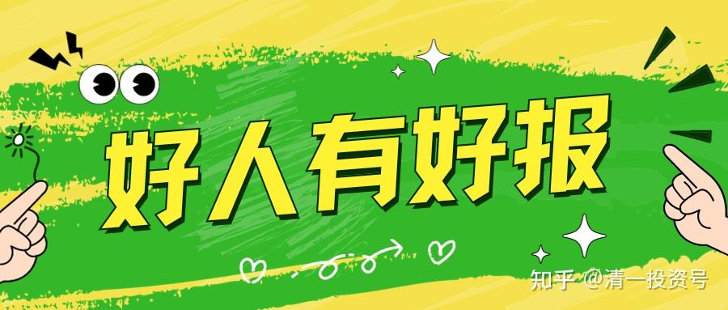
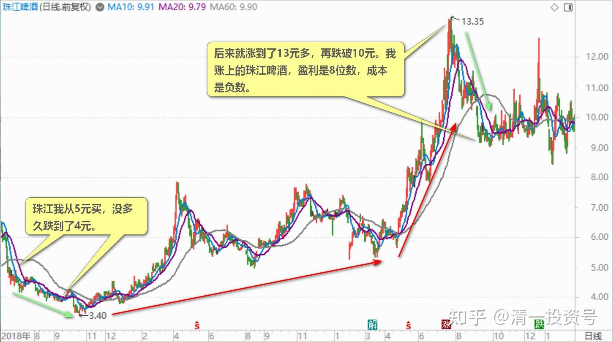
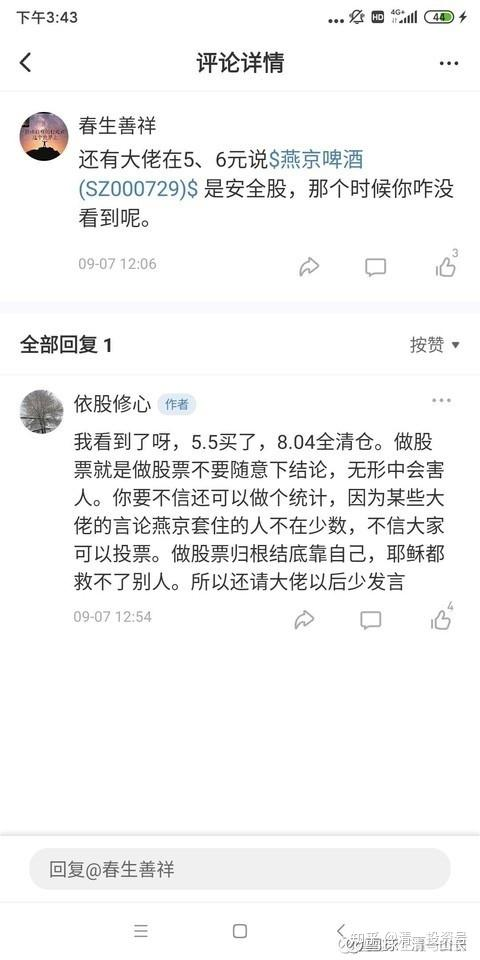
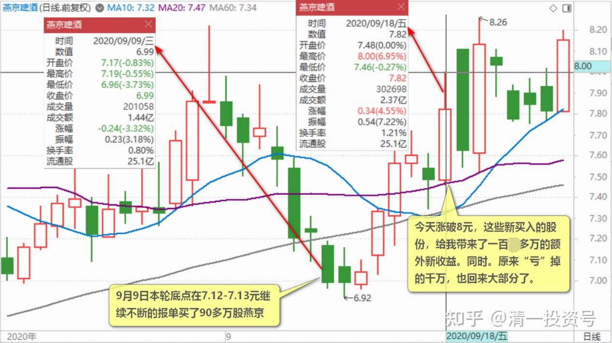

42篇.赔钱至少是有缺陷的

清一山长 2020年9月9日～18日

依股修心[2020-09-07 11:53](http://link.zhihu.com/?target=https%3A//xueqiu.com/1823737860/158621229)

$燕京啤酒(SZ000729)$ 说句实话，由于被某位大V的影响，我在珠江上亏损二十几万，如果不是看到他每天高谈阔论我还在做幸福的小散。这些年在股市没相信过任何人，整体略有小赚，看了他的言论今年牛市第一次赔钱，服了。兄弟你们是因为被他害得赔钱的吗？

清一山长2020-09-09 15:33:02（评论上贴）

我猜您说我吧？**珠江我从5元买，没多久跌到了4元。证明我就是反向指标。后来就涨到了13元多，再跌破10元。我账上的珠江啤酒，盈利是8位数，成本是负数。**买这种优秀的股票，您都能亏钱，真是本事大了。可能证明您的脑子级别太高了。

主动替你拉黑我了，因为你不仅脑子的级别高，您的人格级别也蛮高的。既然我妨碍了您做快乐的小散，你偏自己不拉黑我，还贱到天天要来看我的帖子（虽然我根本没有天天发帖）。您是不是脑子和人格都双重“高级”？

您发帖，还没有拿过打赏吧？这里给您打赏一元，帮您破破纪录，让您有点快乐。让您至少可以出去吹牛，说您除了有专门在别人大赚特赚的股上赔钱的好本事，还有能拿到别人拿不到的钱的本事。恭喜您！

今天还拉黑了几个垃圾虫，一跌就胡言乱语的傻瓜。这些人，活该就是来当韭菜的。无论多赚钱的股，都会赔钱！

清一山长2020-09-09 19:02:26（续评上贴）

$燕京啤酒(SZ000729)$ 别删帖呀？既然你敢说，就要敢负责。躲起来干嘛？我的帖子上，还有你的回复呢！重新把你删掉的帖子贴回来。留此存照！你骂我，我都不怕丢人，你怕啥？我的帖子也没骂你呀？不是在夸你特别有本事，脑子特别好吗？

球友@王贵与安娜 提供了此人更恶心的证据，一并发上来鉴赏：此人自吹说“这些年股市上没相信任何人，整体小赚”。是我害得他“今年牛市第一次赔钱”。真是了不起的牛人，第一次赔钱，我可是赔钱无数次了。幸亏赚钱次数比赔钱多。以下的证据，说明此人跟了燕京啤酒，5.5买了，8.04元全清仓了。这伙计在燕京啤酒上，抄我的底，逃我的顶，赚到比我多的（比率）。居然还来燕京啤酒上骂我的娘！因为他在珠江去抢了高点（我什么时候告诉球友高点要去抢珠江？都在说珠江涨高了别追，想买啤酒，不如燕京安全。**我的珠江只卖货，不买货。最高我还13.5元卖了一部分，跌了两元多才回补仓位。从来没高价买过珠江）。**他自己就亏了一次钱，就跑到他赚了很多钱的燕京上，故意来黑我，还拉一帮兄弟伙，想要一起来黑我。这种人心真是黑呀[吐血]！！！你们现在知道外面这么些清黑，一些就是到处找各种理由来骂我的人，都是些啥种类，啥角色了？就是这种人。我在这里留下这些证据，就是让大家知道：人性，有时候有多么的丑恶！

覺清2020回复清一山长：[很感恩山长一直以来免费的分享我从10年看山长博文开始就开始对思维有了较多的理解。但是估计还是皮毛级别的。比如山长说不能追... - 雪球(xueqiu.com)](http://link.zhihu.com/?target=https%3A//xueqiu.com/8403981318/158868925)

很感恩山长一直以来免费的分享

我从2010年山长博文开始就开始对思维有了较多的理解。但是估计还是皮毛级别的。比如山长说不能追高，这是纪律。这个发帖黑人的主估计没有理解山长的用心。不仅不感恩山长的分享还这样黑，其实黑就黑在人心之黑。而山长这样回复这个人真的是做给我们这些人看的，是在用实际案例教育我们。我学习了。

最近山长的学堂在免费直播示范班的课堂，这估计是价值千万不止的财富。这些免费的分享，无价。可我作为一个有幸了解到的人，也在尝试分享给周围的人，可没有几个相信我，就我家老婆都不相信，说你自己英语都不行，怎么教自己孩子......可是，山长自己英语也没有现在这些学生好，他发现的十岁就超过大学英语水平的方法却成了一个奇迹，相信的人获得了利益，不相信的人失去更多。

山长用心分享，无所求，值得我们好好学习。有一段时间我想不明白，为何这么好的人，有人也黑。也许这就是“阴阳”，总是有些黑心之人来更显明山长的清净大爱。

我也期待关注山长的人，要多学习背后的思维。我很早之前就关注山长分享的财富思维，但是我自认自己理解不够，所以一直都没有进入股市来操作。最近危机的时候进入股市。“危机之中有生机”。开始买中建、珠江、燕京。珠江赚了一点就跑了，燕京一阶段盈利，后来到现在坐电梯，中建最近也是上上下下。如果这个时候我们因为自己亏了点钱来黑，因为别人分享了，所以你被骗......这正说明了自己没脑，更要反思。

而如果中建你在五元以下买，只要你给他时间，你是不可能亏的。除非你最近5.5去追高......可是现在跌下来了，你如果相信它的价值，就可以继续买入啊！谁叫自己无脑追高呢？人就是这么奇妙。

我给我身边的朋友分享买五元以下的中建很难亏，他却去买“退市锐电”，还有什么正川股份。我说这些股票我不买，因为睡不着觉。可是就是有人无脑去追高，还加杠杆......[大笑]所以只要自己“不作死自己，就真的没有人让你死”。

清一山长2020-09-09 22:08:02回复覺清2020:

我拍的观点是：**永远不要指望让别人理解你。**如果我要求他这种档次的黑人，都能完全理解我的话，我的境界要有多低才行[吐血]。我愿意永远是这些清黑的反面派，对照版，过着与他们完全不同的生活[笑]。

清一山长2020-09-18 18:19:39

今天是9月18日，抗战纪念日？9天前，燕京跌到了本轮低点，让我数天前账面上大赚的燕京，与7个交易日前的最高点相比，账面“亏”掉了上千万元。我没有骂天，也没有骂地，更没有骂人。没骂别人，更没骂自己。**我宽容我自己犯这种错误，宽容我又不是神，不知道会继续下跌很正常。我知道是我没这福报赚这种“投机”钱。我只是静静地做我“损失大了”之后该做的事情**——在7.12～7.13元继续不断的报单买燕京，这一天，我买了90多万股，这一轮，总共买了150多万股。算起来今天涨破8元，这些新买入的股份，给我带来了一百多万的额外新收益。同时。原来“亏”掉的千万，也回来大部分了。

同一天，这位清黑混蛋呢，在燕京上抄我的底，5.5元买进燕京；逃我的顶，8.04元成功走掉。这一天，没想应该乘机低价买进，赚更多差价。却因为前段时间自以为高明，高价抢珠江，看珠江也跌了，就跳出来骂娘。还来燕京网友这里发帖，妄图煽动燕京下跌心情不爽的人一起来攻击我。我一看这小子良心实在是大大的坏了。这个价格区间居然来拉燕京的仇恨，不是帮主力拿低价筹码的吗？**所以，为了拯救其他傻猫，我只好骂了回去。同时示范了正确的操作方式。**

没错，燕京跌下来，你们都不高兴。但损失最大的，绝对不是你！千万元就从我账上“飞”掉了。我自己都不说啥，不怨天，不尤人。**让自己做个好人，保持住自己的道德良心。最终，老天拿走了什么，照样会还送给你的。老天是公平的**。你们一跌就哭丧个脸，出来骂人，要遭天谴的。该赚的钱，都要赔掉。

今天不就验证了，燕京到底我示范的买点，对还是错？信的人有福了。信多少有多少福！不信的人，黑我的人，欢迎你们跟我反向做。本轮重新上8元，我坚持还是不做T。你们想做就做！想飞就飞！万一跌了，谁再出来骂人，我见一个拉黑一个！不是骂我才拉（我欢迎你们骂我，得到与我相反的回报，过与我相反的生活。我赔，你就赚。瞧，上次你赚千万去，有好处的[大笑]）。喜欢爆粗口的，心术不正的，我全都拉黑，一元打赏也不给。只要见到骂人贴就拉！这种人，不配来这里赚钱，只配来股市当韭菜，被收割。

范小苗回复清一山长:

这个世界对好人太苛刻，对坏人太宽容，佩服山长敢说敢做[赞]

清一山长2020-09-18 20:21:22回复范小苗：

错了，**我从来没发现坏人有好报的。他们短期可能有好运，长期看都倒霉。不管赚多少钱都没好运。**

我认为这个世界，一直对坏人很严厉的。有时候你看到好人倒霉，其实他们很可能是坏人，只是你不知道罢了。股市上大多数人，都觉得自己是好人。但我认为：**长期来看，赔钱的都是坏人，至少是有缺陷的人。**

不信用我上面的标准来看，有几个真符合的？他们都是坏人，都是盼别人赔钱，自己赚钱的人。这种人，没好报，没赚钱正常。昧良心，总想投机取巧，自然该他们赔钱。所以，**股市上大多数都赔钱，就说明来股市混的人，大多数是坏人。至少有严重的良心缺陷。**

想知道老天怎么评价您的为人，良心，道德的？怎么打分的吗？打开您的账户，看看盈亏就知道了！[大笑]

(标题、图片为编者所加)

**文章音频**：

[401篇.赔钱至少是有缺陷的_清一投资号文章同步音频](http://link.zhihu.com/?target=https%3A//www.ximalaya.com/sound/693039659)

**参考链接：**
[12篇.早期珠江啤酒、燕京啤酒的换仓记录](https://zhuanlan.zhihu.com/p/602033762)
[13篇.买卖操作后的富足之心](https://zhuanlan.zhihu.com/p/604162057)
[14篇.珠江的破位急跌，名曰跌停进货法](https://zhuanlan.zhihu.com/p/606062514)
[22篇.它很可能是下一个重庆啤酒](https://zhuanlan.zhihu.com/p/645392522)
[23篇.危机时刻好公司不用担心](https://zhuanlan.zhihu.com/p/646998882)
[24篇.守住筹码很不易](https://zhuanlan.zhihu.com/p/648860208)
[25篇.筹码收集完毕，正在养股](https://zhuanlan.zhihu.com/p/650255857)
[26篇.现在最应该做的，就是稳稳的做好轿子](https://zhuanlan.zhihu.com/p/651196882)
[27篇.股票交易风格与伴侣选择](https://zhuanlan.zhihu.com/p/653139189)
[28篇.看图要反着看](https://zhuanlan.zhihu.com/p/654521213)
[29篇.行情还没完，后面还有大机会](https://zhuanlan.zhihu.com/p/655878269)
[30篇.给做短线人的建议](https://zhuanlan.zhihu.com/p/657061174)
[31篇.股票也分贫富，贫富会换位](https://zhuanlan.zhihu.com/p/658569494)
[32篇.主力志在长远](https://zhuanlan.zhihu.com/p/659254835)
[33篇.宁愿套牢也不想踏空](https://zhuanlan.zhihu.com/p/660596526)?
[34篇.我的投资不需要别人来打气](https://zhuanlan.zhihu.com/p/661931571)
[35篇.明显是市场的错误定价](https://zhuanlan.zhihu.com/p/663378280)
[36篇.研报的几点信息](https://zhuanlan.zhihu.com/p/664613658)
[37篇.啤酒生意不简单，不是投钱就可以弄](https://zhuanlan.zhihu.com/p/665812265)
[38篇.低位吹票和高位吹票](https://zhuanlan.zhihu.com/p/666484929)
[39篇.我用钱来赌啤酒赢、赌中国建筑会赢](https://zhuanlan.zhihu.com/p/667678766)
[40篇.这种企业，以后一定成为现金牛](https://zhuanlan.zhihu.com/p/668283112)
[41.持有期限最少3年最长15年](https://zhuanlan.zhihu.com/p/670833407)