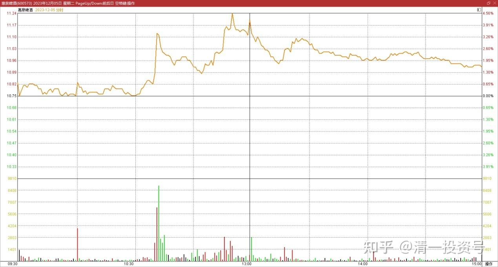
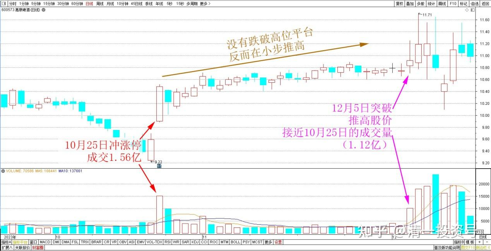
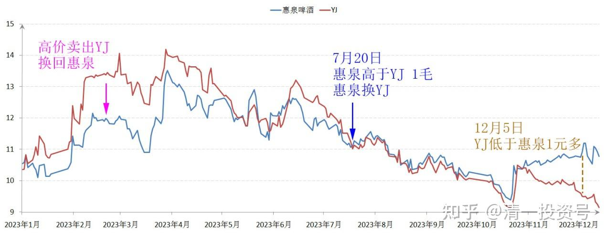
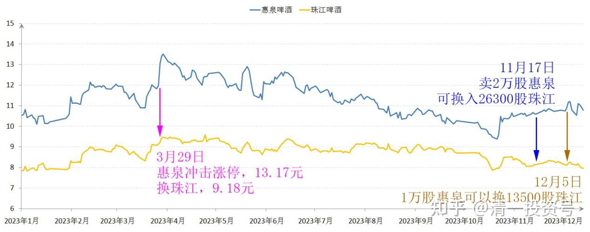

65篇.惠泉异动，借机换股

清一山长 2023年12月5日

今日惠泉啤酒异动：在大势不好的局面下，居然上涨。最高达到了11.26元。我顺势出货一半左右，退出了十大股东行列，最高的几笔，还卖到了11.24元的价格。心里觉得还占了便宜的样子。

*惠泉啤酒 2023年12月5日 分时图*

不过，晚上复盘看看——发现今天可能犯错误了，可能手上的筹码被骗走了。此股10月25日冲涨停，成交1.56亿。之后一直没有跌破高位的平台。反而在小步推高，耐心消化浮动筹码。看得出是典型的平台整理趋势，高位收集筹码的样子。今日突破，推高股价，量能上来了，成交活跃，接近10月25日的成交量。从技术上来判断，是主力筹码收集完成，马上要突破上升的状态。所以——我今天卖出半仓的行为，应该是恰好“中计”了。明天大概率继续上涨，甚至冲高。

*惠泉啤酒 2023年10月～12月 日线图*

未来这些筹码，我大概是捡不回来了。不过，我也没啥遗憾的。这些惠泉，都是在燕京上涨的时候，股价超过惠泉，我高价卖出燕京，换回来的惠泉，负成本持有的。现在的燕京股价低于惠泉一元多，肯定我没亏。

惠泉啤酒、燕京啤酒2023年 收盘价

本来应该买回燕京的，但我发现珠江更低，才8.12元就可以买到了。当然——就赶快把卖出去的资金，都买了珠江回来。一万股惠泉，可以换13500股珠江呢！我觉得老划算了！

*惠泉啤酒、珠江啤酒 2023年 收盘价*

假如惠泉大幅上涨——珠江总得跟上吧？因此——我认为应该不亏的。短时间看似乎不划算，长期来看，用几个月，几个季度来看。应该是划算的。惠泉主力似乎先知先觉。如果惠泉涨了，其他几家啤酒也该涨了吧？最近账户市值缩水不少，但股票的数量增加了。即使只是涨回原地，我也比原来的市值增值了不少。这就是要股不要钱的奥妙！我喜欢跌跌涨涨的行情，因为可以让我拥有更多的机会。大盘一路涨的话，反而没啥事情好做了。

(标题、图片为编者所加)

[原文：今日操作记录](https://www.zhihu.com/pin/1715446529324875776)

**文章音频：**

[402篇.惠泉异动，借机换股_清一投资号文章同步音频](http://link.zhihu.com/?target=https%3A//www.ximalaya.com/sound/693965288)

**参考链接：**

[57篇.省心省事，不多做](https://zhuanlan.zhihu.com/p/651191813)

[58篇.买回落难王子](https://zhuanlan.zhihu.com/p/653368631)

[59篇.三季报隐藏的重大信息](https://zhuanlan.zhihu.com/p/664009422)

[60篇.中国建筑安心买入，珠江啤酒价格很香](https://zhuanlan.zhihu.com/p/667041164)

[61篇.投资养老新模式？比退休金更可靠的金融账户养老收益](https://zhuanlan.zhihu.com/p/668298628)

[62篇.YJ前三大股东研究](https://zhuanlan.zhihu.com/p/669500082)

[63篇.负成本——换股的功劳](https://zhuanlan.zhihu.com/p/670185909)

[64篇.重庆啤酒的主力拉升分析（事后诸葛解析）（配图版）](https://zhuanlan.zhihu.com/p/671473163)

