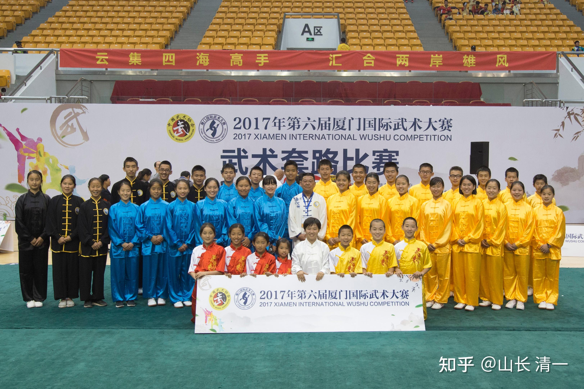
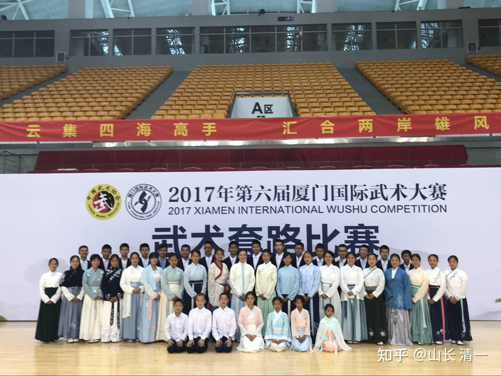

中国从小卷成绩，卷考试的学生，很容易失去人生的目标，陷入迷茫之中，患上中二症！

原本目标单纯，认真学习的小孩子，会因为14岁之后，进入青春期，开始去思考问题，但又想不清楚。从而陷入巨大的麻烦。只要是家中有青春期孩子的家长，和中学教师，都知道“中二症”的厉害：【中二，是一个网络流行语，**多指初二年级青少年的某些病态自我意识**。 来源于日本，由艺人伊集院光在广播节目《伊集院光深夜の马鹿力》中提出，主要是指青春期特有的思想、行动、价值观，是对青少年叛逆时期自我意识过剩的一些行为的总称。】

只说中二的结果吧：成绩快速下滑，颓废，不思进取，社恐，沉迷网络，暴力，等等。而且学生此时精力超级旺盛，跟家长斗智斗勇，让家长防不胜防。各种互相折磨的事情，就出现在这个时期！

解决方式有两个：一个就是从小树立远大志向，比如新教育的志向：做最好的中国人。打败美国人。考上最好的大学等等。但是----真正的有志青年，其实太少了！大多数孩子，其实心志都不强！别指望自家孩子特别精进！

体制内。一些决心考上名校的学生，能够靠----清华北大我来了---的理想，顺利度过“中二”期。这种人，可能高考之前一切良好，不过---考上大学后种种行为心理的泛滥行为，也让大学时代，成为一个“青年活动俱乐部"。很多人其实大学期间，沦落得很严重！身心均严重受损。一直到大学毕业后多年都走不出来，毕业后也不去找工作，就回家啃老了！

看看这个链接：家长们，你知道你的孩子，是这样上的大学的吗？各位知道为啥我不让自己的孩子去上大学了？只要志向坚定，很有热诚理想的孩子，才能送她去上大学。你们培养的“社畜预备队”，在大学就是过着动物不如的生活，特别颓废！

[大学宿舍毁了多少人?](https://www.zhihu.com/question/521577873/answer/3292864900)

反而一些家庭条件特别差的大学毕业生们，不得不为生活而奋斗，反而活得更像一个人一点！家庭条件好的家庭，往往孩子的状况更糟糕！活的连动物都不如！

新教育圈子里面，也一样有这个问题，一些小时候很优秀的学生，15岁左右就变得行为怪异。18岁就躺家里去了。特别是男生，因为不善于与女生沟通，思想乱了又不会好好学习。当然---今日系精英教育，学生不想学习，跟不上进度，当然只能回家了。

我一直想：有没有一种方法，可以让这些目标不清晰的学生，也能聚焦目标，不至于落入“中二”的陷阱呢？特别是考上了SAT1400分后，很多新教育的15岁学生，都有“松了一口气"的感觉，我们特别担心这些孩子出现问题。特别是来清迈上文科班的学生，自觉的人，当然就像公主班的学生一样，积极学习，忙个不停。但假如缺乏目标，“中二症”启动，心思恍惚的混个几年，说不定人就废掉了。还不如去卷理工科，考大学，起码维持个积极努力的状态！

因此，我根据目前的情况，制定了2024年的清迈高中生文科班的培养计划：就是以国学文化和武术格斗为基础，必须全员练武，提升学生的精气神。全员学习传统文化，基本礼仪修养。起码在18岁，成为一个自食其力的，受尊重的人。原来示范【三年学完十二年】的示范班，明年基本上就进入高中阶段了。因此，这个规划，就是未来的示范班高中阶段规划。相信示范班的学生，经过这样的特殊教育之后，考入大学之后，将会获得全世界大学的尊重。我也相信：他们一旦在武术格斗赛事上，取得良好的成绩，会成为名校录取的加分项，甚至可以获得奖学金的。【起码征日格斗赛事的全国冠亚军，可以获得清一大学的全额奖学金】。

[今日国际学校的个人空间-今日国际学校个人主页-哔哩哔哩视频](http://link.zhihu.com/?target=https%3A//space.bilibili.com/487498588/)

目前的三个重点培养方案如下：

**一： 以武入道高中课程。**原来的征泰计划，是精英职业武士的对战计划，是少数精英武士用拳头来捍卫中华传武尊严的行动。现在我们改为普通人，没有武术天赋的人，也可以参加的【业余爱好者格斗征日计划】。现在的格斗假想敌目标锁定“日本踢拳”。高中部的学生，全员以日本人为对手。针对性的训练。要求全员练习专门为“征服踢拳”而设计的中华武道课程。每个学生，都要树立击败日本人，为国争光的荣誉心。而且每个学生，都要有具体的个人目标，每个人都必须参加正规的大型国际赛事，通过实战检验，来验证自己所学，验证自己的训练成果！我们可以在赛场上被击败，毕竟个人能力有差异。但绝对不允许连格斗赛场都不敢上去的怂货，这种学生就不发给【清一书院高中毕业证】，只给一个国家认证的普通高中学业证书！

由于国际踢拳的中国部（国家体育总局武术管理中心--踢拳项目部门），安排有让15-17岁青少年参与的【全国自由搏击*踢拳青少年锦标赛】，我们未来的高中部清迈书院的所有学生，都必须参赛，去通过这个实战考验，作为清一书院学生的毕业成绩之一部分！其中的优胜者（冠亚军），就可以获得清一大学奖学金，就可以在18岁后，继续留在清一书院，深化学习中华武道和国学。同时还能够获得去日本，参加对战日本人的踢拳比赛，通过痛击日本人，争夺格斗世界冠军来为国争光，为自己和家族获取名誉。

其他参加青少年踢拳比赛，战绩不够优秀的书院学生，如果拿不到冠亚军，起码说明没必要长期从事武道事业，仅仅作为爱好行（拿了冠亚军也不一定要吃武道职业饭）。可以只是把武术格斗的修习训练，当做一生的资本，当做一生的业余爱好就行了。太极格斗技术，可以修习一生了。学生在高中时代就有幸接触最高级的武道训练，拥有一个值得自己自豪的体育技能，将来去海外读大学，工作等等，都是有底气的，去做一个值得尊重的，有活力的中国人！而不是一个庸庸碌碌的中二狗。

**二：三语学习计划。**2024年将启动日语学习。要击败敌人，就必须研究敌人。作为中国人1000年来的老对手，我们必须研究日本人，要研究日本人，当然要熟练掌握日语。在三语高中已经顺利征服了泰语，西班牙语，法语之后，2014年我们将启动“征服日语学习计划”。用一年时间来掌握日语，达到中国外国语大学的日语专业毕业水准。师夷之长技以制夷，学好日语，研究掌握日本人的优点，设法发现日本人的弱点，成为未来中日文化，商业，教育领域中，一批非常熟悉日本的中国人，东洋通。这样，才能深入了解日本，才能与日本人斗智斗勇，帮助中国获得与日本在各项文化竞赛中的优胜机会！（日本在世界文化普及上做得比中国好得多，日本文化元素已经深入全世界了）。我们虽然不是士兵，但愿意在文化战场上，未来与日本人一较高低。第一步，就先从批量击败号称世界格斗大国的日本优秀拳手开始！武道不是日本的专利，中国才是日本武道的老师！

**三：中华国学和武士精神的体验式学习！国学也是高中阶段的必修课程，**在中华国学的修身齐家的行为规范引导下，在精英武道的修学，模仿，练习的体验式，沉浸式学习中，我们用三年的时间，把一个15岁的少年。打造成一个温文尔雅，气质优雅，精气神十足的文武双全的"中华之士"。这就是2024年度开启的高中培养规划和目标！

目前的清迈公主班，就是按照这个规划在进行的。现在已经开始了武士道精神的学习，以及武道的训练，对日本文化的研究和了解。公主班的计划，就是等到明年六月份，第一批训练完成的公主，就集体去参加【全国青少年自由搏击比赛】。今后，我们将每年都去参加这个比赛，直到18岁期满，或者学生提前获得冠军头衔为止。明年我们要参加不少全国级的大赛，用实战比赛来磨炼队伍！

明年9月份，想要加入这个计划的新一代高中部的学生（现在的示范班学生），也会来清迈新建成的【公主基地】，一起参与这个新型的，全世界独一无二的文武双全课程学习。而且：重点是----能够参与这个计划的学生，能够正式考上高中部的人，都不用支付学费，甚至不用支付生活费。都有我来供养。学生必须付出努力和志向，重在耕耘，我不求回报。只希望培养的学生，把这种家国天下的理想，带到世界上去为世人服务。成为有荣誉的，受尊重的中国人。

**问题是:学生去打格斗比赛，安全吗？**

实话说：去打现代格斗技术，肯定不安全！ 现在的擂台格斗技术，本质上都是“外家拳”，技术上都非常的相似，格斗双方是互相换拳，拼血条，拼抗打的，算是传武笑话的“傻人笨拳”。打下来，双方都受伤。受伤轻一点的一个，算是获胜方。

但太极格斗都不一样。我们用太极格斗来打泰拳，已经打了220场比赛。KO泰拳手80多次，打得泰拳手读秒应该超过两百次了（有些比赛是几次读秒）。但我方的拳手，场上却连一次读秒都没有遭遇过。唯一的一次例外是木兰佳慧不小心闪神了，被意外KO，以及一次是武士眉弓受伤终止比赛。但我们的拳手，居然至今两百多场比赛，还一次读秒都没有经历过。这是世界格斗历史上的“另类”现象，正常情况下拳手对战根本不可能出现这么大的差距！

因此，这就是我们敢于开设这种全世界都没有的【文武全才】特别课程的核心秘密。中华老祖宗高妙的格斗技术，给了我们信心：由于太极格斗的核心要义，就是首先要保护自己，在自己安全的情况下再考虑攻击对手。技术上是化打合一，攻防合一的！学了太极格斗，就算是个新手，还打不出很厉害的有效伤害力量，但起码自保的能力是有的，对战中会让对手很难击中我们的头部。身体被击中也会自动化力，让对手发不出力量来。所以太极拳手与比自己更强拳手去打，也不会太吃亏。比如明慧与男生打，这么大的力量悬殊，但她身体上也没有啥受伤的，虽然打不赢，也能支撑下来。只是胯部被扫腿击到，回来说有点痛。但对手赛后反馈：自己的脚踢明慧踢痛了。因此：注重防守同时全力进攻的拳种，才会有这种结果。（目前世界上，还没有这种技术的格斗术出世，我们是第一家），俄罗斯的【西斯特马】，理念上是和我们太极很像。但我看过他们在日本岩流岛异种格斗大赛上的表现，跟训练中的表现很不一样。没有啥杀伤力。估计是技术体系没有开发出来适应现代格斗的（西斯特码原来是用于克格勃的特务活动的，招数很厉害，可能就像是原始的太极用于实战一样，一击必杀。据说俄罗斯的西斯特码就是8国联军时代，他们占领东北，有心人找一个当时在东北的中国人学的，后来拿去改进城现在的样子。专用于特务行动）。但赛场上，必须经过结合比赛规则的技术改进才能使用，但是现代格斗规则，就限制了很多杀招的使用。如果传武门派，不用杀招就不能取胜，这种武术再厉害，也是不能上擂台的。目前的清一实战太极，就是专门针对现代格斗，针对泰拳等进行了技术改进的太极，不是原始太极招数的死搬硬套，只是原理上，技术上依然是太极的拳理罢了。将来我们针对奥运拳击的需要，又会做一些针对性的技术，招数的改进。起码不能用正蹬技术来拒止对方吧？

所以：家长们原来会担心的----孩子们去打格斗实战，会不会杀敌一千，自损800。是不是会让孩子大脑受伤？影响将来的生活和工作等等。我们的木兰们，已经用太极征泰的200多场实战的结果，告诉了大家两个基本的事实----我方格斗手的安全系数超高，远远超出预期。第一是我方的头部保护周密，很难被对手击中。但对手常常被我方击中头部。因为外家拳没有攻防合一的概念，进攻中会给我方攻击的机会。第二就是KO率，我方除了发生意外，在正常的情况下，我方的技术和自我保护的太极功夫，让泰拳强手基本上都不可能重创我方。比泰拳更弱的日本拳手，就更不可能重创我方了！因此：我们是在一个极其安全的背景下，来进行这一项世界记录的创造的。太极格斗造成的运动损伤，甚至比不上球类带来的运动损伤。所以---太极格斗技术，绝对是全世界最有价值的体育运动项目！还可以终身受用无穷！

特别是参加国家体委主办的全国格斗赛事，我们国家都特别的重视安全问题。因此赛事中的安排，护具，都特别的周到，你想受伤都基本不可能。赛事中甚至要取得KO都难！马上木兰武士们要回国参加的【全国泰拳锦标赛】，也是带全身护具的。木兰们都担心：会不会KO不了对手，就会被裁判潜规则？我说：大家尽量去打吧。只要密集攻击打垮对手，不用担心裁判的事情。我们只需要做最好的自己就够了！

题图介绍：2017年，时年9岁的张明慧，与小伙伴一起，参加了厦门的全国武术（套路）比赛。获得了一块银牌，两块铜牌！六年之后，这些小伙伴，纷纷走上了泰拳擂台，她身边的小伙伴是明晓，明晓边上是ELLA。另一边看起来更小的小伙伴，现在公主班上学，也在练习准备上场打比赛。这四个小伙伴，依然在一起共同征战。从小共同奋斗的战友情谊很深的！

*2017年的ELLA 明晓 明慧 至今依然在一起征战。*

