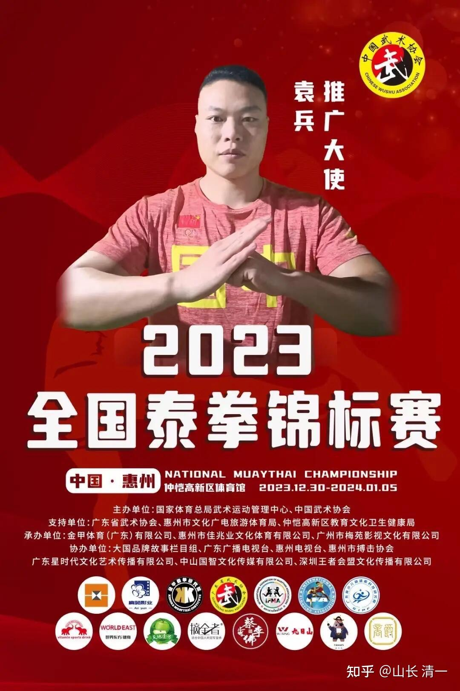

我们已经完成了报名程序：清一太极本期派出14名拳手，参加今年举行的【全国泰拳锦标赛】。

这一次，你们在太极征泰视频上，看到的所有木兰和武士，均将回国参加这次比赛。木兰佳慧这一次也将复出，正式参加本次比赛，她肯定不愿意错过这次宝贵的机会！甚至另外一个，已经退役去今日带班当教师的蔡凯琪木兰，也得到她的学生支持，重披战袍要去参赛了。当然，她的主要目的是会老战友，要去给战友们加油（一起战斗过的战友情，还是非常深厚的）。但顺便也要上场去打比赛，要上场打打酱油玩！用她的话说：虽然很久没练习实战了，肯定比赛能力差了，体能训练也没有跟上。但不就是上台被国内的格斗高手打一顿吗？被打一顿也满爽的。万一---她还不小心把对手打了呢？

只是非常惋惜，大家一直都寄以厚望的郭旗武士，半年多前，就因为遭遇车祸，脾脏受损，导致不能再上擂台了。否则，他和明祺肯定都是这一次的夺冠大热门！春节后，已经养好伤的郭旗，将会回到【清一武医学院】，跟随刘老师学习医道。武医一家，他也不愿意与战友们分开！还希望协助战友们一起去夺冠！

ELLA小公主作为刚刚走上赛场的新拳手，也积极地参加本次锦标赛。她希望自己有机会能够冲入前三名，说不定---还可以入选泰拳国家队呢(内部消息，是本次锦标赛的前三名，都可以进入国家队集训。内部再选出第一名，代表中国参加世界泰拳锦标赛）。小明慧很羡慕EELA可以参数，但她年龄不够，只能以后再上别的比赛了！

除了木兰们以外，清一太极的其他拳手，参赛就没啥野心了。他们原来也没有上过擂台，只是一起跟随木兰们练习备战，全是新手。此次报名参赛，也没有想过去拿啥名次的。都是跟着去打酱油的！（算是我们的后备队伍吧）。这一次去参赛，主要是想去看木兰武士们如何去爬冠军山的，自己长长见识，为自己一年之后，再来正式的竞争，参加这种类似的大型赛事做准备。所以这一次是提前热身，去“找打”的。

虽然本次我们派出的拳手众多，但有实力打入决赛的拳手，大概是3-5个。毕竟中国这么大，很多国内拳手，都是从小在武校练武的练家子，仅仅塔沟一家武校，就有数万学生。选出来参赛的选手，都是优中选优的。据我所知，还有很多体院的搏击专业生（塔沟等武校优选进入大学的）这次也要参加比赛，对手的实力很强的。而且都是国内赛场上，已经征战很多年的老拳手，不少人还是很有经验，很有实力的！真的不可轻敌！

当然，木兰们也不是软柿子，也不好拿捏的。最终，1月5日，各位就可以知道：首次清一太极下山回国，到底能够拿到多少个奖牌了！我也弄不清，等着瞧好了。

本次赛事，今日国际学校的很多家长都会去观战。特别是木兰武士的家长，大多数都从来没有现场观战过孩子的比赛，所以这一次，都会去现场助战。只是木兰武士们却不太欢迎家长们出现，怕家长的担心忧虑，影响他们的作战情绪（跟大家看电影想象的不一样----至亲突然出现在赛场，让拳手勇气大增，最困难的时候反转，击败强敌。而是相反----至亲在场，会让她们有更多的心理负担，更放不开手脚，更容易失败。小明慧第一战，就不让她妈妈去助战，只让我陪她。因为她担心妈妈为她操心，也影响她的情绪）。

但很遗憾：本次赛事，我这个教练，就不能回来当现场指导了。正常情况下，我肯定是要出席的。只是正好元旦期间，清迈安排有【经典财富课程】的培训。职责所在，我当然不能丢下学员不管，只管徒弟。这样也太自私了！

当然，最终我还是要回国参赛的。大约2024年暑假期间，清迈的公主班，应该全体回国，参加【2024全国青少年自由搏击锦标赛】的，她们正好是15-17岁的年龄。这一次我正常情况下是会到场的！尽量预先做好安排，错过暑期的培训安排时段！因为公主班是我的“近卫军”，我得把她们照顾好！