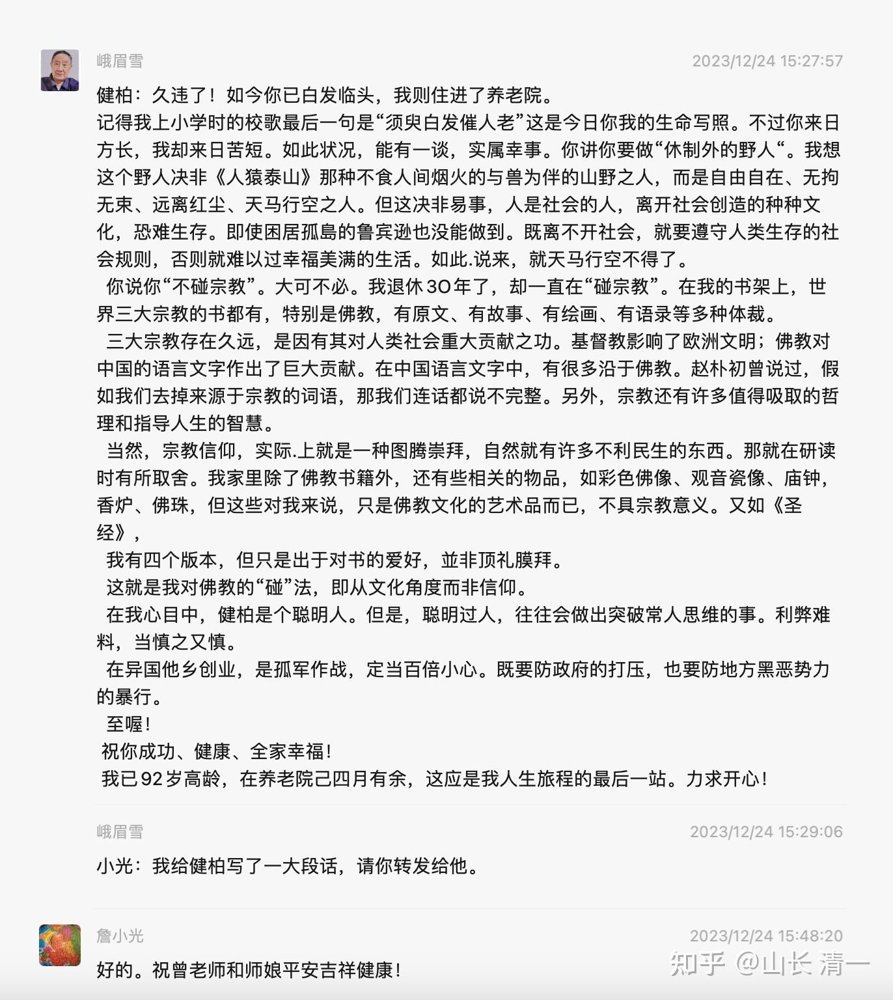

今天意外的收到了一封信！是当年我上大学时代的老师，系总支书记曾老师写的，现年已经92岁了。老人家看到网上说我是“教主”的文章，很关心我的状态，怕我有啥偏激走火的地方。就写了信给我。托我的大学老同学转给了我，我也写了回信。

我把这些信件记录在这里，给后人留一份对历史的记忆。我们这个时代的师生情，与现在大学里面教师，行政人员与学生之间的关系，是完全不同的境界。老师是民国时期旧式教育出身的人，有我们这个时代没有的温良恭俭的作风，谦下待人，高风亮节，不慕凡俗的风骨。当时的老一代教师，是真心关心学生的成长，而不是关注自己的功名利禄，职称地位。现在老师这么大年龄了，依然思维清楚。居然还记得40多年前的一个普通学生，真的非常的难得！（跟我联系的老同学，当年就是优秀的学生干部，学生党员，先进分子。毕业后在政界发展，位高权重。我们有些老同学，已经到了部级领导岗位了。他们与曾老师一直有联系很正常。而我当年只是普通学生，非学生干部。当年也很少打交道，毕业后更是没有啥联系。但老师依然关心学生的发展）。

我很高兴40多年以后，老师依然记得我这个很另类的学生，我可能当年做了很多让老师和同学们担忧和不理解的事情，但我从来也没有做让老师蒙羞，让同学鄙视，让我今天无颜面对师长伙伴的事情。我的人生有很多的遗憾，但没有欺骗。有错误，有教训，有无知，但没有伤伦败德。我很满意过去60年的努力奋斗，有沉沦，有奋斗，但没有迷失自我。让我的今天能够坦然面对老师。

而我的老师，几十年过去，依然觉得我是一个愿意教诲的人，是一个有点傻气，但不乏优点，只是需要用更丰富的人生经历来关心爱护，善意提醒的奇怪学生。而不是一个需要老师原谅，宽恕的无耻混蛋！我才60而已，就已经见过太多，恐怕TA这一生都没脸再来见我的学生。也有可能想见我，但我只想相忘于江湖，一句话都不想多说的学生！我了解这种跨越40年的师生之情，是多么的难得！

曾老师给我老同学发的信息： 看了网上的张教主相关的文章。给我的感觉建柏是个不安分的我行我素的自由主义者、独行侠。经商失败，炒股致富，办学求变，四处流浪。现今闯到国外。不知后果如何？但愿功成身退，安享晚年。想当年建柏在电力系上学时，经常逃课，任课教师很不满意。。。。。。后来我找他谈话，批评了他。又过了几年，他在经商（武大研究生毕业后），在校内我迂见了他，问了些情况，随后我向他推荐了南怀瑾的《论语别裁》一书。以后再未见面。】

** 我的回复：谢谢曾老师的照顾和担当，当年的确有些胡闹。现在也在胡闹。让关心我的人看了就不放心，我母亲也对我不放心。真不好意思！幸亏小刘（妻子）对我很放心。也很支持我。小家还算齐得不错，安度晚年应该没啥问题。虽然穷折腾，就玩玩教育和武术，不去碰政治，碰宗教。也不去玩社交，更不结交江湖人。就做一体制外野人，也没机会去贪污。这样，应该是可以安全落地了，请曾老师放心！**

老师的记忆真好。多少年的往事清晰，文字很有条理。还记得给我推荐书的事情，以及我大学时代调皮逃课的事情（我在大学时，常常逃课去图书馆，读自己喜欢的书，而不是逃课去吃喝玩乐打电玩---当时也没有）。哪里像92岁的老人。很多人50岁就老糊涂了！估计曾老师一生爱读书，爱思考，所以大脑才没有衰退吧，希望我92岁依然如此清醒！

简单的回信，没想到曾老师却给我写了一封长信。充满了长者的智慧和对后辈的关爱！ 如下:

曾老师您好：

谢谢您的来信和指导。没想到40多年了，您还记得一个普通学生当年的事情。也关心学生现在的状况和发展！因为我行事一直与众不同，老师看到网上对我的攻击贬低颇多，对我有些担心，非常感动。过去时代的老师，对学生的关心是发自内心的，无欲无求的。现在的武汉大学，应该已经没有这种师生情谊了。非常怀恋过去珞珈山时代青年的意气和迷茫共存的时光！

记得当年毕业留校后，在武大校内偶遇曾老师，一直勤读各种书籍的曾老师，非常关心我毕业后是否还爱看书，还推荐南怀瑾的书给我。当时应该大陆刚出版不久，说明老师一贯关注学术文化界的新动向，与时俱进的读书求知热情至今不懈。后来我读了不少南老的书，的确大开眼界，还没有见过有人这样解读传统文化的，对我启发很大。多年后，我遇到南老的“私人学生”（南老不承认自己有弟子），说要带我去见南老（太湖时代）。因为这人认为：我很可能就是南老一直在等的“接棒人”。我自知自己的法脉源流，并非南老一脉。他是弥勒内院的“正取生”，我只是偶尔去蹭蹭课的“游学生”罢了，肯定不是他的接棒人。就没有去烦扰他老人家了---反正该说的，他老早在书中都说了，我也看了。不必去当面表演啥请教，敬仰，感谢之意。让老人家也只能照顾后生面子，应酬劳累。所以，我只是对他的学生表达感谢，并表示对他深深的敬意。我平时也喜欢推荐南老的书给年轻人读，应该有很多人，是因为我而结缘南老思想的。我认为这就是我对南老发自内心尊敬的表达方式，而不是去拜见南老，蹭他的大名，假装是他的弟子。据说，南老到死也没有等来他的接棒人，是一个很大的遗憾！也让我理解因缘聚散，无有定数。长达千年的传承法脉，也就这样中断的---因为世人不要了（南老法脉，最初来自于慧能【一花开六叶】之一叶）。有生自然有灭，符合天道。

我与南老思想上的结缘，就是曾老师您引导入门的！非常感恩您当年的推荐，传播善知识！

也谢谢老师关心，提醒我不要“避世”。我了解人是离不开社会的，我们无法提起自己的头发来离开地球。我这野人，不是逃离世界，只是喜欢远离繁华的乡野之人。我是避庙堂之高，不去做官。我也避江湖之险，不立山头。总之，我就是图个自由自在，避免进入利益集团与人争斗，不参与这些人间的竞争和算计以及必然带来的烦恼罢了！只是我玩自己的游戏，自得其乐（但清福难享，就算我当野人了，也免不了被各种人找上门来，各种的算计，也教我学会设防到处都是的小人）

我也不反对利益集团。我反而喜欢研究和了解各种利益集团，他们玩法都很有趣。很精彩。有时候看懂了，会跟他们一起分一杯羹。就像我不喝酒， 不吃宴，不请客，不陪席---奉行“避席”原则！被人视为怪人。但我却是酒业上市公司的大股东！从酒业利益集团手中分一点食。我这野人，也会踪迹行于闹市，欢喜赞叹人生社会的繁华奇妙创造。

我在事业和生活上，尽量走低欲望原则，避免被美食，美物等绑架。也因此不思进取，不去想要什么建设丰功伟业啥的。小光想帮我的忙，劝我去京城，跟他一样当个文化部门的官，帮我进入庙堂---“洗去江湖教主污名”。但我觉得京城居，大不易，太累。污名清名，也不在意。我也不想去学人尽情享乐生活，去“阅尽繁华”。我来泰国多年了，居然从未去过曼谷，芭提雅，普吉岛等繁华城市。我觉得吃喝玩乐一样很累人。我就一直在清迈居住，守住一份清净自在！这就是我的野人形象！一切随缘，借势就好！无我，无为，图个清静，避免心乱！当然---从未看过海的小女，想我陪她去看海，我肯定会带她去一览繁华的。还说明年要带她去大草原看看“美丽草原我的家”。我看中的不是风景，不是美食。而是亲人的陪伴和成长。而小女看中的，则是我带她旅游时，一路讲的各种故事和独特的，观察人间世的思想，她也不在乎风景和美食。

多年闯荡社会，吃过很多的亏。我知道老师的指导，都是金玉之言：我们做人，就必须尊重社会的规则。不能自行其是！想要世界来适应自己定的规则，这肯定是找抽的！所以---我会认真和小心地了解世界的一切，不拒绝一切真相。尽管真相和人性。都常常让人难以面对，不忍直视。但我们必须勇敢地面对和接受这个世界的颠倒，也接受自己的愚痴和过错！我练太极，但不能指望世人跟我一起练太极套路和推手。但我可以使用太极技术，去参与世界各种的格斗游戏竞赛比武。我们完全可以在别人的游戏中，也玩出自己的独特和个性。而不是强迫别人来玩自己设计的游戏。虽然拥有不同的选择和价值观，也不需要彼此互相排斥和矛盾冲突。君子和而不同！

我还要感谢老师来信中指导我对宗教的态度。我理解老师是担心我因为“排斥宗教”，从而失去了绝佳的人生的观察角度，也失去一些非常杰出的人生导师的引导和提升的机会！感谢老师的厚爱！

我与老师一样，对三大宗教都不排斥，但我也不跟随迷信，我只是全然的尊重和学习。10年前，我甚至在一座庙里面给和尚尼姑讲过【金刚经】，很受欢迎。也在今日讲堂公开讲过【六祖坛经】，有人自发刊印出来到处散布阅读。但我不是佛教徒，我认为佛学与佛教不是一回事，耶稣与耶和华也不是一回事。我对“宗教”的所谓“拒绝”的心态，只是拒绝被宗教利益集团洗脑罢了。我认为现在的各种宗教，往往也和世俗的利益集团一样，追求名闻利养，追求愚弄信众。纯粹的祖师大德们真正追求的佛学，不是这样的形状。唐代大禅师的绝代风华，窃心向往之。中国寺庙的宗教氛围，更像是一群疯狂的投资人，以为菩萨神佛也像他们一样贪婪，争相收取贿赂然后为他们发好处利益。一堆连香蕉苹果，烟火都依赖信众供奉的可怜神佛，却有能力为香客们创造巨大的金钱，利益和地位！大大聪明的信徒们，只需要用一点小小的恩惠施舍给神佛，却笃定神佛专做亏本生意，能为自己带来百倍千倍的巨大利益和收获。这种无逻辑缺心眼的宗教，我当然必须拒绝了。但世界范围的宗教，基本都与之类似。只不过---中国人物欲重，喜欢求神赏赐给自己各种世俗的各种好处，名闻利养等等。西方人求神，更多是希望神给与他们心灵的安慰，给以永生和天堂。本质上，中西双方追求都差不多。都是忘记了三大教的祖师，当初创立教派的宗旨，是希望信众从内心深处解放自己。而不是为了自己的欲望去祈求神佛满足自己的私欲，把自己的命运交给僧团，教宗去裁决。这种宗教，说是麻醉品也不为过。世人就喜欢自欺欺人。

我拒绝物质的麻醉，也拒绝精神的麻醉。因此我拒绝宗教各教派的迷信。我不拜神，不拜佛。往往过庙而不入。我只是尊重神佛，尊重伟大的人类教师---如三大教的宗师。

我知道保持心灵清醒，有时会让自己面对巨大的痛苦和折磨。但我依然选择清醒的面对苦痛！然后我要设法看穿苦痛背后的真意，感受自己苦痛的可笑和愚痴。比如---如果儿女“不听话”给我带来的痛苦，其实本质是我想要“控制”她，想要她满足我的愿望，跟我一样的行为和想法！当我选择尊重她个体的自由和选择之时，我也不会痛苦，她也解放了。

如果我面对死亡感到痛苦和恐惧，肯定是我还无法知晓死亡的真意。如果我能学会像庄子一样笑对死亡，怎么还会有死亡的痛苦呢？因此，我发现只有清醒---才能带来给我发现自己愚痴和提升改变的机会！

所以我是一个“拒绝”酒类和药物进入身体的人---拒绝迷茫。但同时我会拥抱酒类公司进入账户---满足世人昏沉愿望？看起来非常矛盾的我。

突然知道：曾老师今年已经92岁了，在我心中，您还是当年才40多50岁，眼神严厉和慈爱兼有的，正置壮年的曾老师。我很羡慕老师如此高龄，依然头脑如此的清醒。我不知道自己能否活到老师的高龄（我亲弟弟47岁就离世了）。但如果我有可能活到92岁，希望彼时也能够像老师一样，清醒和慈悲，善意而同情地看着这个荒唐而奇妙的世界，自尊和自强的活过每一天！我也期待能够像曾老师一样，还能够用自己一生的积累和经验，尽力来给迷茫的后生们一点指导-----如果他们还需要我的话。

最后，我想知道博览群书的曾老师，有没有看过一套【与神对话】的书？其中有一本，我认为特别值得阅读。我非常的喜欢，就是【回归神】 。有的版本也翻译成更浪漫的【与神回家】。现在已经很难找到印刷版本了。因为---这是一本谈死亡真相的书，中国人很忌讳死亡，所以大概出版后就卖不出去。当年我买到书籍后，视为宝贝，还买了不少本送给亲朋好友（瞧我多傻！）。书中对死亡的描述，是令人喜悦和放松的---而非愁苦和纠结。也许这本书对死亡的解释，未必是最终的真理！但是-----我真的找不到比这本书更好的解释了。

如果您已经读过这本书，我想有机会，知道老师对这本书的看法。

如果您还没有读过这本书，我希望我能有最大的荣幸，能够给老师您推荐这本书。它一定能够带你看到一个令人意想不到的，也令人欢喜赞叹的，新奇的死亡世界------与生命的世界一样精彩，有趣！

祝福老师，师母，家人吉祥平安如意！

您的老学生 张健柏

说明： 文章题图，是我今天的学生---公主班集体照。昨天刚拍的照片，用来纪念她们2023年学习历史的年终照。因为她们马上就要放假了，各回各家。我不在照片中，是觉得自己又老又丑，就别出来跟公主们在一起煞风景了。不知道她们60岁的时候，我还在不在这世上？她们又会给我写一封怎样的师生信呢？我有点好奇----