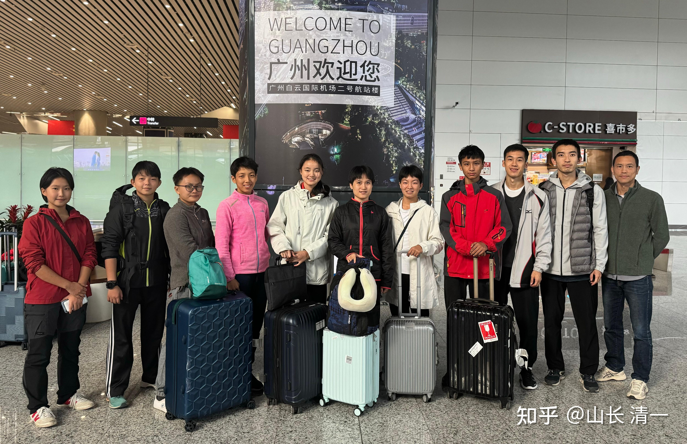
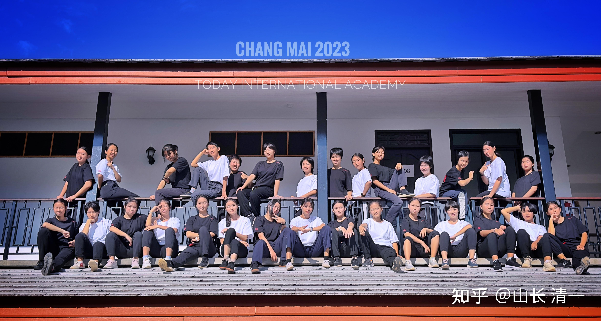
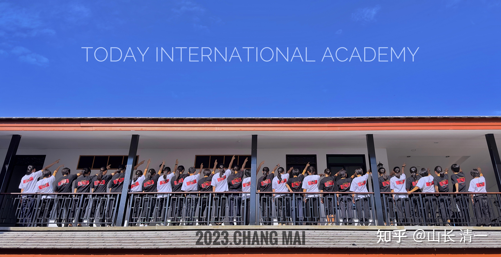
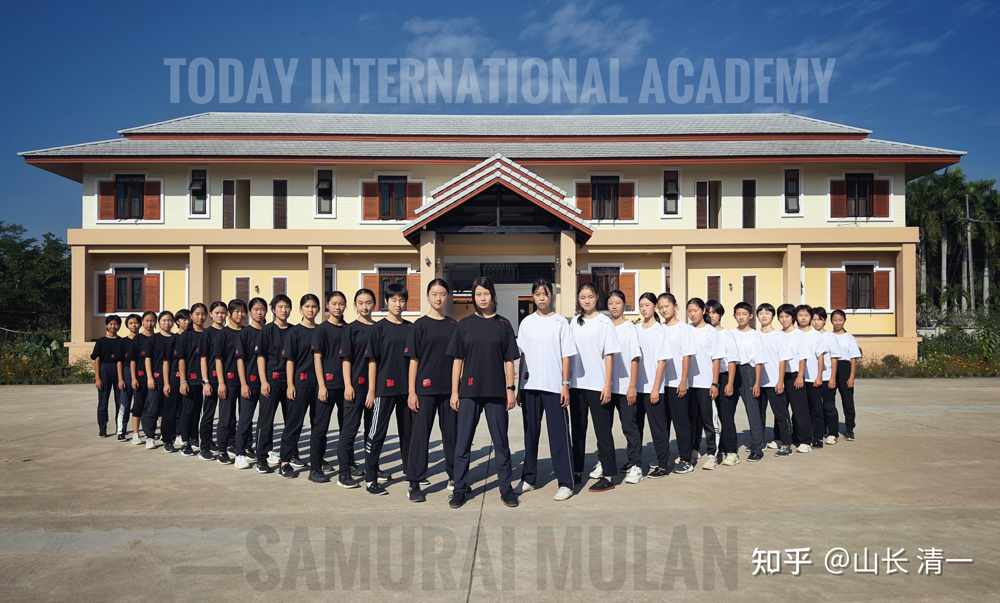

全国泰拳锦标赛于本月31日报到，1月1日称重仪式。1月2日开始比赛，1月4日结束比赛。猜猜看，本次赛事我们清一战队能够拿到多少块奖牌？看谁猜准了[表情]。。。。另外----半年后参加【全国青少年自由搏击锦标赛】的【清一公主战队】已经组队完成，集体亮相了，欢迎各位看看后面的照片！清一新教育体系，从今年开始，将要批量的涌现全国冠军了！成为全世界教育历史上的全新记录。未来的今日三校，将成为批量涌现格斗全国冠亚军，比任何专业的武术大学更多培养出优秀拳手的另类高端国际学校。清一新教育，也将为世界的素质教育指出新的方向，让孩子们能够以优异的SAT成绩，加上优异的赛场成绩，甚至以全国冠军，世界冠军的身份，申请进入国内外名校入读。

将来，学霸们去打实战比赛，去拿到全国冠亚军，可能证明是最轻松获取世界名校资格的入门证的最佳手段！不比卷SAT成绩满分，要更加轻松快乐吗？

这是拳手们回国后，在机场的集体合照，

山长 清一：清一战队已到达赛场：要拿几个全国冠军？

我原来说：我们清一战队，应该有三到五个拳手进入前三名。拿到进入中国泰拳国家队的资格证！参加明年举行的世界泰拳锦标赛！

但刘老师说：我的判断太保守了。她认为我们这一次，仅仅是拿到前两名（冠亚军）的人数，都会超过5名的！更别说加上第三名了。所以，可以把实现的目标，再提高一点点！

我有些惊讶：清一太极首次出山，难道就会一鸣惊人？成为赛场上最亮的那个星星？塔沟武校几万人，全国武术大学搏击队，众多的搏击俱乐部，这么多专业武术人员，居然就让我们出来抢这个风头？是我们太强了？还是国内的对手太弱了？

各位认为我们能够拿到几个冠军？几个亚军，几个季军呢？我们 总共派出了14个拳手，其中7个是打了一年多的“老拳手”，这几个人把握大一些，但所有女生的级别都重复在三个级别内，最多也只能拿三个冠军。还有一个新拳手Ella打了两战。其他的拳手，全是没有上过赛场的新生代就赶来打全国赛了！这次参赛只是想来练练兵，打打酱油。并未指望拿奖。所以--我们的老拳手参赛的级别加上男生总共只有五个。加上新拳手也再增加一个，但新的男生参赛希望应该不大。你们竞猜一下，我们能够拿多少奖牌？看谁能猜准！

**下面，是我们太极格斗的后备军。半年后将要参加【中国青少年自由搏击锦标赛】的【清一公主战队】。各位看看有她们有没有冠军相？**

*公主楼的公主们*

看了这些照片，我想：明年我亲自带她们出山比赛，参加全国自由搏击锦标赛，会不会像是一个神秘的老头，带了一大群女保镖随从？招摇过市？