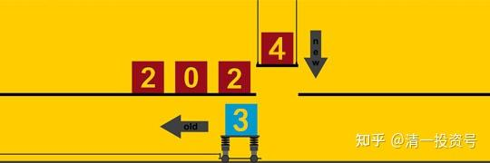
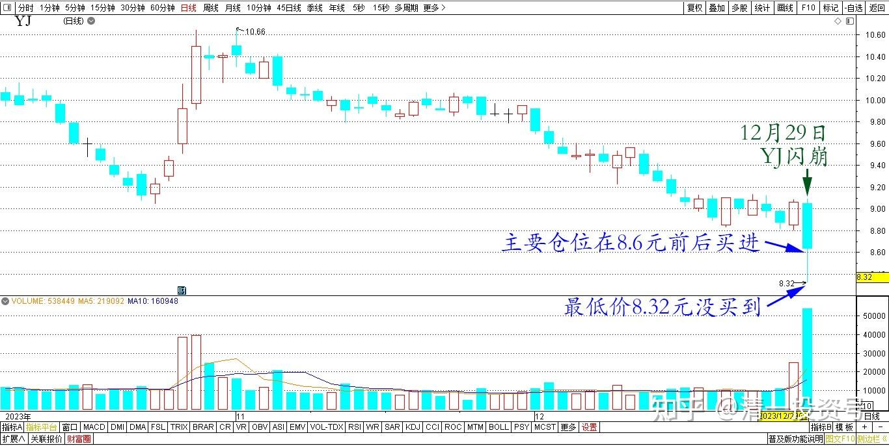
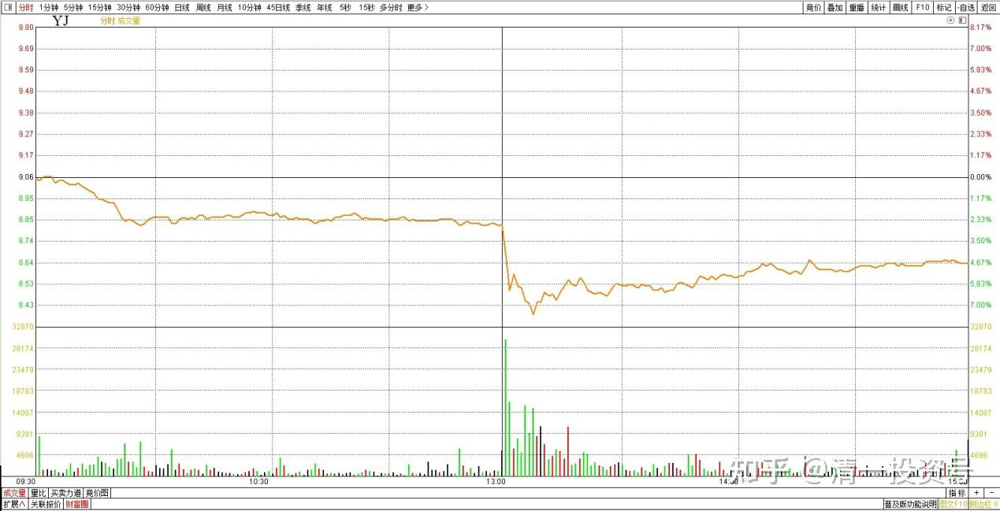
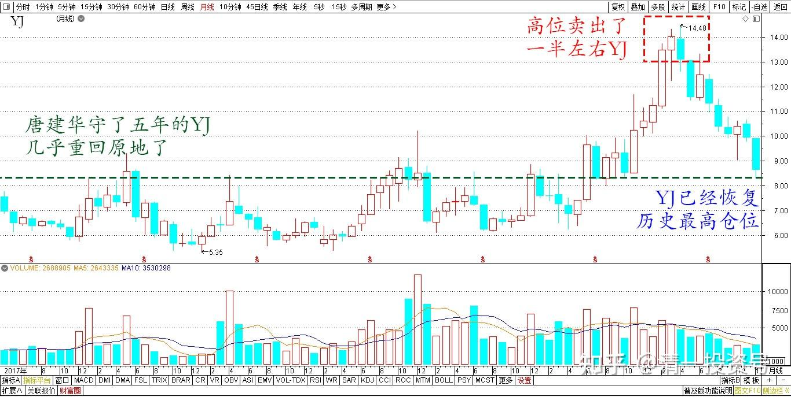
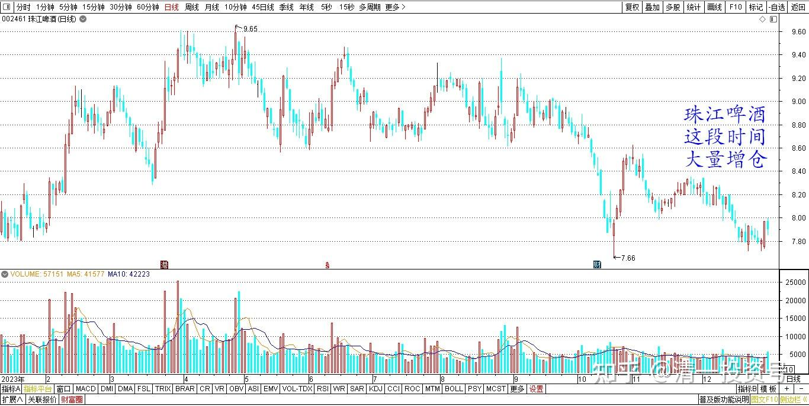
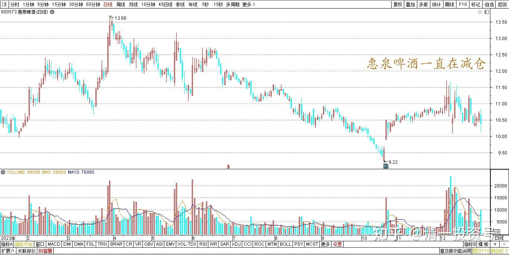

68篇.2023年最后一份持仓总结

清一山长 2023年12月29日

今天是2023年A股交易的最后一天。今天突然发现燕京闪崩，差点跌停了。**我只好尽量的拿钱出来买买买**，总共买了两百多万股。最低价8.32元我没买到。主要仓位是在8.6元前后买进的。

*燕京啤酒 2023年10月～12月 日线图*

*燕京啤酒 2023年12月29日 分时图*

所以，我为拯救燕京啤酒今天的崩盘，做出了重大的贡献（但也可能会有人认为我在别人砸盘制造恐慌的行动的时候捞筹码，坏了江湖规矩？真的吗？）。无论如何，今年的交易终于结束了，明年继续苦哈哈的守燕京啤酒吧！**持股如守寡**……但我比老唐已经好很多了，他守了五年的燕京啤酒 ，几乎重回原地了（今天差点破8回7了）。

由于今天辛苦救市，也把我的钱全都用光了。目前，我的燕京啤酒已经恢复原来的历史最高仓位，已经重新回到燕京啤酒 的十大（如果年底的十大条件不变的话）。但由于我高位卖出了一半左右燕京啤酒 （真遗憾，应该13～14元全卖光的），所以现在的持仓成本，只有市场价格的一半左右。比我上一次高峰时期持有燕京啤酒 仓位的成本要低很多（当时的账面甚至都是绿的）。现在账面还有大量的盈利！尽管现在的价格跌得很低了！但市值比原来更高了。

*燕京啤酒 2017～2023年 月线图*

另外——珠江啤酒这段时间我也在大量增仓，买成了比原来最高持仓还多一倍多的仓位，继续巩固了我的珠江十大股东地位。

*珠江啤酒 2023年 日线图*

不过——由于惠泉啤酒一直在减仓，今天也减仓了十几万股。所以惠泉我已经双双退出了十大股东。（编者注：双双指山长操作的两个账户）

*惠泉啤酒 2023年 日线图*

等于今年年底，我退掉了两个十大，增加了一个十大。看起来是今年反而退步了。不过持仓数量创新高了！市值也比去年高了。因此，今年这一年，也算是丰收年吧！谢谢老天爷的打赏！也谢谢每次都跟我反着做的人。反对我的黑子们，就是我前进的最大动力！大家一起加油。今年的最后一份持仓总结！祝福大家今年收获满满，明年吉祥如意，步步高升，新年新气象，新年大发财！

(标题、图片为编者所加)

[原文：今天是2023年A股交易的最后一天](https://www.zhihu.com/pin/1724099763698528256)

**文章音频：**

[406篇.2023年最后一份持仓总结_清一投资号文章同步音频](http://link.zhihu.com/?target=https%3A//www.ximalaya.com/sound/696955424)

**参考链接：**

[60篇.中国建筑安心买入，珠江啤酒价格很香](https://zhuanlan.zhihu.com/p/667041164)

[61篇.投资养老新模式？比退休金更可靠的金融账户养老收益](https://zhuanlan.zhihu.com/p/668298628)

[62篇.YJ前三大股东研究](https://zhuanlan.zhihu.com/p/669500082)

[63篇.负成本——换股的功劳](https://zhuanlan.zhihu.com/p/670185909)

[64篇.重庆啤酒的主力拉升分析（事后诸葛解析）（配图版）](https://zhuanlan.zhihu.com/p/671473163)

[65篇.惠泉异动，借机换股](https://zhuanlan.zhihu.com/p/672731534)

[66篇.金融理财？干嘛非要把简单的事情做复杂呢？（配图版）](https://zhuanlan.zhihu.com/p/672554704)

[67篇.A股破位下跌的奥秘](https://zhuanlan.zhihu.com/p/673876597)

