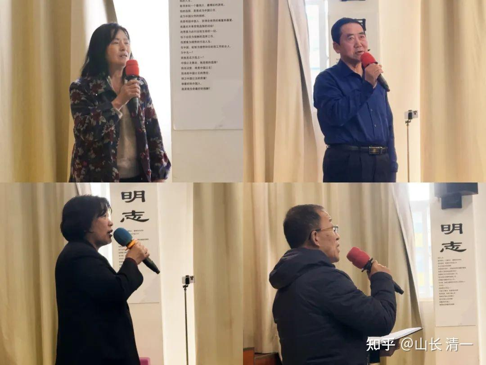
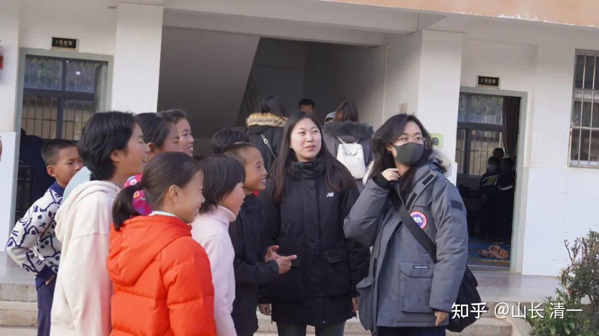
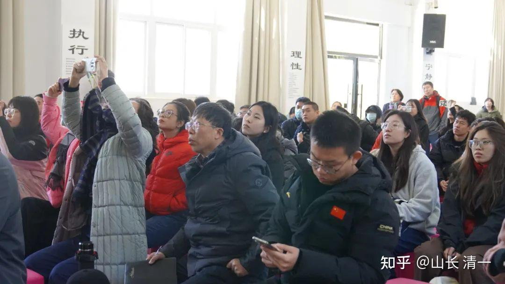
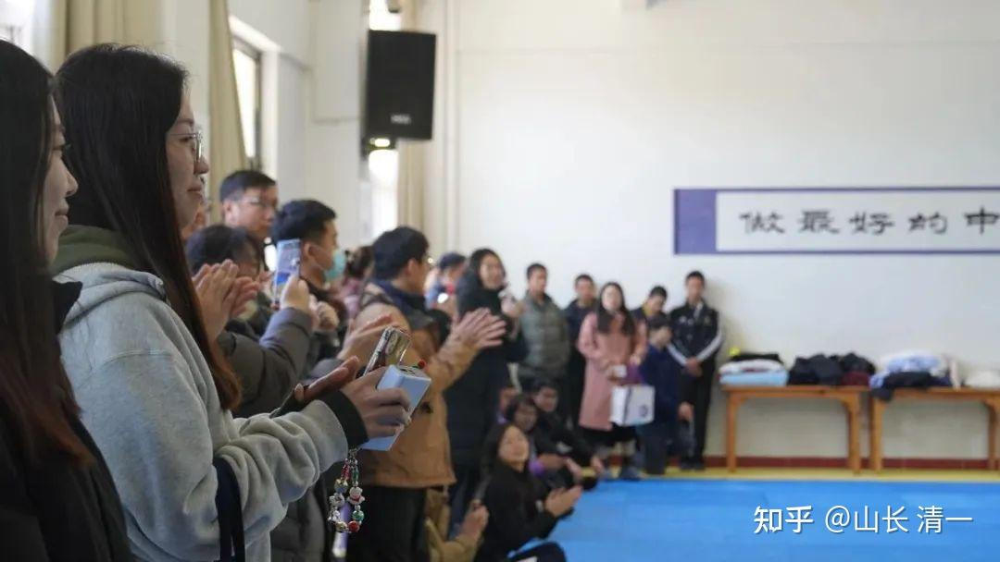
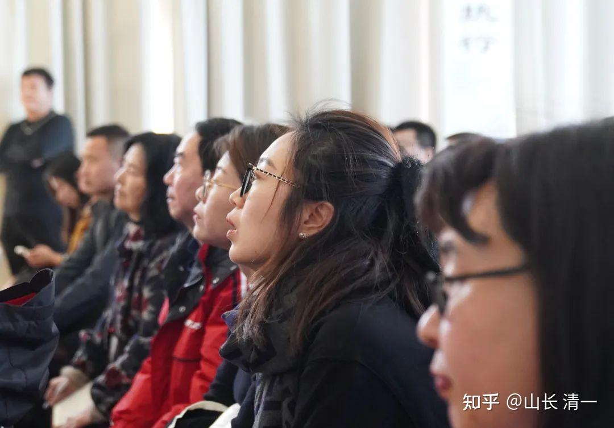
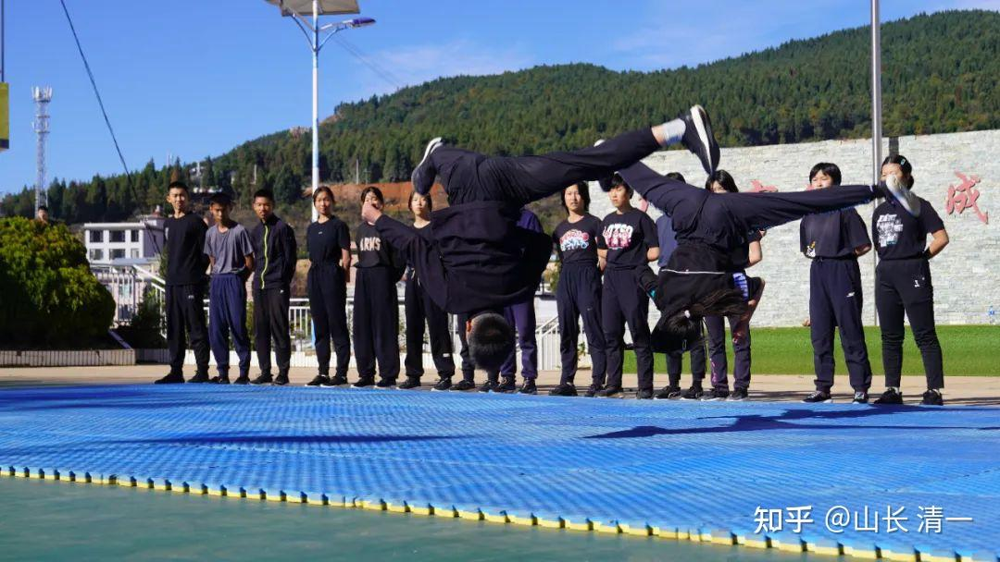

**今日学堂正在“反向影响”和领导传统体制学校的教育改革方向！**

2023年底，三语高中迎来了一个特殊的访学代表团。该访学团来自于北方某省会城市的一所重点中学，云集了该校总校长和各分校长以及骨干教师们，共计58人。其中，包括体制内实力强劲、成绩显著的几位省特级教师，他们曾带出过多位省高考状元和一批考上清华北大等名校的学生。而且，这个学校规模很大，整个K12体系在读学生超过一万人。那么，这些骨干教师们，为什么选择在这个时间，放下自己手头的工作，不远千里而来，专程来到三语高中参访呢？

几年前，该学校总校长从我们学堂一位家长那里听说了今日学堂“四个半月突破一门外语”的神奇教学纪录，就专程来学堂参访过，眼见为实，大为赞叹。还派了一批年轻教师来今日学习，上课培训。此后，便在自己学校内部成立实验班，采用我们的英语学习法进行教学，结果让该实验班的英文成绩一跃成为该市第一名。

近年来，她又关注到我们已经完成了“三年突破十二年”的项目，更为惊叹不已。半年前就提出申请，强烈希望能带领更多的分校长和骨干教师们来实地访学参观，借鉴我们的成功经验。由于这位校长虽然已年超七旬，但依然精力充沛，而且非常谦虚，乐于学习先进的教育理念，为人很受人尊重，所以基金会便同意了这次访学申请。

经过了为期三天的访学，访学团实地考察并亲眼见证了今日国际学校“三年学完十二年”的教育奇迹之后，他们都表示深受震撼与冲击，对学生们的表现赞不绝口，也对三语高中做出了非常高的评价！

**其中一位分校长非常感慨地说：**

“中华文化五千年并不缺少神话，但是现在中国却缺少了一部教育的神话。庆幸的是我们来到了三语高中，发现了、见证了中国教育的一部神话。像你们的“3年完成12年课程”，那是一个中国的神话、世界的奇迹一样。魔术师刘谦有句台词，“见证奇迹的时刻到了”。我们就今天真的来到了三语高中，在见证奇迹的时刻。同学们学习英语的方法、效果、成绩让我感到非常的震惊，这样的速度我们是不可想象的！”

*参访的老师，分校长们纷纷发表参观感言*

**其他的老师在交流中，也纷纷表达了诸多溢美之词：**

“从表演开始到刚才的交流结束，孩子们都是侃侃而谈，有理想、充满了对未来的向往。这样的工作，不是那么好做的，但新教育做了。非常感谢他们推动了教育的向前发展。我们可能已经落后几十年了。”

“带着一篇【让普通人成为天才】的这么一个文章进了校门。进来之后，看到这样的校舍，看到咱们刚才校长说的“面部像运动员的孩子们”，就开始怀疑，什么样的教育能让这些孩子成长、成才？是什么样的理念让这些孩子内心这么强大？就像今天校长所说，没有什么不可能，就是你想象不到。今天真是受到震撼，我觉得是我的学识限制了我的想象！”

“到了三语高中，第一眼看到的是什么？是我最想看到的学生表现。因为我们在学校是负责培训工作，而且我本人也多年从事教育工作，所以看这边学生的话，就正是我们希望得到的。特点是什么呢？朴实无华、再就是热情亲切，再有健康！第二点，我们看到这些学生有超强的个人能力。外语，咱们的英文老师给予了极高的评价。学生个人最初的素质，就是小学四年级的水平、五年级的水平。但是现在，他们英语的水平是大学教授的水平了，是吧？那就太高了。另外，不单是英语，实际上在英语的学习当中，还有在美国课程，K12的课程当中，他们也学了很多其它的科学知识。先科学，然后是社会科学，然后是数学…… 所以他们也学了很多的知识。我认为这是非常好的一个模式。那体能呢？都不是一般的学生能做到的。我们体育生能做到这个强度也不容易，是吧？所以他们有超强的个人能力。第三点，它没有专门的德育处，但学生的思想境界很高。因为他的学习起点就高，它不是我们的英语的“小册子”教材。它直接上本《飘》、大部头，这个知识水平可比我们教材要深多了，非常深。周五的主题课讲的正能量，宣传的是什么？英雄主义！对每一个人的语言行为做细致的剖析，让学生学什么呢？在生活当中明辨是非。所以这就是德育！”

[体制名校访学三语高中记](http://link.zhihu.com/?target=https%3A//mp.weixin.qq.com/s%3F__biz%3DMzAxNzk5NjIzOA%3D%3D%26mid%3D2247504170%26idx%3D1%26sn%3D8b3a05b56ad9bd513160ff3fd3033bf6%26chksm%3D9bdf918baca8189d89af71b20401803792db5de747add8b89e670ba42336ee53f9d16caaab36%26mpshare%3D1%26scene%3D23%26srcid%3D12310WefEPw5avF9Vd5tcX6P%26sharer_shareinfo%3D4816f7acfda6f5f15f1f99902a7f86a9%26sharer_shareinfo_first%3D4816f7acfda6f5f15f1f99902a7f86a9%23rd)[【示范班第七学期】示范班接待体制名校参观，获高度赞誉_哔哩哔哩_bilibili](http://link.zhihu.com/?target=https%3A//www.bilibili.com/video/BV1Kc411k7AE/%3Fspm_id_from%3D333.337.search-card.all.click)

*示范课上课*

*孩子们的运动能力展现，让参访教师认为是不是来到了体育学校？*