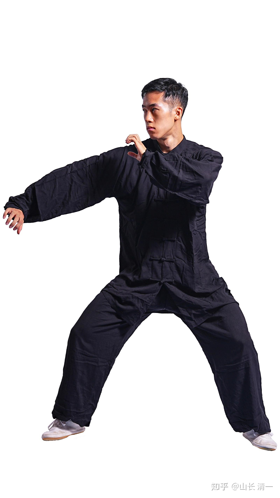
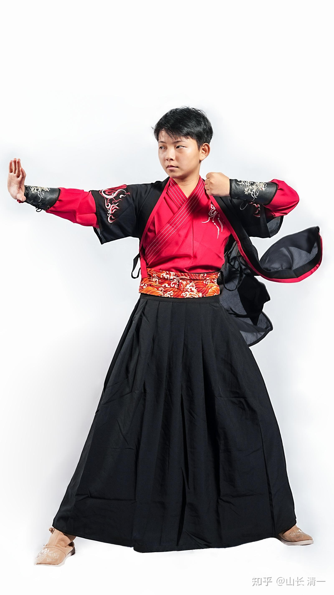
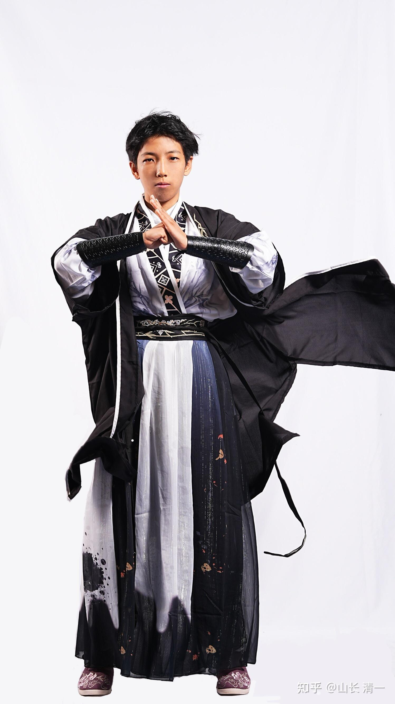
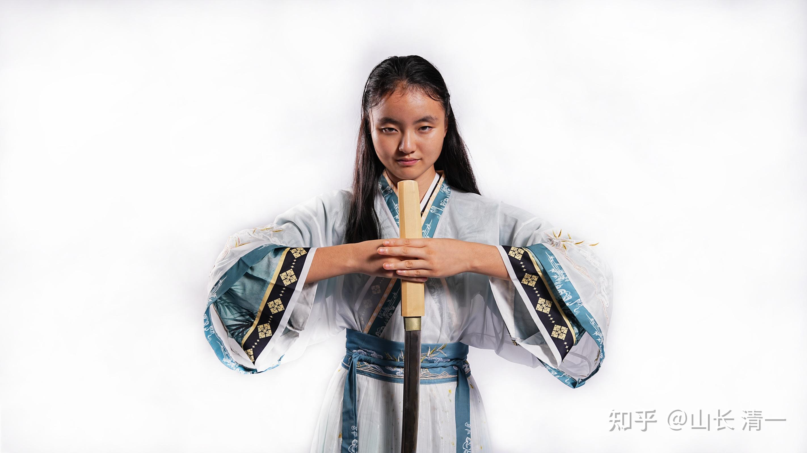
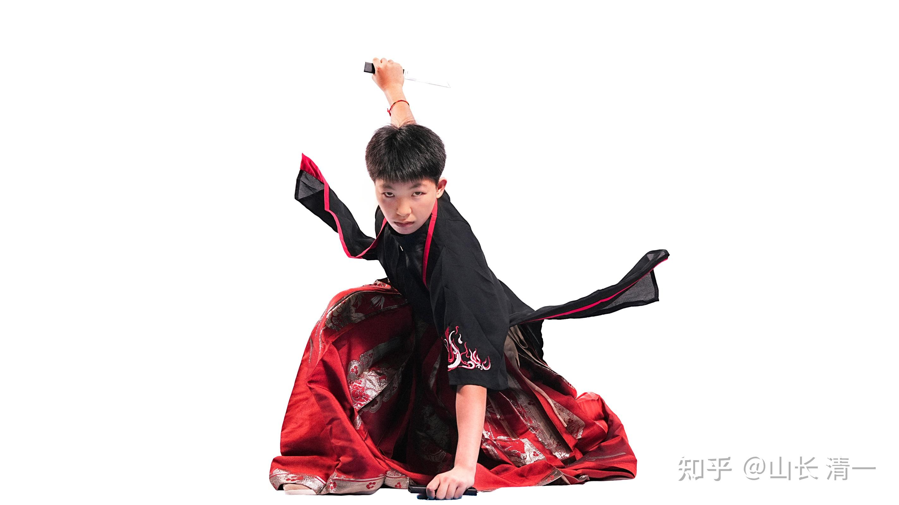

我们的木兰和武士拳手，参加了5个级别的比赛，今天已经完成抽签了，明天就正式开赛。我看了一下赛程，认为我们争取金牌可以做到【保3争5】这个目标，应该是没有问题的。就是保证拿到三块金牌，然后如果孩子们表现不错，对手不够强，争取五块金牌就很牛了，等于只要我们清一武馆的人参加比赛的级别，金牌就被我们夺走。这绝对是压倒性的优势，才有可能做到的地步。

其他我们还参加了3个级别的男子比赛。这些学生是“打酱油”的，没啥实战经验，就是在清迈跟随木兰和武士们一起练拳，当陪练的男生，主要就是商学院的学生。对他们参赛，主要就是让他们去锻炼一下，没有指望他们拿牌的，而且国内的男拳手实力，总体来说还是不错的。所以---重在参与吧，我把这些人算半个！不过，万一这些“半个人”，意外拿到了奖牌，甚至拿到了金牌，就只能说：中国的格斗水平太烂了。要不就是：太极格斗的技术太牛了。

武汉体院是国家泰拳队的集训队，实力超强，历年来，都是全国泰拳比赛的NO1。这次武汉体院队派出了总共11名队员参加。我们所有的男拳手，都要与武汉体院队，以及一个全国知名的泰拳队硬碰硬。所以---真正的实力展现，应该在男拳手这里！（中国的女泰拳手，我看水平实力太差了。应该不是我们队员的对手，我们女队应该轻松获取金牌）。男生看我们的两个正宗清一武士，能否顺利多奖。另外几个打酱油的陪练男拳手（首轮就碰到武体队，有点难啃），这一次能够在男子泰拳级别，拿到啥奖项呢？

*明骐武士照*

我们的女生参加共三个级别的比赛，她们没打算给对手留下任何拿牌的空间，甚至打算我们的拳手去包揽金银铜三块牌子。ELLA的计划，是要拿到铜牌----因为她的同级对手包含有谭木兰和明晓，她要跟他们对拼，她的发挥空间就太小了，她只能收尾了。本来明晓在更低一个的级别，只是明晓的级别取消了，只能升级到谭木兰的级别来打。她们三人，计划在决赛中会师，不给其他人留下拿牌空间！

*佳彦木兰照 *

*明晓木兰照*

*Ella 清一公主照*

*佳慧木兰照 *

领队的现场汇报：今天下午是运动员适应场地，大家都上擂台感受了一下。吃饭时#老师（武汉体院队教练）就说你们的队员上去一练，下面的裁判员就笑了。说她们一看就不是武体训练出来的。姜老师说我们训练的动作不规范，按理重心要低，动作要直接快速有效，但我们几个女队员，重心很高，而且忽高忽低的，这不行，不符合动作规范。

我就故意问姜老师，如果动作跟你们认为的标准不符合，会不会被判无效啊。姜老师说，那不会，一般是用结果说话。我就说那就没有问题，孩子们发挥出水平就好。我想明天大家就会看到“不规范”的动作，怎么打败“规范”动作的。

**技术解说：武汉体院的教练，还是很有技术水平的。他一眼就看到：【我们几个女队员，重心很高，而且忽高忽低的，这不行，不符合动作规范。】，眼力真的很好，马上就发现我们的不同之处，而且说的很清楚。我们的重心的确很高，是方便移动。泰拳的重心低，移动不灵活。但支撑稳定，抗击打力强，攻击的力量也较大。我们的重心的确更高，但移动很灵活，泰拳手很难抓住我们的动向。如果是泰拳手，在我们的这种高重心状况下，是不能发力的。也很容易接不住对手的攻击力量。但我们不是硬借对手攻击力量的，而是边打变动，让对手无法发力的，所以不担心重心高的问题。至于身形忽高忽低----属于架子不稳。练武之大忌讳（外家拳）。但我们这样是太极如水，腰挎力量的发力方式的外在显示，也是开合力量的表达方式，是方便发力的！因此----显然我们和泰拳，外家拳，是典型的不同技术流派的。这个教练看这种区别很清楚。只是他现在，肯定不会相信这种训练很不正规的技术，能够击败他的“正规标准泰拳技术全国第一的武体拳手】。如果后天出现了这种情况，他才会重视起来的！不然会很轻看我们的。认为没有技术！我要求应老师在女生打出威风后，让他们安排我们的几个女生，与51公斤的男拳手打比赛（试验赛），如果一旦安排上了，他们就知道厉害了。难说这些男拳手也会吃他们的亏！**

上午领队会议，国家体委武术中心负责人张雷发言，发言的内容，跟山长对泰拳的推测完全吻合。

事隔5年重启泰拳锦标赛，因为中国泰拳水平太差，派出去打国际锦标赛的选手一去就被打得稀里哗啦的，而且参加的是23岁以下级别的比赛，水平高一点的精英赛甚至连人都派不出参加。所以这次比赛要看看有没有高水平的队员，可以选入国家队训练，参加国际比赛。

他还说国内泰拳结构松散，训练水平不够，要开拓思路，扩展泰拳的发展渠道， 比如泰拳进校园，还要结合中华文化进行推广。

他说武术中心有7个部门，他对哪个部门都全力支持，只要大家有想法有思路都可以跟他交流。还举了散打队的例子，中国散打队用两年时间，水平迅速提升，从恐伊朗，到现在已经把伊朗打趴下了，只要中国参加的级别，伊朗就不敢参加。希望泰拳也能像散打一样，找到提升方法和路径。

2025年世界运动会在成都召开，已经确定有泰拳项目了。还有泰拳世界锦标赛希望中国来承办，但武术中心现在还没有答应，因为一旦承办至少是2千万的花费，如果我们中国连块金牌都拿不到的话，拿钱出来承办就亏了。

为了帮助泰拳这个项目的提升，24年打算安排一些比赛，比如东盟泰拳锦标赛，省际泰拳比赛等。