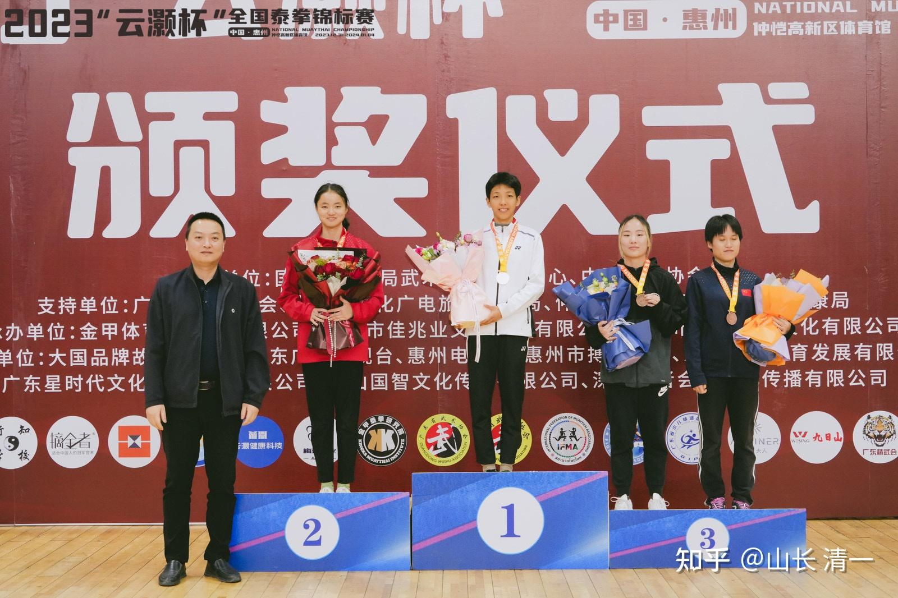
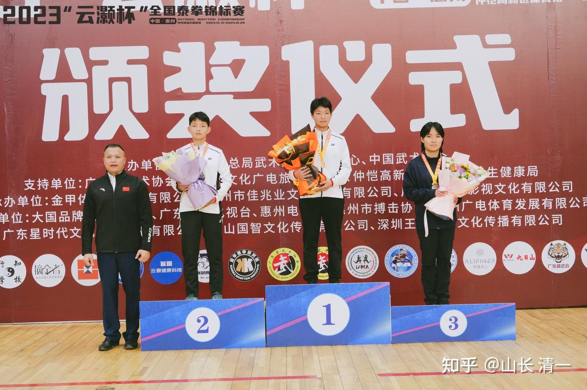
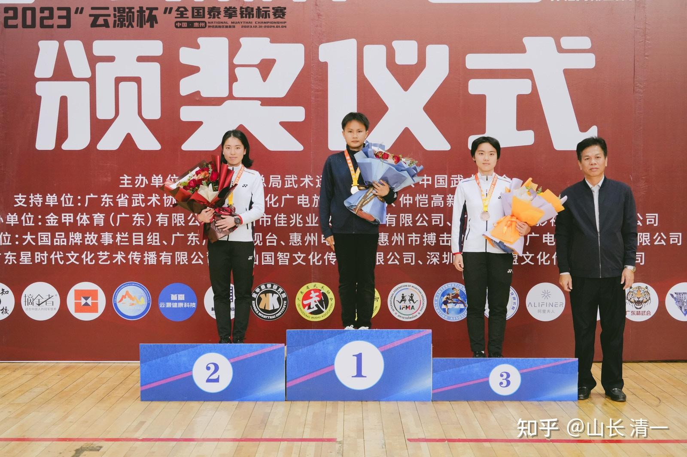
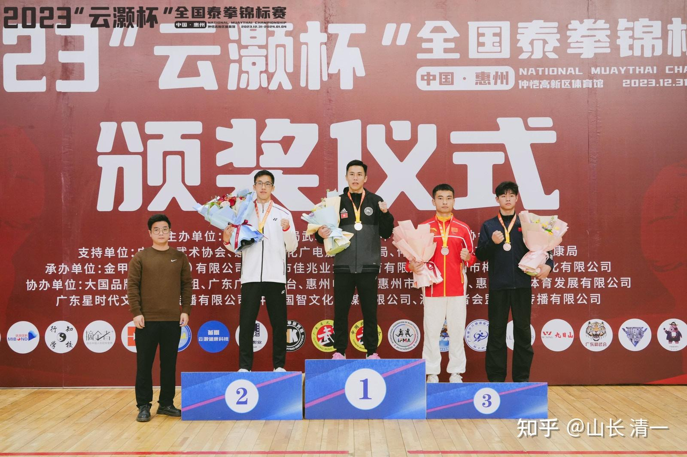
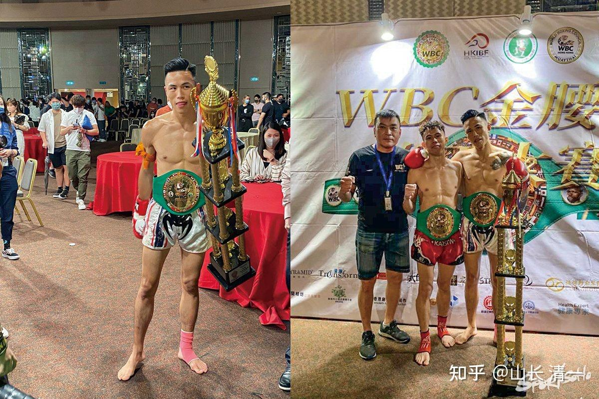
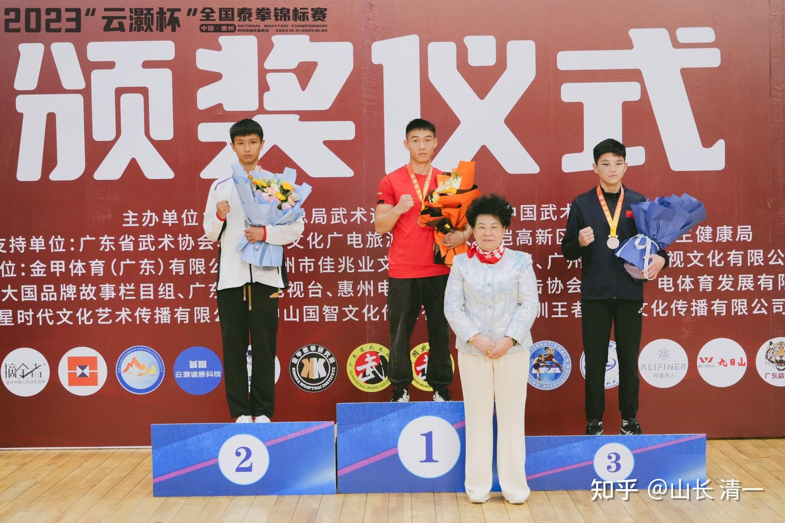

武道馆全员出击，每个拳手都拿到了一块奖牌。谭木兰最委屈，只拿到了铜牌！同台的新人ELLA，还站到比她更高的位置---全国泰拳亚军。相信这是ELLA绝对没有想到的局面----师妹超过了师姐？因为谭木兰分配的半决赛对手是明晓，ELLA分配的拳手是香港拳手。所以-----ELLA当然不费力了！虽然香港拳手也是拿了东亚泰拳比赛冠军的香港拳手！但面对ELLA的长腿长拳，依然无力对抗，只能败下阵来！只是ELLA小公主，今天的决赛对象要面对明晓师姐，干脆选择了弃权。她不想跟师姐打，反正也打不赢！当然，也是因为明晓今天上午跟男拳手进行了实验赛。男拳手本来已经安排了要打51公斤决赛的。但下午他也弃赛了。不知道是上午打木兰累坏了，还是不想要金牌了。

*51公斤级 冠军明晓，亚军ELLA，季军谭木兰*

*54公斤级：冠军佳慧。亚军佳彦。季军蔡凯琪*

*57公斤级：冠军陆鸽，亚军明洁。季军刘宇辰*

* 武士明祺获63公斤级男子亚军。冠军是香港阴招拳王朱敬聰！*

朱是香港泰拳王，东亚泰拳王，WBC的拳王，今年28岁，老资格拳手，拥有多个泰拳冠军的称号，去仑披尼打过比赛。号称打不倒的拳王。如果本次比赛他不是使用阴招，另外如果不是带上护具，他今天下午就已经倒下了。一开局就中了明祺的很多正蹬腿，后来靠两次击裆削弱明祺的攻击力，才勉强逃过被KO的命运。第三局打完，他已经累到喘不过气来了。

赛后，我说这个结局蛮好的，明祺只拿到亚军，让他明白了江湖险恶！一步一擂台。以后要精心磨炼，努力提高。防止黑手阴招！

*阴招拳王朱敬聰拿到WBC金腰带和奖杯的得瑟照片*

*武士刘轩宁，也拿到了一块银牌。*

本次全国泰拳赛，清一武道馆首次出山，取得的最终成绩是----三金，五银，三铜。今天的冠军赛，我们吃了香港黑手的亏。只实现了“保三”金牌的目标，没有争取到更多的金牌。本来今天的男子63公斤的金牌，也应该是我们的，但被无良香港人偷走了胜利。

【裁判讲规则的时候说过，踢裆第三次之后才会扣一分，他们就利用这个规则，踢两次不会有问题】，但拳手在第一局被踢中之后，选手的体能都会受到很大的影响，动作变形，无法完成正常的动作，特别是无法发力。这个香港拳王，心黑手黑。看样子是专门研究各种黑手技术。昨天他打体院的人也一样。第一局数次踢裆，让对手体能下降，技术变形。光拼技术实力，他今天会输惨掉了，甚至可能被KO。但他江湖心眼多，居然赢了！奉送他一个外号---香港阴招拳王！

另外----我认为今天的裁判是偏心对手的。其实许骥并没有输，第一局开始是明显压制对手的，对手一直被打击，没有啥有效还击甚至无法防守，但在许骥被踢裆之后就发挥不正常，但也没有输掉比赛，只是也没有压倒性的优势了。最终判决许骥输掉是没道理的。而且，许骥的确有两次没站稳倒地，但他并未有"短暂失去意识"的情况。但场上裁判就马上读秒。根据比赛规则，拳手被读秒的话，如果这一局他没有KO对手，就会判输掉。显然在帮对手。但昨天，刘轩宁把对手踢倒在地，比许骥倒下要狼狈许多，但裁判也没有读秒，这一局依然判对手胜利。让人特别不服气，也影响了场上拳手的心态。因此---这里面显然是有猫腻的。这群人，其实跟国内的体育武术界，都是内部人。香港拳手也是格斗老油条了，他捞了很多的金牌冠军。油管上他很多的比赛视频。是个泰拳老江湖了。所以----我们这些格斗界小白，输了也就输了，我们认输！----话又说回来----如果我们不想用黑手阴招，去想要去取胜天天琢磨黑手阴招的人，我们就不能只是是比对手强一点就行了。我们必须比他强很多倍。因此---还是我们自己不够强，没有能够输出摧毁性的打击。所以，我们还是继续提高自己吧！
但我也很想知道----香港拳王，只能用这种下三滥的手段（除了踢裆，他内围的时候也有黑手阴招的，只是没有得逞）去取胜。就算赢了，内心真的快乐吗？

第二：这种人，如果代表我们的国家去参加世界的赛事，真的会赢得世界的尊重和荣誉吗？不择手段去赢，得了冠军有啥自豪的？冠军又不能吃。冠军是一种荣誉。用不荣誉的手段获取的荣誉，是真正的荣誉吗？场上的观众，会更喜欢这种人吗？还是骂这种人？

另外一个重要消息：今天上午，佳慧和明晓进行了男女对战实验赛。武汉体育学院派出的拳手，根本就没有啥优势。无法对我们造成有效打击，只是我们也无法拥有压制性的优势。对方很重的扫腿，木兰们轻易接下来然后还击，内围战也不落下风。其实这种场面，已经很能说明问题了----我们的女拳手拥有超过普通女拳手的实力，跟男生相比也不落后的。但是----赛后---，体院的教练居然说：双方相持不下原因，是因为他怕出事，要求自己的拳手不要出肘，不要高扫上头。所以才相持不下-------天。你有本事就用出来呀？泰国拳手天天高扫，上头没有？肘击对手，你也要打出来才算呀？
不过----别人男拳手也要面子的，总不能说一个比自己体重轻的女生都打不赢吧？所以，也算了！至少----现在他们不敢轻视我们了！

赛后故事：今晚，我与木兰武士们总结聊天，听了很多有趣的故事。

一个是：赛前训练热身，打靶的时候，泰拳手们都很疑惑地看著这群招数动作很奇怪的拳手。然后。有一个队长，转身对其他队员说：大概这就是传说中的古泰拳了。因为他们听说---这群拳手是从泰国来的，因此不敢轻视！看木兰打靶，力道十足。有点可怕。但又看不懂木兰们再练什么，招数都跟自己练的不一样。所以他们就猜----会不会这群人，练的是恐怖的古泰拳？据说，一些女队员还因此放弃了上场比赛避免对阵木兰。导致谭木兰和佳慧第一战就不战而胜。轮空进入第二轮半决赛！

估计明晓的表现过于凶猛，也让国内的一些女拳手望而生畏吧？跟明晓打的女拳手，第一局才过了2分钟，空隙（读秒）时间，就转头跟教练说：教练，我能不能放弃比赛呀？教练让她再坚持一分钟。结果她勉强支撑下来第一局，下来就马上就不玩了。明晓第一局就结束比赛，获得了TKO胜利。木兰们很疑惑---国内的女拳手，似乎太容易放弃比赛了，一看赛事安排的对手比较强，就纷纷放弃比赛。据说---总共有30多人放弃了比赛！甚至武士刘轩宁打完半决赛后，本来决赛日（4号）还有一场比赛的，却因为对手弃赛，居然让他站到了亚军的位置上，跟许骥死拼阴招拳王才得到的亚军，居然两人的地位相同。我看到授奖的照片还奇怪呢？原来国内的拳手太不经打了！特别善于保护自己，一点点感觉不好就退赛。

第二个故事：就是一个国内拳手，看了我们女拳手的比赛之后，疑惑地跑来问：你们练的是不是兔子拳呀？木兰们很奇怪，难道这是暗示她们----已经被看穿了---知道她们都是清一老兔子教的弟子，简单称呼为兔子拳？木兰们就很谨慎地回答：你为啥认为我们练的是兔子拳？来人回答---传武有一派叫做兔子拳，听说很厉害的。看你们的打法有点像。

木兰们纳闷-----怎么没听说传武有个兔子拳？后来去百度，查谷歌，只看到有兔子打拳。真没查到有啥传武兔子拳。

估计----正蹬是兔子拳的---兔子蹬鹰式。木兰们跳跃移动的步伐，就是兔子跳吧？