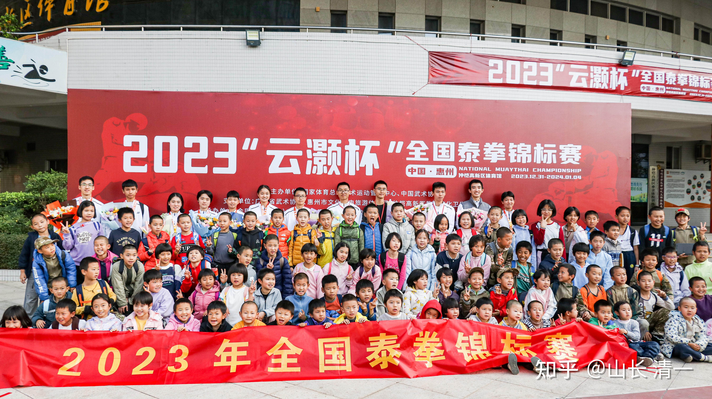
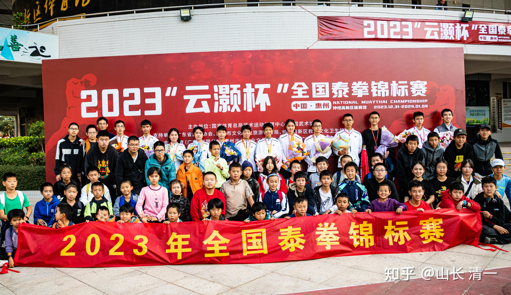
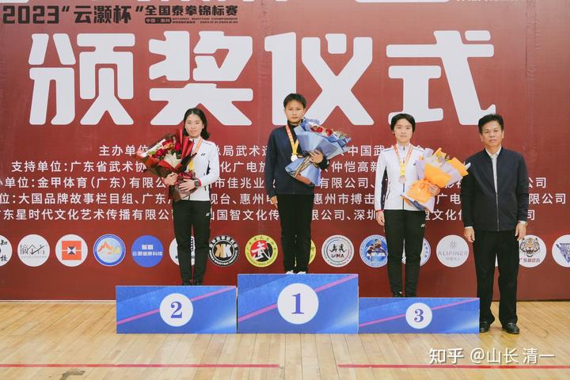

本次赛事，新教育的很多家长和学生都到场观看比赛。共同见证了新教育的奇迹----学霸是怎样变成全国泰拳格斗冠军的！

我有一个预测：5年以后（2028年年底），我们至少会培养出来40-50个全国冠军甚至可能是世界冠军。这些人在什么地方呢？应该就在下面的照片里面----这些小弟弟，小妹妹，现场看到了木兰姐姐们，武士哥哥们的表现， 都想成为木兰武士一样的人。因此，五年后的今天，站在获奖台上的人，应该就是这些孩子了！

*广东地区的新教育学生与冠军团队合影*

下面是家长刘方贵赛后发布的赛事记录信息，供大家参考。刘方贵的两个女儿，本次比赛也上擂台实战，两姐妹同台竞争，分别拿到全国泰拳亚军和季军的奖牌。刘方贵是孩子的好父亲，是我们新教育家长的好榜样。这次比赛中，提前到达赛场，尽心尽力的照顾拳手，为大家服务，他在幕后做了很多细致的工作！一直在忙着接待和照顾客人和朋友们，真心为新教育家人们服务，是个很不错的家长。德行言行谈都很有水准，所以他家的孩子也很不错。是大家学习的榜样！

*图中的两个白衣女孩，就是刘家长的两个女儿*

以下是刘方贵家长的新教育群内的发言：

大家早上好

2023年“云灏杯”全国泰拳锦标赛于4号下午圆满收官，清一武道馆的木兰武士们在场上的表现和取得的成绩相信大家通过直播、视频和山长的知乎文章已经看到了。但仍然有朋友电话问及赛事相关情况，在此统一回复介绍以下5点：

1.在整个比赛期间，我们的木兰武士们表现出来的勇敢坚毅的品质和敢拼敢打的精神让在场的教练和队员及裁判和观众赞不绝口。国家队主教练说，我们队员展现出来的勇毅和坚韧及良好的心理素质是他以前很少见过的，给他留下了既好又深刻的印象。

2.本次锦标赛，主办方是赛前2周才接到的任务，准备时间紧张，义工也不足，所以这次大会的义工工作有2/3都是我们新教育的家长来承担的，会场的各项工作井然有序，展现出了我们新教育人肯于付出、乐于奉献的精神和凝聚力，得到了赛事主办方和国家队教练的大力赞扬和好评及感谢！

3.好多家长好奇赛事期间一直有两位慈祥且精神饱满风度翩翩的长者和应老师在一起，一位是一市级电视台台长，专程过来了解我们木兰和武士的，已彻底被我们的武士和木兰吸引，成了我们木兰和武士的粉丝；另一位长者是山长的好友大学同学，在中南海核心岗位工作，一直有弘扬中华传统文化的愿望，为民族复兴做贡献，对山长创立的新教育给予了高度赞扬和肯定，超级欣赏喜欢我们的木兰和武士，元旦还特意安排他儿子过来惠州与我们的武士和木兰认识，明确表态会大力支持我们平台的建设和发展，我们新教育的学生有福了！

4.这次比赛有很多学堂的师生和家长来到了比赛现场，4号一天就有几百号孩子，但是不管是家长还是孩子们，我们的人员都秩序井然，作为啦啦队给木兰武士们呐喊助威也是非常有气势有节奏，从国家队主教练、主办方到裁判以至其他参赛队伍，都对我们的人员赞赏有加。

5. 赛后深深感受到新教育家人们的热情，多个学堂的孩子和家长围着木兰和武士纷纷表达出要和她们一样为国争光，为弘扬传武精神而备战的想法。签名、合影、送花的场景让大家感动，由于现场人数较多和时间较紧的原因，没办法安排现场家人和木兰武士一一合影留恋，没有以各学堂为单位，而是用大小年龄段的标准，安排了孩子们和木兰武士们的集体合照（附照片），期待给小朋友们种下的传武种子日后能在孩子们心中发芽生长，让传武之风在国内继续乘风破浪，让真太极威名远扬。对此在本次活动中考虑不周未能顾及之处请家人们理解包容！[表情][表情][表情]

非常感谢公主班Ella爸爸、胡源伽妈妈、刘静姝爸爸、李想妈妈、首届三语高中周丽莎妈妈、今日突破班家长陈伟、武道馆前家长吕梁滔爸爸、幸福天使周霖灵周雅粒许少杰三位老师和梁秋实朱永红嘉仪等等清友们的付出与帮助，感谢广州读书会的晶晶老师会同深圳读书会伙伴部署赛事宣传工作（后考虑到公主班学生提出多一些锻炼的机会，我们即时调整和简化了原有宣传计划，将赛事宣传工作交给了公主班学生，我们转发）；感恩领队应老师的通盘考虑和把关，特别感谢行知学校程校和陈总及商学院家长的大力支持，在此一并感谢还有很多我说不出名字的新教育家长，因为有大家的齐心协力共同圆满了本次锦标赛！感恩！

[表情][表情][表情]

通过这次锦标赛，我们和国家体育总局已经建立了良好的关系，这次比赛是一个新的起点。今年木兰和武士们还要参加的大型赛事，世界泰拳锦标赛，中国自由搏击全国锦标赛，世界自由搏击锦标赛。将代表中国与全世界的高手去比赛，为国争光！期待我们的木兰武士们不断取得更好的成绩！祝福大家在新的一年身体健康，心想事成，福慧增长！祝福我们的新教育遥遥领先！ [表情][表情][表情]