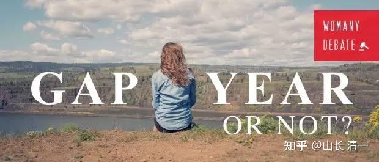

要回答这个问题，就要先回答：你上大学的目的是什么？如果是为了好玩，为了混个文凭，那么直接读也没啥不可以。如果你上大学的目的，是为了更好的适应社会，做好进入职场的准备，那么：起码先了解社会和职场之后，再去有目的的上大学，才更符合人生的最佳设计模式！

** 中国人非常迷信读书：万般皆下品，惟有读书高。只要孩子愿意读书上学，家长会一直供到博士毕业。似乎孩子爱读书就一切都自动会好了，虽然结果并不是这样的！**

的确---不读书的人，往往都活在社会的最底层。因为他们只能从事低端的工作！往往是体力劳动者。

但是，并非读书，拿到文凭的人，一定比不读书的人混得更好。甚至可能会更差----可能成为社会的废物。他们甚至连低端工作都做不了，只能当啃老族，或者流浪街头？如复旦的某个博士学霸？还不如一个没有学历的普通人呢！

不知道各位有没有注意到---现在的很多所谓的大学生，生活现状连底层的打工阶级都不如！不但找不到工作，也没有真实的生活能力，甚至连一个健康的身体和良好的生活习惯都没有。他们连正常的社会交往活动都不会，也不会进行日常的生活，自以为有个文凭，还特别的瞧不起普通人，只能天天躲在家里啃老！

手里的大学毕业证，研究生证书，可能原来中国在发展期还有点用，现在基本上，不太有用。将来会越来越没有用了！真实的能力，在将来求职的时候，会越来越重要。拿一个文凭来糊弄用人单位的时代，已经过去了！

更糟糕的是：一些学生，明明没有读书的能力，也不爱学习。他们所谓的上大学，就是混日子。但是这些学渣，却忽悠爹妈，不断给他们钱去“上大学”，“读研究生”，结果就是天天去大学混日子。特别这些学渣，在国内连高中都考不上的人，却声称要去海外留学，而各种“海外大学”，正好张开大口，笑纳这些消费者入读。家长们花了大钱，只是买回一堆花里胡哨完全就没用的文凭证书，以及一个废掉了的孩子。

怎样才能让孩子有目的的上学呢？特别是---怎样让孩子18岁就具备真正的独立思考和独立生活的能力？而不至于以“我要考大学，我要去留学”这种看似很有道理的道德绑架，让家长不断拿钱给孩子，最终培养出一个废物？

** 方法其实很简单，就是让孩子必须18岁去打工一年。**这样，他就必须在18岁之前，做好走向社会的准备。同时家长还可以根据他的打工的情况，来决定他将来是否去上大学，以及该去上怎样的大学！因此---这孩子18岁之前，一定不敢在学业上怠慢！会认真努力学习K12课程的！因为他的工作情况决定了他能否获得家长支持上大学的条件，而不是理所当然的混日子！

所以：我才不会傻乎乎的在孩子高中毕业就直接去读大学。为了一张文凭，读成一个没用的书呆子，对我有啥好处？

我会让孩子先去社会上工作一年。然后，根据他这一年工资攒下来的存款，再给他加上一点钱，大概是三到五倍，最多不会超过十倍的“学费赞助”，让他自己去上大学去。这样他才会珍惜上大学的机会！

如果这一年，孩子打工能够攒下来5万元，我可以给他20-50万元的赞助，去上一个他喜欢的大学。他想上什么大学自己去挑，想读什么专业自己去选。但费用包干，我才不给他无限兜底呢。有本事自己去拿大学奖学金去！我相信----经过这一年的打工经历，孩子对于上大学的机会，一定会非常的珍惜，绝对不会浪费家长的投资！如果这样实行，我相信---他从7岁开始，就不得不准备面对他18岁的“成人礼”。19岁，他会认认真真的选大学，也会认认真真的读大学。肯定不会进了大学就混吃混喝，成为瞎玩瞎混的一类人。拿着自己挣的钱去大学，一定会更认真的学习，专心提高自己。这样大学毕业后，他才会顺利地进入职场！

家长会问---如果孩子18岁以后，没父母帮助，就是找不到工作，也挣不到钱，先去读大学不行吗？ 我认为---这不就证明这孩子你已经养废了，18岁了还啥用也没有吗？这样的人，你家长花一笔钱，进了大学拿到文凭，难道就具备工作的能力和工作愿望了？18岁就不愿意工作，不愿意付出，只想享乐，天下哪有这样的好事？家长侍候他一生吗？

18岁去找到的工作，不是要多高档，收入有多高。只是去体验真实的职场和社会。 18岁完全没有工作能力的人，只能说一直享受惯了父母的照顾，才如此废材。这种人，还去上啥大学？干脆现在就去流浪和乞讨去。总比读完博士，才来当街头的流浪汉好吧？这种人去上大学，就是白白浪费家庭和国家的投资，浪费了大学的教学资源！

我这个【先工作再读书】的提议，其实在国外很普遍，因为很多学生中学毕业后，并不明白上大学对自己有啥意义。读完了K12，他们也需要去社会上历练一下，再去上大学，心中更有数。因此西方大学普遍都有Gap Year的安排。就是学生在上大学之前，或者大学一二年级的时候，允许空出一年的时间来，去社会上历练。

什么是Gap Year？

1.研究表明，从间隔年回来的学生在学术表现上会更优秀。

2.间隔年的经验会让学生认清自己的职业倾向，开阔视野。

3.间隔年让压力爆棚的资优生有了喘息的间隙，能更好地应对之后的高强度学习。

中国没有“间隔年”。是因为中国的教育体系，高考制度，没有提供这种机会。教育已经成了一个官僚机构，一个筛选机构。不再是为了学生的职业而服务的。因此---家长和学生自己，必须为自己承担起责任来，自己给自己谋划出路。总是等著别人给你出路，万一没有出路呢？周围很多朋友，面对家里面大学毕业去不愿意也没有能力出去工作，也不会社交的儿女愁肠满绪。

**早知如此，干嘛不在孩子18岁的时候，就让TA去社会上历练，早早拥有融入社会，拥有工作的能力和愿望呢？ **

还有：为了实现新教育天书的第一问，为了对18岁的培养目标，有一个真实的检验标准，难道进入职场工作，不是一个非常有必要的教育成果检验吗？比孩子用【直接上大学】的口号，来糊弄家长过去12年的教育，要好得多吧？

后续预告？

[山长 清一：新教育天书第三问：为什么新教育学生往往入读海外知名大学，而不是参加中国高考呢？](https://zhuanlan.zhihu.com/p/677620063)