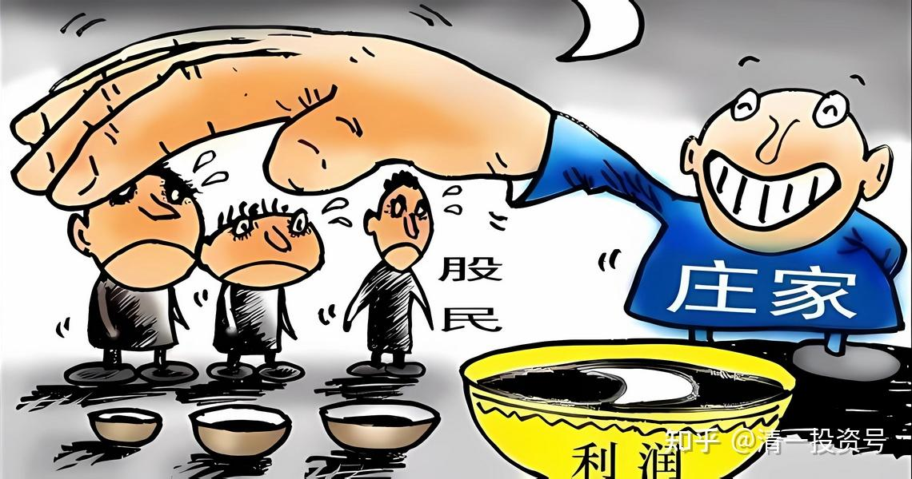
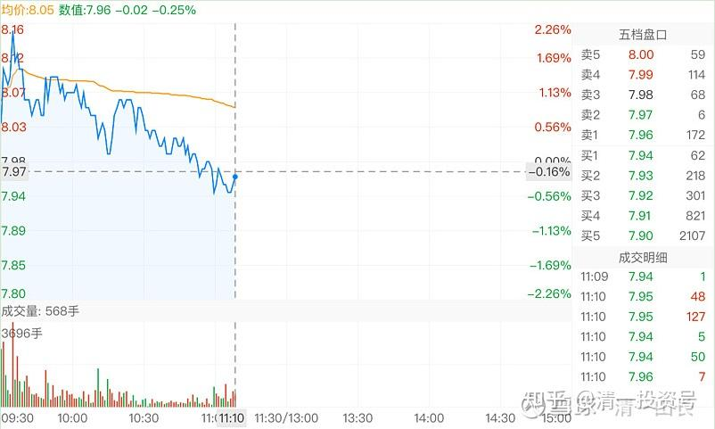
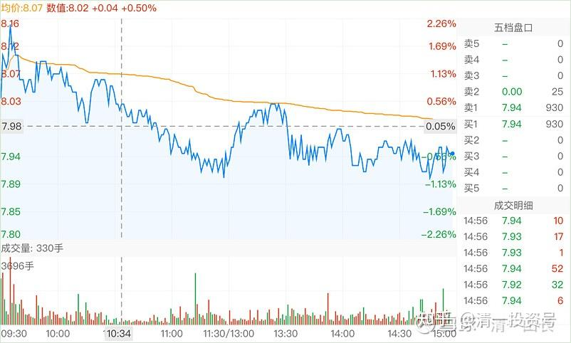
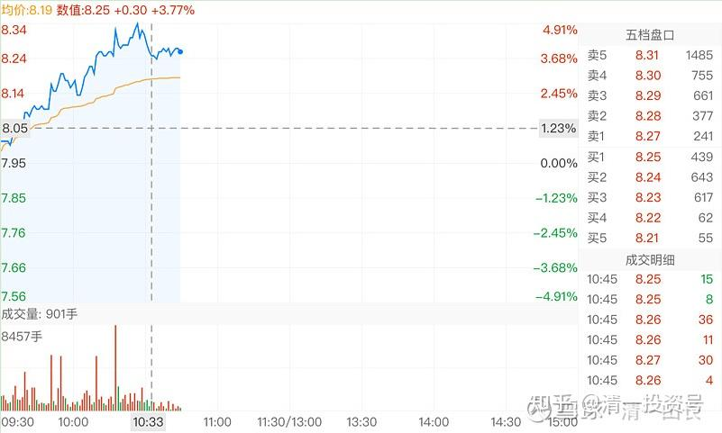
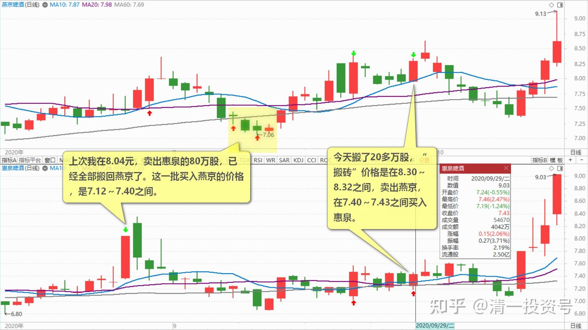

45篇.燕京的“传统”——总是令持仓者失望

清一山长 2020年9月28日-29日

清一山长 2020-09-28 11:13:18

$燕京啤酒(SZ000729)$ 大家学习一下：今天这种走势，图形是标准的出货走势图。不知道您怕不怕？我这一轮底点买的一两百万股燕京，每股已经赚了9毛了，现在要不要出掉？各位给个建议[大笑]？

清一山长2020-09-28 15:37:06（跟评上贴）

收盘的图。下午冲高上破8元，引来一波激动的跟风盘，更多是乘机赶快抛掉的盘。其实从盘面看，买气很差的，卖气也严重不够。按道理从7元上下涨上来，应该是比较热络的股。没想到跟7元一带一样，死气沉沉的。

你可以理解为主力就是不想让持股人高兴和激动的。**他用这种死气沉沉的方式，迫使散户们失去耐心离场。**今天上午的走势很难看，下午也玩了一次冲高回落。但最终只跌了3分钱。算是“有惊无险”。其实，今天这种走势就是弄来吓人的。图形上看，高高地跌下来，似乎多可怕，其实真心没跌多少。大多数燕京持有者应该是盈利的——微薄的盈利，他更希望你给一点小钱就走。而且今天的成交并不大。主力是不可能出逃的，我看盘面上，反而是借机进了一些货。起码是把打下来的筹码又拿回去了。如果今日是出逃，就没逃多少筹码，盘面却会跌得难看之致。不是正常人会做的，主要是小盘股会这样做。**燕京主力，志在长远，不会玩这种小把戏来出票。他要出票，一定是高调，让散户们蜂拥而进，**会比珠江出票更精彩的（珠江的流动盘不大，不够他们玩的。虽然两者市值差不多。但是不懂主力心眼的小散们，肯定吓得赶快跑掉了。

还有一个信息：7.90元以下几分钱，堆积了一百多万股的买单。如果真要出货，不会放过这种机会的，一下子出掉千万元的货。可一直没有碰这些盘。**说明大一点持有筹码的人都不想卖，**卖的都是小小散户。可主力显然也不想买。所以今天算是冷场，让国庆前想空仓的朋友们有机会走掉——给点小利就走。

我呢？继续等待吧！看他后续如何表演。我承认燕京啤酒的主力水平比我高，老玩我，总让盘面走出我想不到的样子。让我T也不敢T，只能傻拿。跌了就傻买！越拿越多。看谁耗得过谁，我就跟你比耐心。

清一山长 2020-09-29 10:57:58（跟评上贴）

$燕京啤酒(SZ000729)$ 昨天我的发言，看懂的有福了。昨天的图形走势，真是标准的“出货”走势。只看图的话，看起来很吓人，特别是上午。

但综合起来看，成交量其实不大，证明没有多少人卖出。最近几天，都在8元附近徘徊，五天来的成交量，都在不断萎缩。昨天的拉高下跌，点位不对。（如果是高点，绝对的出货），现在8元只能算中低位，出货不可能的。所以——**结论很简单，就是“洗盘震仓”。**我昨天就是看到图形不好看，很多自以为聪明的人会赶快逃走，就出来提醒一下。不是我真的没主意，要你们给我建议才知道该咋做。不过，我还是很高兴地发现：不少人还是很清醒的，没有被燕京操盘手骗线。否则今天就要哭了。

今天直接冲5%了，结果如何，我也不知道。按惯例，下午应该跌下来。**才符合燕京的“传统”——总是令持仓者失望。**看上去似乎可以做T。赚点小钱。但我真怕了燕京，燕京操盘手总是出人意料。原来的连续两个涨停，让我意想不到。更想不到两个涨停之后，居然还会跌回原地，再往下挖“地下室”，违背了一切操盘的法则。既然意想不到，我的燕京就只好死拿，而且越拿越多了。我想等涨停再走[大笑]。

今天涨这么多，成交量真不大。**上午不到一个亿。说明现在的燕京盘面上，浮筹真不多。**洗了三年，差不多洗干净了？

清一山长2020-09-29 15:55:58

$惠泉啤酒(SH600573)$ 我最近突发奇想，**如果在燕京和惠泉之间“搬砖”，结果会怎样？**就做了一个实验账户，转入了100万股燕京，专门用来“搬砖”玩，每股做了0.9元的差价。目前已经搬了相当部份的惠泉了。今天搬了20万股多一点，今天“搬砖”价格是在8.30～8.32元之间，卖出燕京，在7.40～7.43元之间买入惠泉。不减少啤酒股的仓位，坚持“搬砖”持有。看是否比单持一只股不动的利润高。上次我在8.04元，卖出惠泉的80万股（有点后悔，当时涨停应该再多卖一点的[微笑]），已经全部搬回燕京了。这一批买入燕京的价格，是7.12～7.40元之间。

现在来算账的话，显然是“搬砖”更划算。最近新买入的燕京，赚了一元左右卖出换回惠泉，最低价在7.06元买回惠泉，成批地买回跌了9毛左右的惠泉。这笔生意差不多每股多了两元的利润。如果惠泉恢复涨停的价格，赚得就更多了。长期来看会怎样呢？

原来我是在燕京和珠江之间“搬砖”。珠江涨了，搬去燕京变重仓的。现在的燕京也涨了，先搬一点点去惠泉吧！珠江现在死气沉沉的样子，不如等燕京再飞一会，再考虑搬珠江的事！[大笑]

(标题、图片为编者所加)

**文章音频**：

[409篇.燕京的“传统”——总是令持仓者失望_清一投资号文章同步音频](http://link.zhihu.com/?target=https%3A//www.ximalaya.com/sound/699058590)

**参考链接：**

[34篇.我的投资不需要别人来打气](https://zhuanlan.zhihu.com/p/661931571)

[35篇.明显是市场的错误定价](https://zhuanlan.zhihu.com/p/663378280)

[36篇.研报的几点信息](https://zhuanlan.zhihu.com/p/664613658)

[37篇.啤酒生意不简单，不是投钱就可以弄](https://zhuanlan.zhihu.com/p/665812265)

[38篇.低位吹票和高位吹票](https://zhuanlan.zhihu.com/p/666484929)

[39篇.我用钱来赌啤酒赢、赌中国建筑会赢](https://zhuanlan.zhihu.com/p/667678766)

[40篇.这种企业，以后一定成为现金牛](https://zhuanlan.zhihu.com/p/668283112)

[41.持有期限最少3年最长15年](https://zhuanlan.zhihu.com/p/670833407)

[42篇.赔钱至少是有缺陷的](https://zhuanlan.zhihu.com/p/672139277)

[43篇.短线T、高级T和反向做T](https://zhuanlan.zhihu.com/p/673874352)

[44篇.没有等来秀场时间，依然要拼耐心](https://zhuanlan.zhihu.com/p/674885494)